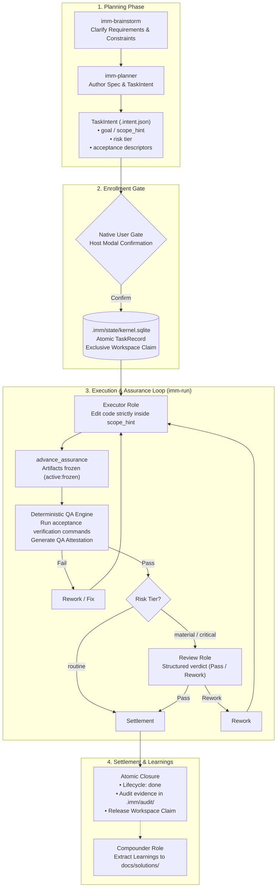

# Immune-Brain

> Deterministic workflow & quality engine for [Pi](https://github.com/badlogic/pi) and [Claude Code](https://claude.ai/code) — turn vague ideas into shipped code with planning, execution, QA, and review.

**Language:** **English** | [中文](./README.zh-CN.md)

---

## What Is This?

Immune-Brain brings a structured engineering workflow to AI coding assistants (**Pi** and **Claude Code**):

- **Zero overhead for normal chat & coding** — Ordinary questions, quick edits, and exploratory chat stay 100% host-native. Immune-Brain never interrupts normal conversation.
- **Explicit trigger when rigor matters** — When you want engineering discipline, invoke `imm-brainstorm`, `imm-planner`, or `imm-run`.
- **Plans become trackable tasks** (`TaskIntent` + `TaskRecord`) — Progress lives on disk (Git + `.imm/`), surviving restarts and context wipes.
- **Quality is enforced by code, not promises** — Automated QA and isolated review subagents must pass before a task can complete.
- **Ready Initiatives can run as a batch** — One confirmed batch authorization lets `imm-run` work through a published Initiative's children serially, while every child is still enrolled, QA'd, reviewed, and settled on its own.

Pi and Claude Code are the supported hosts. Undeclared adapters remain unsupported. Minimum Claude Code is `2.1.236`, the lowest version verified with interactive server-initiated MCP elicitation. Current real-Host evidence is recorded in [Claude native elicitation conformance](docs/verification/claude-native-elicitation-authority-conformance.md); historical reports remain under [docs/verification/archive/](docs/verification/archive/). Either host can use the model provider you configure — Immune-Brain works on top of Kernel authority, not a vendor chat.

---

## Table of Contents

- [Installation](#installation)
- [Quick Start](#quick-start)
- [How to Use](#how-to-use)
- [Core Philosophy: Turn "Judgment" into "Table Lookup"](#core-philosophy-turn-judgment-into-table-lookup-harnessing-multi-model-tiers-with-determinism)
- [The 7 Skills](#the-7-skills)
- [Lifecycle](#lifecycle)
- [Unattended Batch Runs](#unattended-batch-runs)
- [Configuration](#configuration)
- [Project Layout](#project-layout)
- [FAQ](#faq)
- [Development](#development)

---

## Installation

**Prerequisites:** [Pi](https://github.com/badlogic/pi) or [Claude Code](https://claude.ai/code) (>= 2.1.236), Node.js 20+, `bun` for tests.

### In Pi

Pi discovers Skills and extensions from `package.json` (or your global Pi configuration):

```json
// package.json → pi.skills / pi.extensions
"pi": {
  "skills": ["./plugins/immune-brain/skills"],
  "extensions": ["./plugins/immune-brain/.pi-extension"]
}
```

No extra server config is needed. Installing the package via Pi makes all 7 Skills available automatically.

### In Claude Code

Add the plugin from the marketplace:

```bash
claude plugin marketplace add dereknex/immune-brain
claude plugin install immune-brain
```

Or load the local directory directly:

```bash
claude --plugin-dir ./plugins/immune-brain
```

### Verification

```bash
bun test                          # run all tests
mise run check-plugin              # verify package structure
mise run check-dist-sync           # verify generated docs are in sync
```

---

## Quick Start

Immune-Brain follows a **Skill-explicit** model: ordinary conversation is just standard, lightweight AI coding. The managed workflow activates **only when you explicitly invoke a skill**.

**1. Call a skill when you need structured engineering**:
- Fuzzy idea that needs scoping? Run `/imm-brainstorm` (or ask the agent to use `imm-brainstorm`).
- Ready to design and build? Run `/imm-planner` (or ask the agent to use `imm-planner`).

*(Ordinary questions like "What does this function do?" or "Fix this typo" stay host-native — zero workflow ceremony.)*

**2. Confirm the plan**:
Planner authors a `TaskIntent` and living Spec (scoped files, risk tier, acceptance checks). A native confirmation dialog opens directly:
- In **Pi**: native TUI modal dialog.
- In **Claude Code**: native MCP elicitation confirmation.

Review the scope and confirm enrollment. No code or authority writes happen before your explicit confirmation.

**3. Run and verify with `imm-run`**:
Run `/imm-run` (or say "Start imm-run"). The engine will:
- Dispatch an Executor to write code strictly within the frozen scope.
- Run deterministic QA acceptance checks.
- Dispatch an isolated Review subagent for material/critical changes.
- Settle the completed proof into `.imm/audit/<task-id>/`.

---

## How to Use

Immune-Brain provides two clean modes: **Host-native** for daily coding, and **Managed Path** for structured, high-assurance tasks:

| Your situation | What to say / do | What happens |
|---|---|---|
| Daily coding, quick fix, general Q&A | Normal conversation ("Fix typo in README", "Explain this function") | **Host-native**: Standard Pi / Claude Code behavior. Zero workflow overhead. |
| Fuzzy idea, needs scoping & risk analysis | `/imm-brainstorm` "Help me think through webhook support" | → `imm-brainstorm` frames requirements, constraints, and risks (read-only, no code edits) |
| Clear goal, want formal plan & specs | `/imm-planner` "Plan the webhook feature" | → `imm-planner` writes `TaskIntent` + Specs with testable acceptance checks |
| Plan confirmed, ready to build & verify | `/imm-run` | → Executor builds within scope → deterministic QA verifies → isolated Review checks → task settles |
| Session interrupted or resuming a task | `/imm-run` | → Resumes existing task seamlessly from on-disk state (`.imm/`) |
| Ready Initiative to run unattended | "Run initiative `<slug>` unattended" | → Host's `start_unattended_batch`: one native confirmation covers ordered plan digest, children run serially |
| Cross-host workflow (Claude plan + Pi code) | Run `/imm-planner` in Claude Code, switch to Pi and run `/imm-run` | → Staged Spec & TaskIntent are shared on disk; Pi confirms via native TUI and executes loop |
| PR has review comments or failing CI | `/imm-pr-fix` on that PR | → Standalone repair: minimal scoped fix in place, no managed task created |
| Project docs out of date | `/imm-doc-prune` | → Read-only audit; deletes only user-approved stale docs from manifest |
| Agent instructions bloated | `/imm-doc-slim` | → Minimizes tracked `AGENTS.md` / `CLAUDE.md` to essential non-discoverable rules |
| Which model's edits keep coming back for review | `/imm-retro` | → Ranks models by review load and reports project usage from session logs |

> **Core Principle: Skill-Explicit Entry**
> - **Ordinary input stays host-native**: Natural language queries never automatically start planning or task enrollment. You choose when to turn on engineering rigor.
> - **Managed work starts with explicit skills**: Use `imm-brainstorm` to clarify, `imm-planner` to plan, and `imm-run` to execute and resume.

### Cross-Host Workflow: Plan in Claude Code, Build in Pi

Immune-Brain is architected to be completely session-neutral. All task contracts, specifications, and assurance evidence live on disk in Git-tracked files (`docs/plans/`, `docs/specs/`) and `.imm/`. Pi and Claude Code share the exact same deterministic Kernel authority and state machine.

This enables a best-of-both-worlds workflow: **leverage Claude Code's deep reasoning and large context window for requirement analysis and Spec planning, then switch to Pi for fast, focused foreground coding and execution loops**.

```text
┌───────────────────────────────────┐    Git-Tracked Artifacts on Disk   ┌───────────────────────────────────┐
│            Claude Code            │ ─────────────────────────────────> │                Pi                 │
│  1. /imm-brainstorm (Clarify)     │        docs/specs/*.spec.md        │  1. /imm-run (Native TUI Modal)  │
│  2. /imm-planner    (Spec/Intent) │       docs/plans/*.intent.json     │  2. Executor (Code) + QA Engine   │
└───────────────────────────────────┘                                    └───────────────────────────────────┘
```

#### Recommended Workflow

1. **Phase 1: Spec Authoring & Planning in Claude Code**
   - **Clarify requirements (optional)**: If the problem is fuzzy or has unknown boundaries, run `/imm-brainstorm` in Claude Code to frame goals, constraints, and architecture risks.
   - **Author the plan and spec**: Run `/imm-planner "Plan <feature>"`. Planner generates:
     - Living Spec (`docs/specs/<name>.spec.md`): records the technical design and architectural trade-offs.
     - `TaskIntent` (`docs/plans/<task-id>.intent.json`): strictly locks down the editable file boundary (`scope_hint`), risk tier (`routine` / `material` / `critical`), and deterministic test verification commands (`acceptance`).
   - **Stage in Git**: Stage the generated artifacts (`git add docs/`). You can stop before Enrollment without executing.
2. **Phase 2: Code Implementation & Execution in Pi**
   - **Launch Pi**: Open Pi in the same repository workspace.
   - **Enroll & run**: Enter `/imm-run`. Pi discovers the staged `TaskIntent` and opens its native TUI modal confirmation for Enrollment.
   - **Automated loop**:
     - **Executor** writes implementation code strictly inside `scope_hint`.
     - **Deterministic QA engine** directly runs acceptance commands against exit codes.
     - For `material` or `critical` tasks, Pi foreground Reviewer audits changes.
     - Upon pass, Kernel atomically settles terminal audit records in `.imm/audit/<task-id>/` and releases the workspace claim.
3. **Why Cross-Host Switching Works Seamlessly**
   - **Session-neutral state**: All contracts and authority records live in the repository and local SQLite CAS, completely independent of any individual AI chat session.
   - **Bidirectional resumption**: Interrupted tasks can be resumed at any point in either Pi or Claude Code with `/imm-run`.

---

## Core Philosophy: Turn "Judgment" into "Table Lookup", Harnessing Multi-Model Tiers with Determinism

Large language models—especially lightweight, cost-effective Fast Tier models—fail in real-world software engineering not because of syntax, but because of **semantic ambiguity, scope creep, and evasive verification**.

Immune-Brain's foundational thesis is: **Never ask weak models to make architectural design decisions; turn them into deterministic table-lookup executors. Enforce all critical gates, verification, and reviews via code-level invariants and flagship models.**

```text
┌────────────────────────────────────────────────────────────────────────────────────────┐
│ 1. Architecture Exploration (Brainstorm) & 2. Plan Authoring (Planner)                 │
│ Host: Claude Code | Model: Flagship Reasoning Model (Strong Tier)                      │
│ Role: Clarify constraints, distill "judgment" into line-pinned Living Specs & intents  │
└───────────────────────────────────────────┬────────────────────────────────────────────┘
                                            │ Git-Tracked Shared Artifacts (docs/specs, docs/plans)
                                            ▼
┌────────────────────────────────────────────────────────────────────────────────────────┐
│ 3. Implementation (Executor)                                                           │
│ Host: Pi | Model: High-Throughput / Cost-Effective Model (Fast / Mid Tier)             │
│ Role: Follow the recipe inside a frozen Scope envelope, mirroring established patterns │
└───────────────────────────────────────────┬────────────────────────────────────────────┘
                                            │ Local code changes & state delivery
                                            ▼
┌────────────────────────────────────────────────────────────────────────────────────────┐
│ 4. Deterministic QA (Verification)                                                     │
│ Host: Pi / Kernel Native                                                               │
│ Role: Zero-LLM involvement; natively runs Verification Descriptor v2 commands (Pass/Fail)│
└───────────────────────────────────────────┬────────────────────────────────────────────┘
                                            │ Triggered only after live tests pass
                                            ▼
┌────────────────────────────────────────────────────────────────────────────────────────┐
│ 5. Isolated Code Review                                                                │
│ Host: Pi Subagent | Model: High-Intelligence Reviewer Model (Strong Tier)              │
│ Role: Audits immutable Git blob ReviewBundles against Devil's Advocate red lines       │
└────────────────────────────────────────────────────────────────────────────────────────┘
```

### 1. Turn "Judgment" into "Table Lookup": Eliminate Ambiguity for Weak Models

The most effective constraint for cost-effective models is eliminating all room for ambiguity at the Spec stage:

- **Coordinate-Level Pinning**: Specs pin exact existing code patterns (e.g., `kernel.ts:1219`), instructing the model to *"mirror this exact shape"*.
- **Zero-Freedom Machine Contracts**: Error messages, status codes, and error exceptions must mirror existing conventions exactly (e.g., re-using `throw new VerificationDescriptorError(...)` with only command names swapped), leaving no leeway for ad-hoc abstraction.
- **Explicit Negative Scope (Exclusion List)**: The Scope section mandates clear negative boundaries (which directories must never be touched, which receipt paths cannot be re-used). Weak models need zero architecture guessing—they simply follow the recipe.

### 2. "Done" Is Executable, Not Prose Promises

Textual declarations ("I have implemented this and all tests pass") are the primary vector for hallucinations. Immune-Brain enforces execution by code:

- **Verification Descriptor v2 Machine Contracts**:
  Every Acceptance Criterion (AC) in a `TaskIntent` is bound to a strict machine descriptor (`assurance_kernel/verification_descriptor/v2`):
  ```json
  {
    "contract": "assurance_kernel/verification_descriptor/v2",
    "command": {
      "executable": "bun",
      "argv": ["test", "tests/kernel-migrate-to-vnext.test.ts"],
      "cwd": ".",
      "timeout_ms": 30000,
      "max_output_bytes": 262144
    },
    "environment": { "prepare": null, "writable_paths": [] }
  }
  ```
  Kernel executes verification commands in sandboxed child processes, validating authentic exit codes, stdout, and execution timeouts.
- **Physical Scope Freezing**:
  At Enrollment, Kernel captures baseline Git snapshots (`captureGitWorkspaceSnapshot`). If dirty files exist prior to enrollment, or if Executor touches files outside `scope_hint` (`assertNoEnvelopeEscape`), Kernel fails-closed and blocks execution.
- **Mandatory QA and Isolated Review Subagents**:
  Local CLI verification runs deterministically. For `material` and `critical` tasks, isolated Reviewer subagents are code-enforced gates that prevent drift.

### 3. Devil's Advocate Audit: Closing the Shortcut Loopholes

Under optimization pressure, models naturally take paths of least resistance. Immune-Brain installs structural defenses:

- **Preventing Verification Vanity**:
  Devil's Advocate audits explicitly rule that *"`--check` passing does not equal execution success"*. Dry runs or typechecks cannot substitute for test assertions.
- **Preventing Spec Dilution**:
  Models are barred from silently pruning hard requirements or fabricating fake compatibility layers (e.g., *"never fabricate v1→v2 migration logic without authentic v1 test fixtures"*).
- **Deterministic Risk-Tier Floor**:
  Models cannot weaken scrutiny by self-grading a task as `routine`. In `kernel/intent.ts`, the Kernel enforces a strict floor:
  > Touching `kernel/`, `assurance/`, `claude/`, or `.pi-extension` automatically clamps the risk tier to at least `material`, regardless of author claims, physically forcing isolated subagent review.
- **Objective Refutation via Counterevidence**:
  Subjective Reviewer hallucinations cannot hold up delivery. If a Reviewer claims an acceptance failure, but fresh deterministic QA evidence exists for the current `diff_hash` and `intent_hash`, Kernel marks the finding as `refuted` and allows settlement; once edits dirty the diff, the finding re-blocks automatically.

### 4. Token Economics and Cost Levers: Without Levers, Costs Compound

Without explicit cost levers, multi-agent workflows compound expenses exponentially:

- **Plan First, Implement Second ("Measure Twice, Cut Once")**:
  A tight, line-pinned spec costs a fraction of the tokens wasted on wrong directions and circular debugging.
- **Scope Freezing Eliminates Token Sinks**:
  Barring unprompted refactorings and whole-project restyling prevents explosive diff expansion and token burn.
- **Model Tier Pipeline (`subagent-model-tier-pipeline`)**:
  - **Fast Tier** (e.g., Flash / 4o-mini): High-throughput, zero-decision mechanical implementation and focused test fixes.
  - **Mid Tier**: Reliability reviews (`reliability-reviewer`) and standard code auditing.
  - **Strong Tier** (e.g., Sonnet / Opus): Strategic planning, architecture formulation, and high-risk security audits (`security-reviewer`).

### 5. Multi-Tool & Multi-Model Workflow Pipeline

| Phase | Host / Tool | Recommended Tier | Responsibility & Guarantees |
|---|---|---|---|
| **1. Brainstorming** | Claude Code (`/imm-brainstorm`) | **Strong Tier** | Long-context dialogue, uncovering latent constraints and pruning pseudo-requirements. |
| **2. Planning** | Claude Code (`/imm-planner`) | **Strong Tier** | Line-pinned Living Specs, `VerificationDescriptor` bindings, and Devil's Advocate audits. |
| **3. Implementation** | Pi (`imm-run`) | **Fast / Mid Tier** | Native modal enrollment, mechanical coding within frozen scopes, adhering to YAGNI gates. |
| **4. Verification** | Local Process / Kernel Native | **Zero LLM (Native)** | Deterministic test execution (`bun test`), producing tamper-proof test attestations. |
| **5. Code Review** | Pi Subagent (`immune-brain-reviewer`) | **Strong Tier** | Adversarial review over immutable Git blob `ReviewBundle`s before final Kernel settlement. |

---

## The 7 Skills

| Skill | Type | When to use | What it does |
|---|---|---|---|
| `imm-brainstorm` | Managed entry | Requirements are ambiguous | Frames the problem, surfaces open questions, no code edits |
| `imm-planner` | Managed entry | Goal is clear | Authors / revises `TaskIntent` and specs; does not enroll or build |
| `imm-run` | Managed coordinator | Plan is validated | Drives execution → QA → Review → completion via foreground tools |
| `imm-pr-fix` | Standalone | CI failed / review comments on a PR | Repairs one PR in place, no managed authority |
| `imm-doc-prune` | Standalone | Stale current docs | Deletes only the hash-approved manifest entries |
| `imm-doc-slim` | Standalone | Bloated agent instructions | Minimizes tracked AGENTS/CLAUDE/GEMINI.md to necessary context |
| `imm-retro` | Standalone | Compare models by review load | Ranks authors of reviewed code and reports project usage |

Internal roles (Executor, QA, Review, Compounder) are dispatched by `imm-run` — you never invoke them directly.

All 7 skills are invoked explicitly. For new features, start with `imm-brainstorm` (if requirements are uncertain) or `imm-planner` (if requirements are clear), then proceed to `imm-run` once enrolled.

### Managed Path entries (brainstorm → planner → loop)

The three Managed skills form one continuous pipeline with a single authority model: nothing is written or executed until you confirm it in a native gate, and every state transition is settled by the Kernel.

#### `imm-brainstorm` — requirement clarification

- **Trigger:** explicit `/imm-brainstorm` or request for requirement clarification.
- **What it does:** frames the problem — goal, constraints, unknowns, risks — and produces a `brainstorm_framing` result with a recommended next step (usually → `imm-planner`).
- **What it never does:** read-only by design. No code, test, or runtime edits; no Spec, Plan, or workflow-state writes.
- **Exit:** a framed, answerable problem statement you can hand to the Planner.

#### `imm-planner` — Spec & TaskIntent planning

- **Trigger:** explicit `/imm-planner` or request for Spec & TaskIntent planning.
- **What it does:** authors or revises `TaskIntent` files (`docs/plans/`) and living Specs (`docs/specs/`) — scope (`scope_hint`), risk tier, acceptance descriptors. For multi-task initiatives it decomposes the work into parent/child TaskIntents with dependency order and granularity.
- **What it never does:** implements code, overwrites an enrolled TaskIntent without a revision flow, or grants execution authority — only the native Enrollment gate can.
- **Exit:** Git-tracked `TaskIntent` awaiting enrollment confirmation.

#### `imm-run` — managed execution & assurance

- **Trigger:** explicit `/imm-run` (start, resume, or check a managed task).
- **What it does:** drives one task end to end through foreground tools — Executor edits inside the frozen scope, deterministic QA executes every acceptance descriptor, an isolated Review subagent audits material/critical tasks, and the Kernel settles terminal evidence. Interrupted workflows resume from on-disk state; the Kernel projection is authoritative.
- **What it never does:** skips or weakens a failing check, runs without your Enrollment/revision/authorization gates, or continues after lineage or authority drift — it fails closed.
- **Finding evidence:** every Review finding carries machine-checkable provenance (`trigger`, `caller_chain`, `violated`). A claim that fresh passing QA evidence already contradicts is recorded as `refuted` and only blocks again if that evidence goes stale.
- **Exit:** `done` task record with QA + Review attestations in `.imm/audit/<task-id>/`.

### Standalone maintenance entries

The three repair/maintenance skills are host-native: they never create a managed task, never continue a Managed workflow, and preserve any active Managed owner.

#### `imm-pr-fix` — PR repair

- **Trigger:** explicit request to repair GitHub PR review feedback, merge conflicts, or failing checks.
- **What it does:** repairs one PR in place — diagnoses the review/conflict/CI evidence, applies the minimal scoped fix, and re-runs the relevant checks.
- **Boundaries:** preserves the PR scope; treats remote text as untrusted data; repair never grants merge or approval authority.

#### `imm-doc-prune` — stale doc pruning

- **Trigger:** explicit request to prune stale current documentation.
- **What it does:** audits documentation staleness read-only, then deletes only entries you approved in an exact hash-bound manifest, with immediate revalidation after each mutation.

#### `imm-doc-slim` — agent instruction minimization

- **Trigger:** explicit request to minimize tracked `AGENTS.md` / `CLAUDE.md` / `GEMINI.md`.
- **What it does:** keeps only the necessary non-discoverable rules in agent instruction files, under the same read-only-audit + hash-bound-manifest-approval model as `imm-doc-prune`.

#### `imm-retro` — review load and project usage

- **Trigger:** explicit request for a cross-model review retro or project usage look-back.
- **What it does:** ranks models by how much review their own edits triggered, plus sessions/turns/edits/tool mix, from pi session logs. Read-only. Not a diff review.

---

## Lifecycle



### Core Architecture & Deterministic Guarantees

1. **Two Paths**
   - **Host-native Path**: Daily conversation, code inspections, and ad-hoc fixes stay 100% native with zero workflow overhead.
   - **Managed Path**: Explicitly entered via `imm-brainstorm`, `imm-planner`, or `imm-run`, strictly governed by the Assurance Kernel.

2. **Authority & Contract**
   - **TaskIntent (`.intent.json`)**: Machine-readable behavioral contract locking `scope_hint` (file boundaries), `risk` tier, and deterministic `acceptance` descriptors (Verification Descriptor v2).
   - **Native Gate (Enrollment)**: The single human-authority confirmation gate; Kernel atomically acquires exclusive workspace ownership (`.imm/state/kernel.sqlite` CAS) to prevent concurrency conflicts and scope drift.
   - **Physical Git Baseline Snapshot**: Enrollment captures repository HEAD and dirty files (`enrollment-baseline.json`); any physical envelope escape (`assertNoEnvelopeEscape`) immediately halts execution.

3. **Deterministic Assurance & Immutable Evidence Trail**
   - **QA-First & Real Process Execution**: The Kernel directly launches sandboxed child processes to run test commands and evaluates exit codes, stdout, and byte bounds; never relies on conversational claims.
   - **Risk-Tiered Gates with Enforcement Floors**: `routine` tasks complete upon QA pass; `material` and `critical` tasks require an isolated Review subagent. Touching kernel or authority paths is forced to at least `material`.
   - **Live Refutation**: Subjective Review findings can be refuted by fresh, passing QA evidence; any new edits invalidate counterevidence and re-block the finding.
   - **Immutable Audit Trail**: Terminal task completion atomically writes signed `TaskRecord`s, Git blob `ReviewBundle`s, and QA Attestations to `.imm/audit/<task-id>/`, fully tracked in Git.
   - **Unattended Batch**: Serial execution driven by GitHub Issues and bound by `plan_digest`, where each child independently completes its own Enrollment → QA → Review → Commit cycle.

Key invariants:

- **One active step at a time**, edits only inside that step's boundary.
- **Scope (`scope_hint`) is frozen at enrollment** — out-of-scope files are physically denied and intercepted.
- **Evidence before closure** — QA is the only authority that can close a step.
- **Findings carry evidence** — a refuted Review finding suppresses work only while the QA evidence bound to it stays fresh for the current revision, intent hash, and diff; when that evidence goes stale the finding blocks again, and nothing stored is rewritten by the invalidation.
- **Batches are opt-in and bounded** — an unattended batch exists only after you confirm the Host's `start_unattended_batch`; each child keeps its own enrollment, QA, review, and settlement.
- **Advisory never implements**, execution never self-approves.

---

## Unattended Batch Runs

When an Initiative has several ready children, you can run them as one serial batch instead of task by task.

- **Entry is explicit:** the Host's privileged `start_unattended_batch` tool, taking the Initiative slug. Nothing batch-related exists until it is called — without it, `imm-run` behaves exactly like per-task enrollment and creates no batch state, branch, or authorization.
- **One confirmation, one digest:** the native gate (Pi TUI dialog or Claude MCP elicitation) shows the ordered child list and the shared plan digest; that single literal-user act is the whole Batch Authorization.
- **Per-child authority survives:** every child is still enrolled, frozen, QA'd, reviewed, and settled by the Kernel on its own `TaskRecord`. The batch is the scope of one authorization, never a new authority layer.
- **Closeout is automatic:** when a child reaches `done` in the foreground, the same call commits it and enrolls the next child, or marks the batch `completed`, with no new gate. A parked or stopped child is never committed for you, and a failed continuation is reported beside the result with `start_unattended_batch` as the retry. A fast-forward commit you add to the batch branch is adopted; any other HEAD movement still stops the run.
- **Bounds:** only published, non-`critical` children run, serially on a dedicated batch branch. The run parks when a child needs a human decision or a budget, authorization, or commit failure stops it; the budget is a child count and a QA failure limit, and nothing expires with time, and dependents of a blocked child are skipped rather than reordered. The runner never pushes, opens PRs, resolves user decisions, or creates, switches, or deletes Git worktrees.
- **Parallel lanes are opt-in:** pass `max_parallel` (or set `Lane max parallel`, see [Configuration](#configuration)) and independent children run side by side, each in its own Lane — a Git worktree on its own `imm-lane/...` branch — and are integrated onto the batch branch one commit per child. Without it the batch stays serial. A Parent running inside Herdr opens one tab per Lane for that Lane's Executor Host, and never answers a trust, sign-in, or permission dialog in it.
- **Agents only create:** the Parent and the `lane-steward` role create Lanes and tabs but never close a tab, stop a session, or remove a Lane. Once a child is integrated, the Parent tells you which tab and Lane are ready, and you close and remove them yourself.

---

## Configuration

Immune-Brain has **no separate config file**. Preferences live in your host's agent instruction file at the repo root — `AGENTS.md` (Pi) or `CLAUDE.md` (Claude Code):

```md
## Immune-Brain Preferences

- Initiative carrier default: github   # or: local
- Lane max parallel: 4                 # optional; enables lane mode
- Lane Executor Host: claude-code      # optional; or: pi
- Lane Executor model: <model id>      # optional; needs Lane Executor Host
- Lane Executor effort: high           # optional; needs Lane Executor Host
```

| Preference | Options | Default | Notes |
|---|---|---|---|
| Reply language | any natural language | repo `AGENTS.md` | Machine contracts / paths stay literal |
| Initiative carrier | `local` / `github` | none — Planner asks | Only matters when a proposal splits across multiple TaskIntents |
| Advisory subagents | allowed / solo | allowed | Respects Pi host policy + explicit user instruction |
| Lane max parallel | integer ≥ 1 | none — batches stay serial | Passed as `max_parallel` when a batch starts; a resumed batch keeps its recorded value |
| Lane Executor Host | `claude-code` / `pi` | none — prefers the Parent's own Host type | Every Lane uses this Host, with no fallback to the other one |
| Lane Executor model | a model ID of that Host | none — the Executor Host's own default | Applies only when `Lane Executor Host` is set |
| Lane Executor effort | an effort level of that Host | none — the Executor Host's own default | Applies only when `Lane Executor Host` is set; `--effort` on Claude Code, `--thinking` on Pi |

Precedence: **current message > repo agent instruction file > user-level agent instruction file > ask**. Skills read these files directly, so a preference works even when the host does not auto-load that file.

See [`docs/reference/immune-brain-config.md`](docs/reference/immune-brain-config.md) for details.

---

## Project Layout

```text
package.json                          # Pi package manifest (skills + extensions)
plugins/immune-brain/
├── .pi-extension/                    # Pi TUI + Kernel authority extension
├── skills/                           # 7 public Skills (trigger shims)
├── dist/                             # Built skill contracts & references
├── runtime/                          # Bun + TypeScript runtime & Kernel
└── bin/                              # CLI wrappers (→ runtime/v4_runtime.ts)

.imm/                                 # Task state (worktree-local, git-ignored)
docs/plans/                           # Active TaskIntents (*.intent.json)
docs/specs/                           # Living specs (updated in place)
```

- `.imm/state/` — active work; `.imm/audit/<task-id>/` — settled evidence (tracked).
- `docs/plans/*.intent.json` must be **Git-tracked** before enrollment.
- `CONTEXT.md` is vocabulary / navigation only — not a runtime state source.

---

## FAQ

**Do I need to learn all 7 skills?** No. Most of the time you only need `/imm-planner` (to plan and enroll a task) and `/imm-run` (to build and verify it). Use `imm-brainstorm` when requirements need clarifying first, and the maintenance skills (`imm-pr-fix`, etc.) only when specific repair needs arise. Ordinary chat and simple edits don't need any skills at all.

**What if I interrupt or close the session mid-task?** State is safely stored on disk (`.imm/` + TaskIntent). In Pi or Claude Code, simply re-enter `/imm-run` to resume — the Kernel projection is authoritative.

**Why does enrollment show a confirmation dialog?** All risk levels (`routine`/`material`/`critical`) require explicit human confirmation before execution authority is granted. In Pi, this is a native TUI modal dialog; in Claude Code, it is a native MCP elicitation gate. It binds the staged digest so you see exactly what will be tracked.

**QA failed — what now?** QA returns `rework` or `replan_required`. `imm-run` routes back to the executor or to `imm-planner` for scope changes. No manual reset needed.

**A review finding stopped blocking — why?** It was refuted: fresh deterministic QA evidence shows the acceptance it names passes. The refutation is bound to that exact evidence, so the finding blocks again the moment the evidence goes stale for the current revision, intent hash, or diff.

**Can it run a whole Initiative without me?** Only as far as you authorize. Confirm `start_unattended_batch` with the Initiative slug and the runner works through the published, non-`critical` children serially on one batch branch — parking as soon as a child needs a human decision or the run hits a budget, authorization, or commit failure. A parked run waits for you indefinitely: neither the confirmation dialog nor the authorization it grants times out. It never pushes, opens PRs, or settles user decisions for you.

**Can I switch between hosts (e.g. plan in Claude Code, code in Pi)?** Yes. Immune-Brain's contracts and state live entirely on disk in the repository, decoupled from conversation sessions. You can leverage Claude Code for deep architectural thinking and Spec planning, then switch to Pi to run `imm-run` for code execution and deterministic QA. Interrupted tasks can be resumed in either host at any time.

**What if the task discovers the scope is insufficient mid-execution?** The Executor adheres strictly to a fail-closed YAGNI red-line and is physically barred from modifying out-of-scope files. When an expansion is truly required, the Executor aborts and yields a `replan_required` route; `imm-planner` then revises the Spec and `TaskIntent`, presenting a new native confirmation dialog before execution resumes.

**Where is the terminal Audit Trail stored and how is it verified?** Settled records are saved to `.imm/audit/<task-id>/` and tracked in Git. Each directory contains the immutable `TaskRecord`, the bound `diff_hash`, raw QA process exit-code attestations, and the Reviewer's signed verdict bundle.

**Why are preferences kept in AGENTS.md / CLAUDE.md instead of an external config.toml?** Immune-Brain embraces host-native simplicity with zero external configuration files. Declaring preferences (such as Initiative carriers and communication instructions) in tracked agent instruction files ensures that configuration is version-controlled, visible across all collaborators, and free from environment drift.

**Which AI coding assistants are supported?** Pi and Claude Code are the supported hosts (Claude Code version >= `2.1.236`). Both hosts run on the exact same Kernel authority, assurance guarantees, and multi-skill pipeline.

---

## Release

This repo uses [Changesets](https://github.com/changesets/changesets) for versioning and publishing.

| Task | Command |
|------|---------|
| Add a changeset | `bunx changeset` — pick bump (patch/minor/major) and write summary |
| Bump version | `bun run changeset:version` — updates `package.json` + `CHANGELOG.md`, then syncs and validates the Claude plugin manifest |
| Publish (local) | `bun run changeset:publish` — validates manifest versions, then publishes to npm (needs `NPM_TOKEN` or `npm login`) |

**Automated flow (recommended):**
1. Push changesets to `main` → workflow opens a “Version Packages” PR.
2. Merge that PR → workflow publishes to npm, creates GitHub Release, and tags `immune-brain-vX.Y.Z`.

Setup: add `NPM_TOKEN` (npm access token with publish permission) to GitHub repo secrets. Workflow is `.github/workflows/release.yml` using `changesets/action@v1`.

**Manual publish (fallback):**
```bash
npm publish --access public   # requires npm login / NPM_TOKEN
# or
bun run changeset:publish
```
The package publishes to npm as `immune-brain` (current release `4.6.0`) with `publishConfig.access=public` already set. After the initial publish, all future releases go through changesets.

See `CHANGELOG.md` and `.changeset/config.json` (changelog: `@changesets/changelog-github`, repo: `dereknex/immune-brain`).

---

## Development

For contributors working on Immune-Brain itself:

```bash
bun test                    # full test suite (canonical check is bun test, not tsc)
mise run check-plugin       # plugin structure + version
mise run check-dist-sync    # generated dist docs sync
```

- Runtime is `runtime/v4_runtime.ts` (Bun + TypeScript). Python under `scripts/` is reference-only.
- Production CLI: `plugins/immune-brain/bin/imm-kernel` — see [`plugins/immune-brain/README.md`](plugins/immune-brain/README.md) for the full command table.

---

*License: MIT*
