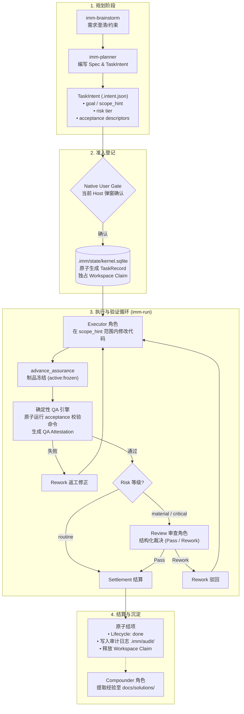
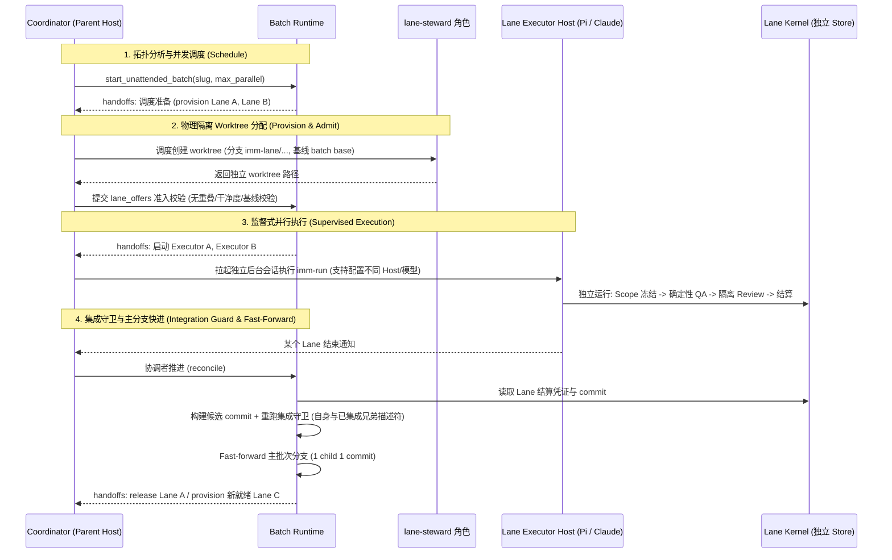

# Immune-Brain

> 面向 [Pi](https://github.com/badlogic/pi) 与 [Claude Code](https://claude.ai/code) 的确定性工程工作流与质量保障引擎 — 把模糊想法变成可交付代码，覆盖规划、执行、QA 与审查。

**语言：** [English](./README.md) | **中文**

---

## 这是什么？

Immune-Brain 为 AI 编程工具（**Pi** 与 **Claude Code**）提供结构化的工程工作流保障：

- **日常对话零负担** — 普通问答、单点代码修改与探索性对话完全保持 Host 原生体验，不拦截、不强加流程。
- **需要严谨时显式启用** — 遇到复杂功能开发或高保证任务时，显式调用 `imm-brainstorm`、`imm-planner` 或 `imm-run`。
- **计划变为可追踪的任务**（`TaskIntent` + `TaskRecord`） — 进度落盘持久化（Git + `.imm/`），会话重启或上下文清理后仍可无缝恢复。
- **质量由代码强制保障** — 自动化 QA 验收与隔离式 Reviewer 审查必须通过，任务才会结算完成。
- **已就绪的 Initiative 可以整批运行（串行或多 Lane 并行）** — 一次确认的 Batch Authorization 即可无人值守推进整批子任务；支持默认单工作区串行推进，或显式开启多 Lane 并行（按 Scope 互斥拓扑调度独立 Git worktree 并发执行，辅以集成守卫与强故障隔离），每个 child 依然保持独立的 Enrollment、QA、Review 与结算。

Pi 与 Claude Code 是支持的宿主。未声明的适配器仍不受支持。Claude Code 最低版本为 `2.1.236`，这是已通过交互式 server-initiated MCP elicitation 验证的最低版本。当前真实 Host 证据见 `docs/verification/claude-native-elicitation-authority-conformance.md`；历史报告归档于 `docs/verification/archive/`。

---

## 目录

- [安装](#安装)
- [快速开始](#快速开始)
- [如何使用](#如何使用)
- [推荐工作流：与 mattpocock/skills 组合使用](#推荐工作流与-mattpocockskills-组合使用)
- [实战案例](#实战案例)
- [核心设计哲学：把“判断”变成“查表”](#核心设计哲学把判断变成查表用确定性工程驾驭多模型)
- [7 个 Skills](#7-个-skills)
- [生命周期](#生命周期)
- [无人值守批次运行](#无人值守批次运行)
- [配置](#配置)
- [项目结构](#项目结构)
- [常见问题](#常见问题)
- [开发者指南](#开发者指南)

---

## 安装

**前置要求：** 已安装 [Pi](https://github.com/badlogic/pi) 或 [Claude Code](https://claude.ai/code)（>= 2.1.236）、Node.js 20+、`bun`（用于测试）。

### 在 Pi 中使用

Pi 通过 `package.json`（或全局 Pi 配置）自动发现 Skills 与扩展：

```json
// package.json → pi.skills / pi.extensions
"pi": {
  "skills": ["./plugins/immune-brain/skills"],
  "extensions": ["./plugins/immune-brain/.pi-extension"]
}
```

无需额外 server 配置，通过 Pi 安装本 package 后 7 个 Skill 即自动可用。

### 在 Claude Code 中使用

从 Marketplace 安装插件：

```bash
claude plugin marketplace add dereknex/immune-brain
claude plugin install immune-brain
```

或在本地开发时直接加载插件目录：

```bash
claude --plugin-dir ./plugins/immune-brain
```

### 验证安装

```bash
bun test                    # 全量测试
mise run check-plugin       # 校验插件结构
mise run check-dist-sync    # 校验生成文档同步
```

---

## 快速开始

Immune-Brain 遵循 **显式 Skill 触发（Skill-explicit）** 模型：日常对话就是轻量自然的 AI 编程，只有显式调用对应 Skill 时才会开启严格工程管理。

**1. 当你需要严谨工程流程时，显式调用 Skill：**
- 需求模糊、重大架构设计或高保证任务想先敲定方案？输入 `/grill-me`（来自 `mattpocock/skills`，强烈推荐）进行苏格拉底式高压追问与决策确认，或输入 `/imm-brainstorm`（内置极简梳理）。
- 目标明确准备制定方案？输入 `/imm-planner`（或对 Agent 说 "用 imm-planner 规划深色模式功能"）。

*(日常提问如 "这个函数什么意思"、"改个 typo" 保持完全原生，没有任何流程弹窗和开销。)*

**2. 确认计划：**
Planner 会在 `docs/plans/` 生成 `TaskIntent` 与 living Spec（锁定文件范围、风险等级与自动化验收条件）。随后弹出当前 Host 的原生确认界面：
- 在 **Pi** 中：原生 TUI 对话框；
- 在 **Claude Code** 中：原生 MCP elicitation 确认弹窗。

检查无误并确认后，才会正式锁定范围并开放执行权限。

**3. 用 `imm-run` 自动执行与验收：**
输入 `/imm-run`（或 "开始 imm-run"），工作流引擎会自动：
- 调度 Executor 仅在锁定的 scope 范围内编写代码。
- 自动运行确定性 QA 验收命令。
- 对 material/critical 任务分发隔离的 Reviewer 子代理审查代码。
- 全部通过后落盘结算凭证至 `.imm/audit/<task-id>/`，任务完成。

---

## 如何使用

Immune-Brain 提供两种清晰的工作模式：日常轻量编码走 **Host-native**，复杂高保证任务走 **Managed Path**：

| 你的情况 | 你做什么 / 说什么 | 会发生什么 |
|---|---|---|
| 日常编码、快速改动、普通问答 | 正常自然语言对话（"帮我改下文案"、"解释这段代码"） | **Host-native**：标准 Pi / Claude Code 行为，零流程开销 |
| 想法模糊，需要架构拷问、边界与决策确认 | `/grill-me`（推荐）或 `/imm-brainstorm` | → `/grill-me` 针对设计树逐项穷追猛打敲定决策；`/imm-brainstorm` 进行内置只读需求框架梳理 |
| 目标明确，需要正规计划与规格 | `/imm-planner` "规划一下深色模式功能" | → `imm-planner` 产出 `TaskIntent` + Spec，包含可执行验收条件 |
| 计划已确认，准备执行与验证 | `/imm-run` | → Executor 在范围内实现 → 确定性 QA 验收 → 隔离 Review 审查 → 任务结算 |
| 会话中断或需恢复未完成任务 | `/imm-run` | → 从磁盘状态（`.imm/`）无缝恢复，以 Kernel projection 为准 |
| 已发布的 Initiative 批次推进（串行 / 多 Lane 并行） | "无人值守跑完 initiative `<slug>`"（可指定 `--max-parallel 4` 或配置 `Lane max parallel`） | → Host 的 `start_unattended_batch`：一次原生确认绑定 plan digest。无配置时单工作区串行推进；配置并行度时开启多 Lane Git worktree 物理隔离并发执行 |
| 跨 Host 协作（Claude 规划 + Pi 编码） | 在 Claude Code 中调 `/imm-planner`，切到 Pi 输入 `/imm-run` | → Spec 与 TaskIntent 共享于 Git，Pi 原生弹窗准入并执行 QA/Review 闭环 |
| PR 被评论 / CI 挂了 | 对该 PR 使用 `/imm-pr-fix` | → 独立修复：在当前 PR 内针对性修复，不创建新 managed 任务 |
| 文档过时需要清理 | `/imm-doc-prune` | → 只读审计过时文档，仅删除经哈希审批的条目 |
| Agent 指令文件膨胀 | `/imm-doc-slim` | → 将 tracked `AGENTS.md` / `CLAUDE.md` 压到最小必要上下文 |
| 想知道哪个模型的改动总被审查 | `/imm-retro` | → 按模型排名审查负载，并从 session logs 汇报项目使用量 |

> **核心原则：Skill 显式调用**
> - **普通输入保持 Host-native**：自然语言提问绝不自动绑架流程或发起 Enrollment。你完全自主决定何时开启严格工程保障。
> - **Managed 工作流显式启动**：需要澄清决策用 `/grill-me`（或 `imm-brainstorm`），制定计划用 `imm-planner`，执行与恢复用 `imm-run`。

### 跨 Host 协作：Claude Code 规划 + Pi 编码执行

Immune-Brain 的核心状态与契约完全去会话化（Session-neutral），所有规划与审计证据均落盘在 Git 仓库（`docs/plans/`、`docs/specs/`）与 `.imm/` 中。Pi 与 Claude Code 共享完全一致的确定性 Kernel 核心与状态机。

你可以自由组合两个宿主的优势：**利用 Claude Code 的深度推理与长上下文能力进行需求澄清、Spec 撰写与任务规划，切换到 Pi 中进行极速的前台编码、确定性 QA 验收与审查闭环**。

```text
┌───────────────────────────────────┐    Git 追踪制品（落盘共享）    ┌───────────────────────────────────┐
│         Claude Code 终端          │ ───────────────────────────> │              Pi 终端              │
│  1. /imm-brainstorm (澄清与约束)    │     docs/specs/*.spec.md     │  1. /imm-run (原生 TUI 弹窗准入)   │
│  2. /imm-planner    (编写计划/规格) │    docs/plans/*.intent.json  │  2. Executor 编码 + QA 自动化验收   │
└───────────────────────────────────┘                              └───────────────────────────────────┘
```

#### 推荐协作步骤

1. **在 Claude Code 中制定 Spec 与任务规划**
   - **需求澄清（可选）**：若需求复杂或边界模糊，先在 Claude Code 中运行 `/imm-brainstorm`，梳理目标、约束与架构风险。
   - **编写计划与规格**：运行 `/imm-planner "规划 <需求名称>"`。Planner 会生成：
     - Living Spec（`docs/specs/<name>.spec.md`）：记录设计方案、架构决策与模块边界。
     - `TaskIntent`（`docs/plans/<task-id>.intent.json`）：严格锁定可修改的文件范围（`scope_hint`）、风险等级（`routine` / `material` / `critical`）以及可执行的自动化验收命令（`acceptance`）。
   - **暂存至 Git**：规划完成后停在 Enrollment 之前，将生成的 Spec 和 TaskIntent 加入 Git 暂存（`git add docs/`）。
2. **切换到 Pi 中进行代码编写与闭环执行**
   - **启动 Pi**：在同一个项目工作区中打开 Pi。
   - **确认准入并执行**：运行 `/imm-run`。Pi 会自动检测到暂存的 `TaskIntent`，并在 Pi 原生 TUI 弹窗中提示 Enrollment 确认。
   - **自动执行与验收**：
     - Executor 角色严格在 `scope_hint` 限定的文件内编写代码。
     - Kernel 自动运行 acceptance 命令进行确定性 QA 验收，不依赖口头汇报。
     - 若为 `material` 或 `critical` 任务，自动调度前台 Reviewer 审查。
     - 验证全部通过后，Kernel 原子落盘证据至 `.imm/audit/<task-id>/` 并释放工作区锁定。
3. **为什么可以无缝切换？**
   - **状态落盘，解耦会话**：所有任务契约（TaskIntent）、设计规格（Spec）和执行状态（`.imm/state/kernel.sqlite`）均持久化在磁盘上，不绑定任何特定 AI 会话的上下文。
   - **双向断点恢复**：无论在哪个 Host 暂停或关闭会话，随时可以在 Pi 或 Claude Code 中重新输入 `/imm-run` 无缝恢复，Kernel projection 确保进度与证据不丢失。

---

## 推荐工作流：与 mattpocock/skills 组合使用

Immune-Brain 能够在工程进入实施阶段后提供坚不可摧的确定性闭环与质量约束，但在实际软件研发中，绝大多数失败早在编码前就已注定：**大模型在尚未充分遍历设计树、评估技术折中并推演边界条件时，就匆忙上手编码。**

为了彻底杜绝盲目开工与范式漂移，生产环境中最推荐的最佳实践组合是将 Matt Pocock 的 **`mattpocock/skills`** 作为上游，与 **Immune-Brain** 构筑的下游确定性引擎组合使用：

> **双引擎协同哲学**
> - **上游苏格拉底式充分摩擦（`grill-me`）**：主动放慢思考节奏。AI 化身为苛刻的技术面试官，在落实任何代码与规格之前，对设计树的每一个分支、技术选型与隐性假设进行穷追猛打，逐一敲定决策。
> - **下游确定性工程闭环（`imm-planner` + `imm-run`）**：将敲定的共识翻译为不可篡改的机器契约（`TaskIntent` + living Spec），通过宿主原生弹窗由人授权，严格冻结文件边界（`scope_hint`），并由沙箱子进程 QA 真实跑通与隔离审查子代理把关交付。

```text
┌────────────────────────────────────────────────────────────────────────────────────────────────────────┐
│ 1. 上游苏格拉底式决策对齐 (mattpocock/skills /grill-me)                                                │
│ 职责: 沿设计树每一个分支进行高压追问，梳理技术权衡与隐性假设，达成架构共识                             │
└───────────────────────────────────────────────────┬────────────────────────────────────────────────────┘
                                                    │ 敲定的决策分支与架构设计共识
                                                    ▼
┌────────────────────────────────────────────────────────────────────────────────────────────────────────┐
│ 2. 正式机器契约与方案规划 (Immune-Brain /imm-planner)                                                  │
│ 职责: 编写 Living Spec 与 TaskIntent (.intent.json)；锁定 scope_hint 与 VerificationDescriptor v2     │
└───────────────────────────────────────────────────┬────────────────────────────────────────────────────┘
                                                    │ Git 追踪的机器契约制品
                                                    ▼
┌────────────────────────────────────────────────────────────────────────────────────────────────────────┐
│ 3. 宿主原生人工准入确认 (Native Host Enrollment)                                                       │
│ 职责: 开发者在原生 TUI / MCP 弹窗中核对范围并授权；Kernel 原子记录 Git 基线并获取 SQLite CAS 锁        │
└───────────────────────────────────────────────────┬────────────────────────────────────────────────────┘
                                                    │ 工作区独占租约
                                                    ▼
┌────────────────────────────────────────────────────────────────────────────────────────────────────────┐
│ 4. 确定性执行与凭证结算 (Immune-Brain /imm-run)                                                        │
│ 职责: 冻结 Scope 内 Executor 编码 -> 真实子进程 QA (bun test) -> 隔离 Subagent Review -> CAS 凭证结算 │
└────────────────────────────────────────────────────────────────────────────────────────────────────────┘
```

### 为什么推荐用 `grill-me` 代替 `imm-brainstorm` 进行决策确认

虽然 Immune-Brain 内置了轻量的 `imm-brainstorm` 技能，但面对非平凡业务功能、重大架构调整或安全敏感边界时，**强烈推荐使用 `/grill-me` 作为前置决策工具**：

| 维度 | 内置 `imm-brainstorm` | 上游 `/grill-me` (`mattpocock/skills`) | 组合推荐姿态 |
|---|---|---|---|
| **生态与安装** | 内置于 Immune-Brain（开箱即用，零依赖） | 来自 `mattpocock/skills` 生态（`npx skills@latest add mattpocock/skills --skill grill-me`） | 由 `/grill-me` 担任上游思想对齐者，Immune-Brain 掌管下游确定性工程闭环 |
| **交互模式** | 结构化问题框架梳理；批量发问；只读概览 | 单轮迭代式、高压苏格拉底式追问；沿设计树逐项穷尽推演 | `/grill-me` 主动质疑开发者的盲目假设，拒绝模糊妥协 |
| **推演纪律** | 优先查阅仓库代码，提炼顶层目标与约束风险 | 优先查阅仓库代码，针对每个决策点主动提供带倾向的推荐方案 | 彻底消除“氛围感盲写”（vibe coding），在上游将设计决策压成确定性共识 |
| **产出形态** | 只读的 `brainstorm_framing` 总结块 | 遍历并收敛完成的完整设计树决策集合 | 将确认后的决策清单无缝输入给 `/imm-planner` 转化为机器契约 |
| **适用场景** | 轻量需求梳理、离线无网络环境或简单任务 | 复杂业务系统、核心架构重构、多服务联动与高危门禁功能 | 严肃工程研发与生产级任务的**首选推荐标准** |

### 安装与配置

使用官方 Skills 安装器将 `grill-me` 添加到当前项目或全局环境：

```bash
# 仅添加 mattpocock/skills 中的 grill-me
npx skills@latest add mattpocock/skills --skill grill-me

# 或安装完整套件
npx skills@latest add mattpocock/skills
```

### 典型端到端流水线：`grill-me` → `imm-planner` → `imm-run`

1. **第一步：苏格拉底式设计拷问（`/grill-me`）**
   - 执行 `/grill-me "实现多租户 Webhook 分发系统，包含重试退避与防重放机制"`。
   - Agent 会先阅读工程现有代码模式，随后针对设计树展开单点追问（存储选型、幂等方案、退避曲线、错误捕获），并在每个问题后给出明确的推荐选项与权衡说明。
   - 开发者逐一确认直至全部分支收敛：“*决策树已全部收敛，准备开始制定工程计划。*”
2. **第二步：机器契约与规格规划（`/imm-planner`）**
   - 执行 `/imm-planner "基于刚才 grill-me 敲定的决策方案规划 Webhook 分发功能"`。
   - `imm-planner` 吸收已确认的架构决策并生成：
     - **Living Spec**（`docs/specs/webhook-dispatcher.spec.md`）：锁定参考坐标、架构权衡与明确的禁止越界边界（Negative Scope）。
     - **TaskIntent**（`docs/plans/webhook-dispatcher.intent.json`）：锁定文件范围 `scope_hint`、风险等级（`material`）与自动化验收命令 `VerificationDescriptor v2`。
3. **第三步：原生弹窗准入授权（Enrollment Gate）**
   - 将生成的 Spec 与 Plan 纳入 Git 暂存（`git add docs/`）。
   - 执行 `/imm-run`。弹出当前宿主的原生确认界面（Pi TUI 弹窗 / Claude Code MCP 交互弹窗）。
   - 人工点击确认后，Kernel 原子生成 Git 基线快照（`enrollment-baseline.json`）并加持 SQLite CAS 工作区排他锁。
4. **第四步：物理冻结执行与客观验证（`/imm-run`）**
   - **Executor**：严格在 `scope_hint` 文件信封内编写代码，任何物理逃逸直接 fail-closed 阻断。
   - **确定性 QA 引擎**：Kernel 直接前台拉起子进程执行 `bun test`，以真实退出码 0 判定胜负，拒绝口头汇报。
   - **隔离 Reviewer 审查**：针对 `material`/`critical` 任务，调度独立的只读审查子代理基于 Git blob 制品严格审计。
   - **结算归档**：Kernel 原子落盘证据至 `.imm/audit/<task-id>/` 并释放工作区锁。

---

## 实战案例

### 案例 1：全新功能从零开发 — 多租户 Webhook 分发系统

- **目标**：实现一套生产级多租户 Webhook 分发引擎，具备 HMAC 密钥签名、指数退避重试与防重放攻击能力。
- **不使用本工作流的常见缺陷**：AI 拿到需求后立即动手写文件，随意引入未经评估的外部三方库，忘记校验时间戳导致重放漏洞，留下内存泄漏的定时器，并且在未做超时中断验证的情况下直接宣称“开发完成”。
- **实战流程**：
  1. **上游高压对齐（`/grill-me`）**：
     - *问题 1（持久化选型）*：SQLite 还是外部队列？*推荐方案*：复用工程现有的 SQLite CAS 表，避免引入额外基础设施依赖。
     - *问题 2（安全规范）*：如何防御重放攻击？*推荐方案*：强制要求 `X-Webhook-Timestamp` 请求头，允许最大 5 分钟时钟容差，使用 HMAC-SHA256 签名。
     - *问题 3（韧性保障）*：重试策略与超时机制？*推荐方案*：采用 Full Jitter 指数退避，最多重试 5 次，单次请求通过 `AbortController` 施加 10 秒硬超时。
     - *成果*：全套架构权衡在 3 分钟人机对话内全部锁定。
  2. **机器契约规划（`/imm-planner`）**：
     - Planner 编写 `docs/specs/webhook-dispatcher.spec.md`，明确标记 Negative Scope（`src/auth/` 与 `src/billing/` 严禁改动）。
     - 生成 `docs/plans/task-webhook-dispatcher.intent.json`，定级为 `material` 风险，配置验收命令真机运行 `bun test tests/webhook-dispatcher.test.ts`。
  3. **原生弹窗准入确认**：
     - 开发者在 Git 中检视 diff，并在 Pi TUI / Claude Code 弹窗中授权。
  4. **执行、QA 验证与审查（`/imm-run`）**：
     - Executor 在 `scope_hint` 限定范围内编写代码。
     - Kernel 真机拉起沙箱执行 `bun test tests/webhook-dispatcher.test.ts`，验证退出码为 `0`。
     - 隔离的 Reviewer 子代理审计 Git blob，核实无任何越界改动并检查异常处理规范。
     - Kernel 原子落盘凭据至 `.imm/audit/<task-id>/`。

### 案例 2：关键架构重构 — CAS 状态机存储引擎迁移（v1 → v2）

- **目标**：将持久化层从历史遗留的 JSON 文件平滑迁移为基于 SQLite 的原子 CAS 引擎，并保持零停机回滚和历史只读审计能力。
- **不使用本工作流的常见缺陷**：模型在底层存储重构时极易造成静默数据损坏、擅自删除历史兼容路径，并通过篡改断言在假测试中制造“通过”。
- **实战流程**：
  1. **上游高压对齐（`/grill-me`）**：
     - *拷问焦点*：“迁移期间若有正在运行的 v1 任务该如何处理？推荐方案：实施严格的排空检查（`drain_required`），拒绝双写，存在活跃任务时立即中断拒绝迁移。”
     - *拷问焦点*：“回滚时如何保证 WAL 不损坏？推荐方案：采用单文件事务、操作系统级排他文件锁与不可变 Git 快照。”
  2. **代码强制兜底规划（`/imm-planner`）**：
     - 由于改动触碰了 `runtime/kernel/storage.ts`，Kernel 规则强制将风险等级锁定至 `critical` 底线。
     - Planner 精准锚定代码坐标（`storage.ts:120`），并配置包含真实历史迁移固件的验收测试。
  3. **原生准入确认**：开发者在宿主原生弹窗中看到被强制锁定的 `critical` 风险与基线快照，点击授权。
  4. **确定性 QA 与对抗性审查（`/imm-run`）**：
     - 真机执行全量回归套件与真实历史固件迁移测试。
     - 独立的 Devil's Advocate Reviewer 子代理针对不可变 Git blob 展开对抗性审计，重点核验向后兼容逻辑。
     - 原子结项并写入不可篡改的审计记录。

### 案例 3：跨 Host 协同开发 — Claude Code（深度追问与方案规划）+ Pi（极速前台执行与真机验收）

- **目标**：最大化利用桌面端旗舰模型的深度推理进行架构推演，同时在极速本地/远程终端中执行代码，大幅节省 Token 成本并提升交付速度。
- **实战流程**：
  1. **在 Claude Code（桌面端）中**：
     - 运行 `/grill-me`（来自 `mattpocock/skills`），利用 Claude 旗舰推理能力充分拷问架构方案。
     - 运行 `/imm-planner`，生成精准定位到代码行号的 Living Spec 与 `TaskIntent` 机器契约。
     - 将制品提交或暂存到 Git（`git add docs/ && git commit -m "docs: webhook spec and plan"`）。
  2. **切换到 Pi（本地或远程终端）中**：
     - 在同一工作区中打开 Pi。
     - 输入 `/imm-run`。Pi 自动识别到暂存的 `TaskIntent`，弹出原生 TUI 弹窗提示准入。
     - Pi 的 Executor 角色调度高吞吐、高性价比模型（Fast / Mid Tier）在锁定的文件边界内写代码。
     - 本地进程直接执行 `bun test` 产出真实退出码凭证。
     - 审查通过后 Kernel 结算结项。
  3. **成果**：跨 Host 状态零损失无缝衔接，同时节约 60%~70% 的旗舰推理 Token 支出。

---

## 核心设计哲学：把“判断”变成“查表”，用确定性工程驾驭多模型

大模型（尤其是轻量/高性价比的 Fast 档模型）在工程落地中最容易失败的原因，不是代码语法不过关，而是死在**语义含糊、过度发挥**与**逃避严格验证**上。

Immune-Brain 的核心假设是：**不要让弱模型做架构决策，把它变成精准执行的查表机；关键的门禁与审核则交由代码规则与强模型把关。**

```text
┌────────────────────────────────────────────────────────────────────────────────────────┐
│ 1. 方案规划 (Brainstorm) & 2. 计划制定 (Planner)                                       │
│ 工具: Claude Code | 模型: 强推理旗舰模型 (Strong Tier)                                 │
│ 职责: 澄清约束、架构推演，把“判断”收敛为精确到行号的 Living Spec 与可执行 TaskIntent      │
└───────────────────────────────────────────┬────────────────────────────────────────────┘
                                            │ Git 追踪制品共享 (docs/specs, docs/plans)
                                            ▼
┌────────────────────────────────────────────────────────────────────────────────────────┐
│ 3. 代码实现 (Executor)                                                                 │
│ 工具: Pi | 模型: 高吞吐/经济型模型 (Fast / Mid Tier)                                    │
│ 职责: 冻结 Scope 内“按图索骥”，严格镜像既有代码模式填空，无设计决策负担                │
└───────────────────────────────────────────┬────────────────────────────────────────────┘
                                            │ 本地代码与状态交付
                                            ▼
┌────────────────────────────────────────────────────────────────────────────────────────┐
│ 4. QA 确认 (Deterministic QA)                                                          │
│ 工具: Pi / Kernel Native                                                               │
│ 职责: 零 LLM 干预，真机执行 Verification Descriptor v2 命令，机器判决 Pass/Fail         │
└───────────────────────────────────────────┬────────────────────────────────────────────┘
                                            │ 自动化测试真实跑通后触发
                                            ▼
┌────────────────────────────────────────────────────────────────────────────────────────┐
│ 5. 代码审查 (Isolated Review)                                                          │
│ 工具: Pi Subagent | 模型: 强推理/高智商审查模型 (Strong Tier)                           │
│ 职责: 基于不可变 Git blob 打包的 ReviewBundle，结合 Devil's Advocate 规则审查代码      │
└────────────────────────────────────────────────────────────────────────────────────────┘
```

### 1. 把“判断”变成“查表”：挤干含糊空间，弱模型按图索骥

约束弱模型最有效的一招，是在 Spec 阶段彻底消除含糊：

- **坐标级精准定位**：在 Spec 中直接给出既有实现的参考锚点（如 `kernel.ts:1219`），明确要求 *"mirror this exact shape"* 沿用既有实现模式。
- **零自由度契约**：连报错文案、返回状态码与错误类型都要求照抄既有格式（如复制现有 `throw new VerificationDescriptorError(...)`，仅替换具体的命令名与字段名），不留任何自由措辞或抽象发挥的空间。
- **物理冻结与负向清单（Exclusion List）**：在 Spec 的 Scope 章节中明确列出 Exclude 清单（严禁改动哪些文件、特定 receipt 路径禁止复用）。弱模型不需要自行推断架构影响面，只需在限定红线内按图索骥。

### 2. “做完”的定义是可执行的，不是文字汇报

口头汇报（Text-based Promise）是幻觉与蒙混过关的温床。Immune-Brain 的 Kernel 强制要求所有完成标准全部代码化、物理化：

- **Verification Descriptor v2 强契约**：
  `TaskIntent` 中每个验收条件（AC）都不是泛泛的自然语言，而是强类型的机器执行描述符（`assurance_kernel/verification_descriptor/v2`）：
  ```json
  {
    "contract": "assurance_kernel/verification_descriptor/v2",
    "command": {
      "executable": "bun",
      "argv": ["test", "tests/kernel-migrate-to-vnext.test.ts"],
      "cwd": ".",
      "timeout_ms": 30000,
      "max_output_bytes": 262144
    },
    "environment": { "prepare": null, "writable_paths": [] }
  }
  ```
  模型无法靠“我已经实现并测试通过”的话术过关；测试必须由 Kernel 子进程在隔离沙箱中真机拉起，根据真实的 exit code、stdout 与超时时限判定胜负。
- **物理级 Scope 冻结**：
  在 Enrollment 准入时，Kernel 通过 `captureGitWorkspaceSnapshot` 对 Git 树和 dirty files 进行基线快照。如果候选任务的 scope 已经变脏，或 Executor 试图修改 `scope_hint` 允许范围外的文件（`assertNoEnvelopeEscape`），Kernel 直接 fail-closed 拦截并拒绝推进。
- **独立 QA 与隔离 Reviewer 强制 Gate**：
  代码修改完成后，QA 阶段由本地命令执行器严格校验；对于 `material` 和 `critical` 任务，必须经由独立的 Reviewer 子代理审计并签批。任何试图跳过门禁的幻觉行为都会被底层状态机拦下。

### 3. Devil's Advocate Audit 与代码级防御：封死偷懒路径

弱模型在面对复杂逻辑和优化压力时，极易选择走阻力最小的“偷懒捷径”。Immune-Brain 从 Spec 到代码层面构建了层层阻尼：

- **防虚荣验证（Verification Vanity）**：
  在 Devil's Advocate Audit 中明确立规：“`--check` 跑通不等于真跑能成功”。静态检查、类型声明或空跑（dry-run）绝不能替代带断言的真实运行测试。
- **防规格稀释（Spec Dilution）**：
  严禁模型因为实现困难而悄悄删减需求，例如：“不许在没有 v1 数据的环境中凭空编造虚假的 v1→v2 转换逻辑”来伪造兼容性。
- **代码强制的确定性风险兜底（Deterministic Risk-Tier Floor）**：
  模型可能会自作聪明地将高危任务自评为 `routine`（常规），企图绕过代码审查。在 `kernel/intent.ts` 中，系统硬编码了底线规则：
  > 只要 `scope_hint` 触及 `kernel/`、`assurance/`、`claude/` 或 `.pi-extension` 等核心权威路径，无论作者声明的风险多么轻微，Kernel 会强制将风险等级锁定至至少 `material`，由代码物理强制触发隔离审查。
- **客观反证机制（Live Counterevidence & Refuted Findings）**：
  审查模型并非百分之百可信。当 Reviewer 提出怀疑某个 acceptance 存在缺陷的主观 finding 时，若 Kernel 拥有一份针对当前 `diff_hash` 和 `intent_hash` 真实跑通的新鲜 QA 凭证（Attestation），Kernel 会直接将该 finding 标记为 `refuted`（反证驳回），避免审查模型的幻觉阻碍任务落地；而一旦代码产生新改动使凭证过期（stale），该 finding 又会立即重新激活阻塞。

### 4. Token 经济学与成本杠杆：没有 Cost Lever，成本会复合爆炸

如果缺乏精细的成本杠杆（Cost Lever），多 Agent 系统的成本会随着任务拆解呈几何级数（Compound）激增：

- **先 Plan 后 Implement（“量两次，裁一次”）**：
  一份几百 token 的精准 Spec 与 TaskIntent 成本，远低于一次方向做错后推倒重来、反复 debug 烧掉的上万 token。“量两次裁一次”在多 Agent 协作中是字面意义的真金白银。
- **冻结 Scope 掐断 Token 黑洞**：
  弱模型最爱“顺手重构无关文件”或“格式化全工程”。在 Immune-Brain 中，每多碰一个文件不仅增加额外的 token 消耗，还会让 Reviewer 和 Git Diff 负担翻倍。基于哈希的 Scope 边界硬性杜绝了模型过度发挥。
- **Model Tier 分档流水线（`subagent-model-tier-pipeline`）**：
  将模型按能力与成本精细分档：
  - **Fast 档（如 Flash / 4o-mini）**：专跑无设计决策的机械填充、局部测试修复、固定模板编码。
  - **Mid 档**：负责可靠性审计（`reliability-reviewer`）与常规代码审查。
  - **Strong 档（如 Sonnet / Opus）**：仅用于前期 Brainstorming、Spec 架构推演与高危安全审计（`security-reviewer`）。

### 5. 典型协作全景：跨 Host 与多模型落地

在 Immune-Brain 的跨 Host 协作模式中，各阶段工具与模型能力得以实现最优配置：

| 阶段 | 参与工具 / 宿主 | 模型档位推荐 | 职责与确定性保障 |
|---|---|---|---|
| **1. 方案规划 (Brainstorm)** | Claude Code (`/imm-brainstorm`) | **Strong Tier** (旗舰模型) | 利用长上下文与强推理，与开发者深入讨论方案、挖掘隐性约束并排除伪需求。 |
| **2. 计划制定 (Planner)** | Claude Code (`/imm-planner`) | **Strong Tier** (旗舰模型) | 编写精确到文件行号的 Living Spec，生成携带 `VerificationDescriptor` 的 `TaskIntent`，完成 Devil's Advocate 预审。 |
| **3. 代码实现 (Executor)** | Pi (`imm-run`) | **Fast / Mid Tier** (经济模型) | 在 Pi TUI 弹窗确认冻结 Scope 后，小模型在信封内按图索骥写代码，遵守 YAGNI 极简红线。 |
| **4. QA 确认 (Verification)** | 本地进程 / Kernel Native | **无需模型 (零 LLM)** | 由 Kernel 直接执行测试脚本（如 `bun test`），严格依照退出码和标准输出出具不可篡改的 Attestation。 |
| **5. 代码审查 (Review)** | Pi Subagent (`immune-brain-reviewer`) | **Strong Tier** (高智力模型) | 调度隔离的只读审查子代理，基于不可变 Git blob 打包的 `ReviewBundle` 进行对抗性审计，通过后 Kernel 结算归档。 |

---

## 7 个 Skills

| Skill | 类型 | 何时使用 | 职责 |
|---|---|---|---|
| `imm-brainstorm` | Managed 入口 | 需求存在实质歧义 | 框架化问题、提出开放问题，不做实现 |
| `imm-planner` | Managed 入口 | 目标清晰 | 编写/修订 `TaskIntent` 与 spec，不负责 Enrollment 与构建 |
| `imm-run` | Managed 协调器 | 计划已验证 | 通过 foreground Tools 协调 执行 → QA → Review → 收尾 |
| `imm-pr-fix` | 独立 | PR 需修复 | 原地修复单个 PR，不触及 managed authority |
| `imm-doc-prune` | 独立 | 清理过时文档 | 仅删除哈希绑定的 manifest 条目 |
| `imm-doc-slim` | 独立 | Agent instruction 膨胀 | 将 tracked AGENTS/CLAUDE/GEMINI.md 压到最小必要上下文 |
| `imm-retro` | 独立 | 比较模型的审查负载 | 排名被审查代码的作者并汇报项目使用量 |

Executor、QA、Review、Compounder 等为 `imm-run` 内部调度的角色，无需手动调用。

所有 7 个 Skill 均显式调用。新需求开发时：若需求含糊先调 `imm-brainstorm`，目标清晰直接调 `imm-planner`，完成确认后调 `imm-run` 推进闭环。

### Managed Path 入口（brainstorm → planner → loop）

这三个 Managed Skill 组成连续的工作流管道，拥有统一的 authority 模型：在你于原生确认窗口授权前绝不执行任何写入，每一次状态转换均由 Kernel 权威结算。

#### `imm-brainstorm` — 需求与问题澄清

- **触发方式：** 显式调用 `/imm-brainstorm` 或明确提出需求澄清。
- **职责：** 梳理问题框架 — 目标、约束、未知项与风险 — 产出 `brainstorm_framing` 结论及下一步建议（通常指向 `imm-planner`）。
- **边界：** 纯只读设计。不修改代码、不修改测试、不写入运行态、不创建 Spec 或 TaskIntent。
- **产出：** 结构清晰、可解答的问题框架，作为 Planner 的输入。

#### `imm-planner` — Spec 与 TaskIntent 规划

- **触发方式：** 显式调用 `/imm-planner` 或明确提出规划请求。
- **职责：** 编写或修订 `TaskIntent` 文件（`docs/plans/`）与 living Spec（`docs/specs/`） — 划定文件范围（`scope_hint`）、风险等级与验收条件。对于多任务 Initiative，负责按依赖顺序和粒度拆解为 parent/child TaskIntent。
- **边界：** 不编写业务实现代码、不经 revision 流程不覆盖已 Enrolled 的 TaskIntent，不擅自赋予执行权限 — 仅当前 Host 原生确认窗口具备授权能力。
- **产出：** 纳入 Git 版本控制、等待 Enrollment 确认的 `TaskIntent`。

#### `imm-run` — Managed 执行与质量保障

- **触发方式：** 显式调用 `/imm-run`（启动、恢复或检查 managed 任务）。
- **职责：** 通过前台 Tool 驱动任务端到端闭环 — Executor 仅在冻结的 scope 内修改代码，确定性 QA 逐项运行验收条件，隔离的 Reviewer 子代理审计 material/critical 任务，最后由 Kernel 结算落盘凭证。会话中断后从磁盘状态自动恢复，以 Kernel projection 为真源。
- **边界：** 绝不跳过或弱化失败检查、无用户原生授权绝不执行、遇到版本或权限偏移立即 fail-closed。
- **Finding 证据：** 每一项 Review finding 均携带可机器核验的 provenance（`trigger`、`caller_chain`、`violated`）。若新鲜且通过的 QA 证据已证明某项 finding 声称的 acceptance 通过，则标记为 `refuted`，仅在证据过期时才会重新阻塞。
- **产出：** 带有完整 QA + Review 签批、保存在 `.imm/audit/<task-id>/` 的 `done` 状态 TaskRecord。

### 独立维护入口

三个维护类 Skill 保持 Host-native：不创建 managed 任务、不推进 Managed 工作流、尊重已有的 Managed owner。

#### `imm-pr-fix` — PR 修复

- **触发方式：** 显式要求修复 GitHub PR 的 review 意见、合并冲突或 CI 失败。
- **职责：** 原地修复单个 PR — 诊断 review/冲突/CI 证据，实施最小范围修复，并重跑相关检查。
- **边界：** 严格限定在 PR 原有范围内；将远端文本视为不可信数据；修复不授予合入或批准权限。

#### `imm-doc-prune` — 过时文档清理

- **触发方式：** 显式要求清理当前过时的文档。
- **职责：** 只读审计文档时效性，根据用户明确审批的哈希绑定 manifest 进行精准删除，每次修改后立即重验。

#### `imm-doc-slim` — Agent 指令文件瘦身

- **触发方式：** 显式要求精简版本控制下的 `AGENTS.md` / `CLAUDE.md` / `GEMINI.md`。
- **职责：** 遵循与 `imm-doc-prune` 相同的「只读审计 + 哈希清单审批」模式，仅保留无法直接推导的必要规则。

#### `imm-retro` — 审查负载与项目使用回顾

- **触发方式：** 显式要求跨模型审查复盘或项目使用量回顾。
- **职责：** 从 pi session logs 按模型排名被审查代码的作者，并汇报 sessions/turns/编辑量/工具分布。只读；不审查 diff。

---

## 生命周期



### 核心架构与确定性保证

1. **双轨制 (Two Paths)**
   - **Host-native Path**：日常对话、代码检视、单点修改，不触碰 Kernel 权限，零流程开销。
   - **Managed Path**：由 `imm-brainstorm` / `imm-planner` / `imm-run` 显式驱动，全程受 Kernel 约束。

2. **权限与契约 (Authority & Contract)**
   - **TaskIntent (`.intent.json`)**：机器契约本体，严格锁定 `scope_hint`（文件修改范围）、`risk`（风险层级）与 `acceptance`（绑定 Verification Descriptor v2 的确定性断言）。
   - **Native Gate (Enrollment)**：唯一一次人工介入确认，Kernel 原子抢占工作区所有权（基于 SQLite CAS），防止多任务并发冲突与范围漂移。
   - **Git 物理基线快照 (Physical Baseline)**：准入时记录真实的 Git HEAD 与 dirty 文件状态（`enrollment-baseline.json`），任何超出 `scope_hint` 的物理逃逸（`assertNoEnvelopeEscape`）都会直接阻断执行。

3. **客观验证与不可变证据链 (Deterministic Assurance & Evidence Trail)**
   - **QA 优先与真实进程调用**：由 Kernel 直接前台拉起子进程执行测试命令，校验退出码、标准输出并施加超时上限，不依赖 LLM 口头汇报。
   - **按险定级与确定性兜底**：`routine` 仅需 QA；`material`/`critical` 必须追加独立只读 Reviewer 产出结构化裁决。触碰核心权威路径强制定级为 `material`。
   - **反证机制 (Live Refutation)**：主观 Review finding 可由真实通过的新鲜 QA 证据反证驳回；代码发生改动后反证自动失效并重新阻塞。
   - **不可变审计落盘**：任务结项时，完整的 `TaskRecord`、Git blob 打包的 `ReviewBundle`、QA Attestation 凭证原子沉淀至 `.imm/audit/<task-id>/` 并受 Git 追踪。
   - **批处理与多 Lane 并行 (Unattended Batch & Parallel Lanes)**：基于 GitHub Issue / `plan_digest` 推进。支持默认单分支串行或多 Lane 物理并行模式；并行时协调者基于 `scope_hint` 互斥拓扑调度独立 Git worktree 并发执行，结算时通过集成守卫（Integration Guard）在候选提交上重跑确定性验收命令再 fast-forward 主分支，杜绝并发污染。

核心不变量：

- **一次仅一个活跃步骤**，编辑仅在步骤边界内。
- **范围（`scope_hint`）在 enrollment 时冻结**，范围外文件被物理忽略与拦截。
- **先记录证据再关闭** — 只有 QA 能关闭步骤。
- **Finding 必须携带证据** — 被反证的 Review finding 只在绑定它的 QA 证据对当前 revision、intent hash 与 diff 仍然新鲜时压制工作；证据过期后 finding 重新阻塞，且这个失效过程不重写任何已存状态。
- **批次必须显式授权且有边界** — 只有你确认 Host 的 `start_unattended_batch` 之后才存在无人值守批次；每个 child 仍各自 Enrollment、QA、Review 与结算。
- **Advisory 不实现，执行不自审。**

---

## 无人值守批次运行

当一个 Initiative 下包含多个已就绪的 child 任务时，开发者无需逐个手动触发 `imm-run`，可通过 Host 原生 privileged tool `start_unattended_batch` 进行整批无人值守推进。

系统支持两种批次运行形态：**默认串行模式** 与 **多 Lane 并行模式（Parallel Batch Lanes）**。

### 1. 批次运行模式概览

| 维度 | 串行批次 (Serial Batch，默认) | 多 Lane 并行批次 (Parallel Batch Lanes) |
|---|---|---|
| **开启方式** | 调用 `start_unattended_batch(slug)` | 显式传入 `max_parallel` 或在配置中设定 `Lane max parallel: <n>` |
| **工作区拓扑** | 共享唯一的专属批次分支（`imm-batch/<slug>`） | Coordinator 维护主批次分支；各并发任务独占独立 Git worktree（`imm-lane/<task-id>` 分支） |
| **调度策略** | 严格按依赖拓扑层级单任务逐个串行推进 | 互不依赖且物理修改范围（`scope_hint`）**完全不重叠（Scope-disjoint）**的任务并发执行 |
| **Authority 边界** | 协调者按序推进单个任务的本地 Authority Store | 每个 Lane 拥有完全隔离的本地 Authority Store，各自独立加锁，零全局 CAS 竞争 |
| **集成机制** | 任务验证完成直接在批次分支提交 1 个 commit | Lane 结算后通过 Git plumbing 校验变更等价性，并在候选提交上重跑集成守卫（Integration Guard）再 fast-forward |
| **适用场景** | 任务数少、前后改动文件强耦合、单核/受限环境 | 大中型 Initiative、多模块解耦子任务、多核或多 Host 算力充裕场景 |

### 2. 批次授权与运行红线

- **入口显式且单一授权：** 未调用 `start_unattended_batch` 之前不存在任何批次状态或分支；未调用时 `imm-run` 行为与逐任务 Enrollment 完全一致。调用时由原生 gate（Pi TUI 弹窗或 Claude MCP elicitation）一次性展示有序任务清单与全局 `plan_digest`，用户的单次确认即为整批执行提供完备授权。
- **Child Authority 守恒：** 批次仅代表授权范围的聚合，绝非降低工程标准。每个 child 依然由 Kernel 单独执行 Enrollment、物理 Scope 冻结、真实子进程 QA、隔离 Review 与独立的 `TaskRecord` 结算。批次只是一次授权的覆盖范围，不是新的授权层级。
- **确定性执行边界：** 仅推进已发布且非 `critical` 的 child 任务；遇到人工决策挂起（`needs_human`）、预算/超时中断或提交异常时立即安全暂停批次，被阻断任务的下游依赖标记为跳过（`skipped_blocked`）而非无序推进。批次运行器不擅自 push、不开 PR、不代替用户结算决策。

### 3. 多 Lane 并行流水线与架构（Parallel Batch Lanes）

在多 Lane 并行模式下，系统通过 Coordinator（Parent Host）、`lane-steward`（工作区管家）与 Lane Executor Host（执行宿主）的严密协作，实现物理级并发隔离：



#### 并行执行的核心机制：

1. **按 Scope 互斥拓扑调度 (Scope-Disjoint Scheduling)**：
   Coordinator 实时计算任务依赖图与路径重叠度。仅当任务的前置依赖已全部集成，且其 `scope_hint` 与当前所有进行中（in-flight）Lane 的路径集合**在物理上完全无交集**时，才允许并发派发；存在路径重叠的任务自动排队，直到前序冲突 Lane 集成完毕。
2. **监督式会话生命周期 (Supervised Host Sessions)**：
   Parent Host 为每个 Lane 拉起独立的 Executor Host 进程（支持跨 Host 与模型档位配置，如 Pi 或 Claude Code）。Parent 监控会话退出事件，会话结束即触发下一轮协调；Parent 不轮询、不猜测终端输出。当 Parent 运行在 Herdr 内时，会为每个 Lane 的 Executor Host 开一个独立 tab，且绝不会替开发者回答其中的信任、登录或权限对话框。
3. **集成守卫与候选验证 (Integration Guard)**：
   为防止并发修改产生隐式冲突，Lane 结算后不会盲目合入主分支。Coordinator 在 Git plumbing 层面构建候选提交，并在候选树上**重跑当前任务以及自其分叉以来所有已合入兄弟任务的确定性验收描述符**。只有全部再次跑通，才通过 fast-forward 原子合入主批次分支。
4. **强故障隔离 (Fault Isolation)**：
   若某个 Lane 出现测试失败、评审驳回或集成冲突，主批次分支保持零写入（Zero-write），仅该任务被置为 `needs_human`，其后续依赖标记为 `skipped_blocked`；其他无冲突的并行 Lane 继续正常推进。
5. **安全回收纪律 (Agents Only Create)**：
   Parent 与 `lane-steward` 角色仅负责创建 Lane（worktree）和终端 tab，绝不擅自关闭 tab、不终止外部会话、不自动删除用户磁盘上的 worktree。任务集成完成后，系统明确告知开发者哪些 Lane 已可安全回收，由开发者自主清理。


---

## 配置

Immune-Brain **没有独立配置文件**，偏好设置写在仓库根目录下当前 Host 的 agent 指令文件里——`AGENTS.md`（Pi）或 `CLAUDE.md`（Claude Code）：

```md
## Immune-Brain Preferences

- Initiative carrier default: github   # 或 local
- Lane max parallel: 4                 # 可选；开启 lane mode
- Lane Executor Host: claude-code      # 可选；或 pi
- Lane Executor model: <model id>      # 可选；需同时配置 Lane Executor Host
- Lane Executor effort: high           # 可选；需同时配置 Lane Executor Host
```

| 偏好 | 选项 | 默认 | 说明 |
|---|---|---|---|
| 回复语言 | 任意自然语言 | 仓库 `AGENTS.md` | 机器契约/路径/标识符保持原文 |
| Initiative 载体 | `local` / `github` | 无默认，Planner 询问 | 仅当提案拆分为多个 TaskIntent 时生效 |
| Advisory subagent | 允许 / 单人 | 允许 | 受 Pi host 策略与用户显式指令约束 |
| Lane max parallel | ≥ 1 的整数 | 无默认，批次保持串行 | 启动批次时作为 `max_parallel` 传入；续跑沿用批次记录的值 |
| Lane Executor Host | `claude-code` / `pi` | 无默认，优先用 Parent 同类 Host | 所有 Lane 都用该 Host，不回退到另一个 |
| Lane Executor model | 该 Host 的 model ID | 无默认，用 Executor Host 自己的默认 | 仅在配置了 `Lane Executor Host` 时生效 |
| Lane Executor effort | 该 Host 的强度档位 | 无默认，用 Executor Host 自己的默认 | 仅在配置了 `Lane Executor Host` 时生效；Claude Code 传 `--effort`，Pi 传 `--thinking` |

优先级：**当前消息 > 仓库 agent 指令文件 > 用户级 agent 指令文件 > 询问**。Skill 会直接读取这些文件，因此即使 Host 不自动加载该文件，偏好依然生效。

详见 [`docs/reference/immune-brain-config.md`](docs/reference/immune-brain-config.md)。

---

## 项目结构

```text
package.json                          # Pi package manifest（skills + extensions）
plugins/immune-brain/
├── .pi-extension/                    # Pi TUI + Kernel 扩展
├── skills/                           # 7 个公开 Skills（触发 shim）
├── dist/                             # 构建后的 skill 契约与参考文档
├── runtime/                          # Bun + TypeScript 运行时与 Kernel
└── bin/                              # CLI wrappers（→ runtime/v4_runtime.ts）

.imm/                                 # 任务状态（worktree-local，git-ignored）
docs/plans/                           # 活跃 TaskIntents（*.intent.json）
docs/specs/                           # Living specs（原地更新）
```

- `.imm/state/` — 活跃任务；`.imm/audit/<task-id>/` — 已结算证据（tracked）。
- `docs/plans/*.intent.json` 必须在 enrollment 前 **Git-tracked**。
- `CONTEXT.md` 仅作词汇与导航，不作为运行时状态来源。

---

## 常见问题

**需要记住所有 Skill 吗？** 不需要。日常开发核心只需两个：`/imm-planner`（规划与确认任务）和 `/imm-run`（执行与验证）。需求模糊时用 `/imm-brainstorm`，维护类任务（如 `/imm-pr-fix`）按需使用。普通问答与即时小修改无需任何 Skill。

**中途关闭会话会怎样？** 状态已落盘保存（`.imm/` + TaskIntent）。在 Pi 或 Claude Code 中重新输入 `/imm-run` 即可恢复，以 Kernel projection 状态为准。

**为什么 enrollment 要弹窗确认？** 所有风险等级（`routine`/`material`/`critical`）在获得执行授权前都必须经由人工显式确认。在 Pi 中是原生 TUI 对话框，在 Claude Code 中是原生 MCP elicitation 弹窗。确认界面绑定 staged digest，让你清楚看到被锁定的文件范围和验收要求。

**QA 失败怎么办？** QA 返回 `rework` 或 `replan_required`，`imm-run` 会自动路由回 Executor 或 `imm-planner` 调整范围，无需手动重置。

**Review finding 突然不再阻塞了？** 它被反证了：新鲜的确定性 QA 证据表明它声称的 acceptance 是通过的。反证绑定到那份具体证据，所以证据一旦对当前 revision、intent hash 或 diff 失效，该 finding 会重新阻塞。

**能不能整个 Initiative 不用我盯着？** 只能在你授权范围内。用 Initiative slug 确认 `start_unattended_batch` 后，runner 会在一个 batch 分支上串行推进已发布且非 `critical` 的 child — 一旦某个 child 需要人决策，或遇到预算/截止时间/授权/提交失败就暂停。它不会替你 push、开 PR 或结算用户决策。

**可以在不同 Host 之间切换吗（例如 Claude Code 规划、Pi 编码）？** 可以。Immune-Brain 的契约与状态完全落盘于代码仓库，解耦了会话上下文。你可以用 Claude Code 进行深度推理与制定 Spec，再切换到 Pi 跑 `imm-run` 编码并完成 QA 闭环；中途随时可以用 `/imm-run` 双向恢复。

**任务执行中途发现 Scope 不够用怎么办？** Executor 遵循严格的 Fail-closed 极简红线，严禁自行越界修改范围外文件。若发现必须扩充范围，Executor 会主动停止并返回 `replan_required` 路线；随后由 `imm-planner` 修订 Spec 与 `TaskIntent` 并生成新的 diff，重新弹出原生确认窗口经由人工授权（Replan）后，方可继续执行。

**任务结算后的审计凭证（Audit Trail）保存在哪里？** 保存在仓库的 `.imm/audit/<task-id>/` 目录下，并作为 Git-tracked 资产提交。其中包含最终的 `TaskRecord`、绑定的代码 `diff_hash`、真实执行的 QA 退出码/输出 Attestation、以及 Reviewer 签署的验证凭据，保证交付全流程可追溯、可审计。

**偏好配置为什么写在 AGENTS.md / CLAUDE.md 而不是独立配置文件？** 遵循“零外部负担、宿主原生”原则。将偏好（如 Initiative 载体、交互语言）声明在项目根目录受版本控制的指令文件中，既能在不同 Host 之间透明生效，又避免了本地全局配置文件容易漂移、团队成员无法共享的痛点。

**为什么在复杂任务中推荐用 `grill-me` 替代 `imm-brainstorm` 进行决策确认？** `imm-brainstorm` 是轻量内置的免安装工具，用于快速对齐顶层问题框架。而来自 `mattpocock/skills` 的 `grill-me` 则具备极具侵略性的苏格拉底式发问机制，能够沿着设计树分支主动提供带偏好的推荐方案并穷追猛打，促使开发者做出明确抉择。对于非平凡功能开发、重大架构重构或安全门禁边界，在上游先用 `grill-me` 彻底敲定决策树再输入给 `imm-planner`，能产出颗粒度极高、无后顾之忧的 Living Spec，从根源上杜绝下游返工。

**我是否必须安装 `mattpocock/skills` 才能使用 Immune-Brain？** 不是。Immune-Brain 本身是完全独立自闭环的，内置的 `imm-brainstorm` 可以零配置直接使用。与 `mattpocock/skills` 的组合属于强烈推荐的工程进阶工作流，旨在为严谨团队提供更极致的决策防线。

**支持哪些 AI 编程工具？** Pi 与 Claude Code 是支持的宿主（Claude Code 最低版本为 `2.1.236`）。两者共享同一套确定性 Kernel 核心、质量保障机制与工具链。

---

## 发布

本仓库使用 [Changesets](https://github.com/changesets/changesets) 管理版本与发布。

| 任务 | 命令 |
|------|------|
| 创建 changeset | `bunx changeset` — 选择 bump 类型（patch/minor/major）并填写说明 |
| 升级版本 | `bun run changeset:version` — 更新 `package.json` + `CHANGELOG.md`，然后同步并校验 Claude plugin manifest |
| 本地发布 | `bun run changeset:publish` — 校验 manifest 版本后发布到 npm（需 `NPM_TOKEN` 或 `npm login`） |

**自动化流程（推荐）：**
1. 推送 changeset 到 `main` → workflow 自动创建 “Version Packages” PR。
2. 合并该 PR → workflow 发布到 npm、创建 GitHub Release，并打 tag `immune-brain-vX.Y.Z`。

配置：在 GitHub 仓库 Secrets 中添加 `NPM_TOKEN`（有发布权限的 npm token）。Workflow 为 `.github/workflows/release.yml`，基于 `changesets/action@v1`。

**手动发布（回退方案）：**
```bash
npm publish --access public   # 需 npm login / NPM_TOKEN
# 或
bun run changeset:publish
```
包名为 `immune-brain`（当前版本 `4.6.0`），已配置 `publishConfig.access=public`。首次发布后，后续所有版本均通过 changesets 管理。

详见 `CHANGELOG.md` 与 `.changeset/config.json`（changelog: `@changesets/changelog-github`，repo: `dereknex/immune-brain`）。

---

## 开发者指南

面向 Immune-Brain 本身的贡献者：

```bash
bun test                    # 全量测试（以 bun test 为准，非 tsc）
mise run check-plugin       # 插件结构 + 版本校验
mise run check-dist-sync    # 生成的 dist 文档同步校验
```

- 运行时为 `runtime/v4_runtime.ts`（Bun + TypeScript），`scripts/` 下的 Python 仅为历史参考。
- 生产 CLI：`plugins/immune-brain/bin/imm-kernel`，完整命令表见 [`plugins/immune-brain/README.md`](plugins/immune-brain/README.md)。

---

*License: MIT*
