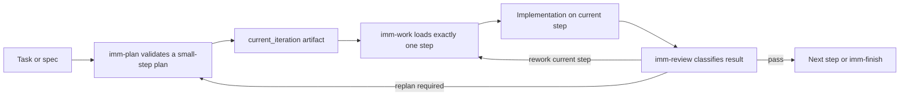

# feat: Rewrite Immune-Brain plan/work/review loop

## Summary

This plan implements the first Immune-Brain middle-loop rewrite as a local orchestration layer inside `.imm/`, not as a patch to the installed Compound Engineering plugin. The implementation adds a plan validator, a single-step work guard, and a review closure gate so `plan -> work -> review` can operate on one verifiable result at a time.

---

## Problem Frame

The current repository already has the beginnings of an Immune-Brain workflow: persistent state, heal/dehydrate/finish scripts, role skills, and specs. What is missing is a concrete middle loop that keeps execution small once planning starts. Today, the repo defines the philosophy, but it does not yet enforce the small-step boundaries that the new requirements call for.

Without that enforcement, the same failure mode described in the origin doc remains likely: plans expand into broad iterations, execution drifts into adjacent work, and review discovers structural problems too late. This plan turns the first version of `plan + work + review` into explicit local artifacts and checks so the workflow can be validated in this repository before any upstream CE integration is attempted.

---

## Requirements

- R1. Preserve the external workflow skeleton `brainstorm -> plan -> work -> review -> compound`.
- R2. Rewrite only the `plan + work + review` semantics in v1.
- R3. Leave `brainstorm` and `compound` unchanged in v1.
- R4. Plans must decompose work by user-verifiable outcomes.
- R5. Each step must promise only one clear result.
- R6. Steps that cannot be independently verified must be rejected or split further.
- R7. Work execution must consume only the current planned step.
- R8. Work must stop and return to replanning when a step is still too large or unclear.
- R9. Work success must be measured against the current step's promised outcome.
- R10. Review must judge closure and step size before inspecting lower-level issues.
- R11. Review must keep local problems local to the current step when possible.
- R12. Review must escalate split failures back to replanning instead of stacking more patch rounds.
- R13. The workflow must support at least one real task being split into 3-5 independent steps.
- R14. Each step must be able to pass through `work -> review` independently.
- R15. The first-version success signal is reduced human cleanup caused by oversized iterations.

**Origin actors:** A1 (用户 / 主操作者), A2 (Planning agent), A3 (Work agent), A4 (Review agent)
**Origin flows:** F1 (小步规划流), F2 (单步执行流), F3 (收口审查流)
**Origin acceptance examples:** AE1 (small-step planning), AE2 (work scope guard), AE3 (review-triggered replan), AE4 (reduced human cleanup)

---

## Scope Boundaries

- Do not rewrite `brainstorm`.
- Do not rewrite `compound`.
- Do not patch the installed `compound-engineering-plugin` cache as part of v1.
- Do not solve all skill redundancy or rename the full CE surface in this pass.
- Do not expand this work into general long-term memory, self-healing, or cross-project portability redesign beyond what is needed to support the new middle loop.

### Deferred to Follow-Up Work

- Upstream CE integration once the local workflow semantics prove useful in repeated real tasks.
- A later rewrite of `brainstorm` and `compound` after the middle loop has stabilized.
- Broader cleanup of overlapping or redundant skills after the local wrapper semantics are established.

---

## Context & Research

### Relevant Code and Patterns

- `.imm/imm-dehydrate.py` already persists session state and syncs `.imm/memory/MEMORY.md`; it is the existing pattern for local workflow state snapshots.
- `.imm/imm-heal.py` defines the repository's current "constitution check" pattern and is the natural place to extend required workflow artifacts.
- `.imm/imm-finish.py` already acts as the end-of-task orchestrator; it is the right integration seam for confirming the new middle-loop artifacts are closed before dehydration.
- `skills/imm-planner`, `skills/imm-qa`, and `skills/imm-compounder` show the role-skill pattern used for local orchestration.
- `.imm/specs/*.spec.md` shows that this repository already treats spec documents as durable control artifacts, which aligns with adding a workflow rewrite spec.

### Institutional Learnings

- `docs/solutions/infra-state-management.md` establishes the repo pattern of lightweight persisted state plus human-readable synchronization.
- `docs/solutions/infra-self-healing.md` establishes the pattern of cheap health checks that report missing required artifacts and suggested fixes.

### External References

- [EveryInc/compound-engineering-plugin](https://github.com/EveryInc/compound-engineering-plugin) for the upstream workflow skeleton and skill inventory being selectively borrowed.

---

## Key Technical Decisions

- Implement the first version as a local `.imm/` orchestration layer rather than editing upstream CE skills directly. This keeps the experiment repo-owned, testable, and reversible.
- Treat "small-step planning" as a validated artifact, not just a prompt instruction. The first version should add machine-checkable structure around plan steps instead of relying on agent discipline alone.
- Persist the active work slice separately from the long-lived summary state. A dedicated current-step artifact gives `work` and `review` a shared boundary that existing `state.json` does not currently provide.
- Model review outcomes as a small explicit state machine: pass, rework-current-step, or replan. This is the minimum structure needed to stop endless `review -> work` loops from pretending structural failures are local fixes.
- Close the role gap by adding an explicit Executor prompt and aligning the
  existing Planner and QA prompts with the new small-step loop.

---

## Open Questions

### Resolved During Planning

- Which surface should v1 modify first? The local repository's `.imm/` workflow artifacts, not the installed CE plugin.
- What does "review" mean in this repo? A local QA-oriented closure gate tied to the current step, not a generic multi-persona code-review pipeline.
- How should success be validated? By piloting the loop on at least one real repository task after the workflow tools land, rather than treating the prompt/docs rewrite alone as success.

### Deferred to Implementation

- Whether the step-validation and review artifacts are stored primarily as Markdown, JSON, or a hybrid representation.
- The exact CLI shape for selecting a current step and recording review outcomes.
- Whether stale current-step state should block new work by default or allow an explicit override path.

---

## Output Structure

    .imm/
    ├── imm-plan.py
    ├── imm-work.py
    ├── imm-review.py
    ├── templates/
    │   ├── iteration-plan-template.md
    │   └── review-report-template.md
    .imm/
    ├── memory/
    │   ├── current_iteration.json
    │   ├── state.json
    │   └── MEMORY.md
    skills/
    ├── imm-planner/
    ├── imm-executor/
    ├── imm-qa/
    └── imm-compounder/
    └── specs/
        └── plan-work-review-rewrite.spec.md
    tests/
    ├── test_imm_plan.py
    ├── test_imm_work.py
    ├── test_imm_review.py
    └── test_workflow_loop.py

---

## High-Level Technical Design

> *This illustrates the intended approach and is directional guidance for review, not implementation specification. The implementing agent should treat it as context, not code to reproduce.*

The key design constraint is that only one step is active at a time. `imm-plan` defines and validates the small-step artifact, `imm-work` exposes exactly one step to execution, and `imm-review` decides whether the loop stays local or must jump back to replanning.

---

## Implementation Units

### U1. Codify the workflow contract in repo-facing artifacts

**Goal:** Make the new middle-loop semantics explicit in the repository's governing docs, skills, and specs before adding enforcement code.

**Requirements:** R1, R2, R3, R10, R11, R12

**Dependencies:** None

**Files:**
- Create: `.imm/specs/plan-work-review-rewrite.spec.md`
- Modify: `IMMUNE.md`
- Modify: `README.md`
- Create: `skills/imm-planner/SKILL.md`
- Create: `skills/imm-executor/SKILL.md`
- Create: `skills/imm-qa/SKILL.md`
- Create: `skills/imm-compounder/SKILL.md`

**Approach:**
- Add role skills that match the local loop described in `README.md`.
- Update `IMMUNE.md` so "Plan -> Spec -> Act -> Verify" explicitly requires small-step execution and review-triggered replanning.
- Rewrite Planner and QA guidance as skills so they talk in terms of one
  verifiable result per step, not generic multi-step plans.
- Add a spec document for the workflow rewrite so the repository's own constitution is used on itself.

**Patterns to follow:**
- `skills/imm-planner/SKILL.md`
- `skills/imm-qa/SKILL.md`
- `.imm/specs/imm-heal.spec.md`

**Test scenarios:**
- Test expectation: none -- this unit changes governing text artifacts and role instructions, not executable runtime behavior.

**Verification:**
- The repository's docs, constitution, skills, and spec all describe the same `plan -> work -> review` semantics without contradicting one another.

---

### U2. Add a small-step planning artifact and validator

**Goal:** Create the first executable enforcement point for planning so oversized or ambiguous steps are rejected before work starts.

**Requirements:** R4, R5, R6, R13, R14

**Dependencies:** U1

**Files:**
- Create: `.imm/imm-plan.py`
- Create: `.imm/templates/iteration-plan-template.md`
- Create: `tests/test_imm_plan.py`

**Approach:**
- Define a plan artifact shape that captures a parent task plus 3-5 independently verifiable steps.
- Encode validator rules that reject steps with more than one promised result, missing verification language, or unclear dependency boundaries.
- Keep generation light: the script should validate and normalize a plan artifact rather than pretending to do the agent's decomposition work by itself.

**Execution note:** Implement test-first. The validator rules are the core contract of the new planning semantics.

**Patterns to follow:**
- `.imm/imm-heal.py` for lightweight structured CLI output
- `.imm/imm-dehydrate.py` for straightforward file-backed state handling

**Test scenarios:**
- Happy path: a plan artifact with 3-5 steps, one result per step, and explicit verification passes validation.
- Happy path: a step that depends on an earlier step but remains independently verifiable is accepted.
- Edge case: a plan with fewer than 3 steps or more than 5 steps is rejected with a useful explanation.
- Edge case: a step that bundles two user-visible outcomes is rejected as oversized. Covers AE1.
- Error path: a plan missing verification text for one step is rejected.
- Error path: malformed plan structure or missing required sections fails without crashing the script.

**Verification:**
- `imm-plan` can accept a correctly structured small-step plan and reject the oversized/ambiguous cases the origin requirements call out.

---

### U3. Add current-step work state and execution guards

**Goal:** Ensure execution consumes only one validated step at a time and can stop cleanly when the step is still too large.

**Requirements:** R7, R8, R9, R14

**Dependencies:** U2

**Files:**
- Create: `.imm/imm-work.py`
- Create: `.imm/memory/current_iteration.json`
- Create: `tests/test_imm_work.py`
- Modify: `.imm/imm-dehydrate.py`

**Approach:**
- Introduce a dedicated current-step state artifact separate from the high-level session summary.
- Load only one validated step into that artifact at a time, including its goal, verification target, and dependency context.
- Refuse to start work when the selected step is unknown, blocked by unmet dependencies, or flagged as structurally unclear.
- Extend dehydration support only as far as needed to preserve the currently active step between sessions.

**Execution note:** Implement test-first for the new work guard, then add characterization coverage around any `imm-dehydrate.py` behavior that is touched.

**Patterns to follow:**
- `.imm/imm-dehydrate.py`
- `docs/solutions/infra-state-management.md`

**Test scenarios:**
- Happy path: selecting a valid step writes it into `current_iteration.json` and exposes its verification target.
- Happy path: reopening state after dehydration preserves the active step without losing the session summary.
- Edge case: selecting a later step with unmet dependencies is rejected.
- Edge case: attempting to activate a second step while one is already active is blocked or requires explicit override behavior.
- Error path: missing or corrupt `current_iteration` state fails with a readable error instead of crashing.
- Error path: a step flagged by the validator as oversized cannot be activated. Covers AE2.

**Verification:**
- `imm-work` always leaves the repository with at most one active step, and that active step is traceable back to a validated plan artifact.

---

### U4. Add a review closure gate that can trigger rework or replan

**Goal:** Give review a concrete mechanism for deciding whether the current step is closed, needs local fixes, or must be split again.

**Requirements:** R10, R11, R12, R15

**Dependencies:** U3

**Files:**
- Create: `.imm/imm-review.py`
- Create: `.imm/templates/review-report-template.md`
- Create: `tests/test_imm_review.py`
- Create: `skills/imm-qa/SKILL.md`

**Approach:**
- Read the active current-step artifact and emit one of three outcomes: pass, rework-current-step, or replan-required.
- Record enough review context that QA decisions are inspectable rather than implicit.
- Align the QA prompt with this explicit closure classification so review stops being "find issues forever" and starts deciding whether the loop should stay local or jump back to planning.

**Execution note:** Implement test-first. The classification behavior is the core contract of the review rewrite.

**Patterns to follow:**
- `skills/imm-qa/SKILL.md`
- `.imm/imm-finish.py` for end-of-loop orchestration tone

**Test scenarios:**
- Happy path: a fully satisfied current step receives a pass outcome and can advance.
- Happy path: a local defect inside the current step receives a rework outcome without forcing replanning.
- Edge case: a review that discovers step bleed or missing boundaries escalates to replan-required. Covers AE3.
- Error path: review invoked without an active current step fails cleanly.
- Error path: incomplete or contradictory review input is rejected rather than silently treated as pass.

**Verification:**
- Review outcomes clearly distinguish local repair from structural replanning, and that classification is persisted in a reusable artifact.

---

### U5. Integrate health checks, finish flow, and a real-task pilot

**Goal:** Connect the new loop to the repository's existing operational scripts and prove it against one real repository task.

**Requirements:** R1, R13, R14, R15

**Dependencies:** U2, U3, U4

**Files:**
- Create: `tests/test_workflow_loop.py`
- Modify: `.imm/imm-heal.py`
- Modify: `.imm/imm-finish.py`
- Modify: `.imm/memory/MEMORY.md`
- Modify: `README.md`

**Approach:**
- Extend `imm-heal` so it checks for the new prompts, templates, scripts, and current-step state artifacts as part of the repository's required workflow contract.
- Update `imm-finish` so it can see whether the current step has been reviewed and closed before encouraging final dehydration.
- Add one end-to-end workflow test or smoke-style fixture path that exercises `imm-plan -> imm-work -> imm-review` against a small real task in this repository.
- Reflect the validated workflow and any operating constraints back into `README.md` and `summary.md`.

**Execution note:** Use characterization-first when modifying `imm-heal.py` and `imm-finish.py`, then add focused integration coverage around the new paths.

**Patterns to follow:**
- `.imm/imm-heal.py`
- `.imm/imm-finish.py`
- `docs/solutions/infra-self-healing.md`

**Test scenarios:**
- Happy path: the new workflow artifacts are present and `imm-heal` reports the repository as healthy.
- Happy path: a reviewed and passed current step can flow through finish/dehydrate without losing summary state.
- Integration: a real repository task can be planned into multiple steps, executed one step at a time, and reviewed independently. Covers AE4.
- Error path: `imm-heal` reports missing new workflow artifacts with actionable repair guidance.
- Error path: `imm-finish` detects an unreviewed or unresolved current step and does not pretend the loop is closed.

**Verification:**
- The repository's own health and finish tooling acknowledges the new middle loop, and one real task demonstrates that the workflow reduces oversized-iteration drift in practice.

---

## System-Wide Impact

- **Interaction graph:** Planner/spec artifacts feed `imm-plan`; validated plans feed
  `imm-work`; current-step state feeds `imm-review`; reviewed state feeds
  `imm-finish` and dehydration.
- **Error propagation:** Invalid plans must fail before work activation; unresolved structural review findings must route back to replanning instead of leaking downstream as "just another fix".
- **State lifecycle risks:** `current_iteration.json` introduces stale-state risk after interrupted work; implementation must define how stale active work is resumed or cleared.
- **API surface parity:** The repository's workflow CLI surface expands from `imm-dehydrate`, `imm-heal`, and `imm-finish` to include `imm-plan`, `imm-work`, and `imm-review`.
- **Integration coverage:** The new value is in the loop, not any single script, so at least one end-to-end workflow test is needed in addition to per-script unit coverage.
- **Unchanged invariants:** `brainstorm`, `compound`, and the existing long-lived memory summary remain in place; the rewrite adds a middle-loop boundary layer instead of replacing the whole system.

---

## Risks & Dependencies

| Risk | Mitigation |
|------|------------|
| The first version becomes another prompt-only layer with no real enforcement | Put the contract into validator/state/review artifacts, not just README or prompt text |
| The workflow becomes over-automated before it is proven useful | Keep the scripts thin, local, and explicitly pilot them on one real task before upstream integration |
| New current-step state drifts from summary state | Reuse the dehydration pattern and add integration coverage for pause/resume behavior |
| Existing scripts regress while adding new checks | Add characterization-first coverage for touched legacy scripts before extending them |

---

## Documentation / Operational Notes

- Update the README usage section so the documented "协作流程" matches the new local loop and references the new scripts explicitly.
- The new workflow artifacts should be included in the repository's constitution/health checks so a fresh clone can detect an incomplete setup quickly.
- After the pilot task, capture operating constraints or repeated failure modes in `summary.md` and `docs/solutions/` so future iterations do not rediscover them from scratch.

---

## Sources & References

- **Origin document:** `docs/brainstorms/immune-brain-requirements.md`
- Related code: `.imm/imm-dehydrate.py`
- Related code: `.imm/imm-heal.py`
- Related code: `.imm/imm-finish.py`
- Related code: `skills/imm-planner/SKILL.md`
- Related code: `skills/imm-qa/SKILL.md`
- Related code: `.imm/specs/imm-heal.spec.md`
- Related code: `.imm/specs/rehydration.spec.md`
- Institutional pattern: `docs/solutions/infra-state-management.md`
- Institutional pattern: `docs/solutions/infra-self-healing.md`
- External reference: [EveryInc/compound-engineering-plugin](https://github.com/EveryInc/compound-engineering-plugin)
