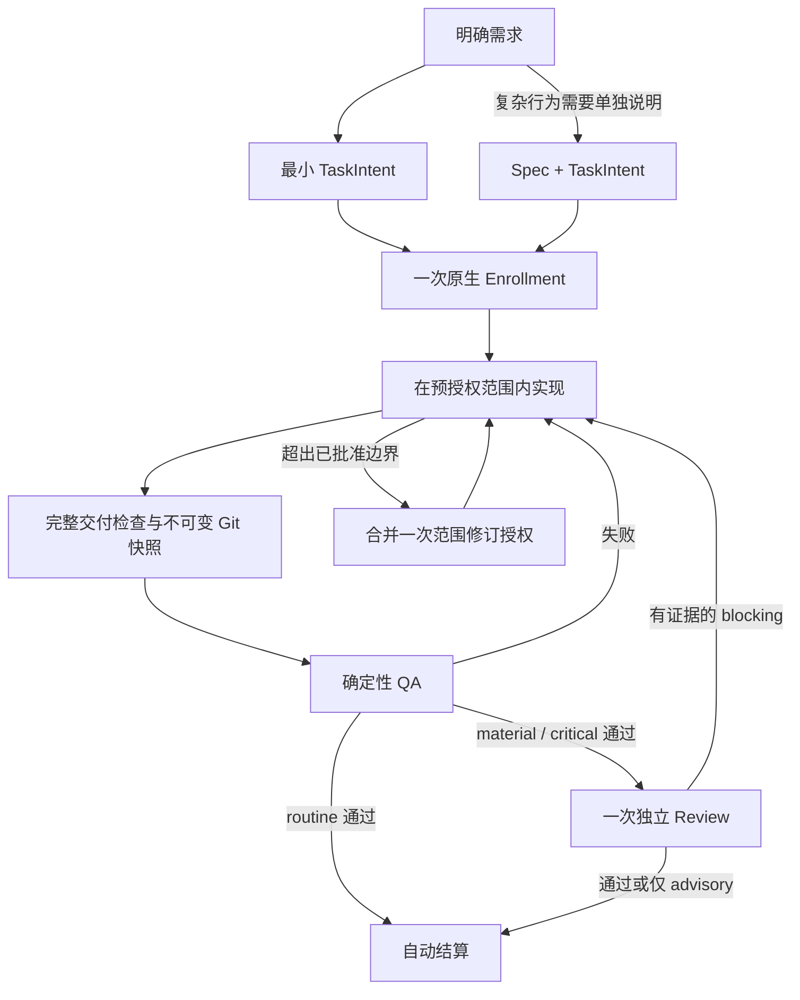

# Managed 工作流简化：最终目标方案与实施计划

状态：最终设计提案，取代本文件此前的“保守优化”版本。用户要求制定方案；尚未实施、迁移、发布或创建 Managed authority。本文描述目标行为，不代表当前版本已经具备。

## 1. 已确定的产品决策

| 问题 | 最终方案 | 必须删除的旧机制 |
| --- | --- | --- |
| 多文件状态协议脆弱 | 单个 SQLite 数据库拥有任务状态和所有权；Git 拥有代码快照 | JSON 字节 CAS、多文件 authority journal、独立 claim/tombstone 权威文件 |
| 简单任务流程过重 | TaskIntent 是充分的执行契约；仅复杂行为保留独立 Spec；一次准入后自动完成机械步骤 | 简单任务强制 Spec、freeze 时文件搬移、重复说明和重复确认 |
| 静态文件清单妨碍探索 | 授权范围、预计文件、交付清单三者职责分离 | 预计文件清单充当授权边界、范围内新增文件补批、静默过滤任务交付 |
| Review 无效往返 | routine 只做 QA；material/critical 一次独立 Review，具体证据决定阻塞 | 纯风格返工、advisory 导致 rework、相同证据的重复争论、默认多模型投票 |

这些是本次改进的交付目标，不再列为“以后有证据再考虑”的候选项。实现前核对调用方、运行兼容性和回归测试用于保证目标可交付，不用于无限延期目标。

保留 Host-native / Managed 两条路径；不添加三级通道。保留 Kernel 的授权和生命周期规则、宿主原生 gate、串行 batch、风险下限和证据新鲜度。替换存储协议与相关契约，不重写 Kernel 状态机，不新增通用调度器。

## 2. 最终用户流程

需求明确时不经过 Brainstorm。简单任务无需独立 Spec。冻结是内部快照操作，不是 Agent 搬文件步骤。用户处理首次授权和真实决策变化；正常验证、记录及结算不重复确认。QA/Review 失败不宣布完成。

## 3. 状态存储：确定采用 SQLite

### 3.1 权威归属

- `.imm/state/kernel.sqlite`：每个当前工作区一份数据库，保留现有工作区隔离。拥有 TaskRecord、唯一 active owner、验收与 finding、终态及需要持久化的操作身份。
- Git：拥有 base、baseline、delivery tree/commit 和 TaskIntent/可选 Spec 的不可变内容。
- `.imm/audit/`：结算后确定性导出的可追溯证据，不再作为判定当前所有权的权威输入。
- Batch 进度仍由现有 unattended 模块负责，其已授权的编排语义不改变；批处理日志不能覆盖数据库中的任务权威。

不因为改用数据库而把 TaskRecord 每个字段拆成表。任务内容可保留 JSON payload，数据库列保存需要约束与 CAS 的 task_id、lifecycle、revision 等字段。任务状态是唯一来源；active owner 从任务表的唯一性约束及查询派生，不再另存重复的 workspace/backend claim 文件。

### 3.2 并发与崩溃

- 使用 SQLite 事务和整数 revision 的条件更新。任务、finding、验收和终态涉及的同一操作在一个数据库事务内提交。
- 通过唯一约束保证同一工作区最多一个 active task。数据库短事务锁与整个任务期间的逻辑所有权分开；调用 QA/模型时不持有数据库写锁。
- 保留操作身份、宿主已验证 receipt 及完成事实，用于提交成功但响应丢失的恢复。进程重启不能凭一行数据库记录伪造新的宿主授权 capability。
- evidence freshness、Intent hash 与 Git 对象身份仍保留。取消的是文件序列化格式参与并发控制，不是取消内容与授权绑定。
- 数据库使用持久化事务设置并进行进程中断测试；忙等待有明确上限。损坏、不合法 owner 和真实 revision 冲突仍拒绝继续，不静默修复内容。

### 3.3 Git 与 SQLite 的边界

二者不是一个分布式事务，禁止声称它们共同原子提交。

1. 先生成不可变 Git 对象并验证可读性，建立可追溯的任务 snapshot ref 以防对象被 GC；ref 仅负责对象保留，不授予任务 authority。
2. 再在 SQLite 中 CAS 绑定对象 OID、Intent revision 和验收身份。CAS 失败可留下无权威的孤立对象/ref，不能形成已授权任务或已通过证据。
3. QA 前后核对任务 revision 和实际工作内容。当前执行环境与交付快照不一致时证据无效，不能让未声明文件影响 QA 却不进入审查。
4. 终态写入数据库后再导出审计文件。导出按 task_id 和终态内容生成，可安全重试；导出失败显示“任务已结算、审计导出待恢复”，不重新占有工作区或重跑验收。
5. batch 产生提交前须确认其所需审计产物已导出。已有 HEAD lineage、预算和授权摘要不放宽。

### 3.4 运行时决定

统一使用 `node:sqlite`，不新增 ORM、数据库服务或第三方原生 addon。实施发布支持基线设为 Node 24.18.0+ 和 Bun 1.4.2+，并在对应 runtime 上跑契约测试；低版本在启动时明确拒绝，不回落到 JSON 写入。

本轮已分别在 Node 24.18.0、Bun 1.4.2 执行 `DatabaseSync(":memory:")` 查询成功。这只证明基础 API 可用；事务、并发、打包和崩溃恢复仍属于实施验收。

## 4. 执行契约：简单任务只保留 TaskIntent

采用新版 TaskIntent 契约，继续包含 goal、acceptance、risk、revision、owner 和 scope_hint。scope_hint 明确表示已批准的修改范围，允许窄目录、明确文件及 glob；它不再要求列出每个预计修改文件。

### 4.1 Spec 规则

默认不要求独立 Spec。以下行为复杂度需要 Spec：新增或改变跨模块对外契约、持久化数据迁移、多状态生命周期变化，或用户明确要求设计文档。风险级别与是否需要 Spec 分开：小而高风险的改动仍需 Review，但不自动生成重复 Spec。

- 简单任务：TaskIntent 的目标、可观察验收、范围足够表达约定，不创建空壳 Spec。
- 复杂任务：Spec 解释行为、取舍和状态关系；TaskIntent 拥有执行授权。避免两处复制整份需求。
- 有 Spec 时将其内容身份纳入授权与验收绑定。涉及实质行为改变必须修订授权，不能利用 Spec 可选绕过要求。
- 冻结只绑定 Git 对象，不移动 TaskIntent 或 Spec。新任务产物保留稳定路径，终态从数据库和 audit 获取。
- 取消自动 active/archive 往返。既有 archive 文件作为历史证据保留，不为统一布局迁移或重写其内容。

## 5. Scope：三种职责，只有一个授权边界

| 对象 | 作用 | 变化方式 |
| --- | --- | --- |
| 授权范围 `scope_hint` | 用户批准的修改路径边界，与 goal/acceptance 一起限定行为 | 改变边界仍需 breaking revision |
| 预计文件清单 | 执行者当前工作清单，允许不持久化 | 自由更新，不进入 authority hash |
| 交付清单 | 从实际变化生成的完整路径、状态、mode、OID | 确定性生成并绑定 QA/Review，不能由模型删选后通过 |

### 5.1 预授权范围

对可明确授权的模块使用窄目录范围，禁止为了省事默认批准整个仓库。目录内发现 helper/test 不需要改变 TaskIntent。涉及权限策略等未获授权的行为仍超出 goal/acceptance，即使路径在范围内也不算已获授权。

首版不引入语义分类器或自动授权机制。路径范围表达以既有匹配器为基础；禁止区域通过收窄允许路径表达，不添加未经需求证明的任意规则语言。跨范围需要修改时，把所有已知路径和行为变化合并成一次修订。

### 5.2 不遗漏交付，也不吞入用户工作

- Enrollment 固定工作区基线，覆盖当时 staged、unstaged、untracked 的身份与路径；复用 Git 对象和已有快照接口。
- 验收前比较基线与当前内容，计算本次任务期间全部变化，再验证授权范围。先检测变化再做范围检查，取消先按 scope 过滤再默认完整的做法。
- 没变的用户既有修改不纳入本次交付、不覆盖、不自动暂存。
- 用户与任务修改同一文件、任务期间出现无法归属的外部变化、受忽略文件参与构建但不在交付中等情况必须明确处理。基线不能证明是谁写了文件，系统不假装能自动判断。
- 对归属冲突给出具体文件及一次处理决策；不得仅靠 Agent 声称“与任务无关”就排除。测试执行环境必须可证明不受未审查修改影响，否则阻断验收并说明隔离要求。
- 测试及生成产物属于交付清单。生成关系复用现有构建脚本/清单；最终检查实际变化，不构建通用依赖扫描框架。
- QA、Review、最终任务交付引用同一 delivery identity；路径变化重新计算风险下限和 freshness。
- QA 在临时目录中展开已绑定的 delivery tree 后运行，不创建或切换 Git worktree，不读取用户当前工作区的未交付源码。依赖及 runner 使用现有受控准备入口；缺少所需依赖时明确失败，不静默改为在原工作区执行。临时目录由本次验收创建并在结束后清理。
- 若任务必须依赖用户尚未交付的修改，先让用户明确是否将这些具体修改纳入交付和授权，再生成新快照；不能直接把用户整个暂存区并入任务。

## 6. Review：单次独立审查，阻塞必须可检查

- routine：确定性 QA，通过后自动结算。
- material/critical：QA 通过后派发一个独立 Reviewer；不默认投票或多模型逐层审批。
- Reviewer 只读不可变 Git revision，读取已有 QA outcomes；不重复执行同一验收，不向工作区写测试。
- 阻塞 finding 必须包含具体触发条件、调用链、违反的 acceptance/security boundary 以及可检查的推导。字段齐全仅代表格式合法，不证明结论为真。
- 有效复现由 Executor 纳入回归检查；补测试或修实现后重新绑定快照和受影响的验证。不能让 Reviewer 写新代码后沿用旧证据。
- 新 verdict 明确允许 `pass` 携带 advisory；只有 blocking 才进入 rework。风格意见不进入任务阻塞状态。
- 同一发现被反驳后，在证据和相关代码未变化时不重复阻塞。出现新证据或实现变化允许重新审查，不用固定轮数硬截断正确性检查。
- 有证据但双方无法裁定的授权/需求问题进入一次具体用户决策，不以无限模型争论代替决策。

不承诺固定 Token 倍数。每项实现记录改动前后工具往返、用户打断、重复 QA/Review、手工恢复步骤，以及可获得的真实耗时/Token；测量附在验收结果，不独立建设指标平台。

## 7. 切换与删除计划

这是存储和契约的破坏性升级，作为一次 major release 交付；不把新旧写路径长期并行发布。

1. 升级前由旧版本完成或显式停止 active task，并结束/停止仍可恢复的 batch run；不能自动替用户停止任务或保留会重新进入旧契约的 batch authority。
2. 新版检测到 legacy layout 时只允许迁移诊断与显式迁移，不自动修改 `.imm`。
3. 迁移在 claimless、无待恢复旧 batch 的条件下获得工作区独占访问；所有新版启动路径识别迁移状态。要求旧宿主退出，迁移前后复核旧记录摘要；不支持新旧进程同时写入。
4. 验证旧状态与终态记录完整性，离线备份原始字节；将历史信息导入临时 SQLite，核对数量、task_id、终态和审计摘要。旧内容 hash/attestation 作为历史事实原样保存，不伪造新 runner 验收。
5. 验证通过并 fsync 后原子发布数据库。启动时“旧布局+有效新数据库”只选择明确的新布局，绝不双写；中断时依据导入摘要确定继续清理或安全重试。
6. 未 Enrollment 的旧候选 Intent 需要转换成新版并重新验证；不保留先前未执行的授权假设。历史 Git 文件不重写。
7. 删除旧 JSON writer、字节 CAS、authority journal、独立 claim/tombstone writer、归档搬移和手工修复指引。旧备份仅供离线恢复，不是 runtime fallback。
8. 回退：新版尚无新写入时可退出新版并整体恢复旧备份与旧程序；产生新任务/验收后禁止覆盖回退，只允许前向修复或专门的数据导出恢复。

迁移 importer 只负责读取旧数据，属于过渡代码。Owner：本次存储切换实施者；退出里程碑：下一次 major release 删除 importer 与 legacy layout 解析入口。用户旧备份的保留由用户决定；代码退出不自动删除用户备份。第一版无旧运行时双写兼容层。

## 8. 五个实施交付项

实施顺序固定为 S1 → S2 → S3 → S4 → S5，开发阶段不发布不完整的新协议。它们是实现批次，不是新增运行时阶段，也不分别创造新的权威来源。

| 项目 | 必交结果 | 重点实现入口 | 通过条件 |
| --- | --- | --- | --- |
| S1 单一事务存储 | SQLite Store 替换持久化协议；保留 reducer 状态转移规则与宿主 capability 边界 | kernel/storage、application、reducer、validation、backend_claim、assurance ports | 双宿主一致；并发只有一个 owner；中断不重复结算；JSON 排版不再参与 CAS |
| S2 单一最小契约 | 新 Intent/Record 契约；简单任务无 Spec；冻结绑定对象，不搬文件 | kernel/intent、types、validation、产物绑定、Planner/Loop 文档 | 简单任务仅 Intent 可准入完成；复杂 Spec 内容被绑定；freeze/rework 无文件往返 |
| S3 完整交付范围 | 固定授权范围与完整 delivery manifest；基线保留用户工作 | workspace_scope、快照与 review revision 调用方、QA 环境检查 | 范围内新文件零补批；真实越界一次 gate；遗漏/外部污染不能通过验收 |
| S4 最短 assurance 与 Review | 自动机械推进；一个 Reviewer；pass 可携带 advisory；反驳去重 | assurance/coordinator、verification、role prompts、Pi/Claude adapters | routine 一次 assurance 推进；material 一个独立 Review；有效 QA 不重放；advisory 不阻塞 |
| S5 切换与清理 | 显式一次迁移、删除旧运行时、双宿主打包、文档与 release | storage migration、unattended 调用方、包清单、生成 bundle、相关 ADR/CONTEXT | 无 active 时迁移成功且中断可恢复；旧路径无写入；完整回归和打包通过 |

S1–S4 每项随实现补 focused tests 和前后开销对照，不另设“先研究是否值得做”的项目。每项具体修改文件须在实施时沿调用关系收齐；上表是实现入口，不是可直接 Enrollment 的完整 scope_hint。

## 9. 验收矩阵

| 场景 | 必须观察到的结果 |
| --- | --- |
| routine 简单修复 | 无 Spec；一次 Enrollment；QA 通过自动结算；无 Review |
| material 局部修复 | Spec 不因风险机械生成；QA 后单次独立 Review；不重复准入 |
| 范围内新增 helper/test | 更新交付清单，无范围修订 gate |
| 授权外变更 | 暂停受影响操作，合并一次明确 revision；不能静默吸收 |
| 用户已有修改或同期外部变化 | 不覆盖、不冒认、不让未审查内容污染 QA；归属冲突明确处理 |
| QA 失败或有效 blocking | 修复并重新验证受影响内容；不得伪造完成 |
| advisory/纯风格/已反驳且无新证据 | 不触发新的阻塞循环 |
| 数据库提交后宿主响应丢失 | 根据持久事实恢复，不重复创建任务、验收或结算 |
| Git 对象创建后 DB CAS 失败 | 无新 authority；孤立对象不会被解释为任务成功 |
| 终态后审计导出失败 | 不复活任务；可重试导出，batch 提交等待所需产物 |
| 新旧布局迁移中断 | 可重试、无双写、无丢失历史事实、无自动覆盖回退 |
| Batch 与宿主切换 | 保持单任务 owner、同一授权绑定、HEAD lineage、foreground Review 和 critical 禁止批处理 |

Focused test 入口：`tests/task-record-durability.test.ts`、`tests/kernel-enrollment-transaction.test.ts`、`tests/kernel-canary-terminal-transaction.test.ts`、`tests/managed-task-snapshot-isolation.test.ts`、`tests/review-revision-identity-conformance.test.ts`、`tests/host-neutral-assurance-coordinator.test.ts`、`tests/planning-artifact-archival.test.ts`、`tests/dual-host-assurance-conformance.test.ts`。退休行为对应断言随之替换，历史正确性覆盖保留；不通过跳过测试实现升级。

runtime 改动先生成 Claude bundle，再跑 focused tests；共享契约跑 typecheck 和双宿主测试。最终运行 `bun run verify:release`，使用 major changeset。QA descriptor 仍使用明确、受限的 focused 文件集，不能绑定全量测试输出。

## 10. 已核对依据与需同步的决策文档

- [CONTEXT.md](../../CONTEXT.md)：现行权威模型与架构入口；实施完成时更新，方案阶段不将目标写成已实现事实。
- [workspace_scope.ts](../../plugins/immune-brain/runtime/workspace_scope.ts)：已有 Git 对象身份、目录/glob 支持和先过滤 scope 的快照逻辑。
- [intent.ts](../../plugins/immune-brain/runtime/kernel/intent.ts)：现有 scope revision 分类，目标保留真正越界需授权。
- [storage.ts](../../plugins/immune-brain/runtime/kernel/storage.ts)、[reducer.ts](../../plugins/immune-brain/runtime/kernel/reducer.ts)：待替换的存储协议与保留的状态转移规则。
- [coordinator.ts](../../plugins/immune-brain/runtime/assurance/coordinator.ts)、[code-review.md](../../plugins/immune-brain/runtime/prompts/code-review.md)：已有自动冻结、证据和纯风格约束；只补缺失行为并删除重复步骤。
- [ADR-0004](../adr/0004-dual-host-assurance-adapters.md)：保留一个 Kernel、一个持久化协议、两宿主适配边界。
- [ADR-0005](../adr/0005-unattended-initiative-batch-run.md)：需修订 JSON 任务事务、文件 tombstone 和 Spec 归档的实现描述；保留单任务授权、batch 进度归属及 HEAD 约束。
- [ADR-0007](../adr/0007-parked-child-claim-release.md)：保留 parked task 占有 workspace；owner 改由 DB 中 active task 表达，不能借存储迁移提前释放。
- [ADR-0009](../adr/0009-settled-slice-reverification-loss.md)：保留历史 runner 和证据事实，不重写 settled descriptor。

## 11. 本轮交付范围

本轮只重写此方案并核对引用、基础 SQLite API 与文档差异。没有修改产品实现、当前规则或用户其他工作区改动；没有运行实施回归、执行迁移、创建 GitHub Issue、提交或启动 Managed 任务。实施切换须按本方案形成具体 Spec/TaskIntent 或用户明确授权的普通工程任务，不能把此提案当作既有任务的权限扩张。
