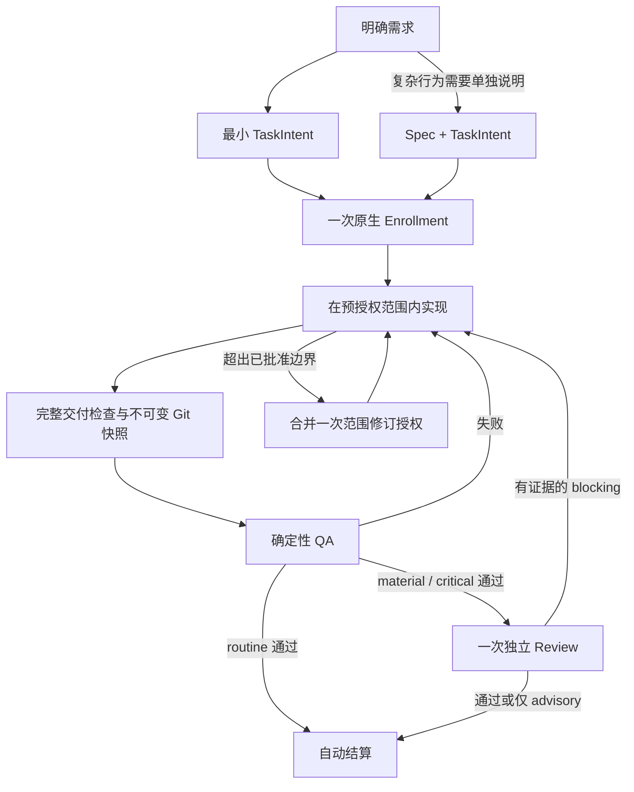

# Managed 工作流简化：最终目标方案与实施计划

状态：最终设计提案，取代本文件此前的“保守优化”版本。用户要求制定方案；尚未实施、迁移、发布或创建 Managed authority。本文描述目标行为，不代表当前版本已经具备。

## 1. 已确定的产品决策

| 问题 | 最终方案 | 必须删除的旧机制 |
| --- | --- | --- |
| 多文件状态协议脆弱 | 单个 SQLite 数据库拥有任务状态和所有权；Git 拥有代码快照 | JSON 字节 CAS、多文件 authority journal、独立 claim/tombstone 权威文件 |
| 简单任务流程过重 | TaskIntent 是充分的执行契约；仅复杂行为保留独立 Spec；一次准入后自动完成机械步骤 | 简单任务强制 Spec、freeze 时文件搬移、重复说明和重复确认 |
| 静态文件清单妨碍探索 | 授权范围、预计文件、交付清单三者职责分离 | 预计文件清单充当授权边界、范围内新增文件补批、静默过滤任务交付 |
| Review 无效往返 | routine 只做 QA；material/critical 一次独立 Review，具体证据决定阻塞 | 纯风格返工、advisory 导致 rework、相同证据的重复争论、默认多模型投票 |

这些是本次改进的交付目标，不再列为“以后有证据再考虑”的候选项。实现前核对调用方、运行兼容性和回归测试用于保证目标可交付，不用于无限延期目标。

保留 Host-native / Managed 两条路径；不添加三级通道。保留 Kernel 的授权和生命周期规则、宿主原生 gate、串行 batch、风险下限和证据新鲜度。替换存储协议与相关契约，不重写 Kernel 状态机，不新增通用调度器。

## 2. 最终用户流程

需求明确时不经过 Brainstorm。简单任务无需独立 Spec。冻结是内部快照操作，不是 Agent 搬文件步骤。用户处理首次授权和真实决策变化；正常验证、记录及结算不重复确认。QA/Review 失败不宣布完成。

## 3. 状态存储：确定采用 SQLite

### 3.1 权威归属

- `.imm/state/kernel.sqlite`：每个当前工作区一份数据库，保留现有工作区隔离。拥有 TaskRecord、唯一 active owner、验收与 finding、终态及需要持久化的操作身份。
- Git：拥有 base、baseline、delivery tree/commit 和 TaskIntent/可选 Spec 的不可变内容。
- `.imm/audit/`：结算后确定性导出的可追溯证据，不再作为判定当前所有权的权威输入。
- Batch 进度仍由现有 unattended 模块负责，其已授权的编排语义不改变；批处理日志不能覆盖数据库中的任务权威。

不因为改用数据库而把 TaskRecord 每个字段拆成表。任务内容可保留 JSON payload，数据库列保存需要约束与 CAS 的 task_id、lifecycle、revision 等字段。任务状态是唯一来源；active owner 从任务表的唯一性约束及查询派生，不再另存重复的 workspace/backend claim 文件。

### 3.2 并发与崩溃

- 使用 SQLite 事务和整数 revision 的条件更新。任务、finding、验收和终态涉及的同一操作在一个数据库事务内提交。
- 通过唯一约束保证同一工作区最多一个 active task。数据库短事务锁与整个任务期间的逻辑所有权分开；调用 QA/模型时不持有数据库写锁。
- 保留操作身份、宿主已验证 receipt 及完成事实，用于提交成功但响应丢失的恢复。进程重启不能凭一行数据库记录伪造新的宿主授权 capability。
- evidence freshness、Intent hash 与 Git 对象身份仍保留。取消的是文件序列化格式参与并发控制，不是取消内容与授权绑定。
- 数据库采用 WAL、`synchronous=FULL`、启用外键；每个连接的 busy timeout 固定为 5 秒，事务内只做本地状态读写。超时返回明确的存储繁忙原因，不通过抢占 active owner 或无限重试恢复。仅支持本地文件系统，不支持通过网络盘或同步盘共享活跃数据库。
- 对正常竞争、中断、磁盘满与数据库损坏分别测试。事务未提交时不得对外宣布成功；损坏、不合法 owner 和真实 revision 冲突仍拒绝继续，不静默修复内容。
- JSON payload 与用于约束的 lifecycle/revision 不得形成两份独立权威：保留一个权威字段来源，在读写边界统一构造 TaskRecord；不接受列值与 payload 值不一致的记录。
- SQLite 是持久化和并发边界，不是对同一 OS 用户的安全沙箱。仍沿用受控文件访问、宿主 capability、receipt 和授权校验，不将可编辑的数据库行当作用户批准。

### 3.3 Git 与 SQLite 的边界

二者不是一个分布式事务，禁止声称它们共同原子提交。

1. 先生成不可变 Git 对象并验证可读性，建立可追溯的任务 snapshot ref 以防对象被 GC；ref 仅负责对象保留，不授予任务 authority。
2. 再在 SQLite 中 CAS 绑定对象 OID、Intent revision 和验收身份。CAS 失败可留下无权威的孤立对象/ref，不能形成已授权任务或已通过证据。
3. QA 前后核对任务 revision 和实际工作内容。当前执行环境与交付快照不一致时证据无效，不能让未声明文件影响 QA 却不进入审查。
4. 终态写入数据库后再导出审计文件。新记录按 run_id 和终态内容生成，可安全重试；导出失败显示“任务已结算、审计导出待恢复”，不重新占有工作区或重跑验收。
5. batch 产生提交前须确认其所需审计产物已导出。已有 HEAD lineage、预算和授权摘要不放宽。

### 3.4 运行时决定

统一使用 `node:sqlite`，不新增 ORM、数据库服务或第三方原生 addon。实施发布支持基线设为 Node 24.18.0+ 和 Bun 1.4.2+，并在对应 runtime 上跑契约测试；低版本在启动时明确拒绝，不回落到 JSON 写入。

本轮已分别在 Node 24.18.0、Bun 1.4.2 执行 `DatabaseSync(":memory:")` 查询成功。这只证明基础 API 可用；事务、并发、打包和崩溃恢复仍属于实施验收。

### 3.5 多 worktree 与运行身份

- 每个 worktree 的 `.imm/state/kernel.sqlite` 独立，禁止放入 Git common directory 形成全仓共享 authority。现有 `.gitignore` 已忽略 `.imm/state/`，数据库、WAL/SHM、临时文件和备份均不进 Git。
- 同一 worktree 的 Pi、Claude、CLI 共用数据库并遵守一个 active task；不同 worktree 可以分别执行，不自动跨工作区调度或转移权限。本项目实施仍只使用当前启动目录，多 worktree 行为用测试夹具验证。
- 本地 workspace_id 标识工作区；task_id 标识逻辑任务；每次 Enrollment 的 run_id 标识本次执行。运行记录以 run_id 为持久主键，新 TaskRecord、操作身份、审计 manifest 和快照绑定携带 run_id。写操作必须绑定精确 run，不能把 task_id 的“最新一次运行”作为隐式目标；只读历史查询允许列出同一 task_id 的各次运行。run_id 不是授权凭据。
- 新审计写入 `.imm/audit/<run-id>/`，快照 ref 使用 `refs/imm/snapshots/<workspace-id>/<run-id>/<snapshot-id>`，避免同名任务在共享 Git refs 或合并审计时互相覆盖。旧审计路径原样保留，迁移保存其来源映射。
- 数据库绑定工作区的规范 Git 管理路径；复制数据库到另一个 worktree 不能自动取得原任务权限。工作区搬迁或数据库恢复须经过显式重绑定检查，不在启动时静默改写身份。
- 不提供仓库级同一业务需求去重或自动认领 GitHub Issue；如果不同 worktree 执行同一 task_id，各自是独立 run。Tracker 终态投影必须校验对应 run 与任务绑定，不能凭相同 task_id 接受其他 run 的完成结果。
- Batch Authorization 仍绑定预先确认的 child Intent 身份、顺序、预算和 base；Enrollment 将新 run_id 记录为该授权 child 的实际执行绑定，恢复使用这个既有绑定，不通过新建 run 或选择“最新 run”绕过原授权。

### 3.6 版本、备份与 Git 操作

- schema 版本及迁移代码进入 Git；数据库本身不进入 Git，不提交 SQL dump 作为另一份 authority。
- 每份 DB 保存 schema version，程序声明可读写版本。旧程序遇到新版 DB 拒绝打开写入口；新程序遇到旧 DB 只给迁移诊断。破坏性迁移仅在 claimless 且无待恢复旧 batch 时显式执行。
- 切分支、checkout、reset 不回滚数据库。每次继续操作重新核对工作区、Intent、base 与 delivery identity；不兼容的程序版本或失效任务基线明确拒绝。
- 新 worktree/clone 从空运行状态开始；代码与已提交审计可读，不能从审计恢复 active authority。各 worktree 独立升级 schema。
- 备份用 SQLite 一致性 backup API，或所有连接关闭并完成 checkpoint 后复制；不能在数据库活跃时只复制主文件。恢复前退出全部访问者，保留当前数据备份，恢复后重验 Git 对象与工作区绑定。
- 恢复 active 记录不会恢复旧进程的 capability/执行许可。先读出已有事实，按同宿主恢复规则建立新的有效运行上下文；无法证明的执行结果保持 unknown。
- 本产品不新增 worktree 管理命令。对用户明确请求的删除，已有入口若能检查状态，应先报告 active task、待导出审计和备份要求；无法拦截用户在外部直接删除目录。不得宣称忽略的数据库受 Git 保护。

### 3.7 审计导出、快照保留与中断结果

- 导出文件存在且摘要相同则成功；同路径不同内容报告冲突，不覆盖。数据库终态保留 export 所需原始事实，不依赖已删除的临时目录。
- 结算后的 audit 是系统生成的独立交付附件，不进入它所证明的源码快照，避免自引用。batch 提交须验证附件确由该 run 的终态导出；不能据此排除其他任意 `.imm/audit/` 改动。
- active run 的 refs 与审计引用的终态 refs 默认保留；普通 Git GC 不应使仍被引用的对象失去可读性。仅清理本工作区命名空间中已确认未被任何 run 使用的失败尝试 ref，使用预期 OID 的条件删除，不清理其他 worktree 的 refs。
- 终态证据主动裁剪不属于自动结算：将来若提供清理入口，必须明确展示会失去的历史可复查能力并单独授权。数据库备份不能替代 Git 对象备份。
- DB 提交成功但回复丢失：恢复已提交事实，不重复提交操作。命令已启动但完成结果未持久化：标记 unknown，不承诺“外部操作恰好一次”；只有契约允许安全重跑的本地验证才可重新执行，不能对任意副作用命令盲目重试。

## 4. 执行契约：简单任务只保留 TaskIntent

采用新版 TaskIntent 契约，继续包含 goal、acceptance、risk、revision、owner 和 scope_hint。scope_hint 明确表示已批准的修改范围，允许窄目录、明确文件及 glob；它不再要求列出每个预计修改文件。

### 4.1 Spec 规则

默认不要求独立 Spec。以下行为复杂度需要 Spec：新增或改变跨模块对外契约、持久化数据迁移、多状态生命周期变化，或用户明确要求设计文档。风险级别与是否需要 Spec 分开：小而高风险的改动仍需 Review，但不自动生成重复 Spec。

- 简单任务：TaskIntent 的目标、可观察验收、范围足够表达约定，不创建空壳 Spec。
- 复杂任务：Spec 解释行为、取舍和状态关系；TaskIntent 拥有执行授权。避免两处复制整份需求。
- 有 Spec 时将其内容身份纳入授权与验收绑定。涉及实质行为改变必须修订授权，不能利用 Spec 可选绕过要求。
- 冻结只绑定 Git 对象，不移动 TaskIntent 或 Spec。新任务产物保留稳定路径，终态从数据库和 audit 获取。
- 取消自动 active/archive 往返。既有 archive 文件作为历史证据保留，不为统一布局迁移或重写其内容。

## 5. Scope：三种职责，只有一个授权边界

| 对象 | 作用 | 变化方式 |
| --- | --- | --- |
| 授权范围 `scope_hint` | 用户批准的修改路径边界，与 goal/acceptance 一起限定行为 | 改变边界仍需 breaking revision |
| 预计文件清单 | 执行者当前工作清单，允许不持久化 | 自由更新，不进入 authority hash |
| 交付清单 | 从实际变化生成的完整路径、状态、mode、OID | 确定性生成并绑定 QA/Review，不能由模型删选后通过 |

### 5.1 预授权范围

对可明确授权的模块使用窄目录范围，禁止为了省事默认批准整个仓库。目录内发现 helper/test 不需要改变 TaskIntent。涉及权限策略等未获授权的行为仍超出 goal/acceptance，即使路径在范围内也不算已获授权。

首版不引入语义分类器或自动授权机制。路径范围表达以既有匹配器为基础；禁止区域通过收窄允许路径表达，不添加未经需求证明的任意规则语言。跨范围需要修改时，把所有已知路径和行为变化合并成一次修订。

### 5.2 不遗漏交付，也不吞入用户工作

- Enrollment 固定工作区基线，覆盖当时 staged、unstaged、untracked 的身份与路径；复用已有快照接口。无关或未批准文件只记录本地指纹，不将其内容写入 Git 对象、审计或模型上下文；忽略文件不因建立基线而被强制纳入 Git。
- 验收前比较基线与当前内容，计算本次任务期间全部变化，再验证授权范围。先检测变化再做范围检查，取消先按 scope 过滤再默认完整的做法。
- 没变的用户既有修改不纳入本次交付、不覆盖、不自动暂存。
- 用户与任务修改同一文件、任务期间出现无法归属的外部变化、受忽略文件参与构建但不在交付中等情况必须明确处理。基线不能证明是谁写了文件，系统不假装能自动判断。
- 对归属冲突给出具体文件及一次处理决策；不得仅靠 Agent 声称“与任务无关”就排除。测试执行环境必须可证明不受未审查修改影响，否则阻断验收并说明隔离要求。
- 测试及生成产物属于交付清单。生成关系复用现有构建脚本/清单；最终检查实际变化，不构建通用依赖扫描框架。
- QA、Review、最终任务交付引用同一 delivery identity；路径变化重新计算风险下限和 freshness。
- delivery identity、Intent/Spec 绑定或 runner 身份变化后，旧 QA 不可沿用：重新运行当前 TaskIntent 的全部 acceptance descriptors，生成一次完整 QA attestation。同一身份且已有有效结果的恢复无需重跑；本次不新增跨快照部分证据缓存。
- QA 在临时目录中展开已绑定的 delivery tree 后运行，不创建或切换 Git worktree，不读取用户当前工作区的未交付源码。需要 Git 的检查在该临时目录构造独立临时仓库和所需对象/元数据，不绑定当前工作区 index 或可写 refs；实际调用和权限保持既有受控 runner 边界。
- 依赖按交付快照的 lockfile 准备到临时目录，默认复用经校验的离线缓存；不把当前工作区 `node_modules` 或源码目录通过可写链接挂入。需要联网或安装脚本时纳入明确的验证准备契约，缓存缺失不能静默回原工作区执行，也不能自动变更 lockfile。
- QA 展开目录提供源码身份隔离，不承诺 OS 级安全沙箱。校验 descriptor cwd 与源码链接的解析边界，禁止解析到用户当前工作区；维持现有环境变量白名单、超时和输出上限。外部服务或凭据只允许契约已明确的测试需求。
- 每次验证创建的临时目录在结束时清理；进程中断遗留目录仅在能够确认属于已结束尝试、且不被其他进程使用时清理。
- 若任务必须依赖用户尚未交付的修改，先让用户明确是否将这些具体修改纳入交付和授权，再生成新快照；不能直接把用户整个暂存区并入任务。

## 6. Review：单次独立审查，阻塞必须可检查

- routine：确定性 QA，通过后自动结算。
- material/critical：QA 通过后每轮派发一个独立 Reviewer；不默认投票或多模型逐层审批。修复后需要复审时允许新的一轮，“一次”只限定每轮默认人数，不是限制整个任务最多审查一次。
- Reviewer 只读不可变 Git revision，读取已有 QA outcomes；不重复执行同一验收，不向工作区写测试。
- 阻塞 finding 必须包含具体触发条件、调用链、违反的 acceptance/security boundary 以及可检查的推导。字段齐全仅代表格式合法，不证明结论为真。
- 有效复现由 Executor 纳入回归检查；补测试或修实现后重新绑定快照并执行全部 acceptance descriptors。不能让 Reviewer 写新代码后沿用旧证据。不能让 Reviewer 写新代码后沿用旧证据。
- 新 verdict 明确允许 `pass` 携带 advisory；只有 blocking 才进入 rework。风格意见不进入任务阻塞状态。
- 同一发现被反驳后，在证据和相关代码未变化时不重复阻塞。出现新证据或实现变化允许重新审查。保留现有 rework 预算/上限的停机保护：达到上限暂停并给出具体未解决问题，不能当作通过、自动放宽验收或继续无限循环。
- 有证据但双方无法裁定的授权/需求问题进入一次具体用户决策，不以无限模型争论代替决策。

不承诺固定 Token 倍数。每项实现记录改动前后工具往返、用户打断、重复 QA/Review、手工恢复步骤，以及可获得的真实耗时/Token；测量附在验收结果，不独立建设指标平台。

## 7. 切换与删除计划

这是存储和契约的破坏性升级，作为一次 major release 交付；不把新旧写路径长期并行发布。

1. 升级前由旧版本完成或显式停止 active task，并结束/停止仍可恢复的 batch run；不能自动替用户停止任务或保留会重新进入旧契约的 batch authority。
2. 新版检测到 legacy layout 时只允许迁移诊断与显式迁移，不自动修改 `.imm`。
3. 迁移在 claimless、无待恢复旧 batch 的条件下获得工作区独占访问；所有新版启动路径识别迁移状态。要求旧宿主退出，迁移前后复核旧记录摘要；不支持新旧进程同时写入。
4. 验证旧状态与终态记录完整性，离线备份原始字节；将历史信息导入临时 SQLite，核对数量、task_id、终态和审计摘要。旧内容 hash/attestation 作为历史事实原样保存，不伪造新 runner 验收。
5. 验证通过并 fsync 后原子发布数据库。启动时“旧布局+有效新数据库”只选择明确的新布局，绝不双写；中断时依据导入摘要确定继续清理或安全重试。
6. 未 Enrollment 的旧候选 Intent 需要转换成新版并重新验证；不保留先前未执行的授权假设。历史 Git 文件不重写。
7. 删除旧 JSON writer、字节 CAS、authority journal、独立 claim/tombstone writer、归档搬移和手工修复指引。旧备份仅供离线恢复，不是 runtime fallback。
8. 回退：新版尚无新写入时可退出新版并整体恢复旧备份与旧程序；产生新任务/验收后禁止覆盖回退，只允许前向修复或专门的数据导出恢复。

迁移 importer 只负责读取旧数据，属于过渡代码。Owner：本次存储切换实施者；退出里程碑：下一次 major release 删除 importer 与 legacy layout 解析入口。用户旧备份的保留由用户决定；代码退出不自动删除用户备份。第一版无旧运行时双写兼容层。

## 8. 五个实施交付项

实施顺序固定为 S1 → S2 → S3 → S4 → S5，开发阶段不发布不完整的新协议。它们是实现批次，不是新增运行时阶段，也不分别创造新的权威来源。

| 项目 | 必交结果 | 重点实现入口 | 通过条件 |
| --- | --- | --- | --- |
| S1 单一事务存储 | SQLite Store 替换持久化协议；保留 reducer 状态转移规则与宿主 capability 边界 | kernel/storage、application、reducer、validation、backend_claim、assurance ports | 双宿主一致；并发只有一个 owner；中断不重复结算；JSON 排版不再参与 CAS |
| S2 单一最小契约 | 新 Intent/Record 契约；简单任务无 Spec；冻结绑定对象，不搬文件 | kernel/intent、types、validation、产物绑定、Planner/Loop 文档 | 简单任务仅 Intent 可准入完成；复杂 Spec 内容被绑定；freeze/rework 无文件往返 |
| S3 完整交付范围 | 固定授权范围与完整 delivery manifest；基线保留用户工作 | workspace_scope、快照与 review revision 调用方、QA 环境检查 | 范围内新文件零补批；真实越界一次 gate；遗漏/外部污染不能通过验收 |
| S4 最短 assurance 与 Review | 自动机械推进；一个 Reviewer；pass 可携带 advisory；反驳去重 | assurance/coordinator、verification、role prompts、Pi/Claude adapters | routine 一次 assurance 推进；material 一个独立 Review；有效 QA 不重放；advisory 不阻塞 |
| S5 切换与清理 | 显式一次迁移、删除旧运行时、双宿主打包、文档与 release | storage migration、unattended 调用方、包清单、生成 bundle、相关 ADR/CONTEXT | 无 active 时迁移成功且中断可恢复；旧路径无写入；完整回归和打包通过 |

S1–S4 每项随实现补 focused tests 和前后开销对照，不另设“先研究是否值得做”的项目。每项具体修改文件须在实施时沿调用关系收齐；上表是实现入口，不是可直接 Enrollment 的完整 scope_hint。

依赖细化：S1 同时交付 workspace/run 身份、schema 和存储恢复契约；S2 收齐 Intent、可选 Spec、Record 及快照绑定；S3 包含 QA 临时环境、完整描述符验收和 Git/依赖准备；S4 同时修改 verdict parser、记录应用和用户展示，不只改 prompt；S5 收齐多 worktree、schema 跨版本、backup/restore、audit export、snapshot refs、Tracker 和 batch 的联动验收。

目录授权规则与预计文件清单的分离不依赖 SQLite。此处串行顺序服务于一次完整升级的实现管理，不将存储迁移当作 Scope 减负的产品前提。

## 9. 验收矩阵

| 场景 | 必须观察到的结果 |
| --- | --- |
| routine 简单修复 | 无 Spec；一次 Enrollment；QA 通过自动结算；无 Review |
| material 局部修复 | Spec 不因风险机械生成；QA 后单次独立 Review；不重复准入 |
| 范围内新增 helper/test | 更新交付清单，无范围修订 gate |
| 授权外变更 | 暂停受影响操作，合并一次明确 revision；不能静默吸收 |
| 用户已有修改或同期外部变化 | 不覆盖、不冒认、不让未审查内容污染 QA；归属冲突明确处理 |
| QA 失败或有效 blocking | 修复后运行当前快照的全部 descriptors；不得伪造完成 |
| 快照变化与同快照恢复 | 新快照旧证据失效；同一有效身份的已完成 QA 不重放 |
| advisory/纯风格/已反驳且无新证据 | 不触发新的阻塞循环 |
| 数据库提交后宿主响应丢失 | 根据持久事实恢复，不重复创建任务、验收或结算 |
| Git 对象创建后 DB CAS 失败 | 无新 authority；孤立对象不会被解释为任务成功 |
| 终态后审计导出失败 | 不复活任务；可重试导出，batch 提交等待所需产物 |
| 新旧布局迁移中断 | 可重试、无双写、无丢失历史事实、无自动覆盖回退 |
| Batch 与宿主切换 | 保持单任务 owner、同一授权绑定、HEAD lineage、foreground Review 和 critical 禁止批处理 |
| 同 worktree 并发与不同 worktree | 同工作区仅一个 active owner；不同工作区独立 DB，run/audit/ref 不碰撞 |
| 数据库 schema 与分支切换 | 旧程序拒绝新版 DB；Git 操作不回滚状态；每个工作区独立迁移 |
| 备份、恢复与数据库复制 | 一致性备份；恢复后重验 Git 和宿主上下文；复制 DB 不转移 authority |
| Git GC 与审计导出碰撞 | 被保留 ref 引用的对象仍可读；不同内容拒绝覆盖；不误删其他 worktree refs |
| QA Git/依赖与链接边界 | 临时仓库可运行相关检查；缓存/lockfile匹配；不能读取当前工作区未交付源码 |
| QA 启动后完成结果丢失 | 保持 unknown；不把没有 receipt 的尝试当作通过，不盲目重试副作用 |
| 达到 rework 预算 | 暂停并说明剩余 blocking，既不自动通过也不无限续跑 |

Focused test 入口：`tests/task-record-durability.test.ts`、`tests/kernel-enrollment-transaction.test.ts`、`tests/kernel-canary-terminal-transaction.test.ts`、`tests/managed-task-snapshot-isolation.test.ts`、`tests/review-revision-identity-conformance.test.ts`、`tests/host-neutral-assurance-coordinator.test.ts`、`tests/planning-artifact-archival.test.ts`、`tests/dual-host-assurance-conformance.test.ts`。退休行为对应断言随之替换，历史正确性覆盖保留；不通过跳过测试实现升级。

runtime 改动先生成 Claude bundle，再跑 focused tests；共享契约跑 typecheck 和双宿主测试。最终运行 `bun run verify:release`，使用 major changeset。QA descriptor 仍使用明确、受限的 focused 文件集，不能绑定全量测试输出。

## 10. 已核对依据与需同步的决策文档

- [CONTEXT.md](../../CONTEXT.md)：现行权威模型与架构入口；实施完成时更新，方案阶段不将目标写成已实现事实。
- [workspace_scope.ts](../../plugins/immune-brain/runtime/workspace_scope.ts)：已有 Git 对象身份、目录/glob 支持和先过滤 scope 的快照逻辑。
- [intent.ts](../../plugins/immune-brain/runtime/kernel/intent.ts)：现有 scope revision 分类，目标保留真正越界需授权。
- [storage.ts](../../plugins/immune-brain/runtime/kernel/storage.ts)、[reducer.ts](../../plugins/immune-brain/runtime/kernel/reducer.ts)：待替换的存储协议与保留的状态转移规则。
- [coordinator.ts](../../plugins/immune-brain/runtime/assurance/coordinator.ts)、[code-review.md](../../plugins/immune-brain/runtime/prompts/code-review.md)：已有自动冻结、证据和纯风格约束；只补缺失行为并删除重复步骤。
- [ADR-0004](../adr/0004-dual-host-assurance-adapters.md)：保留一个 Kernel、一个持久化协议、两宿主适配边界。
- [ADR-0005](../adr/0005-unattended-initiative-batch-run.md)：需修订 JSON 任务事务、文件 tombstone 和 Spec 归档的实现描述；保留单任务授权、batch 进度归属及 HEAD 约束。
- [ADR-0007](../adr/0007-parked-child-claim-release.md)：保留 parked task 占有 workspace；owner 改由 DB 中 active task 表达，不能借存储迁移提前释放。
- [ADR-0009](../adr/0009-settled-slice-reverification-loss.md)：保留历史 runner 和证据事实，不重写 settled descriptor。

## 11. 本轮交付范围

本方案已补齐多 worktree 身份、数据版本、备份恢复、快照与审计保留、QA 临时环境及完整证据复用规则。本轮只修订方案并核对引用和文档差异；此前基础 SQLite API 检查不等于存储实现验收。没有修改产品实现、当前规则或用户其他工作区改动；没有运行实施回归、执行迁移、创建 GitHub Issue、提交或启动 Managed 任务。实施切换须按本方案形成具体 Spec/TaskIntent 或用户明确授权的普通工程任务，不能把此提案当作既有任务的权限扩张。
