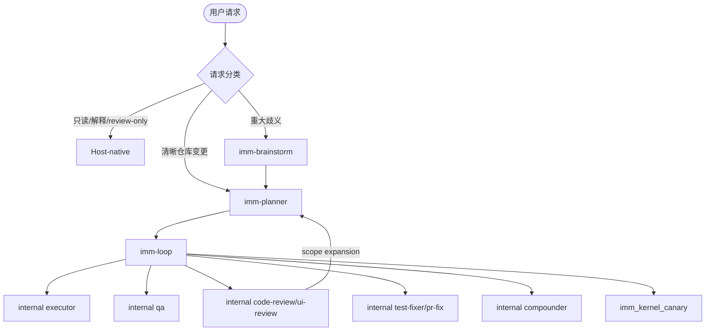

# Immune-Brain public Skills 与内部 roles 指南

Immune-Brain 的 shipped public Skill surface 固定为三个入口：

| Public Skill | 责任 | 下一步 |
| --- | --- | --- |
| `imm-brainstorm` | 澄清需求、范围、假设和风险；`adversarial`/`roundtable` 是内部模式 | `imm-planner` |
| `imm-planner` | 创建或修订 Spec、Plan 和候选 TaskIntent；不自动 Enrollment | `imm-loop` |
| `imm-loop` | 消费 validated Plan，协调执行、QA、Review、repair、learning 和恢复 | Kernel Tool / Planner / terminal |

旧的 Executor、QA、Review、repair、explorer、advisory、Compounder 和 Init entry
不再是可发现的 Skill。它们分别是 `imm-loop` 的内部 role、runtime capability 或 TUI/Tool
操作；没有 alias、feature flag 或第二个 public surface。

## 协作拓扑



## Public Skill 合同

### `imm-brainstorm`

只在问题仍有 material ambiguity 时使用。它负责把假设、决策、风险和非目标整理成
`BR-*` 清单，并在所有 `BR-Q-*` 得到回答前阻止 Planner 继续。它不修改实现、不激活
workflow authority，也不替代 Planner 或 Loop。

### `imm-planner`

Planner 是清晰仓库变更的默认规划阶段。它读取 routing projection，写入 Spec/Plan，
声明 Scope、Result、Verification、风险和 rollback 约束。Plan-only 输出保持
non-authoritative；Enrollment 仍由 literal user 和 Pi TUI 拥有。

### `imm-loop`

Loop 是唯一的执行协调 public Skill。它通过 `buildLoopAction` 和
`buildLoopRoleDispatch` 选择内部 action/role，并保持每个 boundary 的 authority：

- `executor`：当前 active Step 的最小实现。
- `test-fixer` / `pr-fix`：显式委派的测试和 PR repair。
- `qa`：只消费 evidence，返回 pass/rework/replan。
- `code-review` / `ui-review`：只读 review；Stable Review Gate identifiers 为
  `imm-code-review` 和 `imm-ui-review`，这些是 gate IDs，不是 public Skill。
- `arch-explorer` / `advisory-reviewer`：只读探索、lens evidence 和 decision criteria。
- `compounder`：任务 closure、assurance 和 required reviews 完成后才捕获 reusable Learning。

所有 role prompt 的 canonical bytes 位于 `plugins/immune-brain/runtime/prompts/`，
packaged bytes 位于 `plugins/immune-brain/dist/role-prompts/`。Role bridge 直接读取
这些内部 prompt，不扫描 `skills/`，因此 public Skill registry 不会重新暴露内部 role。

## Bootstrap 与 Pi runtime

Managed Path 第一次需要状态时，由 `runtime/bootstrap.ts` 调用
`runtime/bootstrap-templates/` 完成严格、幂等 bootstrap。它不是 `/imm-init` Skill；
partial、incompatible、tracked-deleted 或 symlinked state 必须 fail closed。

Pi runtime 的 public loader 只应发现三个 Skill。Canary Enrollment、Kernel evidence、
Review authorization 和 terminal settlement 通过 foreground Tools/TUI gates 完成：

- `imm_canary_enrollment`：准备、rehearsal、literal-user confirmation、revalidation、commit。
- `imm_kernel_canary`：evidence、assurance、Review authorization 和 completion。
- `imm-code-review` / `imm-ui-review`：Review Gate identifiers，实际 dispatch 由 Loop role bridge 负责。

Canary Work 和 Work 不再是用户工作流入口。相关 extension/tool source 仅作为 runtime
实现保留，用户继续工作时进入 `imm-loop`。

## Surface 与验证

`plugins/immune-brain/skills/registry.yaml`、`dist/registry.yaml`、三个 `SKILL.md`、
三个 `dist/imm-*.md` 和 package manifest 必须保持一致。旧 `imm-*.md` entry files、旧
Skill directories 和兼容 aliases 必须不存在。

建议验证：

```bash
bun scripts/sync-dist-docs.ts --check
bun test plugins/immune-brain/tests/skill-registry-consistency.test.ts
bun test tests/role-prompt-bridge.test.ts tests/loop-execution-routing.test.ts
```

## Output 与 authority

Public Skill 文档的输出保持 terse：结论、关键 evidence、Next Action。Internal roles
不得写 Plan、Spec、workflow state 或 QA closure，除非它们的明确 authority contract
允许该写入；Parent/Loop 负责合并 advisory 结果并触发下一个 boundary。
