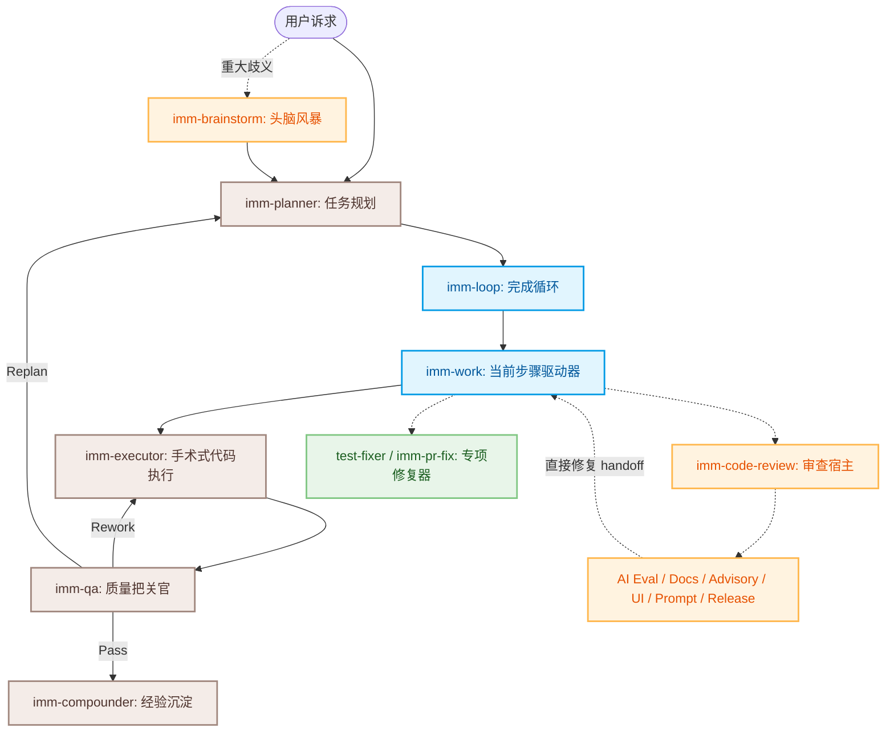

# 🎭 Immune-Brain Skills 架构与全景使用指南

本指南旨在详细梳理 **Immune-Brain** 系统中全部 **15个技能 (Skills)** 的实现逻辑、核心职责、工作流决策与边界约束。（`imm-autowork` 已下沉为 runtime/CLI 命令原语，由 `imm-loop` 消费，不再作为可安装技能。）Immune-Brain 通过严格的“三权分立”（规划、执行、审计）与多角色智能体协同机制，将复杂的软件开发任务拆解为小步闭环的确定性流程。

---

## 🗺️ 系统协作拓扑图 (Collaboration Topology)

根据技能的职责特性与权限边界，15 个技能可划分为四大核心阵营：
1. **指挥协同层 (Coordinator)**：负责流程调度与安全边界衔接。
2. **权威决策层 (Authority Gates)**：负责高风险、高权力的状态改变（如规划、写码与关闭）。
3. **顾问审查层 (Advisory & Reviewers)**：以纯只读的方式参与专项审计，提供高价值的多视角决策参考。
4. **局部专用与辅助层 (Specialists & Bootstrap)**：负责特异化的环境打桩或严格受限的局部修复。

---

## 📋 15 个技能核心元数据一览 (Registry Metadata)

| 技能名称 (Name) | 角色类 (Role Class) | 核心职责与边界 (Boundary) | 产出工件 (Artifacts) | 下一步路由 (Next Action) |
| :--- | :--- | :--- | :--- | :--- |
| **imm-loop** | `coordinator` | validated Plan 的执行总入口，控制串联机制 | `run_status` | `imm-planner`, `imm-work`, `imm-code-review`, `imm-ui-review`, `imm-compounder` |
| **imm-work** | `coordinator` | 常驻核心枢纽，驱动单步状态流转 | `work_status` | `imm-executor`, `imm-qa`, `imm-planner`, `imm-compounder` |
| **imm-planner** | `authority` | 任务细化与 Spec 规范定义，严禁触碰代码 | `validated_plan` | `imm-loop`, `imm-work` |
| **imm-executor** | `authority` | 严格 TDD 单步写码，收集执行证据打桩 | `execution_evidence` | `imm-qa`, `imm-planner` |
| **imm-qa** | `authority` | 循证式严苛把关，无绝对证据拒不通过 | `qa_review` | `imm-work`, `imm-planner`, `imm-compounder` |
| **imm-compounder** | `authority` | 脱水总结，萃取黄金复用经验与 ADR | `solution_learning` | *(流程收尾)* |
| **imm-brainstorm** | `framing` | 探查需求漏洞，建立 BR-* 闭包标签 | `brainstorm_framing` | `imm-planner` |
| **imm-code-review** | `review_host` | 审查派发宿主，归并专项审查决策与修复 | `code_review` | `imm-work`, `imm-planner` |
| **imm-advisory-reviewer**| `advisory` | 多维度（Lens）深层架构和安全审计 | `advisory_review` | `imm-work`, `imm-planner` |
| **imm-ui-review** | `advisory` | Nielsen 启发式高保真可用性视觉审计 | `ui_review` | `imm-work`, `imm-planner` |
| **imm-arch-explorer** | `discovery` | 主动解耦与领域建模审计，输出候选 ADR | `architecture_map` | `imm-brainstorm`, `imm-planner` |
| **test-fixer** | `active-step-bounded-executor` | 专项局部测试文件修复，业务生产代码隔离 | `child_evidence` | `imm-work`, `imm-executor` |
| **imm-pr-fix** | `repair` | 专扫 PR 合并冲突、CI 报错和评审 Blocker | `pr_repair` | `imm-code-review`, `imm-qa` |
| **imm-init** | `bootstrap` | 项目 Immune-Brain 轻量级初始脚手架搭建 | `imm_bootstrap` | `imm-brainstorm`, `imm-planner` |

---

## 🔍 15 个技能实现逻辑、核心优势与解决场景深度剖析

### 1. imm-loop（计划执行总入口）
* **核心职责**：驱动从“已验证计划”到“多维度审查”及“经验归档 handoff”的完整闭环流水线。
* **实现逻辑**：
  1. 校验本地是否存在 validated Plan，若缺失则报错并路由至 `imm-planner`。
  2. 在当前对话消费 `imm-autowork` checkpoint runtime（CLI 原语），主上下文完成实现，并通过隔离 subagent 推进 QA。
  3. 执行通过后，主动发起 `imm-code-review` 联检，并对最终通过的结果调用 `imm-compounder` 提取沉淀。
* **显著优势**：
  * **高阶流程链条集成**：一键式串联，免除用户反复敲击多条指令的心智负担。
  * **全流程强护栏**：强制把守 QA 门闸与 CR 联检，防止带病关闭。
* **能够解决的问题**：
  * 解决开发阶段“步骤过多时，反复需要人工发布推进命令”的繁琐流程。
  * 规避因开发人员图省事而静默绕过代码审查和经验沉淀的投机行为。

---

### 2. imm-work (当前步骤驱动器 — 工作流心脏)
* **核心职责**：整个系统运行时的**战术控制枢纽**。强制每次仅针对当前 `active` 状态的单一步骤发力，确保状态连续性。
* **实现逻辑**：
  1. 执行状态决策流转树：激活并推动当前 `active` Step；若无 active 步骤，自动定位并激活下一个待攻克 Step。
  2. 若计划已执行完毕但存在 pending Reviewer `follow_up` 修复包，则无缝吞噬它，提取 `scope` 和 `change_goal` 指派 Executor 修复。
  3. 通过 `probes` 机制指派只读子 Agent 预先打探目标依赖并填入 State Ledger 的 `child_evidence` 中以供 Executor 直接消费。
  4. 每步 pass 后自动维护根目录 `HANDOFF.md` 快照，防范会话上下文膨胀引起的知识中断。
* **显著优势**：
  * **单步隔离铁律**：严密限缩改动边界，防止一次任务改动越界扩散到整个仓库。
  * **并行探针加速**：通过预打探使 Executor 接招时已具备高纯度上下文，无需 Executor 重复探测。
* **能够解决的问题**：
  * 避免开发过程中因“改着改着就迷路，不知道当前处于哪一步”的定位乱局。
  * 解决“回炉重做 (Rework)”或“计划变更 (Replan)”时，状态在中间会话丢失、上下文错乱的断点恢复难题。

---

### 3. imm-planner (任务规划器)
* **核心职责**：负责定义任务边界、编写技术规格说明书 (Spec) 并拆解为以终为始的迭代执行计划 (Plan)。
* **实现逻辑**：
  1. **脑暴澄清铁闸 (Clarification Barrier)**：硬性拦截脑暴。如果任何标记为 `BR-Q-*` 的开放性问题在脑暴残留中处于未回答状态，立即中断规划，绝不靠猜。
  2. **交付物导向拆解**：坚决摒弃“微观技术动作”为 Step，要求每一个 Step 必须产生**且仅产生一个有形、可验证的实际商业交付物**。
  3. 为执行附加姿态注解（`test-first`/`characterization-first`/`default`）和 `parallel_probes` 指令。
* **显著优势**：
  * **脑暴闭包追踪 (Trace)**：通过 `Brainstorm Trace` 映射表，保证脑暴期间确立的每一个诉求在 Spec/Plan 中都有交代，不漏需求。
  * **可读可校验**：通过 `imm-plan --json` 对最终生成的 Spec 及 Plan 进行语法和语义规范性强校验，杜绝格式错漏。
* **能够解决的问题**：
  * 解决“步骤被拆得过碎（如第一步看代码，第二步改代码，第三步测代码）导致过程繁琐且无法验证”的问题。
  * 解决“上游提了 5 个脑暴点，到了写计划时悄悄漏掉了 2 个”的需求失踪难题。

---

### 4. imm-executor (手术式代码执行器)
* **核心职责**：在极其受限的单步 active 边界下，以严密的技术纪律（TDD）实现最简必要的通过代码。
* **实现逻辑**：
  1. **测试驱动 (TDD) 纪律规范**：如果步骤标有 `test-first`，必须严格执行：**RED**（写出失败测试断言） $\rightarrow$ **GREEN**（实现最简逻辑使其通过） $\rightarrow$ **REFACTOR**（绿灯重构）。
  2. 对于遗留系统，强制在重做前补充 Characterization-first 特征快照测试。
  3. 运行验证命令，并通过 `record-execution` 将真实的命令输出与 commit 证据记录打桩到 ledger 中。
* **显著优势**：
  * **极高行行可信度**：TDD 迫使开发人员保持严谨，每一次改动必伴随着自动化防护网的诞生。
  * **范围彻底锁死**：将修改限制在 active step 目标内，绝不捎带顺手清理（Adjacent Cleanup）。
* **能够解决的问题**：
  * 避免 Agent “野性大发”在实现功能 A 的同时顺手重构了 B 文件导致线上崩塌。
  * 规避未写测试就感性宣布“我写完了”的技术债积累。

---

### 5. imm-qa (质量保障官)
* **核心职责**：无情、刻板的循证审计大关卡，对 Executor 留存的客观事实进行合规度审查。
* **实现逻辑**：
  1. **TDD 链路比对**：核验 Executor 提交的 record 日志，确保 RED 记录的时间确实早于 GREEN。
  2. **覆盖闭包核实**：扫描 Plan 的跟踪表，保证全部 trace 痕迹都已闭合；将采用 Manual 点检验收的步骤记录到技术债列表，强制建议后续补齐回归测试。
  3. **架构 Zoom-Out**：从宏观 `CONTEXT.md` 视角核验更改是否带来了跨模块不一致或隐性性能塌陷。
* **显著优势**：
  * **数据循证，拒绝对话欺骗**：不理会 Executor 文本上的“已修好”，只核验打桩的客观控制台输出。
  * **三权分立，中立审判**：只负责裁决 Pass / Rework / Replan，绝不亲自动手改动任何文件。
* **能够解决的问题**：
  * 解决开发阶段容易出现的“功能似乎修好了，但带病上线，导致旁支逻辑或接口被破坏”的问题。
  * 终结传统 Agent 自写自测时“自己写了 Bug，自己假装通过了测试”的逻辑闭环漏洞。

---

### 6. imm-compounder (经验沉淀器)
* **核心职责**：在任务功成身退时，负责对迭代知识进行脱水归档，提炼可重用经验并科学缩减运行时上下文。
* **实现逻辑**：
  1. 拦截庞杂的执行日志证据（`focus_delta` 等），将其批量“脱水 (Dehydrate)”为稳定的精炼短索引，压缩 `.imm/` 数据。
  2. 将新知识归类追加至现有的核心知识枢纽（`docs/solutions/` 库中的 workflow, contracts, infra），对高价值权衡（反直觉、难逆转）产出极简 ADR（架构决策记录）。
  3. 对文章注入 explicit reuse 标签（可重用性分级）与 `key_files` 前置元数据。
* **显著优势**：
  * **长效抗膨胀 (Anti-Bloat)**：脱水机制彻底根治了长时间长会话开发后 Agent 容易被历史垃圾垃圾“撑爆”的通病。
  * **精准后续指引**：提炼的 ADR 与可重用知识可以直接被后续 Agent 在脑暴早期引用，避免犯重复的错误。
* **能够解决的问题**：
  * 解决“项目连续演进几十轮后，Agent 因上下文塞满庞大旧 Diff 导致理解能力暴跌、开销极高”的问题。
  * 解决“同一类 Bug 团队上个月刚修过，这个月换了一个分支又原样犯了一遍”的认知断层问题。

---

### 7. imm-brainstorm (头脑风暴器)
* **核心职责**：在规划开跑前扮演批判性的“内省质询哨兵”，提前榨取需求中的隐藏假设、技术阻力与决策偏航。
* **实现逻辑**：
  1. **深度 Gap 扫描**：从反事实（现在的成本？）、具体性（谁受益？）、反直觉等多个痛点向用户发问，形成顺畅自然的脑暴对话。
  2. 检索 `docs/solutions/` 库中带 `rejected: true` 标记的前案，遇到类似投机想法时予以坚决阻断。
  3. 将确定下来的要求归类，生成带有固定 `BR-*` ID 标签的闭包清单交接给 Planner。
* **显著优势**：
  * **苏格拉底式质询**：主动提出低摩擦的“更无趣”平庸设计以挑战复杂过度工程。
  * **澄清硬栅栏**：若有任何关键性发问未获得回复，拒绝向 Planner 移交，强力拦截盲目规划。
* **能够解决的问题**：
  * 解决由于需求定义不清导致的“开发到一半，用户突然说我不是要这个效果”的重大静默需求漂移。
  * 解决“为了解决一个小问题，Agent 臆想出一套庞大无比的微服务/设计模式架构”的过度工程（Over-engineering）通病。

---

### 8. imm-code-review (代码审查宿主)
* **核心职责**：质量大联检首要运行时宿主，评估、派发并合并各个专项顾问的审查结果，保障主干分支纯净度。
* **实现逻辑**：
  1. 解析配置文件，利用 `build_delegation_packets` 针对触发文件进行 **文件级别上下文分片 (Context Sharding)**。
  2. 将分片精准派发给 `imm-advisory-reviewer` 各路专家。
  3. 过滤并按严重程度排重，强制 Findings 必须带有可观察的 `verification_criteria`（可观察的判定标准而非教条代码片段）。
  4. 如果属于同边界内的问题，打包成 `follow_up` 路由回 `imm-work` 原地直修。
* **显著优势**：
  * **上下文分片并发 CR**：大大提升了 CR 过程的运行吞吐率，避免庞大 PR 导致 Agent 产生审查死角。
  * **同边界直修降级**：无需 Planner 重写计划，极速修复小缺陷。
* **能够解决的问题**：
  * 解决传统 Agent 审查时容易忽略的“由于文件太大，Agent 看到后半部分时已经漏掉了前半部分的逻辑拼写错误”的问题。
  * 解决 CR 发现问题后，不得不重新生成完整 Plan 导致的低效循环。

---

### 9. imm-advisory-reviewer (多视角咨询审查器)
* **核心职责**：根据宿主传入的特定“透镜维度 (Lens)”，进行无偏差、高价值的特定方向审计。
* **实现逻辑**：
  * 支持多种核心 Lens 维度：
    * `security`: 检查公共端点、密钥暴露和鉴权配置。
    * `api_contract`: 校验协议 Schema 和响应序列化。
    * `data_integrity`: 评估事务边界、约束和数据迁移回填。
    * `reliability`: 审计超时、背景队列及依赖重试。
    * `docs`: 核对 README/手册/CLI 范例与代码行为的一致性；可选 hygiene sweep 模式对文档做只读盘点、分类与 dry-run 清理清单（绝不移动/归档/删除文件）。
    * `prompt_contract`: 审查 System Prompt / Tool Schema / Agent 指令 / 输出契约 / 安全边界变更。
    * `release_readiness`: 审查部署、回滚、迁移灰度、特性开关与生产切换的验证缺口与回滚风险。
    * `ai_eval`: 审查模型/Agent 行为、评估集、Rubric、Guardrails 与生产监控变更的评估维度、失效模式与监控盲区。
    * UI 透镜（`ui_a11y` / `ui_responsive` / `ui_i18n` / `ux_heuristic` / `ui_visual` / `design_contract`）由 `imm-ui-review` 场景驱动。
* **显著优势**：
  * **极度严苛的只读**（默认为 `tool_policy: no tools`）。仅作附加咨询层，如发生超时，直接退回宿主，不充当阻断性大闸阀。
* **能够解决的问题**：
  * 解决单一程序员因“隧道视野”而忽略的安全隐患、数据并发约束漏洞或 API 契约被意外破坏的问题。

---

### 10. imm-ui-review (UI 与可用性审查器)
* **核心职责**：专门针对表单配置、视觉层次、无障碍访问（a11y）与响应式交互进行高品质美学审计。
* **实现逻辑**：
  1. 表单界面：引入防呆、默认值与极简错误捕获交互法则。
  2. 异步长任务：核验 Skeleton、交互态置灰和明确的加载指示。
  3. 寻找潜在的视觉间距对齐冲突（P0-P3 Findings）。
* **显著优势**：
  * **人本可用性审计**：严格加载 Nielsen Usability Heuristics 经典十条，兼顾视觉和无障碍多方面；极速的同边界修复路径能不打扰 Planner。
* **能够解决的问题**：
  * 解决程序员容易忽略的“表单提交后没置灰按钮导致二次重复提交”、“大文件上传没有任何 Skeleton 导致用户以为死机”等影响商业体验的严重缺陷。

---

### 11. imm-arch-explorer (架构探索器)
* **核心职责**：主动在项目演进中扫描架构脆弱面，防止新开发动作无意识推翻现存 ADR 的设计权衡。
* **实现逻辑**：
  1. 使用领域词汇挑战过度解耦或过度耦合的折中方案。
  2. 跨模块探索时，分发无修改工具权限的只读子 mapper 收集领域信息并汇总。
  3. 强制在方案确立前运行“最无趣替代方案（Best-Fit Challenge）”评估不做更改的隐性成本。
* **显著优势**：
  * **ADR 决策忠实护卫**：最大程度继承项目已有的重构经验与折中方案，防范历史失忆。
* **能够解决的问题**：
  * 解决“Agent 在新特性开发时，静默引入了循环依赖或打破了原本封装得很好的分层边界”的慢性代码腐败问题。

---

### 12. test-fixer (测试专项修复器)
* **核心职责**：受限的测试局部修复，用以保持测试的稳健运行。
* **实现逻辑**：
  1. **测试隔离铁防线**：在改动前必须对比 `specific_changes` 名单。**一旦名单为空或涵盖任何业务源码，必须立刻中止以确保业务代码在 Executor 职责之外被绝对保护。**
  2. 仅对断言、Stub 或 mock 测试文件进行修复，提供无害测试证据，并将指令结果汇总反馈给宿主父任务。
* **显著优势**：
  * **极致无害的测试沙栏**：通过文件路径白名单完全封死对业务层变动的可能，安全性极高。
* **能够解决的问题**：
  * 解决“由于需要修几个单测用例的 Mock 数据，结果不小心改坏了生产代码底层逻辑”的测试越权污染难题。

---

### 13. imm-pr-fix (PR 障碍修复器)
* **核心职责**：专扫 PR 演进过程中的三大拦路虎：CI 测试红灯、评审修改建议和远程分支合并冲突。
* **实现逻辑**：
  1. 配合 GitHub CLI (`gh pr`) 检索最新流水线元数据。
  2. 分离出测试错误、修改批注与冲突区；如无共享文件写入冲突，可在孤立的分支工作区中并发调度修复。
  3. 遇合并冲突时，强制校验远程 metadata，防止覆盖他人工作。
* **显著优势**：
  * **并发沙盒级 PR 修复**：完美剥离 Blocker 并隔离并发分支作业，大幅提高通道清理吞吐。
* **能够解决的问题**：
  * 解决“主干分支代码合并频繁，分支时常由于微小冲突或 CI 误报导致 PR 长时间被锁住”的发布拥堵问题。

---

### 14. imm-init (项目初始化器)
* **核心职责**：搭建项目专属的极简 Immune-Brain 环境脚手架。
* **实现逻辑**：
  1. 创建 memory、specs、plans 等文件夹。
  2. **引擎独立隔离**：出于保护业务仓库纯净的目的，绝不将具体的 Python 执行引擎源码拷入项目，保持完全的配置化纯净隔离。
* **显著优势**：
  * **轻量幂等**：一秒即可接入，只补全必要元配置，不对现有业务有任何入侵。
* **能够解决的问题**：
  * 消除跨团队推广 Immune-Brain 开发模式时，因为手动打桩和繁琐的环境拷贝引起的推广阻力。

---

> [!TIP]
> **设计美学思考**：Immune-Brain 的 15 个技能通过层级分工与边界约束，巧妙地抑制了 LLM 的**隧道视野 (Tunnel Vision)** 和**投机清理 (Adjacent Cleanup)** 倾向。在配合开发时，请务必尊重角色契约（例如：Executor 拒绝规划任务，QA 拒绝写码修复），这是实现高达 90%+ 的复杂改动一次性成功率的核心基石。
