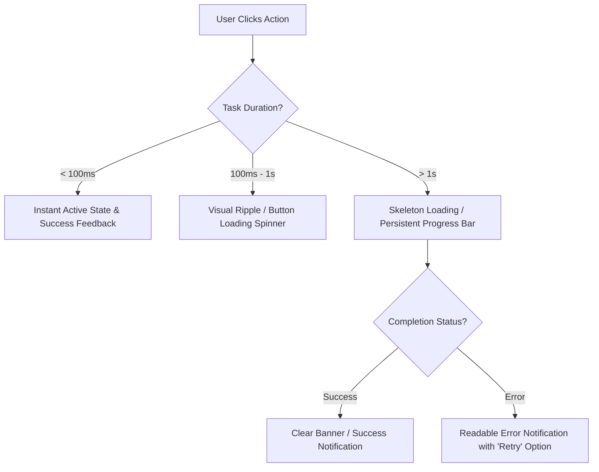

# UI/UX Usability Heuristic & Experience Checklist

This document compiles authoritative user experience (UX), user interface (UI), and heuristic usability principles. It serves as a progressive disclosure review lens for agents and human experts to evaluate applications page by page, component by component.

---

## 1. Nielsen 10 Usability Heuristics (Nielsen's 10)

| **Heuristic / 原则** | **Explanation / 解释** | **Checkpoints / 检查要点** |
| :--- | :--- | :--- |
| **Visibility of System Status** 系统状态可见 | The system should always keep users informed about what is going on, through appropriate feedback within a reasonable time. | - Loading indicators or skeletons for async calls. - Progress bars for long-running operations. - Clear active states on buttons and tabs. |
| **Match Between System and Real World** 符合现实世界 | The system should speak the users' language. Use words, phrases, and concepts familiar to the user, rather than internal jargon. | - Avoid displaying raw DB errors or stack traces to the user. - Use intuitive naming conventions for tabs, menus, and actions. - Map digital interactions to real-world expectations. |
| **User Control and Freedom** 用户可控 | Users often perform actions by mistake and need a clearly marked "emergency exit" to leave the unwanted action without hassle. | - Support undo, cancel, or step-back on critical inputs. - Allow canceling long-running background tasks. - Clear "Close" or "Dismiss" options on modals and popups. |
| **Consistency and Standards** 一致性 | Users should not have to wonder whether different words, situations, or actions mean the same thing. Follow platform conventions. | - Unified color palette (primary, secondary, danger, warning). - Consistent button styling (e.g., solid for primary, outlined secondary). - Same terminology used across all screens. |
| **Error Prevention** 防止错误 | Even better than good error messages is a careful design which prevents a problem from occurring in the first place. | - Disable "Submit" buttons until mandatory fields are filled. - Provide real-time validation alerts *before* submission. - Double-confirm high-risk actions (e.g., delete, reset). |
| **Recognition Rather than Recall** 识别优于记忆 | Minimize the user's memory load by making elements, actions, and options visible. Avoid making users remember information between pages. | - Auto-suggestion in complex search bars. - Persistent labels on input fields (avoid placeholder-only labeling). - Contextual help or tooltips near unfamiliar controls. |
| **Flexibility and Efficiency of Use** 灵活高效 | Shortcuts — hidden from novice users — may speed up the interaction for the expert user so that the system can cater to both. | - Keyboard shortcuts for power operations. - Default smart values (pre-populating fields with common choices). - Bulk action capabilities in list views. |
| **Aesthetic and Minimalist Design** 简洁设计 | Interfaces should not contain information which is irrelevant or rarely needed. Every extra unit of information competes with relevant info. | - High signal-to-noise ratio: prioritize core features. - Clean typography with balanced padding and margins. - Eliminate visual clutter and excessive lines or borders. |
| **Help Users Recognize and Recover** 帮助用户恢复错误 | Error messages should be expressed in plain language (no error codes), precisely indicate the problem, and constructively suggest a solution. | - Use clear, readable explanations instead of `Error 500`. - Provide direct action buttons (e.g., "Retry", "Contact Support"). - Highlight the exact input field that caused the error. |
| **Help and Documentation** 必要帮助文档 | It is best if the system doesn't need additional explanation. However, it may be necessary to provide documentation to help users. | - Contextual tooltips explaining complex system metrics. - Easily accessible FAQ or Help links in navigation. - Clear step-by-step onboarding for first-time features. |

---

## 2. Information Architecture (IA)

- **Clear Categorization (清晰分类)**:
  - Users must immediately comprehend what each module or section does.
  - Logical grouping of functions (e.g., "Analytics" contains only charts, "Settings" contains only configurations).
- **Explicit Visual Hierarchy (层级明确)**:
  - Essential content must appear first and capture immediate visual focus. Secondary actions belong in nested menus or muted elements.
  - High-impact metrics should be larger and bolder than administrative metadata.
- **Stable Navigation Paths (路径稳定)**:
  - Back buttons must reliably return the user to the previous state.
  - No dead-ends: every screen must have at least one stable way to navigate back or go home.
- **Natural Terminology (自然命名)**:
  - Labels must represent user intent, not database column names (e.g., "Add Member" instead of `POST /member_v2`).

---

## 3. Feedback First Interactive Loop

An interface feels "alive" and interactive when feedback is immediate and continuous:

- **Interactive Hover and Active States**:
  - Buttons must transition color/scale smoothly on hover.
  - Clicking a button triggers a satisfying change (visual ripple, spinner, or instant state toggle) so the user knows the click registered.
- **Async Loading Skeletons**:
  - Content containers must display skeleton loaders matching their final layout to prevent jarring page layout shifts.
- **Long-Task Trackers**:
  - Background processes must show a visible task status tracker (e.g., "Generating Report... 45%").
- **Error Recovery Loops**:
  - If a service fails, don't just show an error message. Provide a recovery button: "Try Again", "Reload Page", or "Pre-populate Cached State".

---

## 4. Visual Principles & Layout Excellence

- **Alignment (对齐)**: Align all elements to a clean, consistent grid (left-aligned text, right-aligned numbers, centered icons). Misaligned lines signal poor craftsmanship.
- **Contrast (对比)**: Ensure contrast ratios satisfy WCAG AA standards (minimum 4.5:1 for normal text). Dark modes must feature distinct visual depths (elevation shadows, varying card shades).
- **Proximity (亲密性)**: Related elements must be grouped closely together. Unrelated elements must be separated by generous white space.
- **Repetition (重复)**: Standardize repeating design patterns (margins, padding sizes, font scales, icon shapes) to create familiarity.
- **Whitespace (留白)**: Give your layout room to breathe. Use negative space strategically to guide the user's eye and prevent overwhelming density.

---

## 5. Core Product Experience Principles

- **Don't Make Me Think**: The primary path should be obvious without reading instructions. Labels, grouping, and visual priority should make the next action self-evident.
- **Progressive Disclosure**: Show the most important action or decision first; reveal advanced settings, secondary metadata, and rare actions only when they are needed. Flatly-listed operations must not exceed 2 actions; all other low-frequency actions must collapse under dropdown/more menus.
- **Recognition over Recall**: Keep context, options, and prior choices visible so users do not need to remember information across screens.
- **Feedback First**: Every click, submit, navigation, and long task should immediately show that the system received the user's intent.
- **Error Prevention**: Prefer constraints, confirmation, validation, and preview states that prevent mistakes before users commit them.
- **Empty State Design**: Empty views should explain what is missing, why it matters, and the single next useful action.
- **Consistency**: Similar actions, states, labels, and component patterns should behave the same way across the product.
- **Default Smartness**: Use sensible defaults, prefilled values, and preserved preferences to reduce repetitive setup.
- **User Control**: Users should be able to cancel, undo, back out, retry, or recover without losing orientation.
- **Less but Better**: Remove low-value controls, duplicate explanations, and decorative clutter that compete with the user's goal.

---

## 6. 11-Point Heuristic Acceptance Checklist

Before any feature is signed off by QA, it must pass these **11 criteria**:

1. [ ] **Skeleton Loader**: Does every async data container show a smooth skeleton loader rather than a blank white box?
2. [ ] **Action Spinner**: Do buttons trigger a spinner or disable themselves upon click to prevent double submissions?
3. [ ] **Undo / Cancel**: Can the user cancel or back out of any modal / form step without losing global navigation?
4. [ ] **Natural Error Explanation**: Are raw programming exceptions and system logs caught, replaced with human-readable guidance, and logged to console instead?
5. [ ] **Form Validation**: Are input validation errors highlighted on the specific field in real-time, rather than only in a global pop-up?
6. [ ] **Responsive Flow**: Does the layout remain perfectly aligned with no broken horizontal scrolling on both standard desktop and narrow viewports?
7. [ ] **Unified Colors**: Do all interactive states (hover, active, focus, disabled) conform exclusively to the approved theme palette?
8. [ ] **No Dead-Ends**: Is there a clear, persistent back path or navigation route visible on every single page layout?
9. [ ] **Smart Defaults**: Are complex dropdowns or configurations pre-populated with sensible smart defaults to minimize user fatigue?
10. [ ] **Empty States**: If data is empty or missing, is there a beautiful empty state card with a clear call-to-action button (e.g., "Add your first item")?
11. [ ] **Action & Form Limits**: Are operations grouped to avoid flat listings of >= 3 buttons, and are inputs restricted to readable horizontal limits (max-width recommendation of ~448px or Bento Grid) to prevent stretching on wide screens?

---

## 7. Motion & Color Consistency Heuristics (动效与配色启发式校验)

- **Motion Response (动效响应)**: Interactive micro-animations, hover effects, and view transitions must be responsive, smooth, and must not introduce perceptible lag (typically kept under 300ms) or block critical user actions.
- **Color Accessibility (色彩与对比度)**: All text and interactive element colors must maintain strict WCAG AA color contrast ratios (minimum 4.5:1 for normal text). Brand colors must be applied consistently across states (hover, active, focus).

---

## 8. Design Tier Validation Rules (设计等级差异化校验)

When auditing against the pre-implementation `page_design` contract, verify the implementation according to the declared `design_tier`:

### Standard Tier
- [ ] **Grid & Hierarchy**: Does the layout structure align with the section map and information hierarchy defined in the contract?
- [ ] **Color Contrast**: Are color contrast ratios compliant with WCAG AA standards?
- [ ] **Width Safety**: Are inputs constrained by horizontal bounds (`form_stretching_limits`) to prevent stretching across wide screens?
- [ ] **Action Collapsing**: Are operations structured cleanly with <= 2 visible actions and low-frequency actions collapsed behind `collapsed: true` metadata?

### Rich Tier
In addition to all Standard Tier checks, audit the following:
- [ ] **Motion Contract**: Are the view transitions and micro-animations implemented according to the durations and easing curves defined in the `motion_contract`?
- [ ] **Aesthetic Genre**: Does the interface reflect the visual styling of the specified `aesthetic_genre` (e.g., Swiss typography, mechanical grids, HSL palettes)?
- [ ] **Image Strategy**: Do actual images, illustrations, or placeholder styles match the texture and tone guidelines defined in the `image_strategy`?
