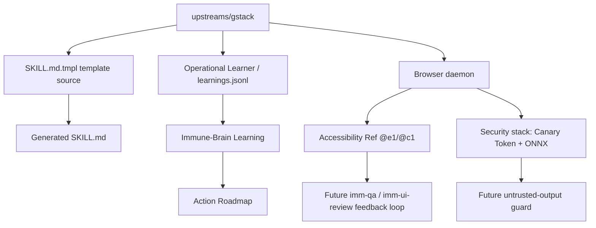

# Pattern: gstack Skill borrow insights

**领域**: Agent workflow / Skill governance / upstream borrowing
**描述**: gstack 的价值不在于复制一整套团队式 Skill，而在于借鉴它把 Skill 生成、操作记忆、浏览器 QA、防注入和路由触发做成可审计系统的方式。Immune-Brain 应把这些能力拆成可验证的 Learning、Plan、Spec、Activation Plan 与 Skill contract 增量，而不是引入新的 runtime 平台。

## Abstract

这份 Learning 记录 gstack Skill 体系中值得长期借鉴的五个维度，并把每个维度映射到 Immune-Brain 的现有边界。结论是：文档防漂移、证据索引和轻量路由属于 P1；browser daemon、Accessibility Ref、Canary Token、ONNX classifier 属于 P2/P3 的基础设施候选。本轮不落地 runtime，只沉淀证据、边界与后续引入顺序。

## Mermaid Context Map



## The Five Golden Ore

### 1. SKILL.md.tmpl Template System

gstack treats `SKILL.md` as generated output and `SKILL.md.tmpl` as the source of truth. The strongest borrow is not the Bun build itself, but the contract that generated prompts must not be hand-merged or silently drift from their templates.

Mechanism detail:
- Template source: edit `SKILL.md.tmpl`, then regenerate `SKILL.md`; merge conflicts are resolved at the template/source layer first.
- CI/contract guard: if Immune-Brain later introduces generated Skill artifacts, the guard should assert that generated files match source templates before review.
- BASELINE alignment: keep shared behavior in `skills/BASELINE.md`; generated per-skill files should carry only role delta and local workflow rules.
- allowed-tools alignment: generated skill metadata should preserve the narrowest `allowed-tools` set instead of copying broad tool grants across skills.

Local fit:
- P1: add a future thin contract for generated Skill artifacts if Immune-Brain introduces templates.
- P1: reuse the conflict rule: resolve source templates first, then regenerate outputs.
- Deferred: no template compiler is needed until this repo has repeated generated Skill files.

### 2. Operational Learner

gstack has a project learning loop: show recent learnings, search by query, prune stale or contradictory entries, export to docs, and manually append structured learnings. Immune-Brain already uses FileSystem-as-Brain, so the borrow should be conceptual: operational learnings must be searchable, pruneable, and evidence-backed.

Mechanism detail:
- Preamble: gstack exposes learnings before work through a skill preamble tier; Immune-Brain should keep this as a concise visible memory cue, not a hidden second planner.
- Learning schema: a local entry should at minimum preserve `type`, `key`, `insight`, `confidence`, `source`, and related `files`.
- Quirks mapping: treat "quirks" as searchable constraints attached to paths, hosts, tools, or workflows, then surface them only when the active Step touches the same boundary.
- Query flow: prefer `docs/solutions/` and `.imm/memory/MEMORY.md` as the query corpus; do not introduce a duplicate `learnings.jsonl` or SQLite/FTS authority.

Local fit:
- P1: keep `docs/solutions/` as the durable Learning store.
- P2: consider a small index or hygiene command for stale Learning checks.
- Rejected: do not add a separate SQLite/FTS memory plane or duplicate `learnings.jsonl` in repo state.

### 3. Headless Browser Daemon and Accessibility Ref

gstack's browser layer uses a persistent daemon with a thin CLI, then maps accessibility snapshots to stable refs such as `@e1`. The key idea for Immune-Brain is the feedback loop: reduce repeated browser setup cost, prefer accessibility-level selection, and fail fast when SPA state invalidates refs.

Mechanism detail:
- Daemon loop: the CLI is a thin stdout client; a workspace-local daemon owns Playwright and browser state.
- Accessibility Ref: refs such as `@e1` are derived from the accessibility tree, then resolved back to Playwright locators.
- Staleness check: before acting on a ref, gstack runs a `count()` check; if the element count is zero, the agent must refresh the snapshot instead of waiting for a long action timeout.
- Local migration schema: first document a QA guidance shape like `{ ref, role, name, source_snapshot, stale_check }`; only later consider runtime support.

Local fit:
- P2: record this as a candidate for `imm-qa` / `imm-ui-review` when browser-heavy QA becomes a repeated cost.
- P2: borrow the Accessibility Ref mental model before borrowing the daemon.
- P3: a browser daemon is infrastructure work and must not be hidden inside a docs Learning.

### 4. Prompt Injection Security Guard

gstack layers untrusted-content defenses: datamarking, hidden-element stripping, ARIA/URL blocklist, ONNX classification, Canary Token exfil detection, and verdict combination. Immune-Brain should treat this as a future untrusted-output guardrail, not as something to bolt into `imm-executor` during a docs slice.

Mechanism detail:
- L1-L3: datamarking, hidden-element stripping, and ARIA/URL blocklist wrap untrusted page or tool text before agent consumption.
- L4: ONNX classifier output is advisory unless it is cross-confirmed by the transcript check or ensemble rule.
- L5 Canary Token: Canary leak always BLOCKs deterministically; this is the hard exfil signal that does not wait for ML agreement.
- Deterministic BLOCK boundary: Immune-Brain should only adopt this inside a separately threat-modeled untrusted-output runtime, not inside normal docs execution.

Local fit:
- P2: document untrusted-output handling expectations for browser or web-fetch outputs.
- P3: evaluate Canary Token and ONNX classifier only when a runtime accepts remote page text or untrusted tool output.
- Deferred: no classifier, daemon, or sandbox implementation in this Plan.

### 5. Skill Routing

gstack Skill files expose `description`, `triggers`, and sometimes `voice-triggers`; browser-skills also match intent against `triggers`, `description`, and `host`. The borrow is an explicit, low-friction routing surface.

Mechanism detail:
- Metadata shape: `description`, `triggers`, and `host` give the router enough signal without forcing every request through every reviewer.
- Tiering: gstack resolves project/global/bundled browser skills by priority; Immune-Brain should keep the analogous decision host-bound rather than centralizing a shared registry.
- Local table: routing hints belong in README/reference docs and should point to existing Skill entry points, not create a new dispatcher.

Local fit:
- P1: use README/reference tables for preferred Skill routing in this repo.
- P1: keep routing host-bound and trigger-only where the current Activation Plan already has catalog support.
- Rejected: do not turn routing into a shared registry or default fan-out gate.

## Action Roadmap

| Tier | Borrow candidate | Local action | Boundary |
|---|---|---|---|
| P1 | Template drift rules | Add docs-only guidance when generated Skill artifacts appear | No compiler yet |
| P1 | Skill Routing table | Keep route hints in README/reference docs | No root `CLAUDE.md` in this slice |
| P1 | Evidence-backed Learning | Store borrow analysis in `docs/solutions/` | Keep FileSystem-as-Brain |
| P2 | Operational Learner hygiene | Consider stale/contradiction checks for Learnings | No duplicate `learnings.jsonl` |
| P2 | Accessibility Ref model | Prototype as QA guidance before daemon work | No browser daemon now |
| P3 | Persistent browser daemon | Separate Spec only if repeated QA cost justifies it | Infrastructure-heavy |
| P3 | Canary Token / ONNX guard | Separate security/runtime Plan | Requires untrusted-output threat model |
| Rejected | shared registry | Keep host-bound Activation Plan | See rejected Learning |
| Deferred | root `CLAUDE.md` | Revisit only for host-specific install docs | Current repo lacks this file |

## Evidence Index

| Dimension | Evidence | Borrow signal |
|---|---|---|
| SKILL.md.tmpl Template System | `upstreams/gstack/CLAUDE.md:151`; `upstreams/gstack/CLAUDE.md:173`; `upstreams/gstack/*/SKILL.md.tmpl` | Generated Skill docs need source-of-truth and merge discipline |
| Operational Learner | `upstreams/gstack/learn/SKILL.md.tmpl:1`; `upstreams/gstack/learn/SKILL.md.tmpl:50`; `upstreams/gstack/learn/SKILL.md.tmpl:76`; `upstreams/gstack/learn/SKILL.md.tmpl:184` | Learning store should support search, prune, stats, and manual append |
| Headless Browser Daemon | `upstreams/gstack/BROWSER.md:76`; `upstreams/gstack/BROWSER.md:166`; `upstreams/gstack/BROWSER.md:181` | Persistent daemon reduces repeated browser startup and isolates per workspace |
| Accessibility Ref | `upstreams/gstack/BROWSER.md:360`; `upstreams/gstack/BROWSER.md:364`; `upstreams/gstack/BROWSER.md:372` | Accessibility snapshot refs reduce selector ambiguity and fail fast on stale SPA state |
| Canary Token / ONNX guard | `upstreams/gstack/BROWSER.md:719`; `upstreams/gstack/BROWSER.md:725`; `upstreams/gstack/BROWSER.md:730`; `upstreams/gstack/BROWSER.md:732` | Prompt-injection defense is layered and belongs in runtime threat modeling |
| Skill Routing | `upstreams/gstack/BROWSER.md:109`; `upstreams/gstack/BROWSER.md:422`; `upstreams/gstack/learn/SKILL.md.tmpl:5`; `upstreams/gstack/learn/SKILL.md.tmpl:11` | Routing can be driven by description, triggers, host, and tiered skill resolution |
| Local boundary | `README.md:633`; `README.md:638`; `docs/solutions/rejected-pro-workflow-sqlite-wiki-authority.md`; `docs/solutions/rejected-shared-registry-generic-dispatcher.md` | Borrow patterns without importing gstack's full team model, memory plane, or registry |

## Local Schema Sketches

```text
GeneratedSkillContract:
  source_template: skills/<name>/SKILL.md.tmpl
  generated_output: skills/<name>/SKILL.md
  baseline_ref: skills/BASELINE.md
  allowed_tools: narrow per-skill list
  verification: generated output matches source template

LearningEntry:
  type: pattern | pitfall | preference | architecture | tool
  key: kebab-case summary
  insight: one sentence
  confidence: 1-10
  source: user-stated | observed | review-derived
  files: repo-relative evidence paths

AccessibilityRef:
  ref: @eN
  role: accessible role
  name: accessible name
  source_snapshot: snapshot id or timestamp
  stale_check: count() must be nonzero before action

UntrustedOutputVerdict:
  l1_l3_wrapped: true
  onnx_signal: allow | warn | block
  transcript_signal: allow | warn | block
  canary_token: intact | leaked
  decision: Canary leak => Deterministic BLOCK; otherwise combine by threat model
```

## Design Pseudocode

```text
for each gstack_dimension:
  collect source evidence paths
  map to Immune-Brain vocabulary
  classify as P1, P2, P3, Deferred, or Rejected
  if candidate requires runtime/platform work:
    defer to a separate Spec and Plan
  else:
    record as docs-first Learning or reference guidance
```

## Constraints

- Keep FileSystem-as-Brain: Learnings live in `docs/solutions/`.
- Keep routing host-bound: no shared registry or generic dispatcher.
- Keep this slice docs-only: no browser daemon, no ONNX classifier, no Canary Token runtime, no new root `CLAUDE.md`.

---
*沉淀日期: 2026-05-24 | 来源: analyze gstack skills borrow insights Plan U1 evidence index*
