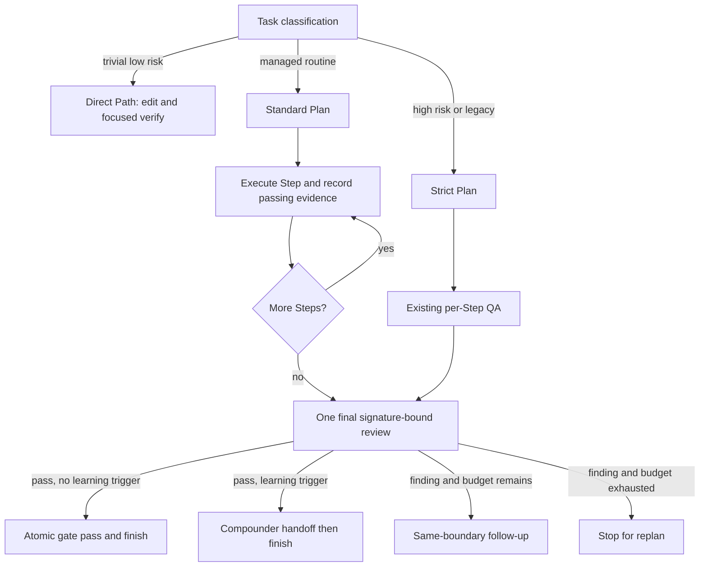

# Spec: Risk-Tiered Workflow Execution

**Task ID**: IMM-RISK-TIERED-EXECUTION-001
**Owner**: Immune-Brain Runtime
**Status**: Approved
**Design risk**: High
**Diagram decision**: required
**Diagram reason**: The change alters execution, QA, review, and finish transitions, so the profile-dependent authority paths need one explicit state diagram.

## 1. Goal

Reduce managed-workflow control overhead without weakening high-risk delivery. The runtime must support a direct path outside Plan state, a standard managed profile with one final independent review, and the existing strict profile for high-risk changes.

## 2. Background

The current managed path applies executor evidence, isolated QA, final review, explicit Compounder handoff, and explicit finish to every Plan. Fast-track compresses interactions but preserves the same gates. Historical Ledger activity shows many more review and handoff transitions than implementation activations, and repeated review follow-ups can dominate delivery time.

Direct Path already exists as a host contract for trivial, low-risk work. This Spec does not add Direct Path state to the Ledger. It makes the managed profiles explicit and removes redundant per-Step QA only when a validated Plan opts into the standard profile.

## 3. Technical Design

### 3.1 Workflow profiles

- `direct` is not a Plan profile. It stays outside `.imm` state and uses edit plus focused verification only.
- `standard` is an explicit Plan Task field. Every Step must have an automated verification signal. Passing structured execution evidence closes the Step without an isolated QA child. The runtime still validates evidence, Git-derived scope, Plan signatures, and workspace freshness.
- `strict` preserves the current behavior. It remains the default when `Workflow profile` is absent, so legacy and existing Plans never silently lose gates.
- A referenced High-risk Spec may only use `strict`.

### 3.2 Standard Step closure

`imm-work record-execution` may automatically apply a machine-owned QA pass only when all of the following hold:

1. the validated immutable Plan declares `Workflow profile: standard`;
2. execution evidence is `passed` and passes existing structured validation;
3. changed files fit declared Scope and the evidence is bound to current Plan and execution-contract signatures;
4. the Step verification contains an automated command signal.

The auto-pass is append-only history with an explicit `decision_source: runtime_standard_profile`. Rework, failed evidence, manual-only verification, follow-up execution, and strict Plans retain existing QA behavior.

### 3.3 Final review and finish

Standard Plans retain the existing changed-files-signature review gate. After the last required review gate passes, the runtime atomically finishes the Plan when no Compounder trigger exists. This combines the review-pass and finish writes under one commit expectation; it does not expand successor authority.

Compounder remains required for strict Plans. It also remains required for standard Plans when any of these deterministic triggers hold:

- the Plan Task field says `Compounder: required`;
- at least two reviewer follow-ups were completed;
- the reviewed change set includes `CONTEXT.md` or a path under `docs/solutions/`.

`Compounder: optional` is valid only for standard Plans and is the standard default. Omitted values preserve strict behavior.

### 3.4 Follow-up budget

Standard Plans permit at most two same-boundary reviewer follow-ups. The checkpoint exposes current round, limit, and exhaustion. A third follow-up cannot be opened. Strict Plans preserve existing behavior because migrations, security, and workflow changes may require additional bounded repair.

Budget exhaustion is not success. The reviewer must route the unresolved finding to replanning or explicit user disposition.

### 3.5 State and compatibility

- No State Ledger schema version change is required. Profile and Compounder policy are read from the immutable `validated_plan_snapshot.task` already stored in the Ledger.
- Plan and execution-contract signatures already include Task fields, so profile edits after activation remain rejected.
- Old Plans without `Workflow profile` behave exactly as `strict`.
- Successor approval, Plan termination, and cross-Plan transition remain literal-user-only operations.

## 4. Requirements

### R1. Validate explicit managed profiles

Plan validation accepts `standard` and `strict`, rejects `direct` and unknown values, requires automated Step verification for standard, and rejects standard when the referenced Spec is High risk.

### R2. Close standard Steps from passing evidence

Passing evidence for a standard Step closes that Step without an `awaiting_qa_decision` checkpoint. Strict Plans and non-passing evidence retain current behavior.

### R3. Preserve one independent final review

A standard Plan cannot finish before every required changed-files-signature review gate passes. Review findings continue through same-boundary follow-up or replan.

### R4. Finish standard Plans atomically when safe

The last review gate pass atomically records the gate and intentional finish when no Compounder trigger applies. It must not write developer insights, invoke Compounder, or activate a successor.

### R5. Make Compounder conditional

Strict Plans always retain the existing explicit Compounder handoff. Standard Plans require it only under the deterministic triggers in section 3.3.

### R6. Bound standard follow-ups

Standard Plans expose a two-round follow-up budget and reject a third same-boundary follow-up without mutating the Ledger.

### R7. Keep host contracts synchronized

`imm-loop`, `imm-work`, `imm-executor`, `imm-qa`, `imm-code-review`, and `imm-compounder` packaged guidance must describe the same profile behavior. Generated dist documentation must remain synchronized.

## 5. Non-goals

- Batch approval or automatic successor activation.
- Parallel active Plans or parallel Ledger mutation.
- Cached QA or review evidence.
- Relaxing scope, signature, Git freshness, migration, or review-gate checks.
- Adding Direct Path records to the State Ledger.
- Automatically classifying high-risk work from filenames alone.

## 6. Acceptance Criteria

1. Legacy and profile-omitted Plans follow the unchanged strict lifecycle.
2. A standard Plan with automated passing evidence closes each Step without isolated QA and reaches final review.
3. A standard Plan cannot skip final code/UI review gates.
4. The last review pass atomically finishes an eligible standard Plan.
5. Compounder triggers prevent auto-finish and surface the existing explicit handoff.
6. A third standard follow-up is rejected without Ledger mutation.
7. Focused runtime, Plan validation, lifecycle, package-sync, and compatibility tests pass.
