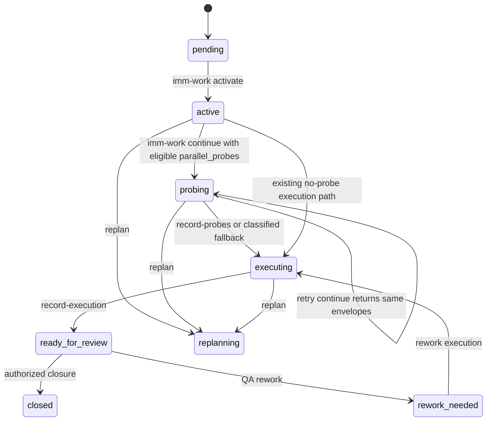

# Spec: TypeScript Work-Probe Lifecycle Repair

**Task ID**: IMM-TS-WORK-PROBE-LIFECYCLE-REPAIR-001
**Owner**: Immune-Brain Runtime
**Status**: Approved
**Design risk**: High
**Diagram decision**: required
**Diagram reason**: The repair restores persisted Step transitions across the runtime, host dispatch boundary, execution evidence path, and interruption recovery. A state diagram is required to make mutation authority and retry behavior explicit.

## 1. Goal

Restore the accepted `parallel_probes` lifecycle in the Bun/TypeScript runtime so an activated Step with planned probes reaches a durable `probing` checkpoint, receives host-produced read-only evidence, advances to `executing`, and exposes that evidence to the executor without relying on conversation memory or provider calls inside the CLI runtime.

## 2. Background

The accepted contract in `docs/specs/imm-work-parallel-probes-runtime.spec.md`, the durable solution in `docs/solutions/contracts.md`, and the shipped `imm-work` and `imm-executor` Skills require `active -> probing -> executing` for Steps carrying `parallel_probes`. The retired Python runtime implemented deterministic probe envelopes, fallback evidence, child evidence normalization, and the Step transitions.

Commit `f9b5e8f` removed the retired Python work-probe helper, work driver, and their behavioral tests during the Bun/TypeScript retirement. The retirement Plan and Spec did not map this contract. The current TypeScript runtime still parses and syncs `parallel_probes`, exposes the `probing` and `executing` states, and accepts `child_evidence`, but `imm-work continue` is read-only and only returns status. There is no production transition into `probing`, and `executing` is only a transient assignment inside `recordExecution()` before `ready_for_review` is written.

The repository's current Ledger contains no `probing` or `executing` entries, but schema v3 and public runtime exports already admit them. The repair therefore treats this as a runtime regression, not as a new workflow model or a reason to delete the states.

## 3. Technical Design

### 3.1 Authoritative lifecycle

The State Ledger remains the sole mutation authority. Host tools may run read-only probes in parallel, but they cannot write Step state or close execution or QA.

For a Step with unconsumed `parallel_probes`, `imm-work continue` persists `active -> probing` before returning a deterministic host-bound dispatch plan. A repeated call while the same Step remains `probing` returns the same probe identities and does not duplicate history or evidence.

A new `imm-work record-probes` mutation ingests structured host results or an explicit fallback classification, validates them against the active Step and expected Ledger revision, persists normalized `child_evidence`, and transitions `probing -> executing`. A Step with probes cannot bypass the checkpoint by recording execution directly from `active` or `probing`. Existing direct execution behavior for Steps without probes and rework targets remains valid.

### 3.2 Deterministic host boundary

Add a TypeScript-owned work-probe module that derives envelopes from immutable Step data. Probe identity is stable for the Plan Step and probe index, and each envelope contains the planned scope, expected output, read-only constraint, advisory-only authority, and the host tool policy required by `docs/reference/subagent-dispatch-protocol.md`.

The module builds and validates data only. It does not import or invoke provider SDKs, the `Agent` tool, or host-specific process APIs. The host executes eligible probes and returns structured results to `imm-work record-probes`. Tests use fake child results.

Reuse current TypeScript advisory vocabulary and configuration resolution where contracts match. Do not port obsolete Python abstractions or provider call shapes merely because they existed before retirement.

### 3.3 Result and fallback ingestion

`record-probes` accepts a structured payload containing the target Step identity, expected Ledger revision, and one result for each planned probe. The runtime derives scope and probe metadata from the immutable Step instead of trusting caller-supplied paths.

Legal normalized outcomes are success, failed, timed out, and fallback. Failure and timeout outcomes carry explicit fallback reasons such as `dispatch_failed` or `child_timeout`. Policy and environment fallbacks include `explicit_required`, `config_disabled`, `host_authorization_required`, and `unavailable_environment` when applicable.

Missing, duplicate, unknown, stale, cross-Step, or scope-conflicting probe identities fail closed. Probe evidence is advisory input only. It cannot satisfy execution verification, close a Standard Step, issue QA pass, mutate the Plan, or expand Scope.

### 3.4 Interruption and replay recovery

The transition to `probing` is committed before host dispatch. If the process or host stops afterward, the persisted state and immutable `parallel_probes` are enough for a later `imm-work continue` call to regenerate the same envelopes without a session ID.

Result ingestion uses existing Ledger lock, revision, and atomic commit primitives. A retry of an already committed identical result returns the recorded outcome without appending duplicate evidence; a conflicting replay fails closed. If a result call succeeded but its response was lost, `imm-work status` exposes `executing` plus the recorded `child_evidence` and routes to the executor.

A `probing` Ledger with already valid probe evidence may recover deterministically to `executing`; ambiguous or malformed evidence requires replanning or an explicit classified fallback rather than inference from free text.

### 3.5 Schema, compatibility, and rollback

No schema version change or project migration is required. Schema v3 already stores `parallel_probes`, `child_evidence`, `probing`, and `executing`. The current repository has no persisted in-progress records requiring one-time conversion.

`imm-work status` remains read-only. `imm-work continue` becomes stateful only when it must enter or recover the probe checkpoint; its command access classification must therefore run through the existing migration and commit protections. Calls with no applicable probe transition remain deterministic and avoid gratuitous writes.

Rollback is code and contract reversion, not data migration. The current runtime already accepts execution evidence from `probing` and `executing`, so an interrupted Ledger can continue sequentially after rollback. The repair must not introduce a new persisted structure required to read schema v3.

### 3.6 Shipped contract truth

The `imm-work` and `imm-executor` packaged contracts must describe the actual TypeScript module, CLI mutations, fallback route, and evidence authority. Thin Skill discovery shims remain unchanged unless their loader-visible boundary becomes inaccurate. `plugins/immune-brain/dist/*.md` Skill contracts are shipped artifacts and are tested directly; they are not generated by `scripts/sync-dist-docs.ts`.

## 4. Requirements

### R1. Restore the TypeScript probe helper

The runtime builds deterministic, provider-free, read-only probe envelopes and normalizes host outcomes and fallbacks.

### R2. Persist the probe checkpoint

An active Step with unconsumed `parallel_probes` reaches a committed `probing` state before host dispatch.

### R3. Provide structured result ingestion

`imm-work record-probes` validates current Step identity, Ledger freshness, complete probe identity coverage, legal outcomes, and fallback reasons before persisting evidence.

### R4. Complete the lifecycle

Valid probe results or an explicit legal fallback persist `child_evidence` and move the Step to `executing`; subsequent execution evidence follows existing profile-bound review and closure semantics.

### R5. Recover without conversation state

Repeated `continue`, interrupted dispatch, lost command responses, and identical result replay are deterministic from the Plan and Ledger alone.

### R6. Prevent authority escalation

Probe children remain read-only and advisory. Probe evidence cannot change code, close a Step, make a QA decision, switch Plans, or alter Scope.

### R7. Preserve current compatibility

No-probe Steps, rework, Standard and Strict profiles, follow-ups, migration checks, and current schema v3 loading preserve their existing behavior.

### R8. Keep package and host surfaces synchronized

CLI help, command manifests, packaged Skills, OpenCode adapters, and package tests expose and describe the same probe lifecycle and structured input shape.

### R9. Prove behavior across process boundaries

Tests must use separate CLI invocations and persisted fixtures to prove state transitions, recovery, stale-result rejection, replay behavior, and executor handoff. Pure helper tests or string-presence assertions are insufficient alone.

## 5. Non-goals

- Running provider calls or host tools inside the TypeScript CLI runtime.
- Parallel Step execution, parallel Plan mutation, or more than one active Plan.
- Adding a generic dispatcher, queue, lease system, session identity, or cross-agent memory.
- Changing Standard or Strict closure authority, QA authority, review gates, or final finish semantics.
- Introducing schema v4 or migrating historical project files without evidence that schema v3 cannot represent the repair.
- Refactoring command dependency bags, `imm_core` exports, or unrelated runtime architecture.

## 6. Acceptance Criteria

1. A schema v3 Step with planned probes reaches persisted `probing` before any host probe result is accepted.
2. Repeated `imm-work continue` calls while `probing` return stable probe identities without duplicate state history.
3. Success, failure, timeout, policy fallback, unavailable-host fallback, stale revision, duplicate, missing, and unknown probe results have deterministic tested outcomes.
4. Accepted results persist normalized `child_evidence` and transition exactly once to `executing`.
5. A Step with unconsumed probes cannot record execution directly from `active` or `probing`; no-probe and rework execution behavior remains compatible.
6. A lost response can be recovered through `imm-work status`, and identical result replay is idempotent while conflicting replay fails closed.
7. Probe evidence cannot close execution or QA and cannot supply caller-controlled Scope authority.
8. `imm-work status` remains read-only; stateful `continue` and `record-probes` use migration, lock, revision, and atomic commit protections.
9. Packaged `imm-work` and `imm-executor` contracts name only production APIs that exist in the TypeScript runtime.
10. Focused runtime, package, adapter, Skill contract, Plan validation, and workspace diagnostics pass.
