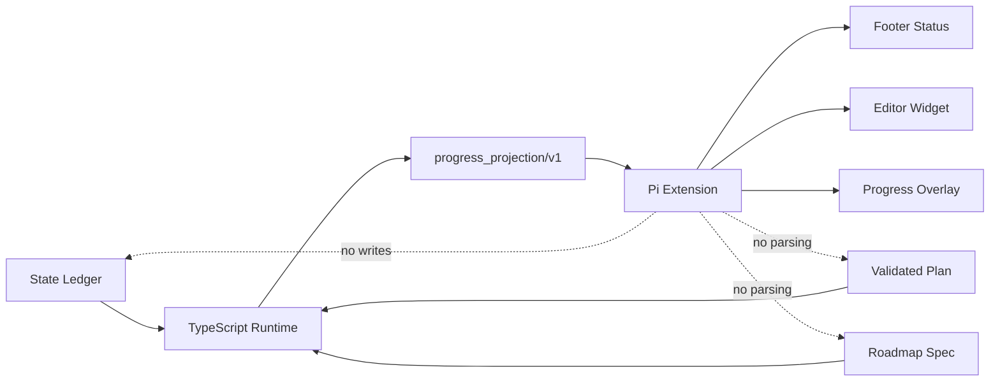

# Spec: Pi Progress Visualization

**Task ID**: IMM-PI-PROGRESS-001
**Owner**: Planner
**Status**: Proposed
**Date**: 2026-08-10

**Design risk**: High

**Design risk rationale**: The initiative introduces a new cross-host read model over State Ledger, Plan, and Roadmap data, then exposes it through a live Pi Extension. Incorrect derivation could present stale or fabricated workflow authority, while host-side persistence could violate session-neutral execution semantics.

**Diagram decision**: required

**Diagram reason**: The authority boundary and one-way data flow from persisted workflow artifacts through a runtime projection into Pi UI must remain visually distinct from workflow mutation paths.

## 1. Goal

Make current Immune-Brain Roadmap, Plan, Step, QA, review, and successor progress visible inside the Pi TUI without creating a second workflow authority or relying on conversation/session memory.

The runtime owns one versioned, read-only `Progress Projection`. The Pi Extension consumes that projection to render a compact footer status, an optional editor widget, and an on-demand `/imm-progress` overlay.

## 2. Accepted Behavior

- A user can see the current Phase, Plan, Step state, blocking gate, and next authority without opening the State Ledger or Plan Markdown.
- `/imm-progress` displays the full declared Roadmap Phase list when its source is available, plus current Plan Steps and gate state.
- The view distinguishes facts such as `closed`, `current`, `successor_candidate`, and `deferred`; it does not infer global Roadmap completion from document order or local Plan closure.
- Repeated reads over identical Plan, Roadmap, and State Ledger bytes return byte-stable JSON.
- Missing or invalid Roadmap sources remain explicit in the projection while current Plan and Step facts remain available.
- State signature drift, invalid current Plan identity, unsupported State Ledger schema, and malformed authoritative state fail closed.
- The same persisted project bytes produce the same progress semantics in the current session, a resumed session, or a new session.

## 3. Requirements

### R1. Versioned Progress Projection

`imm-work progress --json` returns a host-neutral `progress_projection/v1` payload. It contains:

- `contract`: literal `progress_projection/v1`;
- `ledger_revision`: the existing opaque revision derived from normalized State Ledger bytes;
- `workflow`: `runtime_status`, `reset_reason`, `requires_replan`, and `next_action`;
- `plan`: canonical path, summary, current Phase when declared, lifecycle, active Step, closed/total Step counts, and a bounded Step list;
- `roadmap`: declared source, normalized source path, availability, current Phase, successor candidate, ordered declared Phases, display-only acceptance/promotion criteria, and evidence-backed Plan references;
- `gates`: pending follow-up summary, required review gate decisions, and the existing derived `successor_decision` when present.

The payload does not include a generation timestamp, raw session data, full execution evidence bodies, provider responses, or conversation content.

V1 bounds projected Plans to 256 Steps, Roadmaps to 256 Phases, and every human-readable projected field to 8 KiB of UTF-8. An oversized authoritative Plan fails the command with `projection_limit_exceeded`; an oversized optional Roadmap becomes explicitly unavailable with `roadmap_limit_exceeded`. Output is never silently truncated.

### R2. Runtime-Only Derivation

The TypeScript runtime is the sole owner of projection parsing and lifecycle mapping. The Pi Extension must not:

- read or write `.imm/memory/current_iteration.json` directly;
- parse Plan or Roadmap Markdown;
- infer state from transcript text, Todo entries, tool output, session ID, or `HANDOFF.md`;
- persist progress state through `appendEntry`, `sendMessage`, or another host-specific store;
- invoke Plan activation, review, finish, or successor approval commands.

### R3. Truthful Lifecycle Mapping

Plan lifecycle is derived through explicit precedence over authoritative fields:

1. `terminated` when `plan_terminal` records `cancelled` or `superseded` for the canonical current Plan;
2. `replanning` when `requires_replan` is true or the current Step is `replanning`;
3. `follow_up` when `getPendingFollowUp(state)` returns the current pending follow-up;
4. collect the existing `currentPlanStep` candidate set (`active`, `probing`, `executing`, `ready_for_review`, `rework_needed`), require zero or one candidate, then select the sole candidate;
5. `rework_needed`, `ready_for_review`, or `executing` according to that selected Step's exact state;
6. `finished` only when the existing `currentPlanAlreadyFinished(state)` predicate passes, including all Steps closed, `intentional_reset`, and the latest `finish_reset.details.plan_path` matching the canonical current Plan;
7. `closed` when every current Plan Step is `closed` but the finish predicate is false;
8. `pending` when the validated current Plan has pending Steps but no active-like Step;
9. `idle` when no executable Plan facts are available.

Closed and pending Step records do not compete with the selected active-like Step. More than one active-like Step record is malformed authoritative state and fails the progress command with `ambiguous_current_step` instead of choosing a presentation-only winner. Tests include closed-plus-active, stale non-matching `finish_reset`, and multiple-active-like fixtures.

The projection preserves exact Step states. It may count Steps and execution attempts, but it must not estimate elapsed percentage, remaining time, or equal weighting across Steps or Phases.

### R4. Roadmap Source and Phase Evidence

For a declared Roadmap source, runtime first rejects absolute paths, traversal, NUL bytes, and non-Markdown paths. It resolves the project root and candidate with canonical identities, requires the canonical candidate to remain beneath the canonical project root, and rejects a symlink in every lexical path component. Runtime opens and reads through the canonical path, captures the opened file's device/inode identity, then repeats canonical containment plus device/inode checks before exposing parsed content so a check/use retarget is discarded rather than projected.

The parser reuses the existing Roadmap Phase grammar from `plan_core.ts`. Static document order is display order only. `acceptance_criteria` and `promotion_criteria` are display-only strings and are not evaluated by the progress command.

Each Phase receives a deterministic `relations` array drawn only from explicit facts:

- `current`: the current Plan declares the Phase;
- `successor_candidate`: the current Plan declares the candidate under a supported contract;
- `transition_recorded`: a matching append-only transition names the Phase;
- `deferred`: the Phase exists in the Roadmap without any of the preceding relations.

Relations may coexist; for example, a current Phase may also be named by an earlier transition. A transition relation is not a completion claim. A Phase may expose a Plan reference and Plan lifecycle only when current Plan, archive, termination, or transition evidence identifies that Plan. Runtime never infers completion from Phase order.

For a legacy Plan without a Roadmap source, `roadmap` is `null`. For a declared but unavailable or malformed source, `roadmap.availability` is `unavailable` with a stable error code and no fabricated Phase list. When a valid Roadmap is available but current/successor metadata names no declared Phase, availability remains `available`, all unaffected Phase relations remain evidence-backed, and `roadmap.diagnostics` includes `phase_unmapped` for the exact field; no synthetic `unmapped` Phase is created.

### R5. Read-Only and Deterministic Command Behavior

`imm-work progress` is classified as read access by project migration routing. It validates the current Plan and signature with the same fail-closed boundary as `imm-work status`.

The command never mutates State Ledger, Plan, Roadmap, HANDOFF, session files, agent-local inboxes, or host configuration. Fresh-process tests run against isolated project and agent-local roots, recursively snapshot the complete prohibited target sets before and after success/failure, and compare relative file sets, file types, symlink targets, and content hashes. New temporary, lock, cache, or inbox files fail the assertion. Access times and directory modification times are explicitly outside this semantic no-write check.

Existing `imm-work status --json` output remains backwards compatible. The new projection is a separate subcommand so raw status consumers do not receive an unversioned payload expansion.

### R6. Pi TUI Surfaces

The Pi Extension consumes `imm-work progress --json` through `pi.exec` and renders:

- `ctx.ui.setStatus`: one compact always-available status item;
- `ctx.ui.setWidget`: a bounded multi-line summary near the editor when work is active, blocked, or awaiting review;
- `ctx.ui.custom(..., { overlay: true })`: an on-demand `/imm-progress` Roadmap/Plan/Gates view.

It does not replace the full footer with `setFooter`. It uses Pi theme colors and width-aware truncation, preserves editor dimensions, and keeps overlay navigation keyboard-accessible.

The default view uses semantic labels and Step counts rather than percentages or ETA.

The status item is present for every successful lifecycle and for adapter errors. The Widget is present only for `executing`, `ready_for_review`, `rework_needed`, `replanning`, and `follow_up`, plus explicit adapter or watcher errors; it is cleared for `pending`, `terminated`, `closed`, `finished`, and `idle`. The Overlay uses Left/Right or Tab/Shift+Tab to switch Roadmap, Plan, and Gates sections, Up/Down plus PageUp/PageDown to navigate bounded rows, and Escape to close.

### R7. Refresh, Error, and Cleanup Semantics

The Extension performs an initial read on `session_start`, then refreshes after relevant `tool_execution_end` and `agent_settled` events. It watches the `.imm/memory` directory rather than only one file so atomic replacement is detected, and it debounces concurrent refresh signals.

External watchers, timers, and pending refresh work are disposed on `session_shutdown`. UI keys are removed during cleanup.

The installed `@earendil-works/pi-coding-agent` API baseline is `0.84.1`. The `session_start` handler returns before process execution, watcher startup, or UI registration unless `ctx.mode === "tui"`. Refresh is single-flight: triggers coalesce behind one bounded debounce, an in-flight `pi.exec` receives an Extension-owned abort signal, and a disposed or superseded generation cannot publish UI. The watcher records the `.imm/memory` directory identity; a rename/error or later Pi refresh trigger performs one bounded identity check and reattachment attempt, publishing an explicit error while the directory is absent. This recovery never polls. The controller owns at most one live Overlay; a repeated `/imm-progress` invocation disposes the previous instance before replacing it. Operational failures from Pi event, command, watcher, render, or cleanup handlers are contained as bounded UI errors so the agent process can continue. Shutdown is idempotent and clears the status and Widget keys after aborting pending work and closing the watcher.

Projection failures are visible. The footer/widget shows an error state and the overlay exposes the stable error message. The Extension does not silently retain an older successful projection as current truth.

Non-interactive and RPC modes perform no UI work and preserve command behavior.

### R8. Package and Compatibility Contract

The root Pi package registers the Extension in its existing `pi` manifest while retaining the existing Skills registration and peer dependency contract. The Extension resolves the package-local TypeScript runtime from its own module location and invokes Bun without shell interpolation.

Because the Overlay and width-aware renderers import Pi TUI primitives directly, the root package declares `@earendil-works/pi-tui` as a peer dependency alongside `@earendil-works/pi-coding-agent`; no bundled or second Pi runtime is introduced.

Existing Plans, State Ledger schema v3 files, host adapters, wrappers, OpenCode tools, and Pi Skills require no migration. Other hosts may consume `progress_projection/v1` later, but this initiative adds no host-specific UI outside Pi.

## 4. Non-Goals

- No workflow mutation buttons, successor activation control, QA decision control, or automatic Plan continuation.
- No persisted UI cache, Session tree milestone records, conversation entries, or session-dependent rehydration.
- No Web dashboard, browser server, telemetry service, database, queue, scheduler, or new workflow state machine.
- No percentage complete, ETA, Phase weighting, or inference from Roadmap order.
- No replacement of existing `imm-work status --json` consumers.
- No live vendor-host acceptance claim beyond the shipped Pi package and executable extension contract.
- No UI implementation in Phase P1.

## 5. Technical Design

### 5.1 Authority and Data Flow



The dashed edges are prohibited behavior, not alternate data paths.

### 5.2 Runtime Components

| Component | Responsibility |
| --- | --- |
| `runtime/progress_projection.ts` | Define `progress_projection/v1`, normalize Roadmap references, derive bounded lifecycle/gate/Phase facts, and enforce deterministic output. |
| `runtime/commands/work.ts` | Route `imm-work progress`, serialize the projection, and preserve failure exit semantics. |
| `runtime/immune_brain_runtime.ts` | Register the subcommand, classify it as read-only, and inject existing parser/Ledger helpers. |
| `runtime/imm_core.ts` | Export the focused projection module through the existing public runtime barrel. |
| Focused runtime tests | Prove state mapping, Roadmap handling, deterministic no-write behavior, and command/package compatibility. |

The projection module is pure over a normalized State Ledger plus explicitly loaded current Plan/Roadmap inputs. Filesystem resolution is bounded at the runtime edge. It must not mutate passed objects or return aliases to mutable Ledger containers.

### 5.3 Progress Projection Shape

The implementation owns an exported TypeScript type for the v1 payload. The minimum structural shape is:

```json
{
  "contract": "progress_projection/v1",
  "ledger_revision": "<sha256>",
  "workflow": {
    "runtime_status": "idle",
    "reset_reason": "intentional_reset",
    "requires_replan": false,
    "next_action": null
  },
  "plan": {
    "path": "docs/plans/example.md",
    "summary": "Example",
    "phase": "P1",
    "lifecycle": "finished",
    "active_step": null,
    "closed_steps": 1,
    "total_steps": 1,
    "steps": []
  },
  "roadmap": null,
  "gates": {
    "pending_follow_up": null,
    "reviews": [],
    "successor_decision": null
  }
}
```

The concrete v1 type may add bounded evidence-reference fields needed by the overlay. It may not expose arbitrary top-level Ledger extensions, raw evidence notes, full changed-file lists, environment values, or session data. The implementation exports and enforces the v1 limits from R1; it does not truncate lists or strings into apparently complete facts.

### 5.4 Roadmap Reference Normalization

Existing authoring may declare a source as a backtick path followed by the label `Roadmap`. Runtime extracts the backtick-delimited path when present; otherwise it accepts one plain project-relative Markdown path with an optional trailing `Roadmap` label. The original declared value remains available for diagnostics, while matching uses a normalized project-relative path and the existing normalized Roadmap identity used by transition records.

An invalid path produces `source_invalid`; a missing file produces `source_missing`; malformed Phase grammar produces `roadmap_invalid`; oversized Roadmap content produces `roadmap_limit_exceeded`; and current/successor metadata that cannot match a declared Phase produces an available Roadmap plus `phase_unmapped` diagnostics. These codes remain presentation diagnostics and create no workflow state.

### 5.5 Pi Extension Components

Phase P2 adds a thin host adapter under `plugins/immune-brain/.pi-extension/` with three layers:

1. `progress_client.ts`, a process adapter that resolves the package-local runtime and validates required `progress_projection/v1` fields before exposing a bounded clone to views;
2. `progress_views.ts`, pure status, Widget, and Overlay formatters plus the keyboard-navigable Overlay component;
3. `index.ts`, a lifecycle controller that owns Pi events, refresh debounce, single-flight execution, directory watch, UI registration, and cleanup.

The overlay supports close, vertical navigation, and section switching without adding mutation commands. The Extension keeps only the latest in-memory rendering input; this cache has no authority and is replaced by an explicit error state after failed refresh.

The process adapter invokes `bun` with an argument array targeting `runtime/immune_brain_runtime.ts cli imm-work progress --json`, a timeout, and the controller's abort signal. It rejects non-zero exits, invalid JSON, a non-`progress_projection/v1` contract, or malformed required fields. Unknown additive fields do not become host authority and are ignored. The runtime's normal write path atomically renames authority files inside a stable `.imm/memory` directory; watcher startup or directory-identity failure is an explicit UI error, with reattachment attempted only on watcher or Pi refresh events.

### 5.6 Compatibility, Interruption, and Rollback

Phase P1 is additive. Reverting `progress_projection.ts`, command wiring, focused tests, and the `CONTEXT.md` map entry removes the feature without State Ledger migration. Existing `status` output remains unchanged.

If Phase P1 stops midway, unregistered code has no runtime effect; tests must fail until the command, manifest, and package wrapper behavior agree. No partial write repair is needed.

Phase P2 can be rolled back by removing the Extension registration, adapter/view files, and focused tests. The runtime projection remains a valid host-neutral read API. A crashed or reloaded Pi session loses only transient UI objects and reconstructs from the next runtime read.

## 6. Verification Strategy

### Runtime Contract

- Fixture tests cover legacy, pending, active, probing, executing, ready-for-review, rework, replanning, follow-up, terminated, closed, and finished states, including closed-plus-active, ambiguous active-like, and stale finish evidence.
- Roadmap fixtures cover valid phases, overlapping current/candidate/transition relations, missing source, traversal, outside-root resolution, final-component symlink, symlinked parent, pre/post-read identity mismatch, invalid grammar, item/text limits, and phase mismatch.
- Tests prove acceptance/promotion criteria are displayed but never evaluated.
- Fresh-process recursive snapshots prove successful and failing reads preserve complete prohibited file sets, file types, symlink targets, and content hashes without new temp/lock/cache/inbox artifacts.
- Repeated projections over identical bytes are deep-equal and serialized byte-equal.
- Existing status, progression, command manifest, and package wrapper suites remain green.

### Pi Extension Contract

- Mock Pi contexts prove status/widget/overlay registration, compact/error/idle rendering, event-driven refresh, debounce, and cleanup.
- Process-adapter tests reject wrong contract versions, malformed JSON, non-zero runtime exits, and package-local runtime resolution failures.
- Width fixtures prove narrow terminals truncate safely without resizing the editor or overlapping rows.
- Lifecycle tests prove non-TUI modes start no process or watcher, concurrent triggers stay single-flight, directory identity changes reattach without polling, handler failures do not escape into the agent, watcher failures replace stale success with an error, and shutdown aborts work, closes resources once, clears UI keys, and blocks late publication.
- Package tests use an isolated `PI_CODING_AGENT_DIR` local-package install to prove Extension registration and existing Skill discovery survive the actual Pi package resolver.
- Source authority tests reject Extension reads of workflow files, Pi Session trees or IDs, `appendEntry`, shell interpolation, or workflow commands other than the exact Progress Projection invocation.
- A human TUI acceptance pass confirms the overlay opens, navigates, closes, repeated invocation replaces the prior instance, refreshes after a real Ledger change, and restores UI state after `/reload`.

### Design Conformance

QA compares implementation against the one-way authority diagram, v1 payload contract, no-write guarantees, lifecycle precedence, and explicit Roadmap failure behavior. A local mismatch routes to `rework`; any proposal to persist host state, change workflow authority, parse Markdown in Pi, or alter the projection contract structurally routes to Planner.

## 7. Roadmap

### Phase P1: Host-neutral Progress Projection

**Goal**: Runtime clients can read one deterministic, versioned representation of current Roadmap, Plan, Step, and gate facts without state mutation.

**acceptance_criteria**:

- `imm-work progress --json` returns `progress_projection/v1` for current schema v3 projects.
- Lifecycle mapping covers active, review, rework, replan, follow-up, terminated, closed, and finished boundaries through explicit evidence.
- Valid Roadmap sources expose ordered Phases and display-only criteria; unavailable sources expose stable diagnostics without fabricated progress.
- Repeated success and failure reads leave authority files unchanged.
- Existing `imm-work status`, command manifest, package wrapper, and progression tests remain compatible.

**promotion_criteria**:

- The P1 Plan passes focused runtime, package, progression, Plan validation, and repository hygiene checks.
- Independent QA and required code review accept the exact v1 schema, lifecycle precedence, path safety, and no-write evidence.
- The projection API is stable enough for a translation-only Pi consumer.

**candidate next Plan**: Phase P2 Pi TUI visualization.

**deferred**:

- Pi package manifest changes.
- Footer, Widget, Overlay, file watch, refresh debounce, and TUI acceptance.
- UI preferences or additional host consumers.

### Phase P2: Pi TUI Visualization

**Goal**: Pi users can continuously inspect compact current progress and open a complete Roadmap/Plan/Gates overlay backed only by `progress_projection/v1`.

**acceptance_criteria**:

- The root Pi package loads the Extension while retaining existing Skill discovery.
- Footer status, bounded Widget, and `/imm-progress` Overlay render current, blocked, review, error, and idle states.
- Runtime events plus a debounced `.imm/memory` directory watcher refresh the display without polling conversation state.
- `session_shutdown` disposes every watcher, timer, component, and UI key.
- Tests and human TUI acceptance prove no workflow command is invoked except the read-only progress command.

**promotion_criteria**:

- Phase P1 is closed with the exact `progress_projection/v1` contract.
- Pi Extension API behavior is rechecked against the installed `@earendil-works/pi-coding-agent` version before implementation.
- Automated adapter/view/lifecycle tests plus one human TUI acceptance pass succeed.

**candidate next Plan**: none.

**deferred**:

- Web dashboards, telemetry, other host UIs, mutation controls, progress estimation, and persisted UI preferences.

## 8. Full Roadmap Acceptance

- Pi presents current Roadmap, Plan, Step, and gate state without reading conversation memory or becoming a Ledger writer.
- Runtime projection remains deterministic, versioned, bounded, and explicitly fail-closed around authoritative state.
- Roadmap display never claims global completion or evaluates acceptance criteria without explicit workflow evidence.
- Existing CLI, State Ledger, Plan, host, and package behavior remains compatible.
- The user retains sole authority over Plan creation, successor approval, QA/review decisions, execution, and session lifecycle.
