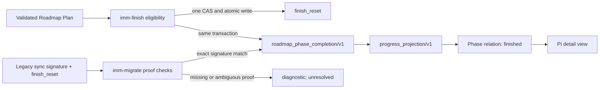

# Roadmap Finished Phase Evidence Spec

**Task ID**: IMM-ROADMAP-FINISHED-PHASE-001
**Owner**: Planner
**Status**: Proposed
**Date**: 2026-08-11

**Design risk**: High

**Design risk rationale**: The change adds persisted authority data, extends a host-neutral projection vocabulary, introduces a current-schema migration, and changes a user-visible workflow label. False-positive completion is more damaging than retaining `deferred`, so every uncertain migration path fails conservative.

**Diagram decision**: required

**Diagram reason**: The same output relation can originate from future atomic finish recording or one-time signed-history migration, while successor and transition evidence stay independent. A diagram makes those authority boundaries and the fail-conservative branch clearer than prose alone.

## Purpose

Make completed Roadmap Phases remain explicitly identifiable after their Plan is finished and another Plan is synchronized, so `imm-work progress --json` and Pi never mislabel a proven completed Phase as `deferred`.

## Context

`progress_projection/v1` currently derives Phase relations from the current Plan, successor declaration, `closed_plan_history`, and `plan_transition_history`. A normal `imm-finish` records only `finish_reset.details.plan_path`. If the operator later uses ordinary `imm-plan --sync` rather than an explicit Roadmap transition, the prior validated Plan snapshot is replaced and no Phase-scoped completion fact survives. The projection therefore applies its truthful fallback, `deferred`, even though the generic Ledger history proves that the Plan finished.

The observed repository state contains exactly this case: P1 has a signature-bearing `sync_plan_from_imm_plan` history entry and a matching `finish_reset`, but no closed Plan archive or transition record. P2 is current and finished. The Pi detail view faithfully renders P1's projected fallback relation, which is semantically misleading to a human reader.

This repair is a new maintenance contract. It does not modify the closed P1/P2 Plans or the historical Pi Progress Visualization Spec.

## Requirements

### R1. First-Class Completion Evidence

State Ledger schema v3 admits an optional append-only `roadmap_phase_completion_history` collection. Every item is a bounded `roadmap_phase_completion/v1` record containing:

- `contract`: literal `roadmap_phase_completion/v1`;
- `completion_id`: a deterministic content identity;
- canonical project-relative `plan_path`;
- exact validated `plan_signature`;
- the Plan-declared `roadmap_source`;
- stable Plan-declared `phase` identifier;
- authoritative `finished_at` from the successful finish operation;
- `provenance`: `runtime_finish` or `signed_history_migration`.

`completion_id` is derived from a domain separator plus `plan_path`, `plan_signature`, normalized Roadmap source, Phase identifier, and `finished_at`. Equal facts produce an equal ID. Duplicate IDs with non-identical bytes are malformed authority state.

The record proves only that the identified Roadmap Phase's signed Plan finished. It does not prove a successor decision, promotion, activation, or transition.

### R2. Atomic Future Finish Recording

A successful `imm-finish` for a validated Plan that declares both `Roadmap source` and `Current phase` appends exactly one completion record in the same Ledger CAS and atomic write as `finish_reset` plus `intentional_reset`.

The record is derived exclusively from the validated Plan snapshot already bound to the State Ledger. Caller text, current Markdown rereads, session state, UI state, document order, timestamps from another event, and successor guesses are forbidden inputs.

A finish without a contracted Roadmap slice keeps its existing behavior and does not fabricate a completion record. A stale CAS, failed eligibility check, malformed snapshot, or failed commit exposes neither the reset nor the completion record. Existing duplicate-finish rejection remains unchanged.

### R3. Typed Validation And Compatibility

New empty State Ledgers initialize `roadmap_phase_completion_history` to `[]`. Existing schema-v3 Ledgers without the optional collection remain readable and normalize to an empty collection; this additive field does not require schema v4.

When the collection is present, runtime validation fails closed for:

- non-array values;
- unknown record contracts;
- empty, oversized, absolute, escaping, or non-canonical Plan paths;
- missing or oversized signatures, Roadmap sources, Phase identifiers, timestamps, or provenance;
- duplicate `completion_id` values;
- a `completion_id` that does not match the normalized record content.

Legacy Ledgers are never treated as completed merely because this optional collection is absent.

### R4. Explicit Historical Migration

`project_migration.ts` remains the sole interpreter of historical completion evidence. It detects a recoverable historical Roadmap finish only when all of the following hold:

1. an unmatched `finish_reset` contains a canonical project-relative `plan_path` and authoritative timestamp;
2. the nearest applicable prior `sync_plan_from_imm_plan` for that exact path contains a non-empty `plan_signature`;
3. the referenced Plan file is contained within the project, is a regular non-symlink file, and validates under the current Plan parser;
4. recomputing the Plan signature produces the exact recorded signature;
5. the signed Plan declares both `Roadmap source` and `Current phase`;
6. no equal completion record already exists.

A recoverable record is appended with provenance `signed_history_migration`; the old `finish_reset`, sync history, Plan, and Spec remain byte-unchanged. Detection is read-only. Explicit migration uses the existing content-addressed backup, journal, lock, atomic replacement, interrupted-run recovery, and post-migration revision guard.

Missing files, signature drift, ambiguous sync matches, invalid Plan content, or missing Roadmap identity never produce completion evidence. `imm-migrate --check --json` reports those skipped candidates as diagnostics while leaving the project runnable and the affected Phase unresolved. Repeated check and migration operations are deterministic and idempotent.

This migration path is permanent data-format ownership, not a temporary runtime compatibility reader. Projection code consumes only current completion records and never reconstructs legacy evidence itself.

### R5. Finished Projection Relation

`progress_projection/v1` adds the relation value `finished` to each declared Roadmap Phase with a valid completion record whose normalized Roadmap source matches the currently projected Roadmap and whose Phase identifier matches the declared Phase exactly.

The projection also adds a bounded `plan_ref` with source `phase_completion`, the recorded Plan path, and lifecycle `finished`. It does not reread historical Plan files.

Relation ordering is deterministic:

1. `current`;
2. `finished`;
3. `successor_candidate`;
4. `transition_recorded`.

Relations may overlap because they describe independent explicit facts. For example, the current Phase may also be finished, and a finished predecessor may also have a recorded transition. `deferred` is emitted only when no explicit relation applies. Phase document order never supplies completion evidence.

A malformed completion collection fails the command rather than silently dropping authority facts. A well-formed record for another Roadmap source is ignored for the current Roadmap projection.

### R6. V1 Consumer Compatibility

The literal projection contract remains `progress_projection/v1`. `finished` is an additive value inside the existing bounded `string[]` relation field; field shape, existing values, lifecycle enums, bounds, and no-write behavior remain unchanged.

The Pi progress client continues accepting bounded relation strings without an exhaustive enum. Its existing generic relation renderer displays `finished` without adding a second completion inference path. Unknown additive relation strings remain parseable so tolerant v1 consumers do not reject the payload.

### R7. Current Incident Acceptance

A fixture matching the current P1/P2 history is migrated from signed P1 sync plus P1 `finish_reset` evidence. After migration:

- P1 has relation `finished` and a lifecycle-`finished` Phase completion reference;
- P1 does not have the fallback relation `deferred`;
- P2 remains `current` and `finished` when its own completion record exists;
- the Pi Roadmap section renders P1 as `finished`;
- repeated projection calls are byte-deterministic and perform zero writes.

The real workspace migration is executed only after the implementation is integrated and under explicit `imm-migrate` authority. Tests and UI Review use isolated copied Ledgers so planning and QA do not mutate the primary historical evidence.

## Technical Design

Completion, successor candidacy, and transition remain separate evidence types. The projection merges their relations without promoting one fact into another.

## Non-goals

- Inferring completion from Roadmap order, Phase names, Plan filenames, Git history, conversation history, cached QA, or UI output.
- Treating a signed Plan alone as completion evidence.
- Synthesizing successor, promotion, transition, or activation records.
- Rewriting historical `finish_reset`, sync history, closed Plans, closed Specs, or signed Plan content.
- Changing Plan lifecycle, Step closure, QA, review gate, transition, or `imm-work status --json` semantics.
- Adding a second Pi-side Ledger reader or Markdown parser.
- Correcting unrelated Roadmap criteria parsing or presentation-document drift.
- Introducing schema v4 solely for one additive optional collection.

## Acceptance Criteria

1. Future Roadmap-backed finishes atomically persist one deterministic completion record; failed or stale finishes persist none.
2. Non-Roadmap finishes remain byte-compatible apart from normalized optional collection defaults introduced by a later write.
3. Migration recovers only exact signed Plan plus finish-reset pairs and is check-only, journaled, rollback-safe, idempotent, and non-destructive.
4. Missing, ambiguous, moved, symlinked, or signature-mismatched historical Plans never become completed.
5. `progress_projection/v1` emits deterministic `finished` relations and Phase completion references without writes or historical Plan reads.
6. Explicitly unrelated Phases remain `deferred`; document reordering does not alter relation assignment.
7. Existing v1 payloads remain accepted by the Pi client, and Pi displays the literal `finished` relation.
8. A P1/P2 incident fixture migrates to `P1 finished`, `P2 current + finished`, with no fallback `deferred` on P1.
9. Fresh focused tests, strict TypeScript checks, Plan validation, migration interruption tests, Code Review, and UI Review pass against the final changed-file signature.
