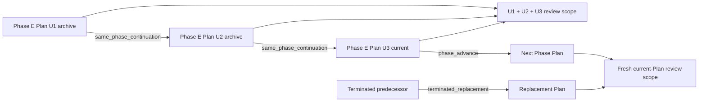

# Spec: Roadmap Same-Phase Plan Continuation

**Task ID**: IMM-ROADMAP-CONTINUATION-001
**Owner**: Planner
**Status**: Proposed
**Date**: 2026-08-13

**Design risk**: High
**Design rationale**: The change modifies approved Plan transition eligibility and the changed-files set that authorizes final code/UI review. A false continuation could bypass Roadmap phase authority or inherit unrelated historical evidence; a missed continuation can leave one Roadmap Phase without a legal executable successor or a cumulative review signature.

**Diagram decision**: required
**Diagram reason**: The distinction between same-Phase continuation, Phase advance, and terminated replacement determines both transition eligibility and review-evidence inheritance and is clearest as a state/data-flow diagram.

## 1. Goal

Allow one Roadmap Phase to be implemented by multiple sequential, independently closable Plans while preserving the existing meaning of `Successor candidate` as the next Roadmap Phase. Same-Phase continuation must carry the Phase's cumulative changed-file review scope across immutable closed-Plan archives; Phase advances and terminated replacements must start a fresh review scope.

## 2. Current Failure

`roadmap-slice/v1` correctly rejects `Successor candidate == Current phase`, because the candidate names a future Roadmap Phase rather than a Plan. However, approved transition runtime currently accepts a finished predecessor only when its candidate equals the successor Plan's `Current phase`. A Phase split into U1, U2, and U3 Plans therefore has no legal U1-to-U2 transition if every Plan truthfully declares the same current Phase and the same future candidate.

The State Ledger already archives each finished predecessor and records every approved transition, but `collectReviewChangedFiles` reads only current Plan Steps plus marker-visible current follow-ups. Even if same-Phase activation were allowed, final review would omit prior Plans in the same Phase.

## 3. Technical Design

### 3.1 Metadata semantics

`roadmap-slice/v1` Plan validation remains unchanged:

- `Current phase` names the Roadmap Phase implemented by the Plan.
- `Successor candidate` names the next Roadmap Phase, or `none` for a terminal Phase.
- A candidate equal to the current Phase remains invalid.

A finished predecessor may activate a distinct successor Plan when both Plans share the same Roadmap source and either:

1. the successor `Current phase` equals the predecessor `Current phase` and both Plans declare the same `Successor candidate`; or
2. the successor `Current phase` equals the predecessor `Successor candidate`.

Terminated replacement keeps its existing explicit-user semantics and does not become continuation authority.

### 3.2 Explicit transition kind

Every newly committed approved transition records one `transition_kind`:

- `same_phase_continuation`: finished predecessor and successor share `Current phase`, preserve the same candidate, and share Roadmap source;
- `phase_advance`: finished predecessor candidate equals successor `Current phase`;
- `terminated_replacement`: the predecessor was explicitly terminated by the user under the existing replacement rules.

The kind is derived and revalidated under the State Ledger write lock. Caller input cannot select it. Existing transition records without `transition_kind` remain readable and are treated as legacy non-continuations for review inheritance. Unknown values or a kind inconsistent with persisted Phase facts fail closed.

### 3.3 Cumulative review projection

`collectReviewChangedFiles` continues to collect current closed Steps and marker-visible current closed follow-ups. It additionally walks the unique incoming transition chain from the current Plan while each edge is explicitly `same_phase_continuation`.

For every traversed edge, runtime resolves `predecessor_archive_ref`, verifies that the archive path/signature matches the transition declaration, and unions changed files from the archive's closed Steps and closed follow-ups. Traversal stops at the first `phase_advance`, `terminated_replacement`, or legacy edge without a kind. Duplicate incoming edges, missing/mismatched archives, cycles, or malformed evidence boundaries fail closed rather than silently dropping review scope.

Review gates remain keyed to the normalized cumulative changed-files signature. Transition activation still clears `review_state`, so every continuation Plan requires a fresh review over the enlarged cumulative set. Phase advance and terminated replacement retain the existing current-Plan-only review scope.

### 3.4 Compatibility and persistence

- State Ledger schema remains v3; no migration or historical rewrite is required.
- Existing archives and transition records remain byte-preserved.
- Legacy transitions without `transition_kind` keep their existing v1 transition IDs, do not gain inferred review authority, and are not rehashed.
- Legacy closed follow-ups whose `execution_evidence` is `null` (a schema-legal historical form, e.g. debug closures) contribute no changed files and never block projection; evidence that is present but whose `changed_files` is not an array fails closed as malformed.
- New explicit-kind transitions use the domain-separated `immune-brain-transition-id/v2` identity over the predecessor archive reference, derived kind, canonical predecessor/successor Plan identity and signatures, both Phase/candidate facts, normalized Roadmap source, termination fact, and approved Ledger revision.
- Validation and activation timestamps remain audit evidence outside identity; changing any immutable authority fact changes or invalidates the v2 ID.
- `review_follow_up_start_index`, follow-up history, revision hashing, approval CLI grammar, explicit literal-user authority, and append-only transition behavior remain unchanged.

### 3.5 Interruption, rollback, and security

The existing lock-time reread, revision comparison, and atomic commit boundary owns `transition_kind`, archive append, transition append, and successor installation. Any metadata drift or malformed chain rejects without a State Ledger write.

Rollback removes the new runtime projection and tests as one coherent change. Persisted records with `transition_kind` remain harmless unknown fields to prior schema-v3 readers because normalization preserves unknown fields; those readers keep current-Plan-only review behavior. Rollback must not delete transition/archive history or rewrite closed Plans.

Closed execution evidence is authority-bearing input. Runtime never trusts a caller-supplied continuation flag, never infers continuation from Phase equality in legacy history, and never copies arbitrary archive fields into review scope.

## 4. Requirements

### R1. Legal same-Phase transition

- A finished, reviewed `roadmap-slice/v1` predecessor may activate a distinct validated successor with the same Roadmap source, same `Current phase`, and same `Successor candidate`.
- Candidate drift, Plan identity reuse, stale revision, incomplete closure, missing review, and lock-time metadata drift reject without persistence.
- Existing Phase-advance behavior remains valid.

### R2. Explicit kind and identity integrity

- New transitions persist exactly one derived transition kind and a v2 integrity ID covering all immutable transition authority facts.
- Lock-time reconstruction produces the same kind and identity as pre-lock validation.
- Existing kind-less records remain readable, retain their v1 IDs, and remain non-inheriting; closed targets with `null` execution evidence contribute nothing while malformed evidence still fails closed.
- Unknown or Phase-inconsistent kinds, incomplete explicit authority facts, or v2 identity mismatches fail closed.

### R3. Cumulative same-Phase review

- A current continuation Plan's review files equal current closed evidence plus all closed archive evidence along its contiguous explicit same-Phase chain.
- Multi-hop U1-to-U2-to-U3 continuation produces the deduplicated union of U1, U2, and U3 paths.
- Every continuation clears old review passes and requires a fresh pass for the cumulative signature.

### R4. Isolation controls

- Phase advance starts a fresh review scope.
- Terminated replacement starts a fresh review scope.
- Legacy kind-less transition history starts a fresh review scope.
- Malformed archive linkage, duplicate incoming transitions, and cycles fail closed.

### R5. Contract documentation

- Canonical vocabulary and planning-quality guidance state that a Phase may span sequential Plans, while `Successor candidate` remains the next Phase rather than the next Plan.
- No guidance asks planners to set a self-successor or rewrite a finished predecessor.

## 5. Non-Goals

- No `roadmap-slice/v2`, schema v4, Plan queue, DAG, parallel active Plan, automatic activation, or session controller.
- No change to literal-user approval, transition CLI flags, Plan validator self-successor rejection, review gate classification, or changed-file hashing.
- No rewrite or rehash of legacy v1 transition IDs; only new explicit-kind records use the v2 identity algorithm.
- No automatic repair or backfill of old transition kinds.
- No mutation of closed Plan Markdown, archived evidence, or downstream project ledgers.
- No content-digest review freshness redesign; this slice preserves the existing path-signature review model.

## 6. Acceptance Criteria

- A three-Plan fixture in one Roadmap Phase activates U1-to-U2-to-U3 through explicit user-approved transitions while every Plan retains the same future Phase candidate.
- U3 review requires the normalized union of U1, U2, and U3 changed files.
- A subsequent Phase advance installs a fresh review scope.
- Candidate drift, malformed continuation history, and any explicit transition integrity mismatch fail closed with byte-identical State Ledger state.
- Terminated replacement and legacy transition fixtures do not inherit predecessor review paths.
- Existing Plan validation, transition, review lifecycle, autowork, finish, migration, package runtime, and full repository tests pass.
