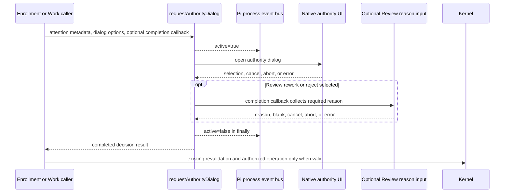

# Spec: Authority Dialog Attention Ownership

**Task ID**: `2026-08-23-001-authority-dialog-attention-ownership`
**Owner**: user
**Status**: Candidate
**Design risk**: High
**Design risk rationale**: This change moves ownership of a process-local event lifecycle across the shared dialog module and every Enrollment and Work authority caller. It must preserve cancellation, abort, UI-error, follow-up input, and Kernel authority behavior while changing an externally observed event contract.

**Diagram decision**: required
**Diagram reason**: The shared dialog, optional Review reason input, event bus, caller, and Kernel have distinct lifecycle and authority ownership that a sequence diagram makes explicit.

## Summary

Every extension-owned user decision is externally observable through exactly one bounded `immune-brain:user-attention.v1` lifecycle. The shared authority-dialog boundary owns event opening and cleanup by construction, including the optional Review rework or rejection reason input. Ordinary Agent chat remains outside this extension protocol.

## Origin

The upstream Brainstorm manifest was confirmed in the current session:

- `BR-REQ-1`: Every extension-owned user decision notifies external adapters.
- `BR-REQ-2`: Each decision emits `active: true` before waiting and `active: false` after success, cancellation, abort, or error.
- `BR-REQ-3`: Review rework and rejection reason input remains inside the same attention lifecycle.
- `BR-DEC-1`: The shared interaction boundary enforces the lifecycle and callers do not duplicate it.
- `BR-DEC-2`: Stale-authority repair uses `authority_repair`.
- `BR-REQ-4`: Behavioral tests cover success, cancellation, abort, and exceptional cleanup with exactly one event pair.
- `BR-OUT-1`: Ordinary Agent chat questions are outside this extension protocol.
- `BR-OUT-2`: Source call-count assertions are not the primary verification seam.

## Problem

`requestAuthorityDialog` is shared by Enrollment and Work, but the attention event is currently emitted by callers through `withUserAttention` or `beginUserAttention`. This split ownership allowed `repair_authority_state` to open the shared dialog without emitting `immune-brain:user-attention.v1`. The existing contract therefore depends on every present and future caller remembering a separate lifecycle wrapper.

Review has a second constraint: selecting `Request rework` or `Reject` opens native `ctx.ui.input`. The attention lifecycle must stay active until that required input completes, so moving cleanup to the raw custom-overlay promise alone would close the event too early.

## Result

- `requestAuthorityDialog` becomes the sole extension boundary that opens an authority dialog and owns its attention lifecycle.
- Every call supplies bounded attention metadata and an event publisher.
- An optional completion callback runs after selection but before attention cleanup; Review uses it for required reason input.
- Enrollment, descriptor waiver, breaking Intent revision, Review authorization, stale-authority repair, stop, user approval, and user-decision resolution emit exactly one matching event pair per decision attempt.
- `repair_authority_state` emits reason `authority_repair`.
- Kernel authority, persisted state, dialog presentation, Review choices, and zero-write cancellation behavior remain unchanged.

## Supersession Boundary

This Spec supersedes only the caller-owned attention decisions in:

- `docs/specs/unified-immune-brain-interaction-ui.spec.md`, which assigned event bracketing to each Tool caller; and
- `docs/specs/archive/authority-dialog-task-rail-refinement.spec.md`, which required `requestAuthorityDialog` to perform no attention emission while callers retained the bracket.

The following decisions remain unchanged:

- `requestAuthorityDialog` remains presentation-only with respect to Kernel state and authority;
- event delivery is optional, process-local, best effort, and non-authoritative;
- Review reason input remains the native `ctx.ui.input` primitive;
- cancellation, blank reason, abort, and UI failure perform zero authority writes;
- Task Rail and Footer contracts remain unchanged; and
- external notification adapters remain separate consumers outside this repository.

## Technical Design

Change `requestAuthorityDialog` to accept the process event publisher and `Omit<UserAttentionEventV1, "active">` metadata in addition to the existing UI options. It calls the existing attention helper internally and encloses both the custom overlay and any supplied completion callback in one `try/finally` lifecycle.

The completion callback receives the selected caller-owned value or `undefined` and may return the caller's completed decision result. Enrollment and ordinary Work authorization need no callback. Review supplies one callback that conditionally invokes `ctx.ui.input` for `Request rework` or `Reject`, returning both the selection and normalized note to its existing authority logic.

Direct caller use of `beginUserAttention` and `withUserAttention` is removed. These helpers become private implementation details unless another non-dialog user-attention surface is introduced by a later Spec. This keeps one event owner without adding a second session abstraction.

### Event contract

Add `authority_repair` to `UserAttentionReason`. Event payload shape, channel name, data minimization, and close-event fields remain unchanged. Every attempt emits:

1. one `active: true` event immediately before the shared boundary begins waiting for the user; and
2. one `active: false` event from `finally` with the same `attention_id`, `task_id`, and `reason`.

An already-aborted signal may produce an immediate open/close pair, matching the current outer-wrapper behavior, but it cannot open UI or write authority. Event emission failures remain contained and cannot affect UI or Kernel outcomes.

### Caller migration

- `imm-canary-enroll.ts` passes `pi` and the existing enrollment or descriptor-waiver metadata directly to `requestAuthorityDialog`; it removes the outer `withUserAttention` wrapper.
- `imm-canary-work.ts` routes stale-authority repair through the same boundary with `authority_repair`.
- `authorizeExactOperation` passes its existing breaking-revision or Review metadata to the boundary and moves conditional reason collection into the completion callback. It removes the outer `beginUserAttention` bracket.

No caller opens a second dialog as fallback, and no nested attention lifecycle is permitted for one decision attempt.

### Verification seam

The highest existing behavioral seams are the extension integration tests that instantiate the real extension factories with fake Pi UI and event buses:

- `tests/pi-canary-enroll-extension.test.ts` covers Enrollment, descriptor waiver, cancellation, and abort behavior.
- `tests/pi-canary-work-extension.test.ts` covers stale-authority repair, Review decisions, required reason input, UI failure, and event capture.

Tests assert event order, exact pairing, reasons, cleanup after exceptional paths, and unchanged authority bytes. Source presence or call-count assertions may remain as package smoke checks but cannot close acceptance.

## Settlement-Design Contract

### Trigger sources

- Enrollment or descriptor waiver reaches its validated authority dialog.
- Breaking Intent revision, stale-authority repair, Review authorization, stop, user approval, or user-decision resolution reaches its authority dialog.
- The user selects, cancels, or escapes the dialog.
- Review rework or rejection reaches required reason input, which may return text, blank input, cancellation, abort, or error.
- The host signal is already aborted or aborts while UI is active.
- Custom UI creation, rendering, selection handling, or reason input throws.
- Event publication throws while opening or closing the lifecycle.

### State inventory

No managed workflow state is added. The ephemeral interaction states are:

- `idle`: no shared authority interaction is active;
- `announced`: `active: true` was attempted;
- `choosing`: the custom authority dialog is waiting;
- `collecting_reason`: Review reason input is waiting inside the same lifecycle;
- `resolved`: a complete caller-owned decision is ready;
- `cancelled`: selection, reason, or signal ended without a valid decision; and
- `closed`: `active: false` was attempted and local listeners were cleaned up.

Allowed transitions are `idle -> announced -> choosing -> resolved -> closed`, `idle -> announced -> choosing -> collecting_reason -> resolved -> closed`, and `announced|choosing|collecting_reason -> cancelled -> closed`.

### Terminal ownership

- `requestAuthorityDialog` is the sole owner of ephemeral attention opening and closing for authority dialogs.
- The native dialog selection and optional native reason input are the only user-response inputs.
- Existing Enrollment and Work callers retain decision validation, freshness checks, cancellation mapping, and invocation ownership.
- Existing capability and Kernel paths remain the sole owners of TaskIntent, TaskRecord, workspace, backend-claim, Review-verdict, and terminal task mutation.
- Event delivery, listener acknowledgment, promise settlement, Task Rail output, elapsed time, and UI rendering are non-authoritative.

### Same-state-machine coverage

The complete interaction lifecycle is owned by:

- `plugins/immune-brain/.pi-extension/pi-canary-interaction.ts`;
- `plugins/immune-brain/.pi-extension/imm-canary-enroll.ts`;
- `plugins/immune-brain/.pi-extension/imm-canary-work.ts`;
- `tests/pi-canary-enroll-extension.test.ts`; and
- `tests/pi-canary-work-extension.test.ts`.

Kernel reducer, storage, capability, TaskIntent schema, TaskRecord schema, Task Rail, Footer, and external adapter paths do not own this interaction lifecycle and remain unchanged.

## Failure, Interruption, And Recovery

- `finally` attempts `active: false` after success, cancellation, abort, callback failure, or UI failure.
- Event publication failure is swallowed and cannot suppress UI, cleanup, cancellation, or authority behavior.
- UI or follow-up input failure propagates to the existing caller error mapping after attention cleanup.
- Partial implementation is not releasable: all three runtime callers must migrate together so no authority dialog can bypass or duplicate the shared lifecycle.
- If implementation stops midway, no persisted authority state requires repair. Revert the runtime and test files together; the next `imm-loop` run resumes from Kernel projection, not interaction memory.

## Compatibility And Rollback

The event reason union is additively extended with `authority_repair`. Existing consumers that observe only `active`, `attention_id`, and `task_id` continue unchanged; consumers that discriminate reasons can handle the new literal without a migration or dual-write period.

Rollback reverts the shared helper signature, both caller migrations, reason addition, and focused tests as one unit. There is no persisted data migration, compatibility shim, event replay, or external adapter change.

## Scope

- `docs/specs/2026-08-23-authority-dialog-attention-ownership.spec.md`
- `plugins/immune-brain/.pi-extension/pi-canary-interaction.ts`
- `plugins/immune-brain/.pi-extension/imm-canary-enroll.ts`
- `plugins/immune-brain/.pi-extension/imm-canary-work.ts`
- `tests/pi-canary-enroll-extension.test.ts`
- `tests/pi-canary-work-extension.test.ts`

## Out Of Scope

- Ordinary Agent chat questions or host assistant narration;
- external notification adapters, Herdr, OS notifications, Pi core, or event persistence;
- Kernel operations, reducers, storage, capabilities, TaskIntent, TaskRecord, or backend-claim semantics;
- Review choices, reason requirements, or authority outcomes;
- custom text editing, IME behavior, a new interaction session class, or a generic notification framework;
- Task Rail, Footer, toast, timer, polling, watcher, progress, or ETA changes; and
- compatibility layers or dual event publication.

## Acceptance

1. Every Enrollment and descriptor-waiver authority dialog emits exactly one matching `immune-brain:user-attention.v1` open/close pair from the shared dialog boundary across confirmation, cancellation, and abort while preserving existing authority outcomes.
2. Every Work authority dialog, including stale-authority repair, emits exactly one matching pair; repair uses `authority_repair`, and success, cancellation, abort, and UI failure all close through `finally` without changing existing zero-write behavior.
3. Review rework and rejection keep required native reason input inside the same event pair, while blank input, cancellation, abort, or input failure cannot duplicate or strand attention and cannot apply authority.
4. Focused extension integration tests execute the real shared boundary and fail on missing, duplicated, misordered, mismatched, or uncleared events. Event payload minimization and unchanged Kernel authority bytes remain covered.

## Verification Approach

- `bun test tests/pi-canary-enroll-extension.test.ts`
- `bun test tests/pi-canary-work-extension.test.ts`
- Post-implementation regression: `bun test`
- Diff hygiene: `git diff --check`

The two focused files are the TaskIntent rehearsal seams. The full suite and diff check remain post-implementation evidence rather than isolated-copy acceptance descriptors.

## Devil's Advocate Audit

**Rollback resilience**: The runtime change is process-local and leaves persisted authority untouched. The helper, two callers, and tests must roll back together; no adapter or data repair is needed.

**Verification vanity**: A grep for `requestAuthorityDialog`, `authority_repair`, or wrapper removal would not prove lifecycle correctness. Integration tests must execute success, cancel, abort, custom UI failure, and Review reason paths while asserting exact event pairs and authority bytes.

**Spec dilution detection**: Fixing only stale-authority repair would leave the omission-prone caller contract intact. Moving cleanup only around the custom overlay would incorrectly exclude Review reason input. The accepted result requires shared ownership across every current authority dialog without expanding into ordinary chat or external adapter work.
