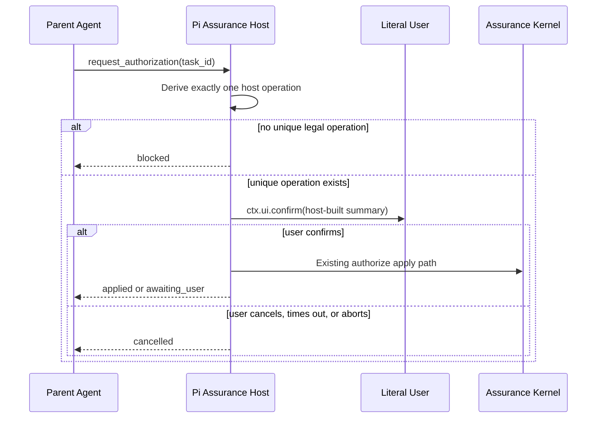

# Spec: Agent-Requested Host Authorization

> **SUPERSEDED (2026-08-22):** This spec's TaskRecord schema, `record-review-verdict`,
> and material-risk literal-user Review confirmation constraints are historical.
> The current architecture is Kernel-obligation driven (TaskRecord v3,
> `lifecycle`/`artifact_state`, single `attestations[]`). Routine tasks complete
> after fresh QA; material and critical tasks complete automatically after fresh
> QA and Review. `request_authorization` is reserved for unresolved user
> decisions and explicit stop. Retain this document for historical task
> auditability; do not enforce its non-current contracts on the v3 production
> path.

**Task ID**: `2026-08-14-003-agent-requested-host-authorization`
**Owner**: user
**Status**: Proposed
**Design risk**: High

The change adds an Agent-callable confirmation trigger on the existing Kernel
canary authority surface. It crosses the closed `imm_kernel_canary` schema,
session-local TUI confirmation, Skill/dispatch contracts, and the existing
literal-user authorize path. An incorrect implementation would let the model
supply authority fields, mint reviewer or user capabilities, or silently skip
the confirmation that still owns native Review output.

**Diagram decision**: required
**Diagram reason**: The distinction between host-derived operation selection,
literal-user confirmation, Kernel write, and parent continuation is a sequence
and authority-boundary contract that prose alone would leave ambiguous.

## 1. Problem Frame

Phase 1 already lets the parent Agent request one non-blocking
`advance_assurance` after fresh evidence. Deterministic QA and one native
Review then run automatically. The remaining friction is not another slash
command for QA or Review. It is the two-step human loop that still follows
every genuine authority wait:

1. the Agent tells the user to type `/imm-canary-authorize <task> <operation>`;
2. the user types that command and then answers `ctx.ui.confirm`;
3. the user replies "confirmed" so the Agent can continue.

The confirmation dialog itself is already host-derived and exact-action. The
waste is the typed command and the extra chat turn around it. Roadmap Phase 4
still requires a later host-attested Review receipt before
`record-review-verdict` can disappear. This slice implements only the
Agent-trigger half of that Phase: keep every existing confirmation, but let
the Agent open it.

## 2. Intended Behavior

After `advance_assurance` returns `awaiting_user`, or after a Review follow-up
reports that a session-bound native verdict is ready, the parent Agent calls
one new closed tool operation:

```text
request_authorization(task_id)
```

The caller supplies only the enrolled task ID. The host derives at most one
legal operation from the current Kernel projection and session-local pending
Review verdict. The existing `/imm-canary-authorize` confirmation and apply
path then runs unchanged. After the dialog settles, the tool returns a
structured result and the parent continues in the same turn.



Normal material flow after this slice:

1. `/imm-canary-new` remains the enrollment confirmation.
2. The Agent records evidence and calls `advance_assurance`.
3. QA and Review run automatically.
4. The Agent calls `request_authorization` once for the pending Review
   verdict. The user clicks the existing confirm dialog.
5. The Agent calls `complete` when the predicate is satisfied.

Critical flow adds one more `request_authorization` for
`record-user-approval`. Slash `/imm-canary-authorize` remains as a manual
recovery alias.

## 3. Technical Design

### 3.1 Closed tool addition

Extend the existing `imm_kernel_canary` action union with:

```text
{ op: "request_authorization" }
```

No operation name, finding ID, resolution, approval payload, capability,
expected hash, or next-intent field is accepted. Privileged reducer kinds
remain absent from the schema. The description may say the operation opens a
host-derived confirmation; it must not say the tool itself is privileged.

### 3.2 Host-derived unique operation

The host selects exactly one operation from the Kernel projection:

1. `resolve-user-decision` when the authoritative TaskRecord has exactly one
   open `unresolved_user_decision`;
2. `record-user-approval` when `next_obligation` is `record-user-approval`
   (critical risk after fresh QA and Review attestations);
3. `stop` when an open `replan_required` finding parks the task.

Zero matching operations or contradictory readiness returns `blocked`. Review
verdicts are submitted directly by the Parent from the foreground reviewer result
and do not enter this user-authorization path. The host never asks the model to choose
among operations.

`approve-breaking-intent-revision` retains its dedicated exact-operation host
gate because its payload is not derivable from the ordinary authorization
projection. Authority repair is now deterministic: it revalidates a narrowly
proven stale claim and removes only that redundant claim without user input.

### 3.3 Shared authorize path

`request_authorization` must invoke the same confirmation and apply function
used by `/imm-canary-authorize`. That shared path already:

- builds the confirm title and summary from TaskRecord, claim, snapshot, and
  pending Review verdict;
- requires TUI mode;
- treats cancel, timeout, abort, session change, stale invocation, and
  replay as zero writes;
- mints user or review authority only after a fresh affirmative confirm;
- revalidates TaskRecord, workspace, Intent, and diff before Kernel apply.

The tool must not mint capabilities, construct approval payloads, or apply
reducer actions itself. Duplicate in-flight authorization for the same task
reuses or rejects through the existing invocation registry; it does not open
a second dialog.

### 3.4 Immediate structured result

Unlike `advance_assurance`, this operation waits for the dialog to settle
because the next Agent action depends on the user's answer. It must not wait
for later QA or Review jobs. Public result states are:

```text
applied         the host-derived operation wrote Kernel authority
cancelled       the user declined, timed out, or aborted; zero writes
blocked         no unique legal operation, non-TUI, or preflight failure
awaiting_user   a different literal-user operation is now required
```

`applied` includes the derived operation name and resulting phase. `blocked`
includes a host reason. The result must not leak capability digests or raw
reducer actions.

After `applied`, the parent may immediately `complete` or call
`advance_assurance` again from the fresh projection. The tool itself does not
auto-complete or start another Review.

### 3.5 Skill and dispatch contracts

`imm-canary-work` source and packaged docs change in one way: after an
`awaiting_user` assurance result or a Review-ready follow-up, the Agent calls
`request_authorization` instead of asking the user to type
`/imm-canary-authorize`. The slash command remains documented as the manual
recovery surface. Prompt guidelines replace "privileged actions are
unavailable here; use the TUI commands" with "request host-derived
confirmation through `request_authorization`; do not ask the user to type
the authorize command."

## 4. Invariants

- Native Review output remains advisory until literal-user confirmation.
- Rule requiring TUI confirmation of native Review output is unchanged.
- The model cannot name or supply the authorized operation.
- Capability minting stays inside the existing authorize apply path.
- Non-TUI, cancel, timeout, abort, stale session, and snapshot drift remain
  zero-write.
- `/imm-canary-authorize` remains a working identical apply path.
- No Kernel reducer, TaskIntent schema, TaskRecord schema, or backend-claim
  contract changes.
- No automatic Review receipt, no out-of-scope dirty-file classifier, and no
  native progress telemetry.

## 5. Failure Behavior

- Missing claim, wrong task, or terminal tombstone: `blocked`, zero writes.
- No pending Review verdict and no other unique legal operation: `blocked`.
- Two open user decisions: `blocked`; the existing fail-closed rule remains.
- Confirm false or abort: `cancelled`, zero writes, existing notify text.
- Snapshot drift after confirm and before apply: existing authorize failure,
  zero or CAS-failed write, tool returns `blocked`.
- Active authorize invocation already open: fail closed without a second
  dialog.

## 6. Compatibility, Interruption Recovery, Rollback, and Exit

This is an additive confirmation trigger, not a compatibility transition. No
shim, dual path beyond the existing slash alias, or persisted journal is
introduced. Existing enrolled tasks and TaskRecords need no migration.

If execution stops after schema/docs land but before the shared-path wiring
is complete, `request_authorization` must remain absent or `blocked`. A
partial tool that accepts the op but cannot open the existing confirm dialog
is not shippable.

Session interruption during the dialog uses the existing authorize abort
path: zero writes, invocation closed. The next Agent turn may call
`request_authorization` again against a fresh projection.

Rollback is a Git revert of the tool schema, shared-path wiring, Skill/dist
docs, and focused tests. Previously confirmed approvals remain in TaskRecord
bytes and are not rolled back.

### 6.1 Plan Boundary and Scope Pressure

The schema, shared authorize entry, Skill/dist wording, and focused tests
share one authority-boundary and rollback unit. Splitting them would leave
either an undocumented Agent path or a documented path that still asks users
to type slash commands. Host-attested Review receipts, dirty-file
classification, drain, and breaking-intent confirmation remain independent
boundaries and stay out of this slice.

## 7. Verification

1. Focused extension schema tests prove `request_authorization` is present
   and privileged reducer kinds remain absent.
2. Focused authority tests prove the tool derives `record-review-verdict`,
   `resolve-user-decision`, and `record-user-approval` without caller fields,
   opens exactly one existing confirm dialog, and applies through the shared
   authorize path.
3. Cancel, timeout, abort, non-TUI, missing unique operation, and in-flight
   duplicate paths perform zero Kernel writes.
4. Skill and packaged docs tell the Agent to call `request_authorization`
   after `awaiting_user` and keep `/imm-canary-authorize` as recovery.
5. Full `bun test` and `git diff --check` pass.

## 8. Scope

Expected implementation paths:

- `plugins/immune-brain/.pi-extension/imm-canary-work.ts`
- `plugins/immune-brain/skills/imm-canary-work/SKILL.md`
- `plugins/immune-brain/dist/imm-canary-work.md`
- `docs/reference/subagent-dispatch-protocol.md` only if it currently
  instructs typed authorize commands as the primary Agent path
- `docs/specs/agent-requested-host-authorization.spec.md`
- `docs/plans/2026-08-14-003-agent-requested-host-authorization.intent.json`
- `tests/pi-canary-work-extension.test.ts`
- `tests/pi-canary-user-authority.test.ts`
- `tests/imm-canary-work-contract.test.ts`
- a focused request-authorization test file if the existing suites cannot
  host the new contract without mixing concerns

Out of scope:

- host-attested native Review receipts or removing
  `record-review-verdict`;
- changing Rule #1437;
- Agent-triggered enroll, drain, stop, or breaking-intent confirmation;
- out-of-scope dirty-file classification;
- native subagent progress telemetry or a durable job journal;
- Kernel reducer or TaskRecord schema changes.

## 9. Devil's Advocate Audit

**Rollback resilience**: The slice is additive around the existing authorize
command. Reverting the tool op, docs, and tests restores typed slash
authorization. No TaskRecord migration is required. A halfway schema change
without shared-path reuse is rejected by the focused tests.

**Verification vanity**: Schema presence is insufficient. Tests must execute
the tool, assert the confirm title/body contain host-derived fields the
caller did not supply, and compare TaskRecord/claim bytes on every rejected
path. A test that only searches Skill text for `request_authorization`
cannot close the slice.

**Spec dilution detection**: The user asked to start 4a, not 4b or 4c. This
Spec does not silently drop Review confirmation, does not auto-select stop,
and does not classify dirty files. It also does not keep the typed-command
loop as the documented Agent path.
