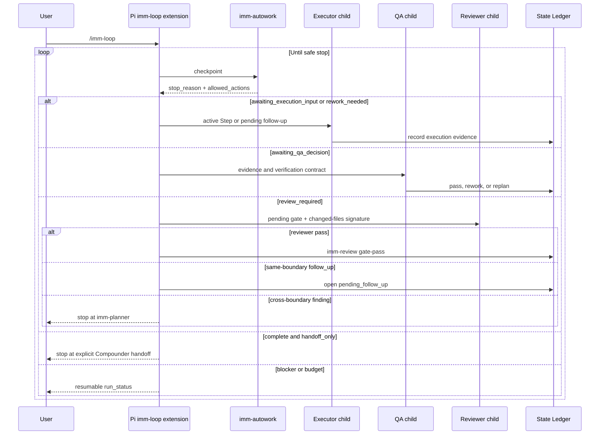

# Spec: Pi `imm-loop` Host Autorun

**Task ID**: IMM-PI-LOOP-001  
**Owner**: Planner  
**Status**: Accepted

## Output Language

- Human-readable prose: English
- Preserved literals: file paths, commands, schema fields, enum values, API names, JSON keys, Skill names, and `CONTEXT.md` canonical terms such as `Plan`, `Step`, `Executor`, `QA`, `State Ledger`, and `Compounder`.

## 1. Goal

Make `/imm-loop` a real Pi-hosted, foreground, cancellable completion loop for a validated Plan. The loop must repeatedly consume deterministic `imm-autowork` checkpoints, invoke the authority named by the checkpoint, record only that authority's structured result, and continue until completion or a first-class safe stop.

This closes the gap between the existing strong-autorun Skill contract and Pi's current behavior, where invoking the Skill only injects instructions into one Agent run.

## 2. Problem and Scope

### Current behavior

- `plugins/immune-brain/skills/imm-loop/SKILL.md` loads a coordination contract.
- `plugins/immune-brain/runtime/immune_brain_runtime.ts` exposes `imm-autowork`, `imm-work`, `imm-review`, and other deterministic commands, but no executable `imm-loop` host surface.
- The root Pi package manifest loads Skills only; it does not load an extension.
- `imm-autowork` correctly reports execution, QA, review, replan, and completion boundaries, but does not invoke the corresponding authority.
- `pending_follow_up` exists in the State Ledger shape, while the TypeScript runtime does not yet provide complete open, execute, QA-close, and resume transitions for that target.

### In scope

- A Pi package extension that registers `/imm-loop` and an abort-aware `imm_loop_run` tool over one shared foreground runner.
- Isolated Pi child runs for Executor, QA, `imm-code-review`, and `imm-ui-review`, with role-specific tools and structured result validation.
- Backwards-compatible persisted `pending_follow_up` execution state and runtime commands needed by the host loop.
- Step, rework, review, follow-up, repeated-error, and elapsed-time budgets.
- Cancellation, target-repository locking, resume from the State Ledger, package-install coverage, and accurate host capability documentation.

### Out of scope

- A generic cross-host dispatcher, shared agent registry, background daemon, scheduler, or repair queue.
- An `imm-autowork-driver` Skill or a runtime default QA pass.
- Automatic Plan mutation or automatic continuation after `replan_needed`.
- Automatic `imm-compounder` execution when `handoff_only` is true.
- Equivalent executable adapters for Codex, Claude, Cursor, or OpenCode in this Plan.
- Remote telemetry, dashboards, or a second workflow authority store.

## 3. Technical Design

### Risk classification

**High risk.** The change crosses Pi package loading, child-agent execution, runtime command contracts, persisted State Ledger behavior, interruption recovery, review authority, and backwards compatibility. This Spec is the single Technical Design baseline.

### 3.1 Authority boundaries

| Component | Authority |
|---|---|
| Pi host adapter | Route checkpoints, enforce budgets, cancel work, validate child result shape, and record non-authoritative run status |
| `imm-autowork` | Return the deterministic next boundary and allowed actions |
| Executor child | Edit only the active Step or pending follow-up and record execution evidence |
| QA child | Decide `pass`, `rework`, or `replan` from evidence; no implementation edits |
| Reviewer child | Perform read-only code/UI review and return `pass`, bounded `follow_up`, or cross-boundary `replan` |
| Planner | Own Plan and Spec changes after `replan_needed` |
| State Ledger | Remain the only workflow authority and resume source |
| Pi session custom entry | Store display and run-budget metadata only; never override the State Ledger |

The adapter must never infer QA `pass` from executor verification. It may persist a decision only after receiving and validating that decision from the corresponding authority child.

### 3.2 Pi package shape

The root `package.json` adds the extension path to `pi.extensions` while retaining the existing Skill path. Runtime imports supplied by Pi remain peer dependencies rather than bundled duplicate copies.

The extension should stay small and host-specific:

```text
plugins/immune-brain/extensions/imm-loop/
  index.ts             # Extension registration and UI integration
  runner.ts            # Checkpoint loop, budgets, lock, cancellation, status
  child-agent.ts       # Isolated Pi process invocation and JSON event parsing
  contracts.ts         # Snapshot and child-result validation
```

`/imm-loop` and `imm_loop_run` call the same runner. The command provides the direct TUI entry; the tool provides an abort-aware Agent/RPC path and testable progress updates. Neither becomes a new Immune-Brain Skill or CLI authority.

### 3.3 Child authority execution

Reuse Pi's documented isolated subprocess pattern:

```text
pi --mode json -p --no-session
```

Each child receives:

- the target repository cwd;
- a role-specific system prompt derived from the corresponding installed Skill contract;
- the current checkpoint and bounded target data;
- role-specific tools;
- an optional model resolved through existing `readImmuneBrainConfig` and `resolveWorkflowStageModels` helpers.

Tool policy:

| Child | Allowed tools |
|---|---|
| Executor | normal project read/edit/write/bash tools |
| QA | read-only project tools plus verification commands |
| Code/UI reviewer | read-only project tools plus verification commands |

A child process exit, model error, abort, malformed structured result, or missing required state transition is a safe stop. The parent must not synthesize the missing authority decision.

### 3.4 Runtime follow-up target

Replace the current effectively unimplemented `pending_follow_up: unknown` behavior with a backwards-compatible optional normalized record. Existing ledgers with `null`, an absent field, or unrelated historical data must still load.

The target must preserve at least:

```json
{
  "id": "stable identifier",
  "state": "pending | executing | ready_for_review | closed | replanning",
  "scope": ["bounded paths or symbols"],
  "change_goal": "single repair outcome",
  "verification_hint": "copy-paste-checkable verification",
  "origin_review": {
    "gate": "imm-code-review | imm-ui-review",
    "evidence_ref": "review evidence reference"
  },
  "execution_evidence": null,
  "opened_at": "ISO timestamp"
}
```

Runtime commands must own all mutations. The extension must never edit `.imm/memory/current_iteration.json` directly. The command surface may extend `imm-work` and `imm-review`, but must remain target-oriented rather than introduce a generic dispatcher.

Required operations:

- open a validated same-boundary follow-up;
- report it as the current execution target when no Plan Step is active;
- record follow-up execution evidence;
- obtain an independent QA decision;
- close it or mark it for replanning;
- include follow-up changed files in the review signature so a repair reopens stale review gates;
- expose `follow_up_completed_in_run` and round state accurately in the next checkpoint.

### 3.5 Host loop sequence



### 3.6 Stop and continuation policy

Automatic continuation is allowed only when the next checkpoint preserves the current Plan boundary and names an executable authority.

| Condition | Behavior |
|---|---|
| `awaiting_execution_input` | Invoke Executor |
| `awaiting_qa_decision` | Invoke QA |
| `rework_needed` | Continue to Executor only when the QA repair target is explicit and rework budget remains |
| `replan_needed` | Stop and recommend `imm-planner` |
| `review_required` | Invoke exactly `pending_review_gate` |
| reviewer same-boundary finding | Open bounded follow-up and continue |
| reviewer cross-boundary finding | Stop and recommend `imm-planner` |
| `complete` with `handoff_only` | Stop and request explicit Compounder intent |
| missing Plan, credentials, verification target, or host capability | Stop with evidence |
| repeated identical failure without changed files, evidence, or strategy | Stop |
| any budget exhausted | Stop without converting the boundary to pass or failure |

Default budgets must be conservative and overridable per run. At minimum: Step, per-Step rework, per-gate review round, follow-up round, repeated-error, and elapsed-time budgets.

When a `rework_needed` target becomes structurally invalid or its bounded follow-up budget is exhausted, the current Executor does not fabricate a successful repair. It records a failure exit (`unclear target or verification` or `no progress`) with the discovered Plan-fit evidence, moving the same target to `ready_for_review`; independent QA may then record `replan`.

A successful Planner sync is the atomic consumption boundary for that `replanning` target. It must archive the superseded follow-up in `follow_up_history` with its execution evidence and QA `replan` decision, clear `pending_follow_up`, clear `requires_replan`, install the revised Plan signature, and expose the first unfinished replacement Step. It must do all of this in one State Ledger commit; clearing only `requires_replan` while retaining a `replanning` target is invalid because `imm-autowork` would remain permanently routed to Planner.

### 3.7 Cancellation, locking, and resume

- Propagate the custom tool `AbortSignal` to child processes and command executions.
- The direct TUI command provides an explicit cancel path backed by the same `AbortController`.
- On cancellation, terminate the child process, record no incomplete authority decision, release the lock, and return `user_cancelled`.
- Use one repository-local ephemeral lock under `.imm/memory/` containing a run ID and process metadata. A stale lock may be reclaimed only after proving its owner is no longer active.
- `session_shutdown` must terminate an owned child and release the owned lock.
- Resume always recomputes the checkpoint from the State Ledger. Pi `appendEntry` data may restore budgets and presentation only.
- Partial State Ledger transitions that were already atomically saved remain authoritative; no rollback of valid prior transitions occurs on interruption.

### 3.8 State Ledger write recovery

`State Ledger` writes are a cross-process transaction boundary, not a best-effort convenience. Atomic file replacement protects readers from partial JSON, but it does not serialize read-modify-write authority transitions. Therefore every mutation must retain a single write lock plus a commit-time version check.

The previous automatic stale-lock reclaim approach is rejected for this host. A user-space reclaim transition requires its own crash-recoverable lock; recursively adding reclaim guards cannot prove that an owner is not replaced between inspection and destructive cleanup. In the absence of a kernel-level lock primitive exposed by the supported runtime, automatic deletion or takeover of an existing State Ledger write lock is unsafe.

The replacement contract is fail-closed:

- an existing write lock always prevents a new mutation, whether its metadata is live, fresh, malformed, initializing, or apparently stale;
- lock metadata is diagnostic only and includes an opaque run ID, process ID, timestamp, and initialization state;
- `imm-heal` reports the lock path, parsed ownership metadata, and a manual recovery procedure, but does not delete or reclaim the lock;
- an operator may remove a stale lock only after independently confirming that every writer for the target repository has stopped;
- after manual recovery, the next runtime command re-reads the last valid Ledger and resumes from its checkpoint; no session entry, cached snapshot, or stale authority result may be replayed;
- all ordinary Step, follow-up, queued QA, and checkpoint-snapshot writes continue to use the same version/CAS commit helper so a stale in-memory state cannot overwrite a newer authority mutation.

This makes a post-crash stale lock an explicit safe stop rather than a silent data-loss or mutual-exclusion failure.

### 3.9 Compatibility and rollback

- Existing `imm-autowork`, `imm-work`, `imm-review`, package Skills, and State Ledger files remain supported.
- The extension is additive to the Pi package and does not change other host manifests.
- Historical session-only follow-up handoffs remain readable as prose but are not silently imported into persisted state.
- The smallest rollback is: disable/remove the Pi extension manifest entry and extension files, then revert optional follow-up runtime operations. Existing optional follow-up or run metadata must remain safely ignored by older readers.
- Documentation must distinguish Pi executable autorun from coordination-only behavior on hosts without an adapter.

## 4. Requirements

### R1. Executable Pi entry

Installing the package in Pi must register `/imm-loop` and `imm_loop_run`. A validated Plan must advance without requiring the user to invoke each authority Skill manually.

### R2. Checkpoint truth

The adapter must route only from `imm-autowork` fields including `stop_reason`, `recommended_authority`, `allowed_actions`, `pending_review_gate`, and `handoff_only`. It must not recreate the workflow state machine from prose.

### R3. Authority-preserving child runs

Executor, QA, and reviewer children must have distinct prompts and tool policies. Missing or malformed child output must stop the loop rather than trigger a parent-generated decision.

### R4. Durable bounded follow-up

A same-boundary reviewer repair must survive interruption, execute through Executor evidence and independent QA, and update the changed-files signature before the reviewer gate can pass.

### R5. Review lifecycle completion

Material and UI changes must pass every runtime-reported review gate. Mixed gates must close in the reported order. Follow-up changes must invalidate stale passes.

### R6. Safe stop semantics

`replan_needed`, unresolved blockers, missing credentials, unclear verification, tool or model failure, repeated unchanged errors, cancellation, lock contention, and exhausted budgets must stop with a machine-readable and user-readable `run_status`.

### R7. Explicit terminal handoff

The loop must not invoke `imm-compounder` automatically when the runtime returns `handoff_only`. Completion reports the handoff and waits for user intent.

### R8. Recovery and concurrency

A cancelled or interrupted run must be resumable from the State Ledger, and two Pi sessions must not concurrently drive the same repository ledger.

### R9. Packaging and documentation truth

Package tests must prove the extension is shipped and loadable. User documentation must promise executable autorun only for Pi with the adapter and describe the coordination-only fallback for other hosts.

### R10. Fail-closed State Ledger write recovery

All State Ledger mutation paths must serialize writes and preserve the last valid ledger. An existing write lock must stop new mutations without automatic takeover. `imm-heal` must expose owner diagnostics and an explicit manual recovery procedure; after that procedure, the runtime must recompute from disk and continue without replaying stale checkpoints or authority results. Planner sync must atomically archive a QA-replanned follow-up while installing the revised Plan, so no consumed `replanning` target can shadow the replacement Step.

## 5. Acceptance Criteria

- [ ] A temporary target repository with a validated two-Step fixture completes both Steps through isolated Executor and QA children after one `/imm-loop` invocation.
- [ ] Executor success alone never closes a Step; only a validated QA `pass` does.
- [ ] QA `rework` continues only with an explicit repair target and remaining budget; QA `replan` stops at Planner authority.
- [ ] Code-only, UI-only, and mixed changed-file fixtures invoke and persist the exact runtime-reported review gates.
- [ ] A reviewer same-boundary finding becomes a persisted follow-up, survives restart, receives execution evidence and QA closure, invalidates stale review state, and returns to the originating gate.
- [ ] Child timeout, malformed output, model failure, tool failure, missing credential, repeated unchanged failure, and budget exhaustion all stop without fabricated pass state.
- [ ] Cancellation kills the active child, releases the owned lock, and preserves the last valid State Ledger transition.
- [ ] Concurrent start is rejected while a live lock owner exists; a proven stale lock is recoverable.
- [ ] `complete` plus `handoff_only` reports `imm-compounder` without invoking it.
- [ ] Existing State Ledger fixtures, CLI command tests, review lifecycle tests, and non-Pi host package tests remain green.
- [ ] The Pi package manifest exposes both the extension and existing Skills, and an installed-package smoke test loads `/imm-loop`.
- [ ] Active documentation no longer claims unconditional executable autorun for hosts without an adapter.
- [ ] An interrupted State Ledger write leaves either the last valid ledger or a visible fail-closed write lock; it never permits an automatic reclaim race or a stale snapshot overwrite.
- [ ] `imm-heal` reports live, fresh, malformed, initializing, and stale write-lock diagnostics without deleting the lock; an operator-removed stale lock permits a fresh runtime checkpoint to resume from the durable ledger.
- [ ] Syncing a revised Plan after follow-up QA `replan` archives that target and exposes the replacement Step in one commit; interruption leaves either the old `replan_needed` checkpoint or the complete new Plan checkpoint, never a mixed state.

## 6. Verification Strategy

- Pure runtime state-transition tests for persisted follow-up behavior and backwards compatibility.
- Pi extension unit tests with a fake `ExtensionAPI`, injected checkpoint/child adapters, fake timers, and temporary repositories.
- Black-box runner tests using fixture child processes for success, failure, malformed output, timeout, cancellation, and repeated errors.
- Package manifest and installed-package smoke tests against the locally installed Pi API.
- Existing focused `imm-autowork`, review lifecycle, completion gate, and package parity regression suites.
- One end-to-end temporary repository proving ordinary Step progression and one proving reviewer follow-up progression.

## 7. Decisions and Assumptions

- **D1**: Implement a Pi-specific foreground adapter, not a cross-host dispatcher or new Immune-Brain Skill.
- **D2**: Register both a direct command and an abort-aware tool over one runner.
- **D3**: Reuse isolated Pi subprocess behavior rather than building a new SDK orchestration platform.
- **D4**: Keep the State Ledger authoritative and use Pi session entries only for non-authoritative run metadata.
- **D5**: Persist bounded reviewer follow-up because session-only handoff cannot support reliable interruption recovery.
- **D6**: Stop on `replan_needed` and terminal Compounder handoff; do not automate scope authority or learning capture.
- **D7**: Preserve current CLI commands; do not add a generic `imm-loop` CLI command that cannot itself invoke host authorities.
- **D8**: State Ledger automatic stale write-lock reclaim is rejected because user-space transition guards introduce an unprovable crash/replacement race. Use fail-closed diagnostics plus explicit operator recovery instead.
- **A1**: The installed Pi package provides `@earendil-works/pi-coding-agent`, `@earendil-works/pi-ai`, `@earendil-works/pi-tui`, and `typebox` to extensions through peer dependencies.
- **A2**: Pi child processes can access the same configured credentials and model registry as the parent host.
- **A3**: Runtime command wrappers remain resolvable from the installed plugin root even when the target repository does not vendor `plugins/immune-brain`.
