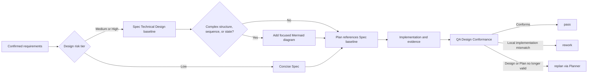

# Spec: Risk-Tiered Technical Design Conformance

**Task ID**: IMM-PLAN-DESIGN-CONFORMANCE-001  
**Owner**: Planner  
**Status**: Proposed

## 1. Goal

Make technical design explicit when a change is risky enough to need it, without
turning every small change into design ceremony. The `Spec` remains the single
design baseline, the `Plan` references that baseline without copying it, and
`QA` must compare the completed implementation with the latest approved baseline
before `pass`.

## 2. Background

The workflow already requires a Spec, an executable Plan, verification evidence,
and a Zoom-Out Check against architecture and the active Plan boundary. It does
not yet require Planner to classify design depth, record a testable Technical
Design baseline for medium/high-risk work, or make final QA explicitly account
for implementation deviations from that baseline.

The missing contract permits two opposite failures:

- complex changes can reach execution with no explicit design baseline; and
- a blanket diagram requirement can add maintenance cost to trivial changes.

This Spec adds one risk-triggered path instead of a new document type or runtime
state machine.

## 3. Technical Design

### 3.1 Design-depth classification

Planner classifies the change with the smallest sufficient tier:

| Tier | Typical surface | Required Spec content | Mermaid |
|---|---|---|---|
| Low | copy, configuration, trivial rename, contained local fix with no contract or ownership change | Existing Goal, Requirements, Non-goals, and Verification are sufficient; `Technical Design` may be omitted | Not required |
| Medium | one module's non-trivial behavior, an internal contract, or a bounded workflow change | A concise `Technical Design` records affected components, key decisions, invariants, failure behavior, and verification implications | Use only when relationships are materially clearer as a diagram |
| High | cross-module/API/data-flow/state-machine changes, security, migration, concurrency, architecture ownership, cross-host or persisted-state contracts | A complete `Technical Design` records boundaries, interfaces/data or state flow, alternatives/decisions, invariants, failure and rollback behavior, compatibility, and verification implications | Required when the design contains multi-component flow, sequencing, or state transitions; prose remains valid for high-risk changes without such relationships |

Planner records the selected tier and rationale in the Spec. When uncertain
between tiers, use the higher tier unless repository evidence resolves the risk.
A low-risk label must not be used to bypass an actual contract, ownership,
security, persistence, compatibility, or multi-component concern.

### 3.2 Single design authority

- The `Spec` is the only durable Technical Design baseline.
- The `Plan` names the Spec path and the design sections/decision IDs that bound
  each Step; it does not duplicate design prose or diagrams.
- If implementation discovery invalidates the baseline, execution stops and
  returns to Planner. Planner updates the Spec first and decides whether the
  existing Plan remains valid or requires `replan`.
- A Mermaid diagram is explanatory evidence, not a second source of truth. Its
  labels and relationships must agree with adjacent prose.

### 3.3 Workflow

### 3.4 Final Design Conformance

Before final Plan closure, QA reads the latest referenced Spec and records a
short `Design Conformance` result:

1. the applicable Technical Design decisions/invariants and implementation
   evidence;
2. any observed deviation and its impact;
3. the route: `pass`, `rework`, or `replan`.

Routing authority stays narrow:

- `pass`: implementation conforms to the latest approved Spec; low-risk work may
  state that no separate Technical Design baseline was required.
- `rework`: the Spec remains valid and the implementation has a local mismatch.
- `replan`: the design is unclear, the implementation intentionally needs a
  changed design, a Plan reference is stale, or the mismatch affects boundaries,
  interfaces/data flow, state transitions, security, compatibility, or acceptance
  behavior.

QA does not approve a new design, silently accept a deviation, or edit the Spec.
A potentially reasonable deviation still returns to Planner first; after the
Spec is updated, the normal Plan validation and QA path runs again.

## 4. Requirements

### R1. Planner must apply risk-tiered design depth

- `imm-planner` defines Low, Medium, and High design-risk tiers with the minimum
  required Spec content above.
- The contract explicitly exempts trivial changes from mandatory Technical Design
  and Mermaid ceremony.
- The contract prevents contract/ownership/security/persistence/compatibility or
  multi-component changes from being silently classified as Low risk.

### R2. Mermaid must remain conditional

- Mermaid is required only when medium/high-risk design contains structure,
  sequence, data flow, or state transitions that a diagram clarifies.
- Mermaid is not a universal gate and is never required for simple local changes.
- Diagrams supplement adjacent prose rather than becoming an independent design
  authority.

### R3. Spec must remain the single Technical Design baseline

- Plan Steps reference the Spec path and applicable design decision/invariant;
  they do not copy Technical Design prose.
- Discovery that invalidates the baseline returns to Planner before execution
  continues.

### R4. QA must perform final Design Conformance

- Before final closure, QA maps applicable Spec design decisions/invariants to
  implementation or verification evidence.
- Missing design evidence, stale references, and unclassified deviations cannot
  pass.
- Local implementation mismatch routes to `rework`; structural or intended design
  change routes to `replan`.
- QA cannot approve design changes or silently treat deviations as equivalent.

### R5. Contracts and packaged guidance must stay regression-protected

- `plugins/immune-brain/dist/imm-planner.md`,
  `plugins/immune-brain/dist/imm-qa.md`, and
  `docs/reference/planning-quality-gate.md` carry the executable guidance.
- The packaged mirror of `planning-quality-gate.md` remains byte-identical.
- A focused Bun contract test asserts positive requirements and negative
  boundaries, so string presence alone is insufficient.

## 5. Non-goals

- No standalone Technical Design document type or extra design approval workflow.
- No runtime schema, State Ledger field, Plan parser, or CLI command change.
- No mandatory Mermaid for all Specs or all high-risk work without diagrammable
  relationships.
- No per-Step Design Conformance ceremony; the mandatory gate is final Plan
  closure, while an earlier Step may replan as soon as drift is discovered.
- No automated semantic comparison between Mermaid, prose, and code.
- No QA authority to rewrite or approve the design baseline.

## 6. Compatibility and recovery

- Existing Specs and Plans remain valid; this is a forward-looking workflow
  contract and does not migrate historical artifacts.
- In-flight work keeps its approved Spec unless Planner explicitly revises it.
- Partial implementation is safe to stop: no runtime state shape changes. Resume
  re-reads the latest Spec and current Plan before execution or QA continues.
- Rollback is reverting the Planner/QA contract, quality-gate mirror, focused test,
  Spec, and Plan changes as one coherent documentation-contract slice.

## 7. Verification

- A focused Bun test proves Planner's tiering, Technical Design, conditional
  Mermaid, and single-source rules.
- The same test proves QA's final Design Conformance evidence and deviation routing,
  including negative assertions against silent acceptance and QA design authority.
- `tests/dist-docs-sync-contract.test.ts` proves the quality-gate source/dist mirror.
- `plugins/immune-brain/bin/imm-plan docs/plans/2026-07-10-001-feat-risk-tiered-technical-design-conformance-plan.md --json`
  validates Plan structure and complete Brainstorm origin coverage.
