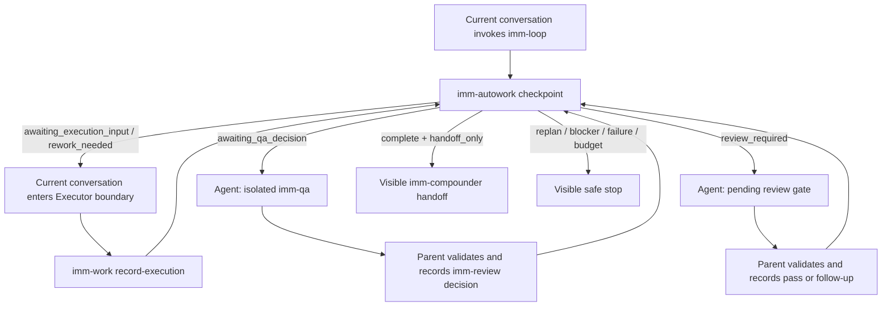

# Spec: Main-context `imm-loop`

**Task ID**: IMM-LOOP-MAIN-CONTEXT-001  
**Owner**: Planner  
**Status**: Proposed  
**Design risk**: High — workflow authority, host/subagent boundaries, packaged Skill behavior, interruption recovery, and removal of an existing CLI execution surface

## 1. Goal

Make `imm-loop` a visible, checkpoint-driven completion protocol executed in the current host conversation. The current conversation keeps implementation context, consumes deterministic `imm-autowork` snapshots, performs the active Executor work, delegates independent QA and required review gates through the host `Agent` subagent primitive, persists accepted decisions through existing runtime commands, and reports progress and the final stop reason in the conversation.

The Pi child-process backend, external loop runner, and `imm-loop` CLI are removed.

## 2. Accepted behavior

### R1. The current conversation owns the loop

- Invoking the `imm-loop` Skill starts from `imm-autowork --json` and repeats checkpoint consumption until a terminal or safe-stop condition is reached.
- `awaiting_execution_input` and `rework_needed` are handled in the current conversation under the active Step's Executor boundary; implementation does not default to a child process or subagent.
- After implementation, the host records execution evidence through `imm-work record-execution` and reads a fresh checkpoint before choosing another action.
- The host never infers completion from conversation memory when the State Ledger can answer it.

### R2. Independent authorities use host subagents

- `awaiting_qa_decision` dispatches an isolated `imm-qa` child through the host `Agent` primitive.
- `review_required` dispatches the exact `pending_review_gate` (`imm-code-review` or `imm-ui-review`) through the host `Agent` primitive.
- QA and reviewer children are advisory or judgment-only: they do not edit implementation files, write Plans, mutate the State Ledger, or close their own decision.
- The parent validates the child's structured result and persists it with `imm-review`; malformed, unavailable, failed, or unauthorized child execution stops fail-closed.
- The parent must not substitute its own QA or review pass when the required isolated authority is unavailable.

### R3. Progress and closure are observable

- Before and after every checkpoint action, the current conversation emits a compact progress line containing Step or follow-up identity, authority phase, result, and next action.
- Subagent dispatch and collection are each visible once.
- Every exit path emits a final summary containing active Plan, completed Steps, QA state, review state, stop reason, and next action.
- Blockers and failures are reported immediately; `imm-loop` must not end silently.
- Extension UI, status widgets, or custom renderers may decorate this output later but are not correctness dependencies.

### R4. State Ledger remains authoritative and resumable

- Existing `imm-autowork`, `imm-work`, `imm-review`, review-gate, and same-boundary follow-up state transitions remain unchanged.
- A resumed invocation re-reads the State Ledger and continues from the last committed checkpoint.
- `replan_needed`, missing required user input, runtime or tool failure, user cancellation, repeated unchanged failure, and explicit budget exhaustion remain safe stops.
- A same-boundary reviewer `follow_up` re-enters Executor work, independent QA, and the originating review gate.
- `imm-compounder` remains an explicit handoff and is never invoked automatically.

### R5. The obsolete Pi backend surface is removed

- Remove `plugins/immune-brain/bin/imm-loop` and `plugins/immune-brain/extensions/imm-loop/`.
- Remove the `imm-loop` command manifest entry and runtime CLI bridge from `plugins/immune-brain/runtime/immune_brain_runtime.ts`.
- Remove Pi child, process runner, process lock, backend flag, child timeout, and runner-budget contracts and tests.
- Keep the `imm-loop` Skill in the packaged Skill registry and package resource discovery.
- Historical Specs, Plans, and Learnings remain immutable evidence; only active contracts and user documentation are updated.

## 3. Technical Design

### 3.1 Boundaries and flow



- `plugins/immune-brain/dist/imm-loop.md` is the detailed host protocol.
- `plugins/immune-brain/skills/imm-loop/SKILL.md` loads that protocol and does not invoke a shell loop.
- The TypeScript runtime remains a deterministic state and command layer, not an LLM driver.
- The host conversation owns orchestration and observable prose; State Ledger snapshots own the next-action truth.

### 3.2 Authority invariants

- The current conversation may edit only while acting under the activated Step's Executor boundary.
- Executor evidence cannot become a QA decision.
- QA and reviewer outputs cannot mutate workflow state directly.
- Only an accepted, structurally valid child result may be recorded by the parent.
- Runtime `recommended_authority`, `allowed_actions`, `pending_review_gate`, and `required_review_gates` constrain every next action.
- Scope changes and cross-boundary findings stop at Planner authority.

### 3.3 Observable output contract

Normal progress uses this compact shape:

```text
[Step 1/3][Executor] implementation recorded | next: QA
[Step 1/3][QA] Agent dispatched
[Step 1/3][QA] pass recorded | next: imm-code-review
```

Every terminal response includes:

```text
Plan:
Completed Steps:
QA:
Review:
Stop reason:
Next action:
```

The exact prose language follows the configured output-language policy; field names, command names, paths, and State Ledger enums remain literal.

### 3.4 Failure and interruption behavior

- If the current conversation stops before a runtime write, no transition is claimed.
- If a runtime write succeeds and the conversation stops, the next invocation recomputes from the persisted State Ledger.
- If `Agent` is unavailable or returns an invalid result at a required QA/review boundary, stop with an explicit authority-unavailable or output-invalid reason.
- Concurrent State Ledger writes continue to use the existing fail-closed write protection. No separate `imm-loop.lock` is retained.
- Session-local counters are advisory only; persisted Step, follow-up, QA, and review state determines resumability.

### 3.5 Compatibility and rollback

- This intentionally removes the public `imm-loop` shell command and `--backend=pi` contract. The installable `imm-loop` Skill remains the user-facing entry.
- Existing State Ledger files and validated Plans require no migration.
- Existing direct `imm-autowork`, `imm-work`, and `imm-review` CLI consumers remain compatible.
- Hosts without an `Agent`-equivalent primitive can execute until an independent authority boundary, then must stop rather than degrade to self-approval.
- Rollback is the coherent restoration of the removed CLI/runner/backend files, command manifest entry, active docs, and dedicated tests. No persisted-state rollback is required.

## 4. Acceptance criteria

- [ ] The packaged `imm-loop` Skill instructs the current conversation to consume checkpoints and never invokes `bin/imm-loop` or Pi child processes.
- [ ] The current conversation is the default Executor context; QA and required reviewers are delegated through the host subagent primitive.
- [ ] Missing or malformed QA/reviewer child output fails closed without a recorded pass.
- [ ] Progress is visible at each checkpoint and every exit includes the mandatory final summary fields.
- [ ] The `imm-loop` CLI, runtime command entry, Pi child backend, process runner, and dedicated process tests are absent.
- [ ] `imm-autowork`, `imm-work`, `imm-review`, review-gate, follow-up, and State Ledger regression tests remain green.
- [ ] Active README, user guides, Skill contracts, registries, and command-manifest tests describe one main-context architecture.
- [ ] Plan validation and `git diff --check` pass.

## 5. Non-goals

- No new extension, custom UI, SDK session, generic dispatcher, DAG engine, or backend registry.
- No automatic QA pass, automatic Compounder invocation, or weakening of reviewer read-only boundaries.
- No State Ledger schema change.
- No rewrite of historical Specs, Plans, or Learnings.
- No guarantee that hosts lacking subagent support can complete independent QA or review gates.
