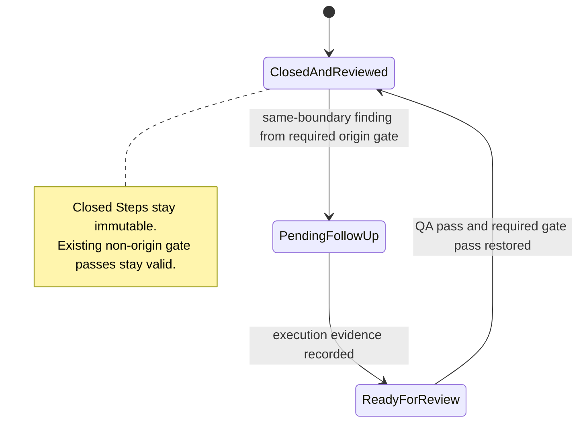

# Spec: Passed Review Follow-up Reopen

**Task ID**: IMM-REVIEW-006
**Owner**: Planner
**Status**: Proposed

## Summary

Allow `imm-work follow-up-open` to consume a legitimate same-boundary reviewer finding after every required review gate for the current recorded change set has already passed. The transition must bind the handoff to the runtime-provided `review_changed_files_signature`, atomically invalidate only the finding's origin gate, preserve the prior pass in audit history, and create the pending follow-up without changing closed Step evidence.

## Problem

`openFollowUp` currently derives the first pending gate from `collectReviewChangedFiles(state)`. When all required gates have exact-signature pass records, that lookup returns no pending gate. A later reviewer finding against the same recorded change set is therefore rejected with `follow-up origin_gate must match the current pending review gate`, even though the reviewer emitted a valid same-boundary handoff.

This leaves `imm-work` with neither an active Step nor a pending follow-up. The authority guard then correctly blocks implementation, but the runtime provides no legal transition that can create the required execution target.

The State Ledger must remain authoritative. Git status, Git diff, conversation text, and `--scope` are not substitutes for recorded execution evidence.

## Technical Design

**Design depth**: Medium. The code change is narrow, but it changes a persisted workflow transition and must preserve compatibility, chronology, and interruption safety.

### State transition

### Transition rules

1. Continue to require all Plan Steps to be closed, no active Step, no pending follow-up, `same-boundary`, bounded scope, and a supported origin gate.
2. Continue to derive the authoritative change set only from closed Step and closed follow-up execution evidence.
3. If a required review gate is already pending, only that gate may open the follow-up. Existing callers may omit `changed_files_signature`; when supplied, it must match the authoritative signature.
4. If no required review gate is pending because every required gate has an exact-signature pass, allow the requested origin gate only when it is one of the required gates and `changed_files_signature` is supplied from the review checkpoint and matches the authoritative change set.
5. In the all-passed case, remove only the origin gate's current pass from `review_state.gates`, append an auditable `review_gate_reopened` history entry containing the gate, signature, prior pass evidence reference, reviewer finding evidence reference, and follow-up ID, then create `pending_follow_up` in the same optimistic State Ledger commit.
6. Preserve the prior pass record through history rather than rewriting closed Step evidence or backdating any record.
7. Keep other gate passes intact. A code-review finding must not invalidate an independent UI-review pass, and vice versa.
8. Reject missing or stale signatures on the all-passed reopen path without mutation. Reject origin gates that are not required for the authoritative change set and gates that do not match an already-pending gate.

### Ownership

- `imm-code-review` and `imm-ui-review` remain advisory-only. They emit the bounded handoff and do not mutate workflow state.
- `imm-work follow-up-open` owns the durable transition from reviewer handoff to execution target.
- `imm-qa` retains follow-up closure authority.

## Requirements

### R1. Previously passed origin gates can be reopened safely

A valid same-boundary handoff can create a pending follow-up when its origin gate already has an exact-signature pass, no other required gate is pending, and its supplied `changed_files_signature` matches the runtime checkpoint.

### R2. Reopening is atomic and auditable

Signature validation, origin pass invalidation, history recording, and pending follow-up creation use the existing optimistic State Ledger commit path. A missing or stale reopen signature fails before mutation, and a concurrent Ledger change aborts the whole transition.

### R3. Closed evidence remains immutable

The transition must not modify closed Step or closed follow-up `execution_evidence`, `recorded_at`, `closed_at`, or historical QA decisions.

### R4. Gate isolation is preserved

Only the origin gate's current pass is invalidated. Unrelated gate passes remain available when their changed-files signature still matches.

### R5. Skill contracts describe the supported route

The distributed `imm-code-review` and `imm-work` contracts state that a same-boundary finding is consumed by `imm-work`, including the all-required-gates-passed case, without implying reviewer-owned state mutation.

## Compatibility

- Existing State Ledger files require no migration; pass records and history arrays retain their current shape.
- Existing pending-gate follow-up behavior remains valid.
- Existing command names remain unchanged. `imm-work follow-up-open` adds optional `--changed-files-signature`; it is required only for the new all-passed reopen path.
- Existing consumers that treat a missing current gate pass as pending continue to work.

## Interruption And Rollback

The existing compare-before-commit guard prevents a partial persisted transition. If execution stops before commit, the Ledger remains unchanged. If the implementation must be rolled back, restore `state_ledger.ts` and the two distributed skill contracts; no persisted schema rollback is required. A follow-up created by the new behavior remains a valid ordinary pending follow-up and does not require manual Ledger surgery.

## Acceptance Criteria

1. A fixture with closed Steps and exact-signature passes for all required gates can open a follow-up from one required origin gate only with the exact checkpoint signature.
2. The resulting Ledger has one pending follow-up, lacks the reopened origin gate's current pass, retains unrelated gate passes, and records `review_gate_reopened` history with both prior-pass and finding evidence.
3. Missing and stale signatures on the all-passed path are rejected with byte-identical Ledger state.
4. A non-required origin gate is rejected without state mutation.
5. An origin gate that conflicts with an already-pending required gate is still rejected without state mutation; the existing signature-omitting call remains compatible.
6. A concurrent Ledger mutation still aborts follow-up creation without partial gate invalidation.
7. Closed Step evidence is byte-for-byte unchanged by the transition.
8. Focused runtime tests, review lifecycle tests, plugin package tests, Plan validation, and `git diff --check` pass.

## Non-goals

- Reading Git status or Git diff as workflow authority.
- Importing unrecorded workspace changes into execution evidence.
- Adding `imm-review follow-up-open` or allowing reviewers to mutate the Ledger.
- Rewriting closed Step evidence or prior QA history.
- Adding a background repair queue, a new state store, or a State Ledger migration.
- Expanding `imm-heal` to infer missing conversational handoffs.
