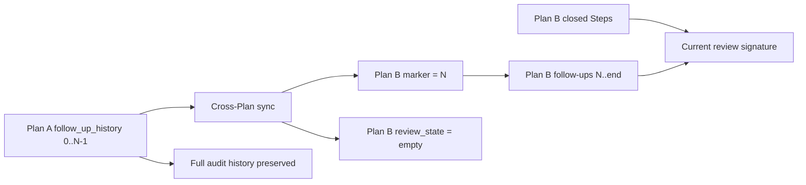

# Cross-Plan Review Scope Reset Spec

**Design risk**: High

The change modifies State Ledger review evidence, cross-Plan sync behavior, and persisted reviewer passes. An incorrect boundary can either force unrelated historical files into every review or reuse an old pass to skip review of a new Plan.

**Diagram decision**: required

**Diagram reason**: The distinction between preserved audit history and current-Plan review evidence is a state transition that is clearer as a data-flow diagram.

## 1. Goal

Make review signatures represent only the current Plan's closed Step and follow-up evidence while preserving the complete follow-up audit history. A cross-Plan sync must also invalidate prior reviewer passes even when the new Plan later changes the same file paths.

Separately, repair the canonical L2S workflow evidence link so it resolves to the tracked Spec.

## 2. Current Technical Evidence

- `collectReviewChangedFiles` currently unions every closed Step with every closed entry in `follow_up_history`.
- `imm-plan --sync` spreads the previous State Ledger before replacing Steps. On `same_plan: false`, it resets Step completion but preserves `follow_up_history` and `review_state`.
- The completed maintenance Plan recorded 17 reviewed files although its two Steps produced only 5 files; 12 reviewed paths came from prior Plan follow-ups and had no current git diff.
- A preserved `review_state` pass is keyed only by gate and changed-files signature. If a later Plan produces the same path set, the old pass can satisfy the new Plan's review gate.
- `docs/solutions/workflow.md` references `.imm/specs/l2s-workflow-pattern.spec.md`, which does not exist. The tracked source is `docs/specs/l2s-workflow-pattern.spec.md`.

## 3. Technical Design

### State field

Add optional State Ledger field `review_follow_up_start_index`.

- It is the inclusive index of the first `follow_up_history` entry eligible for the current Plan's review signature.
- A missing field reads as `0`, preserving legacy Ledger behavior without an eager migration.
- An explicit value must be an integer in `0..follow_up_history.length`. Negative, fractional, non-numeric, or out-of-range values fail closed with a clear error; they are not silently clamped.
- The field affects review evidence queries only. It must not truncate, reorder, archive, or hide the persisted `follow_up_history` audit trail.

### Sync behavior

- `same_plan: false`: in the same atomic State Ledger commit, set `review_follow_up_start_index` to the pre-sync `follow_up_history.length` and replace `review_state` with an empty gate map.
- `same_plan: true`: preserve `review_follow_up_start_index`, `review_state`, and existing append/replan follow-up behavior.
- Cross-Plan identity continues to use the existing normalized Plan path comparison. This slice does not introduce a new Plan identity model.

### Review evidence behavior

`collectReviewChangedFiles` returns the normalized union of:

1. changed files from closed Steps in the current State Ledger; and
2. changed files from closed `follow_up_history` entries at or after `review_follow_up_start_index`.

Open, executing, rework, or replanning follow-ups remain excluded. Existing trim, deduplication, sorting, signature generation, and gate classification remain unchanged.

### Rollout behavior

Existing Ledgers without the marker remain readable and use legacy index `0` until the next cross-Plan sync establishes a boundary. No historical state rewrite is planned. The repair Plan itself may therefore over-include legacy follow-up files in its final review once; it must still require review because U1 changes `tests/cross-plan-sync-reset.test.ts`, a path absent from the currently persisted reviewed signature. The next cross-Plan sync under the fixed runtime establishes the bounded scope.

## 4. Requirements

### R1. Backwards-compatible marker

- Preserve schema version 2 and unknown-field compatibility.
- Read missing `review_follow_up_start_index` as `0`.
- Preserve valid explicit markers through normalization and serialization.
- Fail closed on invalid explicit markers before deriving a review checkpoint or pass.

### R2. Atomic cross-Plan reset

- On `same_plan: false`, set the marker to the existing history length and reset all persisted review gates in the same optimistic State Ledger commit as the new Plan snapshot.
- Preserve the complete `follow_up_history` and general `history` arrays.
- Do not inherit old Step bodies, execution evidence, active state, pending review passes, or changed-file scope into the new Plan.

### R3. Same-Plan continuity

- Preserve the marker and matching `review_state` during same-path resync and append-safe continuation.
- Continue to include current-Plan closed follow-up changed files in the signature.
- Continue to invalidate a prior pass when a current-Plan follow-up adds a changed path.

### R4. Review bypass prevention

- A prior Plan pass must not satisfy a new Plan review gate even when both Plans produce the same changed-file signature.
- A new Plan with no current follow-ups must not include files from marker-preceding history.
- Review collection must continue to include all current closed Step files.

### R5. Canonical L2S evidence path

- Replace `.imm/specs/l2s-workflow-pattern.spec.md` with `docs/specs/l2s-workflow-pattern.spec.md` in `docs/solutions/workflow.md`.
- Verify the replacement path exists.
- Do not rewrite historical Plans or Specs.

## 5. Non-goals

- No deletion, compaction, migration, or reordering of `follow_up_history`.
- No new Plan identity, follow-up record version, schema version, migration command, or generic cursor abstraction.
- No change to review gate selection, signature hashing, QA authority, follow-up opening rules, or optimistic concurrency.
- No in-place rewrite of existing project State Ledgers.
- No repository-wide documentation link cleanup beyond the confirmed canonical L2S reference.

## 6. Acceptance Criteria

- Legacy State Ledger fixtures without `review_follow_up_start_index` load and collect follow-up evidence from index `0`.
- Invalid explicit markers fail closed with deterministic diagnostics.
- Cross-Plan sync preserves full follow-up history, sets the marker to the pre-sync history length, and clears all review gates atomically.
- Same-Plan sync preserves a nonzero marker and current review passes.
- Review checkpoints for a new Plan contain current closed Step files plus only marker-visible closed follow-up files.
- A prior pass with an identical path signature cannot close the new Plan's review gate.
- Existing same-Plan follow-up signature invalidation tests remain green.
- `docs/solutions/workflow.md` references the existing `docs/specs/l2s-workflow-pattern.spec.md` and no longer references the missing `.imm/specs/` path.
- `plugins/immune-brain/bin/imm-plan docs/plans/2026-07-21-002-fix-cross-plan-review-scope-reset-plan.md --json` validates the Plan without warnings.
