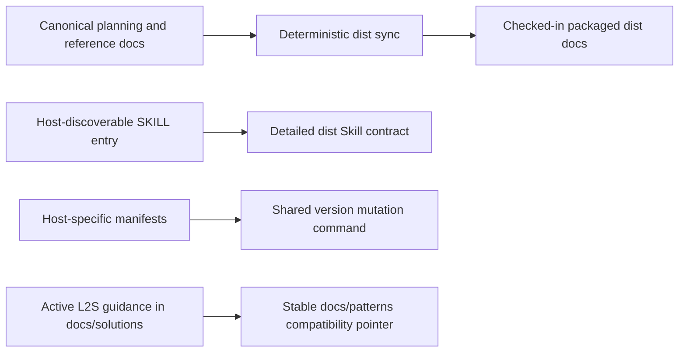

# Maintenance Surface Simplification Spec

**Design risk**: High

The selected opportunities cross historical planning evidence, four host package contracts, checked-in generated output, and host-discoverable Skill entry points. The implementation slice is intentionally documentation-led, but an incorrect consolidation could break release or runtime discovery behavior.

**Diagram decision**: required

**Diagram reason**: The source, generated-output, host-entry, and compatibility-path relationships are easy to confuse; the diagram makes ownership explicit without replacing the requirements below.

## 1. Goal

Resolve five architecture-simplification candidates by distinguishing intentional compatibility boundaries from removable maintenance ambiguity:

1. Define prospective retention rules for `docs/plans/` and `docs/specs/` without bulk-moving referenced history.
2. Preserve host-native manifest shapes while naming the existing versioning command as the shared mutation boundary.
3. Preserve checked-in deterministic `dist/` output while naming canonical authoring sources and drift verification.
4. Preserve the distinct host-discovery and detailed-instruction roles of `skills/*/SKILL.md` and `dist/*.md`.
5. Make `docs/solutions/workflow.md` the active L2S guidance and retain `docs/patterns/l2s-workflow.md` only as a stable compatibility pointer.

The objective is lower decision and maintenance cost. It is not to maximize deleted files.

## 2. Current Technical Evidence

- The repository contains 233 Plan files and 230 Spec files. Current documentation defines them as planning evidence, but no explicit retention or archival contract determines which historical paths may move.
- Native Codex, Claude, and Cursor manifests have host-specific schemas. OpenCode and the root package add two more version-bearing files. `scripts/plugin_versioning.ts` already validates and updates this complete set.
- `plugins/immune-brain/dist/docs/` is required by packaged plugins that do not ship repository sources or upstream submodules. `scripts/dist-sync-manifest.ts`, `scripts/sync-dist-docs.ts`, and `tests/dist-docs-sync-contract.test.ts` already provide deterministic mirror and adapted-copy checks.
- `plugins/immune-brain/skills/*/SKILL.md` is the host-discoverable entry surface. `plugins/immune-brain/dist/*.md` carries the detailed packaged contract. Existing tests intentionally inspect both.
- `README.md` says long-lived knowledge belongs in `docs/solutions/`, but `docs/patterns/l2s-workflow.md` remains active-looking and is referenced by `docs/solutions/workflow.md` plus historical Plans.

## 3. Technical Design

### Ownership invariants

- Historical Plan and Spec paths are durable by default. Archival or deletion requires explicit proof that current docs, tests, packaging, State Ledger data, and release/support workflows do not depend on the path.
- Host manifests remain native files with native schemas. Shared mutation is limited to fields already handled by `scripts/plugin_versioning.ts`; no common manifest schema, factory, or generated adapter layer is introduced.
- Repository docs remain authoring sources for classified packaged references. Checked-in `dist/` remains the runtime package output, and `bun scripts/sync-dist-docs.ts --check` remains the fail-closed drift check.
- `SKILL.md` remains a concise discovery and dispatch entry. `dist/*.md` remains the detailed runtime instruction contract. Neither surface is removed or hidden behind a new generator.
- `docs/solutions/workflow.md` owns current L2S guidance. The old `docs/patterns/l2s-workflow.md` path remains resolvable but must clearly point readers to the canonical solution instead of maintaining a second full copy.

### Interruption and rollback model

The ownership decision and the L2S compatibility migration are separate Plan Steps. If execution stops after the ownership decision, runtime and packaging behavior remain unchanged. If the L2S migration fails, restore the previous solution section and pattern document together; no runtime state, schema, manifest, or generated package rollback is required.

## 4. Requirements

### R1. Planning-artifact retention

- Add a concise repository retention contract for Plans and Specs.
- State that historical files are retained by default because paths may be durable evidence.
- Require inbound-reference and runtime-state checks before any future move or deletion.
- Keep bulk archival or deletion of the existing corpus outside this Plan.

### R2. Host manifest boundary

- Document that host-specific schemas remain authoritative at their existing paths.
- Document `scripts/plugin_versioning.ts` as the existing shared version validation and mutation entry.
- Do not introduce a canonical manifest model, template engine, new dependency, or generated host adapter.

### R3. Packaged dist boundary

- Document repository docs as authoring sources and checked-in `dist/` as packaged output.
- Keep mirror/adapted classifications, deterministic replacements, and fail-closed drift checks unchanged.
- Do not convert `dist/` into an untracked build-only artifact or symlink.

### R4. Skill entry boundary

- Document `skills/*/SKILL.md` as host discovery and `dist/*.md` as detailed packaged instructions.
- Keep existing paths and dual-surface contract tests.
- Do not add a generator solely to remove the small intentional overlap.

### R5. L2S documentation ownership

- Preserve complete current L2S guidance in `docs/solutions/workflow.md`.
- Replace the active-looking `docs/patterns/l2s-workflow.md` body with a clear compatibility pointer to the canonical solution.
- Update current documentation references that present `docs/patterns/` as authoritative.
- Do not rewrite historical Plans or Specs merely to replace old evidence links.

## 5. Non-goals

- No bulk movement, deletion, or renaming of existing Plan and Spec files.
- No host manifest schema consolidation or release-version storage redesign.
- No removal of checked-in `plugins/immune-brain/dist/` content.
- No merge of `SKILL.md` and `dist/*.md` into one physical file.
- No new generator, registry, dependency, archive CLI, link checker, or migration framework.
- No runtime, State Ledger, workflow-authority, or user-facing command behavior change.
- No rewriting of historical planning evidence solely for current naming consistency.

## 6. Acceptance Criteria

- A repository document states prospective Plan/Spec retention and proof requirements for future archival.
- An ADR or equivalent architecture decision records why native manifests, checked-in deterministic `dist/`, and the two-level Skill contract remain separate.
- `scripts/plugin_versioning.ts validate` succeeds against all configured version-bearing manifests.
- `bun scripts/sync-dist-docs.ts --check` succeeds without changing packaged output.
- Existing host manifest, dist sync, Skill registry, planner ensemble, and package runtime contract tests pass.
- `docs/solutions/workflow.md` contains the complete active L2S guidance.
- `docs/patterns/l2s-workflow.md` remains resolvable and clearly identifies itself as a compatibility pointer rather than a second canonical source.
- Current docs no longer direct maintainers to update `docs/patterns/`; historical Plan and Spec links remain untouched.
- `plugins/immune-brain/bin/imm-plan docs/plans/2026-07-21-001-refactor-maintenance-surface-simplification-plan.md --json` validates the Plan.
