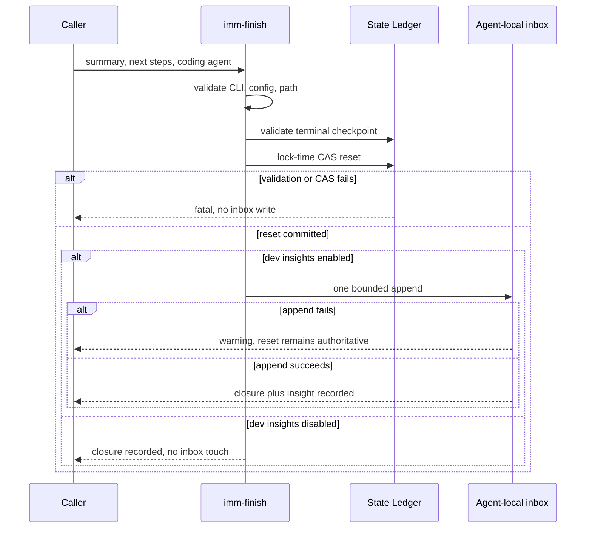

## Task

Restore the declared `imm-finish "<summary>" "<next steps>"` behavior in the TypeScript runtime without weakening closure authority, guessing host-local configuration ownership, or storing dev insights in the State Ledger.

**Design risk**: High - this changes the terminal workflow authority check, lock-time reset ordering, public CLI arguments, agent-local config consumption, and an opt-in user-global write surface. An ordering error can either reset an unclosed Plan or record an insight for a closure that never committed.

**Diagram decision**: required
**Diagram reason**: The reset CAS and best-effort external append cannot be atomic; a sequence diagram makes the authoritative ordering and partial-failure boundary explicit.

## Output Language

Human-readable Spec and Plan prose is English. CLI literals, environment variables, paths, state keys, and code identifiers remain unchanged.

## Origin

This is a direct Planner entry after the 2026-07-27 Brainstorm decision-probing iteration completed, passed independent QA and `imm-code-review`, and was compounded. During the explicit Compounder handoff, the host invoked:

```text
imm-finish "<summary>" "<next steps>"
```

The TypeScript command reset the iteration but ignored both arguments and did not evaluate or write the documented opt-in dev-insights inbox. The previous Plan is closed and the runtime is `idle` with `reset_reason: intentional_reset`, so this repair is a new slice rather than an append or post-closure rewrite.

No Brainstorm manifest applies. The problem and expected behavior are already concrete.

## Problem Statement

`plugins/immune-brain/dist/imm-compounder.md` and the root README declare `imm-finish "<summary>" "<next steps>"` as the normal closure entry and state that this path records dev insights. The current TypeScript `runFinishCommand(args, root)` ignores `args`, accepts any normalized ledger state, and only commits the idle reset.

The retired Python implementation provides historical evidence for the intended boundary:

- reject a non-closed iteration;
- treat the summary and comma-separated next steps as explicit record data;
- resolve an opt-in user-level inbox with `IMM_DEV_INSIGHTS` taking precedence over `[dev_insights]` config;
- reset authoritative project state;
- append a structured Markdown insight best-effort;
- never store the insight in `current_iteration.json`.

The restored behavior must use current agent-local roots rather than the retired `~/.immune-brain/` root, preserve lock-time CAS, and keep help and invalid-input paths free of state mutation.

## Technical Design

### Sequence Diagram



### 1. CLI modes

`imm-finish` supports two explicit modes:

1. `imm-finish` remains a compatibility reset-only form. It requires a finish-eligible iteration, performs no dev-insights config lookup, and creates no user-global file.
2. `imm-finish "<summary>" "<next steps>" --coding-agent <id>` is the record-aware form. `IMMUNE_BRAIN_CODING_AGENT` may supply the agent id when the flag is absent; the flag wins when both are present.

The record-aware form requires exactly two positional values. One positional value, more than two positional values, unknown flags, repeated `--coding-agent`, or a missing flag value fail before reading or mutating the State Ledger. `--help` and `-h` short-circuit with the full usage contract and no state access.

Summary and next-steps values are trimmed, must remain non-empty, reject NUL, and are limited to 4096 Unicode characters each. CR, LF, and tab characters are normalized to spaces before Markdown serialization so one argument cannot inject additional record fields.

### 2. Finish eligibility

Both modes use the same authoritative closure predicate as the terminal `imm-autowork` checkpoint:

- a valid current Plan exists;
- every Plan Step is `closed`;
- no active or pending follow-up remains;
- `requires_replan` is false;
- all required review gates for the current changed-file set have passed;
- the iteration has not already been reset with `runtime_status: idle` and `reset_reason: intentional_reset`.

A missing, malformed, open, rework, replanning, review-pending, or already-finished iteration is fatal. Failure leaves the ledger and inbox byte-for-byte unchanged.

### 3. Agent-local dev-insights settings

Extend the existing agent-local configuration type and helpers rather than adding a second parser.

The record-aware form resolves settings in this order:

1. `--coding-agent <id>`;
2. `IMMUNE_BRAIN_CODING_AGENT`;
3. `IMM_DEV_INSIGHTS=1|0` overrides the selected agent config's `enabled` value;
4. selected `<agent-local-root>/config.toml` `[dev_insights] enabled`;
5. disabled by default.

An invalid explicit `IMM_DEV_INSIGHTS` value is fatal in record-aware mode. The runtime must not inspect the retired `~/.immune-brain/` root and must not infer a coding agent from unrelated host environment variables.

The default inbox is `<agent-local-root>/insights/workflow-improvement-inbox.md`. A configured `inbox_path` may be absolute or `~`-prefixed; relative paths, NUL, or paths derived from summary/next-steps text are rejected before reset.

When dev insights are disabled, the command completes the authoritative reset but does not create an inbox directory, file, lock, or placeholder.

### 4. Structured insight record

When enabled, append one structured Markdown record compatible with the historical inbox consumer:

- date;
- project name;
- project path;
- workflow: `imm-finish`;
- context: normalized summary;
- friction: `Not specified`;
- evidence: `Closed via imm-finish`;
- suggested improvement: normalized next steps;
- severity: `medium`;
- status: `inbox`.

Do not include raw prompts, transcripts, diffs, provider metadata, token usage, environment dumps, or serialized ledger content. Errors and warnings must not echo summary or next-steps text.

### 5. Commit ordering and partial failure

All fatal CLI, closure, host, config, and path validation occurs before mutation. The command then commits the existing idle reset through lock-time CAS. Only after that commit succeeds may it append the optional inbox record.

This order is intentional:

- a stale CAS or reset failure writes no insight;
- an inbox failure cannot roll back or corrupt authoritative workflow closure;
- inbox failure returns success with a non-sensitive warning because dev insights are explicitly best-effort;
- a process crash after reset but before append may lose an optional insight. This first slice accepts that gap and does not add an outbox or retry ledger.

An already-finished iteration is rejected, so sequential retries cannot append duplicates. Concurrent calls race through the existing CAS; only the successful resetter may attempt the append. The append should use one bounded write operation and restrictive permissions for newly created local paths.

### 6. Contract and documentation parity

Update the TypeScript help, root README, plugin README, active Compounder contract, and agent-local config reference to describe:

- both CLI modes;
- explicit coding-agent selection for record-aware calls;
- closure eligibility;
- environment-over-config precedence;
- disabled no-write behavior;
- reset-before-best-effort-append semantics.

Generated packaged documentation must be refreshed through the existing dist sync tool rather than edited as an independent source of truth.

## Requirements

| ID | Requirement |
| --- | --- |
| FIN-REQ-001 | Record-aware `imm-finish` consumes validated summary, next steps, and explicit agent identity. |
| FIN-REQ-002 | Reset-only no-arg compatibility remains available without dev-insights writes. |
| FIN-REQ-003 | Finish rejects every non-terminal, review-incomplete, replanning, malformed, or already-reset iteration before mutation. |
| FIN-REQ-004 | Dev-insights enablement follows explicit agent-local config with `IMM_DEV_INSIGHTS` precedence and no retired-root fallback. |
| FIN-REQ-005 | Enabled record-aware finish appends one privacy-bounded structured Markdown entry after successful CAS reset. |
| FIN-REQ-006 | Disabled mode and every fatal failure leave the inbox untouched; append failure is a non-sensitive warning after successful reset. |
| FIN-REQ-007 | Existing closed-step history, validated Plan snapshot, idle status, reset reason, help behavior, wrapper forwarding, and CAS protection remain compatible. |
| FIN-REQ-008 | CLI, Compounder, README, config docs, packaged mirrors, and behavior tests describe one executable contract. |

## Acceptance Criteria

- `imm-finish "closed summary" "compound next" --coding-agent pi` resets a fully reviewed temporary iteration and appends exactly one entry when the temporary Pi config enables dev insights.
- `IMM_DEV_INSIGHTS=0` overrides enabled config and produces no inbox filesystem change.
- `IMM_DEV_INSIGHTS=1` overrides disabled config and writes to the selected agent's default or configured inbox.
- Record-aware invocation without an explicit agent id fails before reset.
- No-arg invocation remains reset-only and writes no insight.
- Open, replan, pending-review, malformed, duplicate-finish, invalid-argument, invalid-config, and stale-CAS cases leave both targets unchanged.
- An injected inbox failure occurs after reset, returns a warning without raw argument content, and leaves the iteration intentionally reset.
- Focused tests prove summary and next steps never enter State Ledger history or snapshots.
- Source/package documentation synchronization and `git diff --check` pass.

## Non-Goals

- Do not restore the retired Python runtime, `~/.immune-brain/` config root, memory-history rotation, workflow telemetry emission, or implicit `imm-dehydrate` invocation.
- Do not add `dev_insights` fields, an outbox, retry queue, append receipt, or insight payload to the State Ledger.
- Do not infer the host from `PI_*`, Codex, Cursor, Claude, or OpenCode marker variables.
- Do not make optional inbox delivery a prerequisite for authoritative closure.
- Do not migrate or deduplicate historical inbox entries.
- Do not change installer behavior or add another CLI wrapper.

## Security and Privacy

- Only explicit CLI data enters the insight record; no conversation or session context is captured implicitly.
- User text never participates in path construction and is normalized before Markdown serialization.
- Disabled and fatal paths perform no user-global filesystem write.
- Tests use temporary project roots and homes; they must never write the developer's real agent-local inbox.
- Error output names only the failed field or operation, not the supplied content.

## Verification

Run the focused behavioral and parity suite:

```bash
bun test tests/finish-dehydrate-runtime.test.ts tests/immune-brain-config-runtime.test.ts tests/plugin-package-runtime.test.ts tests/imm-follow-up-runtime.test.ts
bun scripts/sync-dist-docs.ts --check
plugins/immune-brain/bin/imm-plan docs/plans/2026-07-28-001-fix-imm-finish-dev-insights-contract-plan.md --json
git diff --check
```
