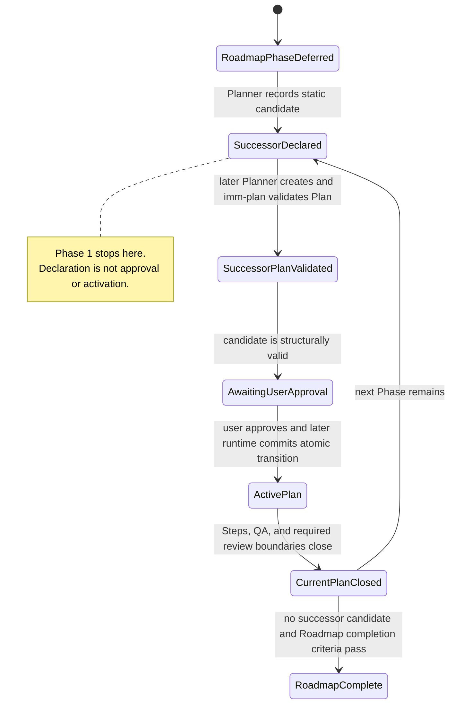
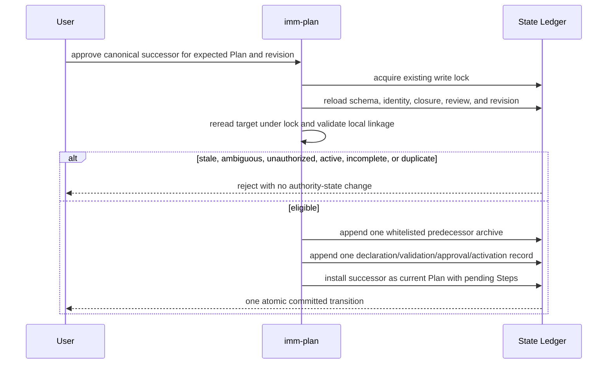

# Spec: Roadmap Plan Boundary and Successor Contract

**Task ID**: IMM-ROADMAP-SUCCESSOR-001
**Owner**: Planner
**Status**: Proposed
**Date**: 2026-07-28

**Design risk**: High
**Design rationale**: The work changes planning authority, Plan validation, future State Ledger transitions, cross-session continuity, and the boundary between Planner, QA, review, and runtime activation. Incorrect semantics could make oversized Plans appear valid or allow non-authoritative metadata to be mistaken for execution approval.

**Diagram decision**: required
**Diagram reason**: The distinction between a declared successor, a Planner-validated Plan, user approval, and runtime activation is a state-transition contract that is materially clearer as a diagram.

## 1. Goal

Make large Immune-Brain initiatives progress through a linear sequence of bounded, independently closable Plans without turning a Plan into a session budget or turning successor metadata into an execution engine.

The Roadmap remains the durable authority for full scope. Each executable Plan covers one coherent slice whose authority, risk, verification, and rollback boundaries belong together. A successor is only a planning candidate until Planner validation, explicit user approval, and a later runtime transition all occur.

## 2. Background

Immune-Brain already distinguishes a Roadmap from an executable Plan and preserves deferred phases. It also requires independently closable outcome Steps. The missing contract is at the Plan level:

- guidance to avoid combining several independent authority or review boundaries into one Plan;
- a static, durable way to name the current Roadmap Phase and candidate successor;
- a machine-checkable distinction between planning metadata and runtime authority;
- a deterministic handoff from one closed Plan to the next planning decision.

A representative session exposed the gap. One three-Step Plan combined a new audit foundation, an audit read surface, and human collaboration permission rollout. Its Step evidence covered 49 changed files, and post-Plan review required more work than the primary implementation because foundational redaction, scope, canonical writer, and atomicity invariants were reviewed only after many consumers had already been changed.

The corrective principle is not a fixed file, token, Step, compaction, or session limit. Plan boundaries are semantic. File count, domain count, verification breadth, and repeated review are scope-pressure evidence that Planner must explain, not universal execution gates.

## 3. Requirements

### R1. Plan-level boundary discipline

For Roadmap-backed work, Planner must distinguish Step granularity from Plan granularity:

- a Step remains one independently closable outcome unit and must not become a read/edit/test micro-step;
- a Plan covers one coherent executable slice;
- an independent authority, risk, verification, promotion, review, or rollback boundary should normally become a successor Plan rather than another large Step in the current Plan;
- infrastructure that establishes an invariant should normally close and pass review before broad consumer rollout begins.

The Planner must record a `Plan boundary` and `Boundary rationale`. The rationale must address outcome cohesion and the relevant authority, risk, verification, and rollback boundaries. File and domain counts may be included as scope-pressure evidence but cannot be the sole rationale.

### R2. Opt-in static Plan contract

A new Roadmap-backed Plan may opt into `Plan contract: roadmap-slice/v1`. That contract requires these Task fields:

- `Roadmap source`: referenced Spec/Roadmap path;
- `Current phase`: stable Phase ID within the referenced Roadmap;
- `Plan boundary`: the current executable slice;
- `Boundary rationale`: why the included Steps belong in one Plan;
- `Scope pressure`: advisory evidence considered by Planner, or `none`;
- `Successor candidate`: one stable Phase ID in the same Roadmap, or `none` for a terminal slice;
- `Successor preconditions`: what must be true before the candidate may be planned, or `none` when terminal;
- `Current-slice warning`: explicit statement that deferred phases are not implemented by this Plan.

These fields are static planning metadata. They do not create, validate, approve, activate, queue, or execute another Plan.

### R3. Linear successor declaration

`roadmap-slice/v1` supports zero or one direct successor candidate. Phase IDs use a stable identifier shape and must not be inferred from headings, array order, HANDOFF prose, or filenames.

Phase 1 validation must reject malformed Phase IDs, a successor equal to the current Phase, and a non-terminal successor without preconditions. It must not claim cross-file existence, predecessor, cycle, Roadmap membership, approval, or runtime-state validation until those capabilities exist in later phases.

### R4. Compatibility

Existing Plans remain valid without migration or rewrite. The new contract is opt-in:

- missing `Plan contract` preserves existing parsing and validation behavior;
- historical Plan, Spec, State Ledger, closed Step evidence, and review records remain unchanged;
- free-text uses of "next", "successor", "follow-up", or "handoff" are not reinterpreted as authoritative metadata;
- `current_iteration.json` schema v2 remains the current-Plan State Ledger during Phase 1.

### R5. Authority separation

The workflow must preserve these independent facts:

1. Roadmap identifies a candidate next Phase.
2. Planner creates and validates a successor Plan.
3. The user explicitly approves successor activation.
4. Runtime atomically switches the active Plan in a later phase.

QA closes only the current Step or same-boundary follow-up. Review may return same-boundary fixes to `imm-work`; findings that change the Spec, invalidate a planning invariant, or expand the Plan boundary return to Planner. Neither QA closure, HANDOFF content, parser success, Plan file existence, nor session continuation implies successor approval or activation.

### R6. User-owned session lifecycle

Immune-Brain must not create, close, or force a new session based on Plan boundaries, tokens, compaction count, tool calls, elapsed time, or review rounds. A user may continue in the current session or start a new one. Persisted Spec, Plan, State Ledger, and successor handoff artifacts must support either choice.

### R7. Successor handoff

A later workflow phase must persist an append-only successor handoff after the current Plan's required QA and review boundaries close. It must include:

- current Roadmap, Phase, Plan, and closure evidence references;
- inherited decisions and invariants;
- deferred scope and open questions;
- candidate successor and promotion evidence;
- explicit non-goals and blockers;
- the current authority boundary and next required user decision.

HANDOFF.md may mirror this information for humans but is not the execution authority.

### R8. Failure and correction semantics

Same-boundary defects remain follow-ups. A finding that changes accepted behavior, introduces a new authority domain, invalidates Technical Design, or requires a different verification/rollback boundary must produce replan or a new correction Plan. This classification is semantic; it is not based on a fixed number of review rounds.

Closed evidence is append-only. Replacement, skip, supersede, rollback, and correction actions must add new records rather than rewrite historical closure.

## 4. Non-Goals

- No automatic session creation, closure, compaction, or continuation policy.
- No token, file-count, domain-count, Step-count, elapsed-time, or review-round hard limit.
- No DAG, branch, merge, parallel active Plan, queue, or generic orchestrator.
- No automatic successor Plan creation or execution.
- No State Ledger successor state or activation command in Phase 1.
- No SQLite, global database, or second workflow authority.
- No bulk rewrite or migration of historical Plans, Specs, State Ledgers, HANDOFF files, or closed evidence.

## 5. Technical Design

### 5.1 Authority model

| Artifact or role | Authority |
| --- | --- |
| Spec/Roadmap | Full initiative scope, stable Phase IDs, acceptance criteria, promotion criteria, candidate next phases, deferred decisions, and non-goals |
| Plan | Current executable slice, outcome Steps, static Phase/successor declaration, verification and rollback evidence path |
| `imm-plan` | Pure parsing and validation of the declared Plan contract; no approval or activation authority |
| State Ledger | Current active Plan and Step lifecycle; later phases add atomic transition records without becoming the Roadmap authority |
| Planner | Creates or revises Specs/Plans and validates successor planning scope |
| User | Explicitly approves activation of a successor Plan and decides session lifecycle |
| QA/review | Close or return the current boundary; cannot select or activate successor Plans |
| HANDOFF.md | Human-readable continuity mirror; never the source of execution authority |

### 5.2 State separation



### 5.3 Phase 1 parser boundary

Phase 1 extends Plan parsing and validation only when `plan_contract` is `roadmap-slice/v1`. It may:

- preserve the new Task metadata in normalized JSON;
- require non-empty contract fields;
- validate stable Phase ID syntax;
- enforce zero-or-one scalar successor declaration;
- reject self-successor and missing preconditions;
- emit focused, deterministic errors or warnings.

It may not:

- read or write State Ledger transition state;
- validate user approval;
- resolve or create a successor Plan path;
- infer a successor from free text;
- mutate Plan, Spec, HANDOFF, or session state;
- claim Roadmap membership, predecessor consistency, cycle detection, or runtime readiness.

### 5.4 Interruption and rollback

Phase 1 consists of a documentation/template contract and a pure parser/validator extension. If interrupted, existing Plans continue to use legacy behavior. The contract Step can close independently before parser enforcement. The parser Step is additive and guarded by focused fixtures; reverting it does not require State Ledger or document migration.

Later runtime phases must use atomic compare-and-swap semantics already established by State Ledger writes. A stale session must fail closed rather than activate a different successor.

### 5.5 Phase 2 State Ledger transition contract

Phase 2 adds an explicit transition path for one closed `roadmap-slice/v1` Plan and one validated direct successor. It does not add a queue, scheduler, Roadmap parser, automatic activation, host workflow messaging, or session behavior.

#### 5.5.1 Version and persisted-state matrix

The transition path lazily upgrades the State Ledger from schema v2 to schema v3. Version handling is explicit:

- a valid schema v2 Ledger remains v2 across legacy single-Plan, legacy cross-Plan, same-Plan, Step, QA, review, finish, and dehydrate writes;
- the first approved Roadmap transition is the only P2 operation that upgrades v2 to v3;
- a valid schema v3 Ledger requires well-formed `closed_plan_history` and `plan_transition_history` arrays, and every existing writer must preserve them byte-for-semantics;
- schema v2 with transition fields, schema v3 with missing or malformed transition fields, conflicting archive identities, and unknown future schema versions fail closed rather than being repaired or downgraded;
- unknown non-transition fields remain part of the conservative revision input and are preserved, but they are not copied into a closed-Plan archive.

Schema v3 adds two append-only collections inside the existing State Ledger:

- `closed_plan_history`: immutable, Plan-scoped predecessor evidence snapshots;
- `plan_transition_history`: immutable authority records that reference one predecessor archive and separately preserve declaration, successor validation, explicit user approval, and activation facts.

A closed-Plan archive uses a whitelist schema. It stores an archive ID, canonical Plan identity and signature, the normalized validated Plan snapshot, normalized closed Steps and execution evidence, the slice of `follow_up_history` beginning at the predecessor's validated `review_follow_up_start_index`, the current required-gate review records, the final QA record, and the matching `finish_reset` timestamp. It does not recursively copy prior archives, prior transition records, global audit history, follow-ups before the current Plan marker, arbitrary top-level extensions, raw stdin, environment values, credentials, or session transcripts. Existing evidence normalization and redaction boundaries continue to apply.

A transition record contains a deterministic transition ID, predecessor archive reference, canonical predecessor and successor identities and signatures, predecessor/current and successor Phase IDs, normalized Roadmap source, the predecessor's declared candidate, lock-time validation timestamp, approval `{ actor: "user", approved_revision, recorded_at }`, and activation `{ committed_at }`. The active `steps`, `review_state`, and follow-up marker continue to describe only the newly installed current Plan.

Archive and transition payloads are constructed from normalized deep copies. Later current-Plan mutations cannot alias or rewrite archived evidence. Three or more sequential fixture transitions must grow history linearly: each transition adds exactly one Plan-scoped archive and one transition record without nesting earlier collections.

#### 5.5.2 Canonical identity, revision, and command grammar

The Phase 2 low-level command is:

```text
imm-plan <successor-plan> --sync --approve-successor --expected-current-plan <path> --expected-ledger-revision <revision>
```

Each transition option is accepted exactly once in either `--name value` or `--name=value` form. Duplicate options, missing values, option-looking values, extra positional arguments, and approval flags on validate-only or same-Plan requests are rejected before State Ledger access. The parser identifies the Plan positional argument independently from option values.

A canonical Plan identity is the normalized repository-relative path of a real regular Plan file under the project root. The transition path resolves relative, absolute, `.` and `..` aliases to that identity, rejects paths outside the root, and rejects symlinked Plan files so approval cannot name a different object from the file validated under lock. Persisted predecessor identity, expected predecessor input, target identity, archive identity, and transition identity all use this same canonicalization. Only canonical identities are persisted.

The read-only status surface exposes the canonical current Plan identity and an opaque ledger revision. The revision is lowercase fixed-length SHA-256 over a recursively key-sorted serialization of the complete normalized persisted Ledger, prefixed with the domain separator `immune-brain-ledger-revision/v1\0`. Array order remains significant; JSON whitespace and object-key order do not. All preserved unknown fields participate, while the derived revision itself is never persisted or included. Status must not expose archive/evidence content merely to provide the token.

The approval binds literal actor `user`, canonical expected predecessor identity, canonical target identity, validated target signature, and the approved revision. The revision does not replace lock-time compare-and-swap. Runtime acquires the existing Ledger write lock, reloads and normalizes the Ledger, compares the user's approved revision, then rereads and validates the target Plan from the canonical file under that lock. The lock-time target bytes produce the signature, snapshot, and installed Steps used by the commit; an earlier pre-lock validation cannot authorize different bytes.

#### 5.5.3 Contract guard and eligible predecessor

Ordinary cross-Plan `--sync` is allowed only when both persisted predecessor and requested target are legacy Plans without a declared `Plan contract`. If either side declares a Plan contract, ordinary cross-Plan sync fails closed. This prevents a contracted predecessor from being replaced by a legacy intermediate Plan and prevents a contracted target from bypassing explicit approval. Same-Plan revision sync retains its existing behavior and cannot include transition approval options.

The approved transition command requires both sides to use supported `roadmap-slice/v1`. A legacy-to-contracted, contracted-to-legacy, unsupported-contract, or missing-predecessor-snapshot transition is rejected in P2; broader migration remains P4.

The predecessor is eligible only when all of these lock-time facts hold:

1. its schema/version and transition collections are valid;
2. canonical `plan_path` and `plan_signature` match its `validated_plan_snapshot`;
3. `runtime_status` is `idle`, `reset_reason` is `intentional_reset`, and the latest matching `finish_reset` names this canonical Plan;
4. every current Step state is exactly `closed`, no active-like Step or `active_step` exists, `next_action` is empty, `requires_replan` is false, and `pending_follow_up` is exactly `null`;
5. required review gates are derived from this Plan's normalized execution evidence and current-Plan follow-up slice, and every gate has a current changed-files signature pass in `review_state`; `last_review` alone is not authority;
6. the predecessor and target have distinct canonical identities and signatures;
7. the predecessor `Successor candidate` is not `none`, equals the target `Current phase`, and both Plans declare the same normalized Roadmap source;
8. the target passed lock-time `imm-plan` validation and has not already been activated.

This proves local linkage between two contracted Plan snapshots, not Roadmap membership, phase order in the Spec, predecessor graph validity, or cycle freedom. Runtime and user-facing output must not claim that Roadmap membership or workflow continuation is validated; those remain P4 and P3 respectively.

#### 5.5.4 Atomic facts, duplicate rules, and commit sequence

Declaration, validation, approval, and activation are separate fields in one committed event, not recoverable intermediate Ledger states. Declaration references the predecessor's already persisted snapshot. Validation records the lock-time target parse/signature. Approval records literal user authority bound to the expected revision and identities. Activation is synonymous with the successful atomic commit. P2 stores no approved-but-inactive record, scans no pending approvals, and performs no automatic retry or replay.

The transition ID is a domain-separated deterministic hash over canonical predecessor identity/signature, canonical successor identity/signature, normalized Roadmap source, and the two Phase IDs; the approved revision is evidence but is not part of transition identity. Runtime rejects an existing transition ID, a target already present as a historical successor, a current Plan already equal to the target, a distinct path with the same target signature, and a transition whose predecessor is not the current linear history tail.



The successful commit upgrades to schema v3 when needed, clears current-Plan review gates, advances the follow-up review marker to the existing history boundary, installs only successor Steps as pending, clears `intentional_reset`, and appends exactly one audit event inside the same Ledger transaction. Historical follow-up, archive, and transition collections are retained without recursive copying.

#### 5.5.5 Recovery, rollback, security, and test boundary

Every grammar, identity, schema, precondition, validation, duplicate, lock, stale-revision, and injected-interruption failure leaves persisted authority state byte-identical, reports no successful approval, and creates no external audit record. Temporary lock/write artifacts created by the command must be removed through the existing lock lifecycle; the command must not leave a new stale temp or lock. The target Plan, HANDOFF, session files, and developer-insight inbox remain unchanged. Existing stale-temp cleanup behavior is not expanded into lock reclamation.

After a successful transition, rollback does not delete or rewrite the transition or predecessor archive. A bad successor follows the existing replan/correction path. Any future reverse move is a new explicitly approved append-only transition, not an undo mutation.

P2 tests cover the full any-side contract guard matrix, attempted legacy wash-through, canonical relative/absolute/dot aliases, outside-root and symlink rejection, duplicate/missing/ambiguous options, lock-time target replacement, stable revision serialization, unknown-field revision changes, opaque status output, the complete eligible-predecessor predicate, malformed v3 and unknown future versions, v3 history preservation by existing writers, three-transition linear archive growth, Plan-scoped follow-up selection, sensitive/unknown-field exclusion, duplicate/history-chain conflicts, stale and concurrent writers, interruption, legacy and same-Plan controls, and no HANDOFF/session/external-audit writes.

### 5.6 Phase 3 workflow progression and handoff contract

Phase 3 projects the persisted current-Plan and successor facts into read-only workflow status, host checkpoints, and human handoff surfaces. It does not create a successor Plan, infer a target path from a Phase ID, approve a transition, mutate session state, or repair historical pre-Phase-2 activations.

#### 5.6.1 Read-only successor decision projection

`imm-work status --json` exposes a derived `ledger_revision` and, for a valid current `roadmap-slice/v1` Plan whose `Successor candidate` is not `none`, one `successor_decision` object. The projection contains the canonical current Plan identity, current Phase, declared successor candidate, successor preconditions, literal authority `user`, the opaque expected Ledger revision, and a structured non-executable command template that still requires one separately created and validated successor Plan path. The projection is derived on read and is never persisted as a second approval or workflow authority.

Because the repository's closed P2 Ledger predates this public status field, P3 activation has one prerequisite: reopen the passed P2 `imm-code-review` gate through a bounded same-boundary follow-up that adds only `ledger_revision` to `imm-work status --json`, then close independent QA/review while retaining the existing matching `finish_reset` and `intentional_reset`. The follow-up uses the already exported `buildLedgerRevision` primitive; it does not add successor projection, change schema, rewrite P2 Plan Steps, synthesize transition history, or emit a duplicate finish event. The supported status output, not a manually reproduced hash, supplies the expected revision for P2-to-P3 activation.

Runtime rereads the canonical current Plan, validates it, and requires its signature to match the persisted `plan_signature` before exposing successor facts. Missing, malformed, moved, or signature-drifted current Plans make the status request fail as one unit with exit code `1`, empty stdout, and one deterministic stderr reason; runtime emits neither revision-only success nor a partial `successor_decision`. Every failure leaves Ledger, HANDOFF, session, and inbox bytes unchanged. Terminal Plans with `Successor candidate: none` expose no successor approval request. Active, review-pending, and replan states may expose revision and candidate context, but they never become transition-eligible merely because the projection exists.

The `imm-plan` command manifest and help/usage surfaces document `--approve-successor`, `--expected-current-plan`, and `--expected-ledger-revision` in both `--name value` and `--name=value` forms. Documentation must distinguish a command template from approval: only a literal user invocation with a concrete validated successor path may activate the P2 transition path.

#### 5.6.2 Closure and checkpoint ordering

The existing Plan closure sequence remains ordered:

1. every current Step closes through independent QA;
2. every runtime-required review gate passes for the current changed-files signature;
3. `imm-autowork` returns the existing explicit `imm-compounder` handoff while the Plan has not been intentionally finished;
4. after record-aware `imm-finish` writes `runtime_status: idle` and `reset_reason: intentional_reset`, a non-terminal successor changes the checkpoint to `awaiting_user_successor_decision`.

`awaiting_user_successor_decision` is a terminal host-loop stop, not an executable auto-advance action. Its recommended authority is `user`; its required input carries the current Plan identity, Phase, candidate, preconditions, and expected revision; and its visible Next Action asks the user whether to create/validate or approve one successor Plan. `imm-loop` does not dispatch Planner, transition, Compounder, session creation, or another host on the user's behalf at this boundary.

A terminal Roadmap slice (`Successor candidate: none`) does not emit the successor-decision stop. Review-required, follow-up, rework, and replan checkpoints retain priority over successor messaging, so no candidate can hide an unresolved current-Plan boundary.

#### 5.6.3 Role authority and HANDOFF projection

Planner may create and validate a successor Plan but cannot approve or activate it. QA pass and review-gate pass close only the current Step or review boundary; neither command accepts successor identity, approval revision, or activation options. Runtime transition history can grow only through the P2 approved transition command.

HANDOFF and the exact runtime rehydration surfaces `imm-work status --json` and `imm-autowork --json` mirror the same read-only successor decision fields: current Plan and Phase, closure/review state, declared candidate and preconditions, expected Ledger revision, explicit next user decision, and deferred scope. HANDOFF remains prose, may be stale, and is never consumed as transition authority. Continuing in the same session or a new session must produce the same checkpoint from identical Spec, Plan, and Ledger bytes.

#### 5.6.4 Historical bootstrap and P4 boundary

This repository's P1-to-P2 activation occurred through the legacy cross-Plan sync path before the P2 guard existed. Phase 3 must not synthesize declaration, validation, approval, activation, archive, or schema-v3 history for that event. The closed schema-v2 P2 Ledger is a compatibility bootstrap fixture: the first real approved P2-to-P3 transition appends one truthful predecessor archive and transition, and optional historical adoption/migration policy remains Phase P4.

P3 tests therefore prove forward correctness from a closed schema-v2 contracted predecessor without asserting a fabricated P1-to-P2 record. Secret scanning is not part of this Plan: the prior gitleaks claim has no reproducible finding in the available project diagnostics, and adding a scanner or upstream credential cleanup would create an unrelated security-maintenance boundary.

### 5.7 Phase 4 compatibility and end-to-end acceptance contract

Phase 4 is the terminal executable slice for compatibility and acceptance. It may add one derived terminal checkpoint, end-to-end fixtures, and host/package transport coverage. It does not add a State Ledger schema, historical adoption record, Roadmap topology parser, progress view, queue, scheduler, or session controller.

#### 5.7.1 Local terminal completion projection

After a valid contracted Plan with `Successor candidate: none` has closed every Step, passed every required review gate, handed off explicitly to Compounder, and committed a matching `imm-finish`, `imm-autowork --json` returns a derived terminal checkpoint:

- `stop_reason: terminal_plan_complete`;
- `next_recommended_skill: null`;
- `recommended_authority: null`;
- `allowed_actions: []`;
- `required_input: null`;
- `handoff_only: true`;
- `successor_decision: null`;
- the same opaque `ledger_revision` exposed by `imm-work status --json`;
- `next_action: "Terminal Plan is finished; no successor Plan is declared."`.

This projection is local Plan truth, not global Roadmap membership or topology proof. Runtime must not label the state `roadmap_complete`, because it does not parse the Roadmap or evaluate cross-file phase order. Before `imm-finish`, the existing explicit Compounder handoff remains authoritative. Active Step, QA, review, follow-up, rework, and replan states retain priority. Legacy Plans without `roadmap-slice/v1` keep their existing post-finish behavior for compatibility. The projection is read-only and creates no Ledger, HANDOFF, session, or inbox write.

#### 5.7.2 Compatibility and historical adoption policy

Valid schema-v2 Ledgers remain schema v2 through ordinary same-Plan lifecycle writes. Schema v3 archive and transition collections remain append-only and are never reconstructed from prose or file order. P4 adopts an explicit no-backfill policy for the repository's pre-contract P1-to-P2 bootstrap: no migration command, `adopted`, `superseded`, or synthetic transition record is added. The first truthful P2-to-P3 record remains the first transition.

A successful user-approved P3-to-P4 activation must append exactly one P3 archive and one P3-to-P4 transition, preserve the existing P2 archive and P2-to-P3 transition, install only pending P4 Steps, and leave P1 absent from both append-only collections. Validation-only P4 planning does none of these writes.

`superseded` is an acceptance scenario, not a new persisted Plan state. Before approval, the user may choose a different validated Plan for the same declared candidate; unchosen candidates leave no Ledger record. After activation, history cannot be superseded by rewriting: a defect follows same-boundary rework/replan or a later separately specified, explicitly approved append-only correction Plan. The P4 mainline harness ends at terminal P4 and does not invent a successor for it. Existing synthetic linear-history compatibility tests remain the executable evidence that later correction records append without nesting or rewriting prior records.

#### 5.7.3 Fresh-process linear acceptance harness

P4 acceptance uses isolated project roots and fresh CLI process invocations through the packaged wrappers. The successful path must exercise this sequence as observable behavior:

1. close and finish one contracted predecessor with current review gates;
2. validate a concrete successor without writing authority state;
3. read the current opaque revision from supported status output;
4. invoke one literal revision-bound user approval;
5. observe one atomic archive/transition append and successor-only pending Steps;
6. execute, QA, review, Compounder handoff, and finish the terminal successor;
7. observe the local terminal checkpoint with no further automatic action.

The failure matrix covers stale revisions, duplicate activation, active or review-pending predecessors, interrupted/competing writes, missing or replaced Plan files, pre-approval candidate replacement, contracted terminal behavior, legacy/schema-v2 controls, and no external writes. Each failure must be deterministic and leave persisted authority bytes unchanged except when the scenario explicitly models an independently committed competing writer. Append-only correction remains a separate compatibility assertion over synthetic transition histories; it is not a fabricated post-terminal P4 transition.

Fresh process boundaries stand in for session continuation: identical Spec, Plan, Ledger, and plugin package bytes must produce identical status and next authority without reading a session ID, transcript, HANDOFF prose, or host conversation memory.

#### 5.7.4 Supported-host and package acceptance boundary

The shipped host inventory is explicit: the root Pi package, Codex/Claude Code/Cursor plugin manifests, the OpenCode package plus TypeScript adapter, and the shared `plugins/immune-brain/bin/imm-*` wrappers over one CLI runtime. Host manifests and the Pi package must share the release version selected by the existing versioning contract.

The common CLI runtime remains the only workflow authority. Host adapters may translate structured inputs but may not infer approval, cache a revision, synthesize a successor path, or create host-specific workflow state. No currently shipped structured adapter provides a trustworthy literal-user provenance signal, so agent-callable tools remain validation/status transports and must not expose `--approve-successor`, `--expected-current-plan`, or `--expected-ledger-revision` as activation fields. OpenCode's `imm_plan_validate` continues to omit those fields and tests must prove that supplying similarly named extra arguments cannot produce an approval command. Successor activation remains a direct plugin-local CLI invocation entered by the user with one concrete validated path and fresh revision.

Hosts without a structured adapter continue to use the packaged Skill plus plugin-local wrapper contract. The P4 supported-host claim is deliberately limited to shipped artifacts: Pi package metadata, Codex/Claude Code/Cursor manifests and assets, OpenCode schema/argv behavior, and shared standalone wrappers. It does not claim live vendor loading, UI behavior, or session orchestration.

Package acceptance copies the shipped plugin into an isolated temporary location with no source-checkout runtime fallback, invokes its wrappers against a separate target project, and verifies command-manifest, status, transition grammar, skill/manifest, version, and dist-doc parity. OpenCode adapter tests also prove mapped commands remain inside `list-commands --json`. These tests establish the repository's executable host/package contract; they do not claim vendor UI automation or control of live host sessions.

#### 5.7.5 Recovery and rollback

P4 activation is append-only and is never rolled back by deleting the P3 archive or P3-to-P4 transition. If implementation fails after activation, the P4 Plan remains current and follows normal rework, replan, or later correction semantics. The terminal projection can be rolled back only as one coherent runtime/role/test change; removing it restores the previous terminal post-finish checkpoint without touching persisted history. Because the later acceptance suites depend on that projection, rolling back the terminal change must also remove or explicitly downgrade every E2E and package assertion that claims `terminal_plan_complete`. Rolling back the fresh-process lifecycle harness likewise prevents the package suite from claiming complete linear-lifecycle acceptance; artifact/version checks may remain only under their narrower names.

An interrupted test or package-copy run uses temporary roots and must not mutate the repository Ledger, HANDOFF, session files, developer inbox, or installed host configuration. Existing fail-closed lock ownership and manual stale-lock recovery remain unchanged.

#### 5.7.6 Verification boundary

P4 verification combines focused terminal tests, a fresh-process linear acceptance harness, transition/state/workflow compatibility suites, standalone package/host contract tests, deterministic dist sync, plugin version validation, runtime build, Plan validation, LSP diagnostics, and `git diff --check`. Presence-only assertions cannot close a Step: tests must execute wrappers or adapters, compare authority bytes and revisions, and assert exact stop/command semantics.

### 5.8 Alternatives considered

1. **Documentation-only guidance**: rejected as insufficient because field drift and malformed successor declarations would remain invisible.
2. **State Ledger Plan queue in Phase 1**: rejected because it mixes Roadmap scope with current execution state before identity, approval, and recovery semantics are stable.
3. **New Initiative/Program manifest**: deferred. The existing Spec/Roadmap can own linear topology until a demonstrated need exceeds it.
4. **Fixed Plan size thresholds**: rejected because semantic cohesion, not file or token count, determines a valid Plan boundary.
5. **Automatic successor activation**: rejected because it bypasses Planner and user authority.
6. **Eager schema v2 migration**: rejected because existing single-Plan projects do not need transition state and historical ledgers must remain readable without bulk rewrite.
7. **Separate approval and activation commands with a pending queue**: rejected for Phase 2 because it creates resumable scheduling state. One explicit revision-bound command may persist approval and activation as separate facts inside one atomic transition record without introducing a queue.
8. **Persisted historical adoption or superseded markers**: rejected for P4 because they would create new authority facts for events that did not pass the transition contract. Pre-approval alternatives stay non-authoritative; post-activation correction is append-only.
9. **Runtime `roadmap_complete` claim**: rejected because current runtime validates local Plan linkage only and does not prove global Roadmap membership or topology. P4 uses `terminal_plan_complete` for local truth.
10. **Separate workflow state machines per host**: rejected because host adapters transport the shared CLI contract and must not become additional workflow authorities.

## 6. Roadmap

### Phase P1: Successor-ready planning contract

**Goal**: New Roadmap-backed Plans can declare and validate a bounded executable slice plus one non-authoritative successor candidate without changing runtime state.

**acceptance_criteria**:

- Planner guidance distinguishes Plan boundary decisions from Step decomposition and session lifecycle.
- `roadmap-slice/v1` Task metadata is documented consistently in Planner guidance, planning quality gate, canonical vocabulary, and Plan template.
- `imm-plan --json` preserves valid static metadata and deterministically rejects malformed opt-in metadata.
- Legacy Plans without the opt-in contract remain valid without migration or changed runtime behavior.
- Tests prove successor declaration does not imply Plan creation, user approval, State Ledger mutation, or activation.

**promotion_criteria**:

- Phase P1 Plan passes focused contract, parser, packaged-doc sync, and `imm-plan --json` verification.
- Static metadata names and authority boundaries are stable enough to design persisted transition state.
- No Phase P1 implementation requires changing `current_iteration.json` schema v2.

**candidate next Plan**: Phase P2 State Ledger transition contract.

**deferred**:

- Persistent user approval representation.
- Atomic active Plan switching and stale-writer recovery.
- Cross-file Phase membership, predecessor, and cycle validation.

### Phase P2: State Ledger transition contract

**Goal**: State Ledger can persist an append-only, atomic transition from one closed Plan to one user-approved successor while retaining current-Plan-only execution semantics.

**acceptance_criteria**:

- Plan closure, successor declaration, Planner validation, user approval, and runtime activation are represented as separate facts.
- Atomic activation rejects stale revisions, double activation, active-Step conflicts, and unauthorized candidates.
- Closed Plan and Step evidence remains immutable and traceable after cross-Plan sync.
- Existing single-Plan State Ledger fixtures remain readable through an explicit compatibility strategy.

**promotion_criteria**:

- State machine design passes high-risk preplan review.
- Recovery, idempotency, rollback, and schema compatibility tests are specified before implementation.
- Phase P1 metadata contract remains sufficient or is revised by Planner before runtime work.

**candidate next Plan**: Phase P3 workflow role and successor handoff integration.

**deferred**:

- Host workflow messaging and HANDOFF projection.
- Cross-host UAT and optional migration tooling.

### Phase P3: Workflow progression and handoff

**Goal**: Planner, `imm-work`, `imm-loop`, QA, review, and HANDOFF surfaces progress a closed Plan to the next explicit user decision without crossing authority boundaries.

**acceptance_criteria**:

- A closed current Plan with a successor stops at an explicit transition boundary rather than reporting the Roadmap complete.
- Same-boundary follow-ups return to `imm-work`; structural or scope-changing findings return to Planner.
- HANDOFF and rehydration expose the same successor facts while State Ledger remains authoritative.
- The user can continue in the current session or a new session with identical workflow semantics.
- No host automatically creates, closes, or selects a session.

**promotion_criteria**:

- Runtime transition tests from Phase P2 pass.
- Cross-role contract tests prove QA and review cannot approve or activate a successor.
- User-facing Next Action wording is stable across supported hosts.

**candidate next Plan**: Phase P4 compatibility and end-to-end acceptance.

**deferred**:

- Historical artifact migration and Roadmap progress views.

### Phase P4: Compatibility and end-to-end acceptance

**Goal**: Existing projects and supported hosts adopt linear multi-Plan progression without historical rewrites or workflow regressions.

**acceptance_criteria**:

- Legacy Plans and State Ledger schema v2 fixtures continue through existing single-Plan paths.
- New opt-in Roadmaps complete a two-Plan sequence with explicit user approval and no duplicate activation.
- Interrupted, stale, blocked, pre-approval replacement, append-only correction, and contracted terminal-Plan scenarios have executable tests.
- The Pi package, Codex/Claude Code/Cursor manifests, OpenCode adapter, shared wrappers, and packaged docs remain synchronized with source contracts.
- Fresh CLI processes over identical Spec, Plan, Ledger, and package bytes produce identical progression semantics without session identity.

**promotion_criteria**:

- End-to-end behavior, compatibility, standalone package, and supported-host contract suites pass.
- The local terminal completion projection passes exact payload, priority, legacy-control, and no-write tests.
- No unresolved high-risk review finding remains.

**candidate next Plan**: none.

**deferred**:

- DAGs, parallel active Plans, automatic scheduling, and project-management UI.

## 7. Acceptance Criteria for the Full Roadmap

- A large initiative can be represented as a Roadmap with stable linear Phase identities and multiple bounded executable Plans.
- Planner explains Plan boundary cohesion using semantic authority, risk, verification, and rollback reasoning.
- Static successor metadata cannot be mistaken for approval or activation.
- Exactly one Plan is active at a time, and a successor activates only after Planner validation plus explicit user approval.
- Plan closure does not imply Roadmap completion when a required successor remains.
- Users retain complete control over whether progression continues in the current session or another session.
- Existing Plans and closed evidence remain valid and unchanged by default.
