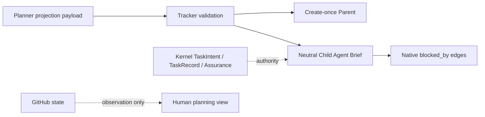

# Spec: Agent-Ready GitHub Initiative And Task Projection

**Task ID**: `2026-08-25-003-agent-ready-github-issue-projection`
**Owner**: user
**Status**: Proposed
**Design risk**: High
**Design risk reason**: The change crosses the GitHub tracker operation contract, Planner guidance, packaged skill output, native Issue dependency projection, and deterministic tracker tests while preserving Kernel authority boundaries.
**Output language**: English

**Diagram decision**: required
**Diagram reason**: The projection has separate Parent, Child, native dependency, TaskIntent, and internal Agent-handoff boundaries that are easier to audit as a flow than as prose alone.

## Brainstorm Trace

| Manifest ID | Status | Mapping |
| --- | --- | --- |
| `BR-REQ-ISSUE-CONTRACT` | covered_by_step | The Child Issue becomes a durable behavior contract suitable for a fresh Agent. |
| `BR-DEC-AGENT-BRIEF` | covered_by_step | The Child body adopts Agent Brief sections without becoming Kernel authority. |
| `BR-DEC-PARENT-CONTEXT` | covered_by_step | The Parent body receives stable Initiative context sections. |
| `BR-DEC-RESULT-TITLE` | covered_by_step | Titles lead with the human-visible result and omit Task IDs. |
| `BR-DEC-HIERARCHICAL-TITLE` | covered_by_step | Titles use `[initiative/slice] result`. |
| `BR-DEC-NO-IB-PREFIX` | covered_by_step | The old `[IB:...]` title prefix is removed; hidden markers remain. |
| `BR-DEC-BLOCKING-EDGES` | covered_by_step | Native GitHub blocking edges and readable `Blocked by` text are projected. |
| `BR-DEC-NONAUTHORITY-HANDOFF` | covered_by_step | Agent handoff is explanatory only and excludes internal reservation data. |
| `BR-DEC-OPTIONAL-STORIES` | captured_as_decision | User Stories are not required for engineering Initiative projection. |
| `BR-OUT-GITHUB-AUTHORITY` | covered_by_step | GitHub state remains outbound observation and never gates Kernel workflow. |
| `BR-OUT-TASKINTENT-DUPLICATION` | covered_by_step | Mutable TaskIntent paths, execution scope authority, and runtime state are not copied into Issue authority. |

## Problem

The current GitHub Parent and Child bodies are intentionally minimal, but they
are too sparse for the workflow now expected of them. Titles are dominated by
internal identifiers, Child Issues omit current and desired behavior, stable
interfaces, verification intent, explicit exclusions, and blocking context, and
there is no native dependency projection. A fresh Agent or maintainer must
recover the useful contract from the original conversation or local planning
artifacts.

The existing tracker already has the correct authority and idempotency boundary:
Kernel TaskIntent, TaskRecord, and Assurance remain authoritative; GitHub is
optional outbound visibility; marker lookup and post-mutation rereads handle
uncertain remote results. This change improves the projection's writing quality
without changing that boundary.

## Result

A GitHub Initiative Parent is created once with stable, source-owned planning
context: Problem, Result, Decisions, Testing strategy, Out of scope, and Slice
summaries. A validated TaskIntent is projected as one Child Issue whose title is
`[<initiative>/<slice>] <result>` and whose body is a durable Agent Brief:
Parent, What to build, Current behavior, Desired behavior, Key interfaces,
Acceptance criteria, Verification, Blocked by, Out of scope, Agent handoff, and
Authority boundary.

The Child remains an open, neutral projection until the existing exact terminal
projection closes it. Blocking edges are projected through GitHub's native issue
dependency API when blockers resolve to exact marker-owned Task Issues; readable
blocking references remain in the body. Dependency and frontier state are
observation only and never affect Enrollment, execution, QA, Review,
authorization, or Kernel settlement.

## Technical Design

### Projection input

The tracker operation receives bounded public projection fields in addition to
canonical TaskIntent data. The tracker strictly validates and redacts these
fields, rereads the canonical TaskIntent for identity, risk, and acceptance, and
never stores a TaskIntent path, Issue number, URL, scope authority, or mutable
Kernel state as execution input. Existing CLI behavior remains JSON-only; the
Planner supplies a complete projection payload through the canonical tracker
wrapper before the first remote mutation.

### Parent

`create-initiative` accepts the stable Initiative context and Slice summaries.
The Parent title is `[<initiative>] <initiative result>` and the body contains
one exact Initiative marker plus one exact marker per Slice. The tracker creates
it once, confirms exact convergence after a lost response, and never rewrites an
existing Parent. Later human edits remain source-owned.

### Child

`upsert-task` renders the Agent Brief sections from bounded public projection
fields and canonical acceptance assertions. The title is
`[<initiative>/<slice>] <result>`. The existing identity markers remain hidden
and exact. The body explicitly says that the Issue is outbound visibility only,
that Kernel artifacts remain authoritative, and that internal role prompt,
review-gate, and reservation details are not part of the external handoff.

### Blocking edges

Each blocker is identified by an immutable Task ID. The tracker resolves the
blocker to exactly one marker-owned Child Issue and its numeric GitHub database
ID, rejects missing or ambiguous ownership without mutation, and creates the
native `blocked_by` relation after Child creation. It confirms existing edges
before adding them, so retries are idempotent. The body lists the same stable
blocker references for human readability. GitHub dependencies are never read
back into Kernel or used as an authority gate.

### Compatibility and failure behavior

Existing marker identity, carrier conflict checks, Child attachment checks,
terminal projection, redaction, bounded `gh` execution, and result classes are
preserved. A malformed projection, missing blocker, duplicate marker, foreign
parent, unsupported dependency API response, or ambiguous remote state fails
closed with the existing tracker result classes. A lost create or dependency
response is retried by exact lookup and post-mutation observation. The Parent is
never automatically rewritten, and a tracker failure never rolls back or blocks
Kernel work.

### Agent boundary

The external `Agent handoff` section describes the bounded TaskIntent result,
expected focused checks, authority owner, and explicit non-goals. It does not
contain internal `role_prompt_bridge` packets, tool policies, review gates,
model reservations, prompt digests, or instructions that can widen scope or
settle QA. Internal role dispatch remains governed by ADR 0003 and the existing
Loop bridge.

## Scope

The implementation scope is limited to:

- `plugins/immune-brain/runtime/github_issue_tracker.ts`
- `plugins/immune-brain/skills/imm-planner/SKILL.md`
- `plugins/immune-brain/dist/imm-planner.md`
- `tests/plugin-package-runtime.test.ts`
- `docs/specs/2026-08-25-003-agent-ready-github-issue-projection.spec.md`
- `docs/specs/archive/initiative-tracking-carrier-simplification.spec.md` only if a direct historical contract reference must be updated; otherwise no archive mutation is required
- `docs/plans/2026-08-25-003-agent-ready-github-issue-projection.intent.json`

The active Spec and its archive predecessor are included in the planning
reference closure; the archive is read-only historical evidence unless a direct
contract reference proves an edit necessary.

## Verification Decisions

Use `tests/plugin-package-runtime.test.ts` as the highest existing behavioral
seam. Its Fake GitHub transport already verifies Parent creation, Child creation,
native Sub-issue attachment, redaction, canonical TaskIntent publication, and
terminal projection. Extend that seam to assert rendered title/body contracts,
marker stability, exact blocking-edge creation and idempotent retry, ambiguous
blocker failure, and the source/packaged Planner contract parity. This avoids a
second tracker harness and tests the external observable behavior rather than
private string helpers.

Focused acceptance commands:

- `bun test tests/plugin-package-runtime.test.ts`
- `bun test tests/plugin-package-runtime.test.ts && bun scripts/sync-dist-docs.ts --check`

The first command exercises the tracker behavior and contract assertions. The
second proves the packaged Planner contract remains synchronized. Full `bun test`
is deferred to Loop QA because it is not a focused acceptance descriptor.

## Execution Step

### Step 1: Publish agent-ready Initiative and Task projections

- **Result**: GitHub Initiative and Task projections expose durable result-oriented Agent Briefs with exact native blocking edges while Kernel remains the sole authority.
- **Scope**: `plugins/immune-brain/runtime/github_issue_tracker.ts`, `plugins/immune-brain/skills/imm-planner/SKILL.md`, `plugins/immune-brain/dist/imm-planner.md`, `tests/plugin-package-runtime.test.ts`
- **Verification**: `bun test tests/plugin-package-runtime.test.ts && bun scripts/sync-dist-docs.ts --check`
- **Verification type**: automated
- **Failure behavior**: If rendering, dependency lookup, or post-mutation confirmation fails, return the existing non-authoritative tracker failure result and preserve all local Kernel artifacts and remote source-owned Parent content.
- **Security considerations**: Keep all public text bounded and redacted; reject token-like identifiers and marker injection; never expose internal prompt digests or authority credentials.
- **Discovery cache**: `plugins/immune-brain/runtime/github_issue_tracker.ts` (projection renderer and remote dependency operations); `tests/plugin-package-runtime.test.ts` (Fake GitHub observable seam); `plugins/immune-brain/skills/imm-planner/SKILL.md` (Planner publication contract); `plugins/immune-brain/dist/imm-planner.md` (packaged contract parity).

## Assumptions

- The repository's configured Initiative carrier remains `github` by the global
  `AGENTS.md` default, subject to literal-user confirmation of the Initiative
  slug before remote mutation.
- GitHub native issue dependencies are available through the existing `gh api`
  transport; unsupported or unavailable endpoints fail as non-authoritative
  retryable or permanent tracker results.
- Existing Planner publication occurs only after canonical TaskIntent authoring
  and validation; this Spec does not change Enrollment or terminal settlement.

## Devil's Advocate Audit

- **Rollback resilience**: The change is one atomic projection contract. A
  failed render or dependency mutation leaves Kernel state untouched; remote
  create and attach operations are independently observed and retried by marker
  lookup. Rollback means reverting the complete tracker, Planner source/dist,
  and focused-test change before starting another projection attempt; no
  persisted TaskRecord schema migration is required.
- **Verification vanity**: Tests assert the actual Fake GitHub request payloads,
  rendered titles and bodies, marker ownership, native dependency calls,
  idempotent retries, and failure classifications. They do not merely search for
  section names in source text.
- **Spec dilution detection**: All confirmed Brainstorm decisions are mapped in
  the Brainstorm Trace. The plan does not omit Agent Brief structure,
  result-oriented titles, blocking edges, or the non-authority boundary to avoid
  the tracker work; User Stories are intentionally recorded as optional rather
  than silently dropped.

## Non-goals

- Making GitHub state an execution or authorization authority
- Importing GitHub Issue status or dependencies into Kernel
- Exposing internal role delegation packets through Issues
- Adding a generic subagent registry or a new Issue reconciler
- Rewriting existing Parent Issues after creation
- Copying mutable TaskIntent paths, scope authority, or runtime state into GitHub
- Adding a mandatory User Story section to engineering projections
