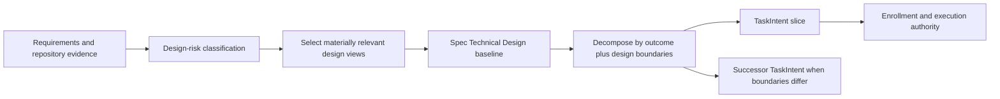

# Spec: Planner Technical Design Decomposition

**Task ID**: `2026-08-25-001-planner-technical-design-decomposition`
**Owner**: user
**Status**: Proposed
**Design risk**: High

This change strengthens a packaged Planner contract that governs architecture and
TaskIntent decomposition across repositories. It spans the host-discoverable Skill
entry, the packaged detailed contract, a packaged reference mirror, and focused
contract tests. It changes no Kernel schema, execution authority, or persisted
workflow state.

**Diagram decision**: required
**Diagram reason**: A compact diagram clarifies how requirements select applicable
technical-design views and how the resulting boundaries constrain TaskIntent
slices without creating a second planning authority.

## Goal

Require `imm-planner` to produce an explicit, decision-based Technical Design for
Medium- and High-risk work. The design must select and document the architecture
views that materially affect the change, including architecture layers, service
or component interfaces, data flow, state transitions, and temporal sequencing.
The selected design boundaries must become one input to TaskIntent decomposition.

## Problem

The current Planner contract already classifies Technical Design depth and names
boundaries, interfaces, data flow, and state-machine work as High risk. It does
not make the design process explicit enough:

- architecture layers and ownership can remain implicit;
- service or component interfaces may be listed without inputs, outputs, failure
  behavior, or compatibility effects;
- data flow, state transitions, and temporal sequencing are mentioned as diagram
  candidates but are not required design judgments when materially relevant;
- decomposition guidance does not explicitly use the resulting design boundaries
  when deciding whether work belongs in one TaskIntent or several.

This allows a Spec to contain a nominal `Technical Design` section while leaving
execution boundaries under-specified.

## Technical Design

### Design-view selection

Planner first classifies design risk using the existing Low, Medium, and High
tiers. For Medium and High risk, it then selects every design view that can change
Scope, interfaces, invariants, failure behavior, Verification, rollback, or task
boundaries. A view is required because it is materially relevant, not because a
template lists it.

| Design view | Use when | Required decision content |
|---|---|---|
| Architecture layers | Responsibility or ownership crosses modules, services, runtimes, or storage boundaries | Layer responsibilities, dependency direction, ownership, and prohibited coupling |
| Service/component interfaces | One component calls or is consumed by another | Inputs, outputs, errors, compatibility/versioning, and caller/callee ownership |
| Data flow | Data crosses a trust, process, persistence, serialization, or ownership boundary | Source, transformations, validation, destination, and failure handling |
| State transitions | The change creates or mutates durable or workflow state | States, legal transitions, trigger, invariant, terminal ownership, and recovery |
| Temporal sequence | Correctness depends on order, concurrency, retries, timeout, cancellation, or asynchronous handoff | Ordered interactions, authority at each point, interruption behavior, and idempotency |

When a view is not materially relevant, Planner records no empty subsection. The
Technical Design instead contains a short `Design views` statement naming the
selected views and why the omitted views cannot affect the design. This keeps
small designs concise while making the selection auditable.

### Design authority and flow

The Spec remains the single Technical Design baseline. Neither the Skill entry,
quality gate, TaskIntent, nor an Initiative duplicates the design prose. A
TaskIntent references the behavior through its goal, acceptance descriptors, and
scope; execution authority still begins only at Enrollment.

### Decomposition rule

Planner treats Technical Design as one decomposition dimension, alongside the
observable outcome, Verification seam, dependency order, risk, authority,
rollback, and compatibility boundary.

Keep work in one TaskIntent only when its selected design views describe one
coherent executable slice with shared acceptance, risk treatment, rollback, and
authority. Split a successor TaskIntent when a service boundary, state-machine
owner, migration/compatibility boundary, independently promotable layer, or
sequence dependency needs independent verification, rollback, authorization, or
settlement. Do not split merely because the design names several layers or files.

For a multi-TaskIntent Initiative, the Initiative may summarize slices, but the
Spec and each candidate TaskIntent remain the only planning and authority inputs
recognized by the Managed Path. This change does not revive prose Plan Steps,
Roadmap, or Phase authority.

### Contract surfaces

- `plugins/immune-brain/skills/imm-planner/SKILL.md` gives the host-visible
  Planner summary and must name explicit design-view selection and decomposition.
- `plugins/immune-brain/dist/imm-planner.md` owns the complete packaged planning
  contract and decision rules.
- `docs/reference/planning-quality-gate.md` applies the same checks to elevated-risk
  work.
- `plugins/immune-brain/dist/docs/reference/planning-quality-gate.md` remains the
  byte-identical packaged mirror.
- `tests/technical-design-conformance-contract.test.ts` is the focused behavioral
  contract for these surfaces.

## Invariants

1. Low-risk work remains concise and is not forced to produce empty architecture,
   interface, data-flow, state, or sequence sections.
2. Medium- and High-risk Technical Design records the materially relevant views
   and enough decisions to constrain implementation and Verification.
3. The Spec remains the single Technical Design authority; TaskIntent and
   Initiative text do not duplicate it or become a prose Plan substitute.
4. Technical Design influences decomposition but does not override outcome,
   acceptance, risk, rollback, dependency, compatibility, or authority boundaries.
5. Multiple files, layers, or services alone do not force multiple TaskIntents.
6. Kernel TaskIntent schema, Enrollment, TaskRecord, and Assurance behavior remain
   unchanged.

## Compatibility And Recovery

Existing Specs and TaskIntents remain valid. The contract applies prospectively
to new or revised planning artifacts; no migration or compatibility layer is
introduced.

If implementation stops midway, only documentation-contract and test files can
be partially changed. Resume reruns the focused conformance test and dist sync
check. Rollback reverts the Planner contract, quality-gate source and mirror, and
focused test as one coherent change. No workflow state repair is required.

## Acceptance

1. Both Planner contract surfaces require Medium/High planning to select every
   materially relevant design view from architecture layers, interfaces, data
   flow, state transitions, and temporal sequence, while allowing irrelevant
   views to be omitted with rationale.
2. The packaged Planner contract makes Technical Design an explicit TaskIntent
   decomposition dimension and defines retain/split criteria without reviving
   prose Plan authority or splitting by file/service count alone.
3. The elevated-risk quality gate checks design-view selection and decomposition,
   and its packaged mirror remains synchronized.
4. The focused Technical Design conformance test proves the positive contract and
   guards the low-risk, single-authority, and no-count-based-splitting boundaries.

## Discovery Evidence

- `plugins/immune-brain/skills/imm-planner/SKILL.md`: host-visible entry contract.
- `plugins/immune-brain/dist/imm-planner.md`: complete packaged Planner contract.
- `docs/reference/planning-quality-gate.md`: elevated-risk design checklist.
- `plugins/immune-brain/dist/docs/reference/planning-quality-gate.md`: packaged
  mirror governed by ADR 0002 and the sync manifest.
- `tests/technical-design-conformance-contract.test.ts`: highest focused existing
  contract seam for risk-tiered Technical Design.
- `tests/dist-docs-sync-contract.test.ts` and `scripts/sync-dist-docs.ts`: packaged
  reference synchronization evidence.
- `docs/adr/0002-maintenance-surface-ownership.md`: distinct Skill-entry and packaged
  contract ownership; checked-in dist remains required.
- `docs/adr/0003-internal-role-prompt-routing.md`: advisory roles cannot own Spec or
  planning authority.
- `docs/solutions/contracts.md`: prior risk-triggered planning guidance favors
  Planner-owned contract text plus focused tests before parser enforcement.

## Non-goals

- No new Technical Design document type, parser schema, runtime state, CLI, or
  approval gate.
- No mandatory Mermaid or fixed design template for every change.
- No automated semantic validation of architecture diagrams or prose.
- No changes to QA, Review, Enrollment, TaskRecord, or Kernel authority.
- No prose Plan, Roadmap, Phase, or durable Step resurrection.
