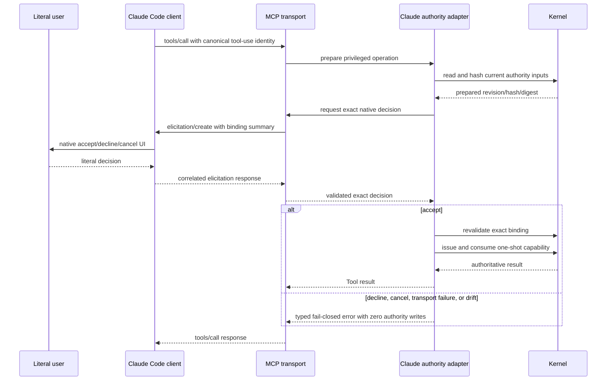

# Claude Native Elicitation Authority

**Status**: Proposed
**Owner**: user
**Design risk**: High
**Design risk rationale**: This change replaces the native user-authorization transport for every privileged Claude Managed Path operation, changes bidirectional MCP stdio sequencing, and aligns cross-host Skill contracts and release claims without changing Kernel authority.
**Design views**: Architecture layers, component interfaces, data flow, state transitions, and temporal sequence are selected because authorization crosses Skill routing, Claude MCP transport, process-local capability issuance, Kernel mutation, package generation, and real-Host evidence.
**Diagram decision**: required
**Diagram reason**: Nested server-to-client elicitation inside a client-to-server Tool call introduces ordering, cancellation, and shutdown relationships that are not safely captured by prose alone.

## Task

Replace Claude Code's permission-dialog and `ElicitationResult`-hook authorization dependency with server-initiated MCP elicitation that occurs after the exact operation binding is prepared. Align Managed Path contracts so plan-only requests never invoke Enrollment and any native authority failure remains fail-closed without suggesting a Direct Path, Pi fallback, or cross-worktree workaround.

## Output Language

Spec and TaskIntent prose is English. Schema fields, enum values, CLI flags, JSON keys, file paths, Tool names, API names, contract identifiers, error reason codes, and canonical terms remain literal.

## Origin

**Brainstorm manifest**: `BR-DEC-001` through `BR-DEC-009`; no unresolved `BR-Q-*` items.

The request follows a real Claude Code `auto` session in which a valid, Git-tracked TaskIntent reached the privileged `enroll` MCP Tool without a permission dialog. No `ElicitationResult` existed, so the adapter returned `host correlation metadata missing` before Kernel mutation. Planner then incorrectly offered Pi or ordinary implementation paths even though the user had entered a plan-only Managed Path.

## Result

Every privileged Claude Managed Path operation obtains literal-user authority through one server-initiated MCP `elicitation/create` exchange bound to the prepared operation, task, revision, content hash, and digest. Preapproval, `auto`, allowlists, or missing permission hooks cannot mint authority. Plan-only Planner output stops as a candidate, and all Managed authority failures preserve that candidate or active Task without proposing an unmanaged or alternate-Host bypass.

## Current Behavior

- Claude advertises `anthropic/requiresUserInteraction` on privileged Tools and treats the resulting `ElicitationResult` Hook as authority evidence.
- A preapproved Tool can execute without that Hook, causing `host correlation metadata missing` even when the client declared MCP elicitation support.
- The server answers MCP protocol `2024-11-05`, which predates standardized `elicitation/create`, and its stdio loop accepts requests and notifications but cannot correlate responses to server-originated requests.
- Planner says plan-only must stop, but its verification and Next Action clauses still mandate Pi TUI Enrollment whenever planning gates pass.
- Brainstorm, Planner, Loop, BASELINE, and current guidance contain Pi-specific authority wording despite Pi and Claude being supported Hosts.
- Existing deterministic tests synthesize permission-Hook decisions. Prior real-Host evidence explicitly records that preapproved privileged calls fail, so fixture success overstates `auto` behavior.

## Desired Behavior

### Plan-only and execution routing

1. Explicit plan-only requests create and validate candidate planning artifacts, report readiness, and stop without invoking Enrollment.
2. A later literal-user execution request, or an original request that explicitly includes execution, invokes the current Host's native Enrollment Tool directly without chat pre-confirmation.
3. A Managed authority failure reports one stable reason code and one recovery action for the current Host. It must not offer Direct Path execution, switch to Pi, cross-worktree Enrollment, CLI authority mutation, or implementation without a Workspace Claim.
4. The rule applies to Enrollment, unresolved user authorization, breaking Intent revision, and stop. Deterministic stale-authority repair remains non-interactive.

### Claude native authority

1. The Claude adapter accepts authority-mutating calls only from a trusted `claude-code` initialize handshake that negotiates a protocol supporting `elicitation/create` and declares an elicitation capability.
2. The adapter prepares the complete operation binding before opening elicitation. The message identifies the operation and task and displays risk, Intent revision, content hash, and preparation or scoped-diff digest when applicable.
3. The requested schema asks for no sensitive information. The response action itself is the decision: exact `accept`, `decline`, or `cancel` only.
4. Only an `accept` response to the exact outstanding server request on the same live MCP connection can continue to revalidation and capability issuance. Production runtime options and Tool metadata expose no direct-decision or preapproval seam; deterministic tests inject the same asynchronous `NativeConfirmationPort` boundary. Tool arguments, model prose, generic Tool permission, Hook text, request-ID aliases, unknown responses, and responses from another connection remain non-authoritative.
5. `decline`, `cancel`, malformed content, response error, duplicate/replayed response, cancellation, disconnect, shutdown, unsupported protocol/version, or changed binding produces no capability and no Kernel write.
6. `anthropic/requiresUserInteraction` and the `ElicitationResult` authority path are removed rather than retained as a second gate. Ordinary Host Tool permissions may still protect Tool invocation, but they are not authority evidence and cannot replace the nested elicitation.
7. The minimum supported Claude Code version is the lowest stable version that passes the real interactive conformance run with server-initiated elicitation. Versions or protocol revisions below that observed floor fail with `unsupported_host` before authority mutation.

### Failure classification

Privileged Claude failures expose one of these stable reason codes with a bounded, operation-specific message and exactly one recovery action:

- `interaction_not_opened`
- `user_denied`
- `user_cancelled`
- `correlation_missing`
- `unsupported_host`
- `workspace_changed`

A denial or cancellation stops and waits for a fresh literal-user request. Recoverable transport or freshness failures require a fresh native gate; they are never automatically retried because authorization is one-shot.

## Discovery Evidence

- `plugins/immune-brain/runtime/claude/mcp_server.ts` owns Tool declarations, trusted initialize binding, JSON-RPC parsing, stdio concurrency, cancellation, and Tool dispatch. It currently rejects all inbound response envelopes because it requires `method` and has no outbound request registry.
- `plugins/immune-brain/runtime/claude/kernel_ports.ts` prepares Enrollment and other privileged-operation digests, consumes `ClaudeReviewHost.takeConfirmation`, revalidates bindings, and issues capabilities. It is the narrow point where an asynchronous native-confirmation port must replace permission-Hook lookup.
- `plugins/immune-brain/runtime/claude/interaction.ts` owns privileged-operation classification, annotations, decision evaluation, and `confirmation_ref` construction.
- `plugins/immune-brain/runtime/claude/review_host.ts` and `plugins/immune-brain/hooks/hooks.json` currently persist, correlate, consume, and clean up `ElicitationResult`. Review lifecycle Hook evidence remains separate and must continue unchanged.
- `plugins/immune-brain/runtime/claude/capability.ts` owns Host version/platform probing and the current permission-mode vocabulary.
- `plugins/immune-brain/dist/claude/mcp-server.mjs` is built solely from `runtime/claude/mcp_server.ts` by `scripts/build-claude-plugin.ts`; `tests/claude-host-package.test.ts` already enforces byte-for-byte regeneration.
- `plugins/immune-brain/dist/imm-planner.md` contains both the correct plan-only stop rule and contradictory unconditional Pi TUI Enrollment clauses. `imm-brainstorm.md`, `imm-loop.md`, and the three BASELINE copies also contain Pi-specific native-gate wording.
- `tests/claude-host-authority.test.ts` is the highest existing observable authority seam; `tests/dual-host-assurance-conformance.test.ts` covers stdio shutdown and cross-host continuity; `tests/claude-host-package.test.ts` covers generated output and Host version claims; `tests/imm-planner-kernel-intent-contract.test.ts` and `tests/pi-packaged-legacy-fallbacks.test.ts` currently assert obsolete Pi-only contract text.
- `docs/adr/0004-dual-host-assurance-adapters.md` requires `Host adapter -> Shared Assurance -> Kernel`, one persisted authority protocol, no Host registry, and Pi characterization compatibility.
- `docs/solutions/rejected-out-of-band-review-authority-reconstruction.md` rejects manufacturing authority from workspace or conversational evidence. The same rule prohibits reconstructing user confirmation from Tool permission or chat output.
- MCP `2025-06-18` defines nested server-originated `elicitation/create`, exact `accept|decline|cancel` response actions, restricted primitive schemas, client capability advertisement, and clear decline/cancel UX. It forbids requesting sensitive information.
- A bounded internal `arch-explorer` identified runtime, Skill, package, and verification surfaces. Planner rejected its proposed Kernel routing-policy and all-Skill registry expansion because plan-only is a Planner contract concern and only four Claude operations own native authority gates.

## Technical Design

### Architecture layers

1. **Managed Skill contracts** own plan-only versus plan-and-execute routing and fail-closed user-facing continuation. They name a native Host gate but never select Pi or Claude as a planning input.
2. **Claude MCP transport** owns protocol negotiation, outbound elicitation requests, response correlation, cancellation, connection identity, and structured transport errors.
3. **Claude authority adapter** owns operation preparation, native decision consumption, binding revalidation, and process-local capability issuance. It delegates persisted writes exclusively to existing Kernel applications.
4. **Claude Review Hook adapter** continues to own Subagent and Session lifecycle evidence only. It no longer stores or resolves user authorization.
5. **Kernel and Shared Assurance** remain unchanged and Host-neutral.
6. **Package and conformance surfaces** bind source, generated runtime, current guidance, minimum supported Host version, deterministic tests, and real-Host observations.

Dependency direction remains `Skill -> current Host adapter -> Shared Assurance/Kernel`. Kernel, Shared Assurance, and Pi may not import Claude transport code. No generic Host registry or second authority protocol is introduced.

### Component interfaces

`serveStdio` becomes a bidirectional JSON-RPC peer while retaining newline-delimited framing. It owns a collision-resistant namespace for server request IDs and a process-local pending-response map. Incoming envelopes are classified before method validation:

- a request has `method` and `id`;
- a notification has `method` and no `id`;
- a response has `id` plus exactly one of `result` or `error` and no `method`.

The transport must process incoming JSON-RPC responses to server requests while an outer `tools/call` is blocked waiting for user action. Transport writes settle on `drain`, `error`, or `close`; output failures reject pending elicitations and settle in-flight Tool calls. Only exact pending server IDs settle elicitation promises. A malformed envelope carrying an exact pending ID immediately rejects that waiter with `correlation_missing`; it cannot remain pending. Unknown or duplicate responses fail closed without being routed as Tool calls. The input loop must continue consuming responses while an outer `tools/call` awaits elicitation.

The Claude runtime receives one asynchronous confirmation port rather than reading `ClaudeReviewHost` confirmation state. Its input is the exact privileged operation binding; its output is one `accept|decline|cancel` decision or a typed transport failure. The port constructs `elicitation/create` using a flat, non-sensitive schema and returns only after validating the exact response envelope.

`confirmation_ref` binds a per-connection opaque identity, the outer canonical `claudecode/toolUseId`, the nested elicitation request ID, operation, task, Intent revision/hash, and prepared digest. Neither client-supplied session aliases nor Hook logs can populate missing fields.

The initialize response negotiates a protocol revision that actually supports elicitation. Declared capability without a compatible negotiated protocol is `unsupported_host`. Host-version checks remain stable-semver and platform-bound; the released minimum changes only after real evidence establishes the floor.

Structured MCP errors retain JSON-RPC error semantics and add a stable reason code plus one recovery action. Existing callers that render the message remain compatible; no Tool schema or Kernel schema changes.

### Data flow and temporal sequence



### State transitions

No persisted state changes. The MCP connection adds process-local states:

```text
idle -> preparing -> elicitation_pending -> revalidating -> committing -> released
                    |                     |
                    +-> declined ---------+
                    +-> cancelled --------+
                    +-> failed -----------+
```

Only `revalidating -> committing` after exact `accept` can reach Kernel capability issuance. Every other terminal branch returns to `released` with no new authority. A completed Kernel commit remains authoritative even if the outer Tool response is later lost; a fresh Assurance Projection reconciles it.

### Temporal, interruption, and idempotency rules

- Outer `notifications/cancelled`, input end, stream error, or session shutdown rejects outstanding elicitation promises before waiting for in-flight Tool calls, preventing shutdown deadlock.
- Cancellation before capability commit performs zero writes. Cancellation after the Kernel commit point cannot undo authority and is reconciled from a fresh Projection.
- Each nested request settles once. A duplicate or late response cannot satisfy another operation.
- Concurrent non-privileged Tool calls remain allowed. Privileged operations retain existing Kernel/workspace serialization; pending elicitation state grants no lock or authority.
- Binding freshness is checked both while preparing the gate and after acceptance. Drift at either point returns `workspace_changed` with one fresh-current-Host-gate recovery action.
- Breaking Intent revision retains exact worktree/index restoration on every precommit failure, including elicitation decline, cancel, disconnect, and malformed response.

## Settlement-Design Contract

### Trigger sources

- Trusted or unsupported initialize handshake and protocol negotiation.
- Privileged Tool call, preparation success/failure, native accept/decline/cancel, malformed or error response, duplicate/replay, outer cancellation, input end, stream error, session shutdown, workspace drift, Kernel commit success/failure, and lost outer response.

### State inventory and transitions

- Process-local transport: `idle -> preparing -> elicitation_pending -> revalidating -> committing -> released`, with `elicitation_pending -> declined|cancelled|failed -> released` and `revalidating -> failed -> released`.
- Persisted TaskRecord, Artifact State, Workspace Claim, Backend Claim, and Settlement transitions are unchanged.

### Terminal ownership

- The literal user action returned by the exact native MCP elicitation is the sole user decision.
- The Claude adapter may issue a process-local capability only after exact acceptance and binding revalidation.
- Existing Kernel application and transaction owners exclusively mutate or settle persisted authority.
- Tool permission, annotations, Hook callbacks, promise settlement, chat text, elapsed time, transport closure, and conformance prose are non-authoritative.

### Same-state-machine coverage

The mutation envelope includes all four privileged operation declarations and dispatch, their common interaction evaluator and capability binding, Enrollment and active-task authorization preparation, MCP response/cancellation/shutdown transport, obsolete Elicitation Hook state, generated runtime, Host support/version claims, Managed Skill gate instructions, and focused tests covering the shared sequence. Kernel and Pi paths are explicit compatibility oracles and remain outside implementation scope unless a focused test exposes a regression requiring replan.

## Compatibility, Migration, and Rollback

- No TaskIntent, TaskRecord, Workspace Claim, Backend Claim, Assurance Projection, capability payload, or audit schema migration.
- Existing active tasks remain resumable by either compatible Host from Kernel projection; no process-local elicitation survives restart.
- Pi Tool schemas and native dialogs remain unchanged.
- Claude public Tool names and input schemas remain unchanged. MCP protocol negotiation and response handling are additive at the transport boundary, while obsolete permission-Hook authority is deleted atomically.
- An older Claude version that cannot complete real server-initiated elicitation is unsupported rather than served by a compatibility fallback. The minimum version is updated consistently in code, current docs, tests, and new conformance evidence.
- Rollback reverts Claude runtime, Hook manifest, generated bundle, Managed contracts, current support docs, tests, and conformance evidence as one unit. No authority data repair is required.

## Verification Strategy

### Deterministic checks

1. `tests/claude-host-authority.test.ts` exercises exact nested elicitation acceptance, decline, cancel, response errors, malformed/unknown/duplicate/replayed IDs, binding drift, preapproved outer Tools, all four privileged operations, zero-write failures, and removal of Hook-only authorization.
2. `tests/dual-host-assurance-conformance.test.ts` proves response processing can progress while an outer Tool call is pending and proves cancellation/input-end shutdown rejects pending elicitation before waiting, flushes committed results, and preserves cross-host projection recovery.
3. `tests/claude-host-package.test.ts` proves protocol negotiation, minimum version, Hook manifest cleanup, generated bundle parity, unchanged Tool inputs, and self-contained package behavior.
4. `tests/imm-planner-kernel-intent-contract.test.ts`, `tests/pi-packaged-legacy-fallbacks.test.ts`, `tests/baseline-packaging-contract.test.ts`, and a focused Managed authority-failure contract test prove plan-only never enrolls, execution uses the current native Host gate, packaged Planner no longer requires a Pi-only Tool name, and failure text cannot offer Direct/Pi/unmanaged fallback.
5. A focused promotion test validates the new conformance report's package/version/protocol binding and evidence classes without claiming that a fixture proves a human click.
6. Final repository regression remains `bun test`; it is not an Acceptance Descriptor.

### Real Host evidence

Before assurance, run a foreground interactive Claude Code conformance pass against source and generated plugin bytes. Record:

- exact Claude Code and plugin versions and negotiated MCP protocol;
- plan-only producing no Enrollment Tool call;
- `manual`, `acceptEdits`, `auto`, and preapproved/allowlisted outer Tool scenarios opening the digest-bound server elicitation;
- accept creating exactly one Workspace Claim;
- decline and cancel producing zero authority writes;
- disconnect/cancellation during pending elicitation producing zero precommit writes;
- one representative non-Enrollment privileged operation;
- absence of `ElicitationResult` authority dependence;
- the observed minimum stable Claude version.

The report is review/HITL evidence, not a QA attestation or Kernel authority. Future changes to Claude authority transport, minimum version, or support claims must update real-Host evidence; unrelated releases need only deterministic checks.

## Scope and TaskIntent Decomposition

This is one TaskIntent because Skill routing and Claude native interaction enforce one atomic trust invariant: a Managed task cannot gain authority without a digest-bound current-Host decision, and failure cannot route around that boundary. Shipping runtime elicitation without contract correction leaves plan-only and fallback behavior wrong; shipping contract correction without working elicitation leaves Claude unable to enroll. They share one promotion, rollback, Review, and real-Host verification boundary.

No `parallel_probes` are planned. Transport, authority preparation, generated output, Skill wording, and tests have causal dependencies and are safer to implement and verify as one sequence.

## Assumptions

- Claude Code continues to advertise the standard MCP elicitation capability in supported interactive sessions.
- MCP `2025-06-18` remains the minimum protocol revision required by this implementation; a newer compatible client may negotiate a supported revision without changing Kernel contracts.
- The current Host may show its own generic Tool-permission UI, but that UI is not the Managed authority gate. Immune-Brain itself requests exactly one digest-bound elicitation per operation attempt.
- Existing real-Host evidence is historical and remains byte-preserved under `docs/verification/archive/`.

## Out of Scope

- Kernel-enforced HITL acceptance for translation or other external Dev checks.
- Pi interaction changes, generic Host registries, new code-agent Hosts, native Windows support, cross-worktree state movement, automatic retry, background authority, sensitive elicitation fields, or persisted Host-session state.
- Changing deterministic stale-authority repair into a user-confirmed operation.
- Modifying historical archived Specs, TaskIntents, TaskRecords, or conformance reports.

## Devil's Advocate Audit

### Rollback resilience

The change has no persisted migration. Runtime, generated bundle, Hook declaration, host-neutral contracts, current docs, tests, and new evidence revert together. A failure before Kernel commit creates no authority; a failure after commit is recovered from the existing Projection. Breaking-revision sidecars retain their exact restoration contract.

### Verification vanity

String checks alone cannot prove native authority, and a synthetic `ElicitationResult` cannot prove server-initiated UI. Deterministic tests must drive bidirectional JSON-RPC and assert Kernel mutation counts. Package tests must execute generated Node bytes. Real-Host evidence must separately record actual native accept/decline/cancel and preapproval behavior.

### Spec dilution detection

The implementation is incomplete if it merely improves the error message, forbids preapproval, updates Planner wording, keeps permission-Hook decisions as a fallback, adds a second confirmation without binding the prepared digest, or labels fixture evidence as real-Host coverage. All four privileged operations, plan-only behavior, failure routing, version claims, generated bytes, and shutdown semantics remain in scope.

## Brainstorm Trace

| ID | Status | Mapping |
|---|---|---|
| `BR-DEC-001` | covered_by_step | Runtime authorization and Planner routing are one atomic TaskIntent. |
| `BR-DEC-002` | covered_by_step | Plan-only stops after candidate validation with no Enrollment call. |
| `BR-DEC-003` | covered_by_step | Server-initiated elicitation occurs after preparation and displays the binding. |
| `BR-DEC-004` | captured_as_decision | Hook-only authorization is removed; native response is authoritative only on the exact live connection. |
| `BR-DEC-005` | covered_by_step | Stable fail-closed reasons return one current-Host recovery action. |
| `BR-DEC-006` | covered_by_step | The rule covers Enrollment, breaking revision, user authorization, and stop. |
| `BR-DEC-007` | covered_by_step | Minimum Claude version follows real evidence rather than an unverified compatibility claim. |
| `BR-DEC-008` | covered_by_step | Deterministic CI and change-triggered real-Host evidence are both required. |
| `BR-DEC-009` | deferred | Kernel HITL settlement is a separate capability; this task documents the boundary and does not implement it. |
