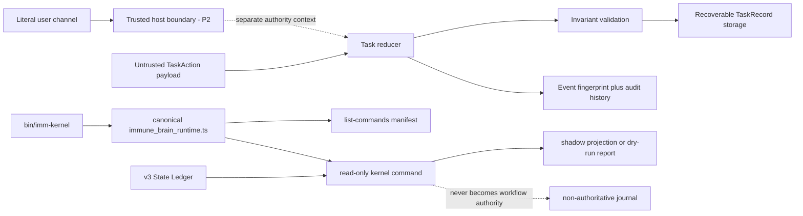

# Spec: Assurance Kernel v4 P1 Hardening

**Design risk**: High — this repair changes lifecycle authority, persisted TaskRecord creation rules, legacy compatibility projection, and the canonical plugin command surface across multiple runtime modules.
**Diagram decision**: required
**Diagram reason**: the repair has two trust boundaries (privileged TaskAction reduction and read-only CLI routing) whose ownership and data flow must remain distinct to prevent a shadow-only hardening slice from becoming a production cutover.

## 1. Goal

Close the five post-foundation review findings without promoting Assurance Kernel v4 beyond shadow-only P1:

1. privileged lifecycle outcomes cannot be produced by an ordinary self-asserted TaskAction;
2. canonical TaskRecord creation cannot bypass the reducer or completion predicate;
3. v3 shadow projection represents Plan, Step, and pending follow-up facts conservatively;
4. `imm-kernel` uses the canonical TypeScript CLI runtime and command manifest;
5. package verification is independent of the repository's current tracked State Ledger.

The parent design remains `docs/specs/assurance-kernel-v4.spec.md`. This Spec narrows and corrects the P1 contract only; it does not approve P2 production routing.

## 2. Evidence

Post-terminal `imm-code-review` reproduced these behaviors against the current worktree:

- generic `resolve_finding` can resolve `unresolved_user_decision`, while `stop` carries no separate user authority or auditable actor;
- `writeTaskRecord` can create `review`, `done`, or `stopped` records with empty evidence, approvals, and history;
- an all-closed aggregate with no Plan identity can map to `done`, an executing pending follow-up maps to `review`, and legal follow-up replanning can be reported as divergence;
- `plugins/immune-brain/bin/imm-kernel` directly starts `runtime/commands/kernel.ts`, bypassing `immune_brain_runtime.ts` and `list-commands`;
- `tests/plugin-package-runtime.test.ts` reads the repository's tracked terminal Ledger and dereferences an optional Roadmap.

Focused Kernel tests passed, but the full suite added two wrapper-boundary failures and one Roadmap smoke failure relative to the HEAD snapshot. A pre-existing compatibility-document failure and a missing local `@opencode-ai/plugin` dependency are not part of this repair.

## 3. Non-Goals

- No v4 production mutation route, scheduler, host adapter, automatic migration, dual write, or State Ledger replacement.
- No terminal TaskRecord import API. P1 migration remains dry-run only; a future import path requires a separate Plan with provenance, validation, owner, and activation criteria.
- No cryptographic user authentication inside the pure reducer. Host authentication remains a P2 integration concern.
- No edits to `.imm/memory/current_iteration.json` for the purpose of making tests pass.
- No repair of the pre-existing compatibility-document failure or local package installation.

## 4. Technical Design

### 4.1 Authority and mutation flow

The solid production-facing entry remains `immune_brain_runtime.ts`. The dotted user-authority edge is a contract seam only in P1; this Plan does not expose or mint a production authority credential.

### 4.2 D1 — Privileged actions use a separate authority context

- Ordinary TaskAction payloads are untrusted data and cannot self-assert `actor`, `role`, `user_confirmed`, or equivalent authority.
- Generic `resolve_finding` rejects findings whose kind is `unresolved_user_decision`.
- User-decision resolution and `stop` use privileged reducer operations that require a separate `UserAuthorityContext` supplied by the caller boundary.
- The authority context is not embedded in the TaskAction payload. Its non-secret audit descriptor (actor identity, authority source, confirmation reference) is included in the event fingerprint and append-only history.
- Replaying the same event and same authority descriptor is idempotent. Reusing the event ID with a different action or authority descriptor fails closed.
- P1 provides no host command that issues this context. Tests may use an internal fixture boundary that is not exported from `runtime/kernel/index.ts`.
- P2 must authenticate the literal-user source before exposing any privileged mutation route. P1 proves privilege separation and audit propagation, not host authentication.

### 4.3 D2 — Canonical creation is one legal initial state

The public storage mutation surface is creation plus reducer-owned action application:

- canonical creation accepts only `phase="working"`;
- initial `evidence`, `findings`, `approvals`, and `history` are empty;
- the TaskRecord must satisfy the existing schema, intent, baseline, revision, and single-working ownership checks;
- existing records cannot be replaced directly;
- `review`, `done`, and `stopped` snapshots cannot enter through creation;
- no import, restore, hydration, or compatibility exception is added to the public P1 API.

A future terminal import path expires as a candidate until P2/P3 migration-write approval. Its owner is the future migration Plan, and its activation milestone is explicit approval of provenance validation and rollback behavior.

### 4.4 D3 — Legacy projection consumes the complete active aggregate

Projection precedence is deterministic:

1. malformed structure, contradictory current candidates, or explicit terminal contradictions map to `stopped("legacy-inconsistent")`;
2. an explicit valid `plan_terminal` maps to `stopped` before empty-Step fallback;
3. a non-null pending follow-up is validated and participates in the phase aggregate;
4. simultaneous active-like Step and active-like follow-up ownership is inconsistent;
5. `requires_replan` is compared against Step and follow-up replanning signals;
6. all-closed completion still requires a non-empty current Plan identity and the complete typed `finish_reset` evidence set.

Pending follow-up mapping:

| v3 follow-up state | shadow phase |
| --- | --- |
| `pending`, `executing`, `rework_needed` | `working` |
| `ready_for_review` | `review` |
| `replanning` | `stopped` with replan reason |
| `closed` while still pending, unknown, or malformed | `stopped("legacy-inconsistent")` |

A legal follow-up `replanning` plus `requires_replan=true` is not divergence. A missing replan flag, an extra replan flag, concurrent active owners, or conflicting Plan identity remains explicit divergence/inconsistency.

### 4.5 D4 — Canonical shadow CLI routing

- `plugins/immune-brain/bin/imm-kernel` is a thin wrapper over `runtime/immune_brain_runtime.ts cli imm-kernel`.
- `imm-kernel` is registered in `IMM_COMMANDS`, `COMMAND_MANIFEST`, dispatch, help/examples, and project-access classification.
- `status` and migration dry-run receive read access; `journal` and help do not require State Ledger migration. No subcommand gains workflow write authority.
- `runtime/commands/kernel.ts` remains the command implementation, not a second production entrypoint.
- Wrapper argv, stdout, stderr, JSON shape, and exit status remain unchanged.
- Manifest text labels the command shadow-only and read-only; registration is discoverability, not production cutover.

### 4.6 D5 — Repository-state-independent package verification

- Package progress tests run in isolated temporary roots and create the Plan, State Ledger, and optional Roadmap they assert.
- One fixture proves a declared Roadmap remains `available`; another proves a terminal/no-Roadmap Plan returns the formal optional representation without throwing.
- Tests snapshot relevant files before and after read-only commands.
- `.imm/memory/current_iteration.json` may be used as review evidence but never as an implicit package test fixture.

## 5. Invariants

- I1: No ordinary TaskAction can resolve a user decision or stop a TaskRecord.
- I2: Privileged event identity binds the authority descriptor as well as the action payload.
- I3: Every newly persisted TaskRecord starts in canonical `working` form.
- I4: No P1 API imports or directly creates terminal lifecycle state.
- I5: Legacy `done` requires positive Plan identity and complete typed finish evidence.
- I6: Pending follow-up ownership participates in phase and divergence projection.
- I7: Every `bin/imm-*` wrapper except the documented standalone diagnostic enters through the canonical TypeScript runtime.
- I8: Shadow CLI commands never mutate schema-v3 workflow authority.
- I9: Package tests produce the same result regardless of the repository's tracked Ledger.

## 6. Compatibility and Recovery

- Existing schema-v3 State Ledgers remain read-only inputs; no migration or rewrite occurs.
- Existing TaskRecords created by the foundation remain readable. The stricter creation rule applies only to new writes; malformed existing records continue to fail schema/invariant validation.
- Existing non-privileged history entries remain valid. Privileged entries created after this repair carry the authority descriptor.
- If execution stops after any Step, the previous closed Steps remain independently valid. No Step requires data migration cleanup.
- CLI routing can be rolled back as one coherent set (`immune_brain_runtime.ts`, wrapper, manifest tests) without changing TaskRecord data.
- Fixture isolation is test-only and has no runtime rollback requirement.

## 7. Security Considerations

- Authority data in the action payload is attacker-controlled and must never be trusted.
- Audit descriptors prove what the trusted caller supplied; they are not cryptographic proof. P2 must define host authentication before privileged commands become reachable.
- Event replay must bind authority metadata to prevent laundering a previously accepted event ID.
- Legacy records, Plan paths, follow-up objects, and journal entries are untrusted input and parse fail-closed.
- No repair path may silently normalize malformed terminal or ownership evidence into `done`.

## 8. Acceptance Criteria

- [ ] Generic finding resolution cannot close `unresolved_user_decision`; privileged resolution and stop require separate authority context and persist its descriptor.
- [ ] Canonical TaskRecord creation rejects non-working phases and pre-populated lifecycle evidence/history.
- [ ] Legacy matrix tests cover missing Plan identity, active follow-ups, follow-up replanning, simultaneous owners, valid finish, and real contradictions.
- [ ] `imm-kernel` appears in `list-commands --json` and its wrapper invokes only `immune_brain_runtime.ts`.
- [ ] Package progress smoke tests cover Roadmap-present and Roadmap-absent isolated fixtures without reading the repository Ledger.
- [ ] Focused Kernel, wrapper, package, and progress suites pass with no new failure relative to the recorded HEAD baseline.
- [ ] Real-Ledger shadow status and migration dry-run remain read-only and report no false follow-up divergence.
- [ ] Plan validation and `git diff --check` pass.

## 9. Verification Matrix

| Boundary | Required evidence |
| --- | --- |
| Authority | negative generic resolve/stop tests; separate-context success; authority-bound replay conflict; history audit descriptor |
| Creation | table-driven rejection of `review/done/stopped` and non-empty lifecycle arrays; canonical `working` success |
| Legacy | Plan/Step/follow-up truth table plus divergence assertions and malformed controls |
| CLI | static wrapper boundary, manifest discovery, black-box argv/output/exit behavior |
| Package | temporary Roadmap-present and no-Roadmap roots; before/after file snapshots |
| Whole slice | all affected test files, real shadow/dry-run smoke, full-suite baseline-delta audit, Plan validation, diff hygiene |

## 10. Deferred Work

- P2 host authentication, authority issuance, and production privileged commands.
- Terminal TaskRecord import/migration-write API with provenance and rollback.
- Any replacement of v3 command routing or State Ledger authority.
