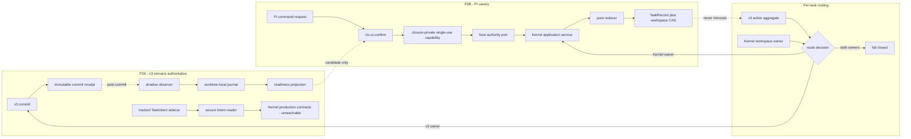

# Spec: Assurance Kernel v4 P2 Managed Cutover

**Design risk**: High - P2 introduces production TaskRecord contracts, host-mediated authority, routing ownership, and a staged replacement for v3 managed execution.
**Diagram decision**: required
**Diagram reason**: the design crosses four distinct trust and rollback boundaries: v3 post-commit observation, TaskIntent ownership, host-issued authority, and per-task backend routing.

## 1. Goal

Move Assurance Kernel v4 from a read-only P1 shadow into a controlled production path without rebuilding the v3 Plan/Step state machine or creating dual workflow authority.

P2 is a Roadmap, not one immediate cutover:

1. **P2A - Production Readiness**: collect complete automatic v3 shadow evidence and freeze the TaskIntent, production fact, and authority-port contracts while v3 remains the sole production authority;
2. **P2B - Pi Canary**: enroll explicitly confirmed new Pi managed tasks into Kernel ownership after the promotion gate passes;
3. **P2C - Supported-Host Default**: make Kernel the default only for newly created managed tasks on hosts that prove equivalent authority semantics;
4. **P3 - Legacy Retirement**: retire v3 creation and decide whether terminal import has enough value to justify a separate migration.

P2A is eligible to implement now. The current shadow journal covers only about five hours and 48 manual status or migration calls. It does not satisfy the parent P2 promotion condition of two weeks of real v3-plus-shadow operation.

## 2. Evidence and Problem Statement

P1 established:

- one four-phase TaskRecord lifecycle: `working`, `review`, `done`, `stopped`;
- pure reduction, completion, readiness projection, and invariant validation;
- reducer-owned storage with content-hash CAS, one-working ownership, and recoverable cross-file transactions;
- a conservative v3 Plan/Step/follow-up inspector;
- canonical read-only `imm-kernel status|journal|migrate --dry-run` routing;
- separation between ordinary TaskAction payloads and privileged authority context.

P1 intentionally did not establish:

- automatic observation after real v3 mutations;
- a promotion report that can prove the required observation window;
- a Git-owned TaskIntent sidecar reader;
- stable acceptance identities with evidence coverage for every criterion;
- reducer actions for recording production evidence, findings, approvals, and intent revisions;
- a production host authority issuer;
- a production TaskRecord command or routing path;
- terminal migration writes.

The existing completion predicate accepts any fresh accepted evidence. That is sufficient for a shadow foundation but not for production: every acceptance criterion must have fresh accepted evidence before completion.

## 3. Design Principles

1. **Assurance, not orchestration**: persist only phase and factual evidence, findings, approvals, intent snapshot, route ownership, and history. Do not persist `next_action`, `allowed_actions`, planner entry, recommended authority, blocked status, or skill sequence.
2. **One task, one backend**: backend ownership is selected before the first mutation and never changes for that task.
3. **No dual write**: P2A writes only non-authoritative observations. P2B Kernel tasks never mirror lifecycle state into v3.
4. **Post-commit observation**: v3 commits complete before shadow projection or journal I/O begins.
5. **Authority is not payload**: no flag, JSON field, environment variable, command provenance, actor label, or confirmation reference can mint privilege.
6. **Human intent is explicit**: a strict JSON sidecar is the semantic intent authority; Markdown Plan prose is not a second machine authority.
7. **Promotion is evidence-bound**: elapsed time alone and manual status calls cannot qualify a canary.
8. **Rollback stops enrollment**: rollback never reconstructs an in-flight task in another backend.
9. **No migration dependency**: production routing does not require terminal import.

## 4. Threat Boundary

Assurance Kernel protects against ordinary caller confusion, stale writers, partial multi-file transactions, accidental authority mixing, and unsupported state transitions.

It is **not** a security boundary against a malicious agent or same-user process with arbitrary workspace code execution. Such an actor can edit source, TaskIntent, TaskRecord, journal, Git metadata, or tests. P2 must not claim cryptographic non-repudiation, tamper-proof audit, or authenticated reviewer identity against that attacker.

Within the supported orchestration boundary:

- TaskAction fields remain untrusted;
- CAS and event identity protect concurrent and replayed writes;
- host-issued capabilities protect privileged application paths from ordinary CLI/tool invocation;
- source hashes and path checks detect drift and filesystem confusion;
- independent QA/review receipts prove process separation, not hostile-code identity.

## 5. Technical Design

### 5.1 Authority and routing overview



### 5.2 D1 - Roadmap boundaries

| Phase | Production routing | Entry condition | Exit condition |
| --- | --- | --- | --- |
| P2A | v3 only | P1 terminal and reviewed | P2A contracts pass QA/review; readiness collection is active |
| P2B | Pi-only, explicit per-task enrollment | readiness status `candidate` plus literal user approval | canary evidence meets P2C gate |
| P2C | Kernel default for newly created tasks on supported hosts | separate user approval after canary | v3 new-task creation can be retired |
| P3 | no active-task routing change | no active v3 task and separate migration decision | legacy read path retired or retained explicitly |

P2A completion does not imply P2B eligibility. The observation window may continue after the P2A Plan closes.

### 5.3 D2 - Automatic post-commit shadow observation

P2A introduces `assurance_kernel/shadow_observation/v1` at the central successful v3 mutation boundary.

The authoritative transaction returns an immutable commit receipt containing at least:

- canonical workspace identity;
- command or transition family;
- committed Ledger revision;
- committed bytes hash;
- stable history-tail identity;
- commit timestamp.

Only after the v3 transaction has committed does the observer:

1. inspect the committed bytes supplied by the receipt rather than reopening a live path;
2. derive the v4 shadow phase and divergence result;
3. append one idempotent observation whose identity binds the receipt and observer contract version.

Observation failure:

- never changes v3 exit status, stdout contract, Ledger bytes, lock result, or recovery behavior;
- never retries or repairs the v3 mutation;
- remains visible as a warning;
- creates a readiness coverage gap by reconciliation against authoritative commit history.

Manual `imm-kernel status`, journal reads, and migration dry-runs remain useful smoke evidence but do not count as qualifying production observations.

### 5.4 D3 - Readiness projection

`imm-kernel readiness --json` exposes `assurance_kernel/readiness_report/v1` as a pure, read-only projection.

Semantic status values:

- `collecting`: the evidence window or lifecycle coverage is incomplete;
- `blocked`: malformed evidence, a coverage gap, ambiguity, or divergence exists;
- `candidate`: all machine promotion conditions hold; literal user approval is still required separately.

P2B machine candidacy requires all of the following:

1. at least 14 consecutive calendar days after the latest observer contract change;
2. at least three completed real v3 managed lifecycles;
3. real coverage of task activation or sync, execution evidence, QA or review, and finish or explicit termination families;
4. every successful authoritative commit receipt in the window has exactly one matching observation;
5. zero malformed or ambiguous observations;
6. zero shadow divergence during the qualifying window;
7. automatic observer fault-injection tests cover reject, CAS conflict, restart, journal failure, and post-commit race paths;
8. the current migration dry-run report digest is present and performs no writes.

A divergence, observation gap, or observer contract change resets the qualifying window after repair. P2A does not add a divergence-adjudication workflow merely to preserve a metric.

The report includes counts, window boundaries, covered mutation families, gaps, reason codes, observer version, and migration digest. It never persists `ready=true` as workflow authority.

### 5.5 D4 - TaskIntent v1 and acceptance identity

P2 defines a Git-owned sidecar at:

```text
docs/plans/<task_id>.intent.json
```

Canonical contract:

```json
{
  "contract": "assurance_kernel/task_intent/v1",
  "task_id": "123-short-goal",
  "goal": "One outcome statement",
  "acceptance": [
    {
      "id": "A1",
      "assertion": "One observable acceptance condition",
      "verification": "One deterministic verification description"
    }
  ],
  "scope_hint": ["path/or/domain"],
  "risk": "routine",
  "revision": 1,
  "owner": "user"
}
```

The runtime treats Git tracking as an ownership convention, not proof of user identity. Runtime safety comes from:

- canonical project containment;
- exact `<task_id>.intent.json` path binding;
- regular-file and whole-path no-symlink checks;
- bounded size and strict JSON with unknown-field rejection;
- unique acceptance IDs;
- positive revision and exact task identity;
- pre/post-read device/inode verification;
- normalized content hash.

P2 production records use `assurance_kernel/task_record/v2`. They preserve a normalized intent snapshot plus `intent_ref { path, revision, content_hash }`. P1 TaskRecord v1 remains readable for shadow compatibility but is not eligible for production enrollment.

Every evidence item binds:

- one acceptance ID;
- current intent revision;
- current intent content hash;
- current diff hash;
- stable event identity and audit actor.

Completion requires fresh accepted evidence for **every** current acceptance ID. Revision or hash drift makes prior evidence and approvals stale by projection; stale flags are not persisted.

A compatible intent revision preserves task identity, goal, owner, prior acceptance IDs and assertions, and never lowers risk. Breaking intent changes require a user decision in P2B; P2A only defines and tests the distinction.

### 5.6 D5 - Closed production mutation vocabulary

P2A freezes one reducer-owned factual action vocabulary without exposing it through production CLI or routing:

- `record_evidence`;
- `record_finding`;
- `resolve_finding` for ordinary findings only;
- `record_approval` for host-attested QA or review authority;
- `record_user_approval` for host-confirmed user authority;
- `revise_intent` for compatible revisions;
- `approve_breaking_intent_revision` for user-confirmed changes;
- existing `submit_review`, `request_rework`, `complete`, `stop`, and `resolve_user_decision` behavior.

No generic patch, snapshot replacement, hydrator, direct array append, or arbitrary serialized `TaskAction` command is permitted.

All actions:

- validate phase and factual preconditions in the reducer;
- bind event fingerprint to action, current record identity, intent hash, diff hash when applicable, and authority descriptor when privileged;
- append auditable history;
- apply through storage CAS and the existing workspace transaction boundary;
- preserve idempotency for identical replay and reject conflicting event reuse.

Adapters may translate host input but may not derive phase, completion, freshness, review rounds, required approvals, or workspace ownership.

### 5.7 D6 - Host authority port

P2A defines an authority consumption port and negative tests. It does not expose a production issuer or privileged mutation command.

Authority kinds are distinct:

- ordinary executor facts: no privileged capability;
- QA or review approval: host-validated isolated child receipt;
- literal-user actions: successful host UI confirmation.

A privileged capability is:

- opaque and non-serializable;
- closure-private to the trusted host callback;
- single-use;
- bound to task ID, exact action digest, TaskRecord hash, intent revision/hash, diff hash when applicable, confirmation reference, and expiry;
- consumed in the same host operation that applies the mutation.

The persisted authority audit descriptor is not authority and cannot be replayed as authority.

P2B's first issuer is Pi TUI only:

- an extension command may request approval but command invocation itself grants nothing;
- the handler displays exact action scope and calls `ctx.ui.confirm`;
- cancel, timeout, exception, non-TUI mode, JSON/print mode, or missing UI causes zero writes;
- no LLM-callable approval tool is registered;
- the capability is never passed through CLI arguments, environment, files, journal, or session state.

RPC and OpenCode remain v3 for privileged behavior until each host proves an equivalent independent confirmation boundary.

### 5.8 D7 - P2B backend pinning and rollback

P2B enrolls only new managed tasks. Enrollment atomically validates:

- readiness digest and observer version;
- exact TaskIntent path/hash/revision;
- no active v3 Step or pending follow-up;
- no Kernel working owner;
- literal user confirmation for that exact task.

TaskRecord creation plus workspace claim fixes the task to Kernel ownership. Existing v3 tasks remain v3. There is no dual write and no fallback after a failed mutation.

Canary rollback:

1. disables new Kernel enrollment;
2. leaves existing v3 tasks unchanged;
3. lets existing Kernel tasks drain or requires a user-confirmed `stop`;
4. never synthesizes v3 Plan/Step state from a Kernel task.

P2C changes only the default for newly created managed tasks on qualified hosts. Already-created tasks retain backend affinity.

### 5.9 D8 - Terminal import remains outside P2

P2 does not add terminal import, restore, hydration, or migration-write APIs.

Legacy terminal state remains available through the read-only v3 inspector. Production routing does not need copied historical TaskRecords. P3 starts with a value decision: if read-through projection satisfies reporting and audit needs, terminal import is rejected entirely.

Only a concrete unmet consumer requirement may justify a P3 import Plan. Such a Plan must define provenance, source hash, idempotent import identity, ambiguity handling, owner, rollback or forward-fix policy, activation milestone, and deletion of the import path after migration closes.

## 6. Invariants

- I1: P2A cannot create or mutate a production TaskRecord through any CLI or host adapter.
- I2: v3 commits complete before shadow observation begins.
- I3: Observer failure cannot change v3 authority behavior.
- I4: Readiness derives from automatic authoritative commit coverage, never manual query volume.
- I5: A P2B task has one backend for its complete lifetime.
- I6: No action payload or serialized value can mint privileged authority.
- I7: Every current acceptance criterion has fresh accepted evidence before completion.
- I8: Production TaskRecord facts change only through reducer actions and CAS storage.
- I9: TaskIntent revision and content hash are revalidated at the mutation boundary.
- I10: Four lifecycle phases remain the only persisted lifecycle state.
- I11: Pi session ID and session tree are never workflow authority.
- I12: OpenCode, JSON, print, and untrusted RPC paths cannot perform privileged P2 mutations.
- I13: P2 has no terminal import or migration-write seam.

## 7. Recovery and Compatibility

- P2A is additive. Disabling its observer restores pure v3 operation; journal data remains non-authoritative.
- P1 `task_record/v1` remains readable but cannot be enrolled into production.
- A P2A interruption cannot strand a production Kernel task because no production route exists.
- P2B task/workspace writes reuse recoverable transactions and stale-lock recovery.
- A host restart before privileged commit discards the in-memory capability; the user confirms again.
- A host restart after commit recovers from TaskRecord/workspace state, not session memory.
- A TaskIntent drift blocks further mutation until a compatible revision or user decision is applied.
- Downgrade during P2B disables enrollment but must preserve status and drain/stop access for existing Kernel tasks.

## 8. P2A Acceptance Criteria

- Every successful v3 authoritative mutation family produces one post-commit observation from committed bytes.
- Rejected or CAS-conflicted v3 mutations are never reported as successful observations.
- Observer exceptions and journal failures leave v3 results and authority files unchanged.
- Readiness reports the current five-hour/manual-only evidence as `collecting`, not candidate.
- Synthetic time fixtures cannot report `candidate` before 14 consecutive qualifying days.
- A valid TaskIntent sidecar has stable acceptance identities and an exact content hash.
- Path escape, symlink, malformed JSON, unknown fields, duplicate IDs, identity mismatch, oversized input, and read drift fail closed without writes.
- TaskRecord v2 completion requires evidence coverage for every acceptance ID.
- All production factual mutations have reducer actions, event replay tests, authority-role tests, and CAS tests.
- No P2A command exposes production mutation, authority issuance, route enablement, terminal import, or migration writes.
- Full repository tests, Plan validation, real shadow/readiness smoke, migration dry-run, and diff hygiene pass.

## 9. Roadmap

### P2A - Production Readiness (current executable slice)

- automatic post-commit observation;
- deterministic readiness projection;
- TaskIntent v1 and TaskRecord v2 acceptance identity;
- closed reducer mutation vocabulary and authority consumption port;
- v3 remains sole production authority.

### P2B - Pi Canary (candidate)

Promotion preconditions:

- P2A is terminal, independently reviewed, and deployed to the observation workspace;
- readiness status is `candidate` for the exact observer version;
- the report proves 14 consecutive days, three completed lifecycles, complete commit coverage, and zero divergence/ambiguity/gaps;
- current migration dry-run digest is displayed;
- rollback/drain behavior passes a real Pi TUI rehearsal;
- the literal user separately approves one bounded canary task through `ctx.ui.confirm`.

P2B implements Pi issuer, Kernel application service, exact-task enrollment, TaskRecord/workspace creation, Skill routing, and drain-only rollback. It remains new-task-only and Pi-only.

### P2C - Supported-Host Default (deferred)

Promotion requires a separately declared canary window, zero authority bypass or dual-write incidents, no manual TaskRecord repair, successful restart/rollback drills, and literal user approval. Each host qualifies independently.

### P3 - Legacy Retirement (deferred)

Stop new v3 task creation only after P2C. Retain read-only projection by default. Terminal import requires a separate value and migration decision and is not assumed.

## 10. Planner Decisions and Open Questions

Resolved decisions:

- P2A can begin now; P2B and P2C cannot.
- Manual P1 journal calls do not count toward promotion.
- Pi TUI is the first possible privileged host; OpenCode and untrusted RPC are excluded.
- `ctx.ui.confirm` result is confirmation input, not durable workflow state.
- TaskIntent is the semantic authority; runtime checks hashes and revisions rather than treating Git status as authentication.
- P2 uses TaskRecord v2 for production acceptance identity; P1 v1 is compatibility-read-only.
- Terminal import remains outside P2 and may be rejected permanently.

Questions intentionally deferred to P2B planning:

- the exact first canary cohort beyond one explicitly selected task;
- Pi UI wording and interaction design;
- the validated child-receipt representation for QA/review authority;
- P2C canary duration and default-route operational threshold;
- whether any non-Pi host can provide equivalent confirmation semantics.
