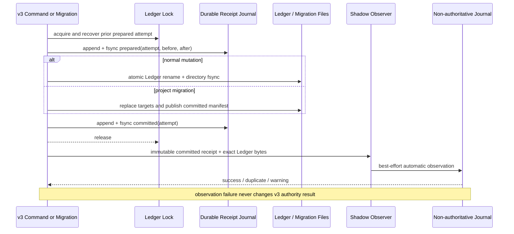

# Assurance Kernel v4 P2A Readiness Revision 1 Specification

**Design risk**: High - this revision changes the v3 Ledger commit protocol used to qualify a future Kernel canary. It spans normal authority mutations, project migration transactions, crash recovery, durable receipt identity, non-authoritative observation, and promotion evidence.
**Diagram decision**: required
**Diagram reason**: the system has two authority commit paths plus projection-only writes; each must have explicit receipt, recovery, and observation semantics.

## 1. Status and Scope

This document is the single Technical Design baseline for the corrected P2A slice. It supersedes `docs/specs/assurance-kernel-v4-p2-managed-cutover.spec.md` only for P2A implementation details. The parent document remains the roadmap authority for P2B Pi canary, P2C supported-host default, and P3 retirement decisions.

P2A remains production-unreachable for Kernel mutations:

- v3 remains the sole production workflow authority;
- no TaskRecord production routing or dual write is added;
- no host capability issuer is added;
- no privileged CLI/RPC/JSON/print path is added;
- no terminal import or migration-write command is added.

## 2. Replan Cause

The predecessor Plan assumed `commitStateMutation` covered every production Ledger authority commit. QA proved `project_migration.ts:migrateProject` is also production reachable from canonical runtime preflight and commits `.imm/memory/current_iteration.json` through its own atomic transaction.

Further adversarial review proved existing history and migration manifests are not sufficient durable commit receipts:

- business history can be archived before the Ledger rename;
- a hash of final Ledger bytes can collapse distinct commits;
- migration manifest v1 has deterministic identity that omits `after_sha256` from `manifestIdentity`;
- a rolled-back migration can reuse and overwrite its deterministic manifest directory;
- observer failure after commit is not recoverable from the current observation journal alone.

The corrected design introduces a durable authority commit receipt protocol before readiness projection consumes any observation evidence.

## 3. Goals and Non-Goals

### 3.1 Goals

1. Represent every successful v3 Ledger authority commit by one unique durable committed receipt.
2. Recover the terminal result of an interrupted prepared receipt before a later authority commit.
3. Emit exactly one automatic non-authoritative observation for each committed receipt.
4. Detect missing, duplicate, conflicting, malformed, and unsupported-writer evidence deterministically.
5. Preserve exact committed Ledger bytes/revision rather than rereading the live path after lock release.
6. Keep v3 command success, output, rollback, and authority semantics independent of observation success.
7. Deliver deterministic readiness, TaskIntent v1, TaskRecord v2, production reducer actions, and an authority-consumption port without production routing.

### 3.2 Non-Goals

- P2B canary enrollment or routing.
- Pi `ctx.ui.confirm` capability issuance.
- OpenCode/RPC privilege.
- Generic patch, hydration, import, or terminal creation APIs.
- Terminal legacy import.
- A security boundary against the same OS user arbitrarily modifying workspace files.

## 4. Technical Design

### 4.1 Closed Writer Inventory

P2A classifies every production-reachable write to `.imm/memory/current_iteration.json`:

| Writer | Classification | Receipt requirement |
|---|---|---|
| `commitStateMutation` and its authority mutation callers | authority commit | required |
| `project_migration.ts:migrateProject` when Ledger bytes change and the migration commits | authority commit | required |
| `commitStateIfUnchanged` used for autowork status snapshots | projection-only write | excluded only if tests prove authority facts unchanged |
| `saveStateLedger` | raw/bootstrap API | excluded only while production call-site inventory is empty |
| failed CAS, no-op migration, prepared/rolled-back migration | no successful authority commit | no committed receipt |

A new production writer, a projection writer that changes authority facts, or an unclassified raw caller makes readiness `blocked` and invalidates promotion evidence.

### 4.2 Durable Authority Commit Receipt Protocol

A dedicated append-only receipt journal under `.imm/memory` records authority commit attempts. It is distinct from:

- business `history` and `current_iteration_history.jsonl`;
- migration manifests;
- non-authoritative `.imm/journal.jsonl` observations.

Each record is strict, versioned, domain separated, and fsynced. Receipt identity uses a unique random attempt ID, not final-state hash.

```text
AuthorityCommitReceipt/v1
  record_id
  attempt_id
  source_kind: state_mutation | project_migration
  status: prepared | committed | aborted | recovered_committed | recovered_aborted
  state_path_identity
  before_sha256
  after_sha256
  ledger_revision
  source_ref
  previous_record_hash
  recorded_at
```

Rules:

1. `attempt_id` is unique per attempted authority commit, including byte-identical commits.
2. `record_id` is domain-separated over canonical record bytes.
3. `previous_record_hash` forms a deterministic tamper/gap chain.
4. `prepared` is fsynced before the Ledger replacement.
5. Ledger rename is followed by parent-directory fsync.
6. A terminal receipt is fsynced after the authority outcome is known.
7. Failure to append a terminal record after a successful Ledger rename does not change the v3 result; the next startup/write recovers the prepared attempt before accepting another authority commit.
8. Recovery compares strict state-path identity and exact before/after hashes. Any third state fails closed and blocks further authority commits pending repair.
9. A→B→A→B produces three distinct attempt IDs even if final business bytes repeat.

### 4.3 Normal Mutation Protocol

Under the existing Ledger write lock:

1. load and validate the persisted state;
2. apply `beforeWrite` and history compaction effects needed to determine exact bytes;
3. build exact proposed bytes/revision;
4. append/fsync a `state_mutation/prepared` receipt;
5. atomically replace and directory-fsync the Ledger;
6. append/fsync `committed` or leave recoverable prepared evidence if terminal append fails;
7. release the Ledger lock;
8. best-effort append the shadow observation from the immutable receipt and committed bytes.

A failure before Ledger replacement records/recoverably classifies `aborted` and emits no committed observation.

Business history archives remain audit material, not commit receipts.

### 4.4 Project Migration Protocol

Project migration remains a recoverable multi-file transaction. The corrected protocol adds a unique authority attempt reference without treating a deterministic v1 manifest ID as commit identity.

For a migration that changes Ledger bytes:

1. recover any interrupted migration and authority receipt first;
2. create a unique receipt attempt and bind it into the prepared migration attempt metadata;
3. append/fsync `project_migration/prepared` with Ledger before/after hashes;
4. perform target replacements under the existing Ledger lock;
5. validate all current target bytes;
6. durably publish the migration manifest as `committed`;
7. append/fsync the terminal committed receipt;
8. release the Ledger lock;
9. best-effort observe the immutable committed receipt and exact Ledger bytes captured under lock.

Rollback and recovery rules:

- failure before committed-manifest publication restores targets and terminates the receipt as aborted;
- recovery of surviving prepared migration restores targets, publishes `rolled_back`, and terminates its receipt as recovered-aborted;
- a committed manifest is never rolled back;
- interruption after committed-manifest publication but before terminal receipt/observation is recovered as committed from strict manifest, target hashes, and prepared attempt identity;
- a no-op or Plan-only migration does not enter the Ledger authority denominator;
- explicit `imm-migrate` and automatic canonical preflight use the same instrumentation;
- legacy manifest v1 remains readable/recoverable but does not qualify as P2 observer-version evidence unless a strict receipt exists.

### 4.5 Observation Protocol

Observation is non-authoritative and consumes committed receipt objects. It never invents commit identity from live Ledger bytes.

Each observation binds:

- observer version;
- receipt record/attempt ID and source kind;
- exact committed bytes hash and Ledger revision;
- bounded legacy shadow result;
- divergence/ambiguity result;
- timestamp and deterministic observation identity.

Semantics:

- identical replay is `duplicate`;
- reuse of an observation/receipt identity with different canonical content is a hard telemetry conflict;
- lock/journal/observer failure never changes the successful v3 command result;
- manual `imm-kernel status`, `journal`, `readiness`, and `migrate --dry-run` calls are queries, never automatic observations;
- no TaskRecord or workspace pointer is written.

### 4.6 Reconciliation and Readiness

Readiness derives the denominator from the validated durable receipt chain, not observation count and not business history.

For each qualifying `committed` or `recovered_committed` receipt, exactly one matching automatic observation must exist. Readiness is:

- `collecting`: evidence is valid but duration/lifecycle/family coverage is incomplete;
- `blocked`: receipt-chain gap, prepared recovery ambiguity, missing/conflicting observation, unsupported writer, divergence, ambiguity, malformed evidence, observer-version discontinuity, stale dry-run digest, or failed rollback rehearsal exists;
- `candidate`: all mechanical gates pass; literal user approval is still absent and cannot be inferred.

Promotion requires one unchanged observer/receipt protocol version for 14 consecutive days, at least three complete real v3 lifecycles, required mutation-family coverage including any migration family that occurred, exact receipt-to-observation reconciliation, zero divergence/ambiguity/gaps, current dry-run digest, rollback rehearsal, and separate literal user approval.

### 4.7 TaskIntent v1 and TaskRecord v2

P2A introduces Git-tracked `TaskIntent/v1` sidecars with stable acceptance IDs, revision, and canonical intent hash. TaskRecord v2 binds task ID, intent revision/hash, baseline/diff hash, and event identity.

Completion requires fresh accepted evidence for every current acceptance ID. TaskRecord v1 remains compatibility-read-only and is never production eligible.

### 4.8 Reducer and Authority Port

The closed production action vocabulary covers evidence, findings, ordinary resolution, approvals, intent revision, stop, and user-decision resolution. Every fact mutation is reducer-owned and event-fingerprinted.

Privileged actions consume opaque single-use authority through an internal port bound to task ID, action kind, record revision, intent revision/hash, diff hash, event ID, and expiry. P2A provides no issuer, CLI flag, serialized descriptor, generic patch/import path, or production mutation route.

### 4.9 Sequence Diagram



## 5. Invariants

1. v3 is the sole production workflow authority throughout P2A.
2. Every successful authority commit has one unique durable terminal receipt.
3. No later authority commit proceeds while an earlier prepared receipt is unresolved.
4. Every qualifying committed receipt has exactly one automatic observation or readiness is blocked.
5. Commit identity does not derive solely from final state bytes.
6. Observation failure does not alter v3 command result or committed bytes.
7. Projection-only writes cannot change authority facts.
8. No production TaskRecord write, capability issuer, privileged CLI/RPC path, or terminal import exists in P2A.

## 6. Failure and Recovery Matrix

| Failure point | Authority result | Receipt result | Observation result | Recovery |
|---|---|---|---|---|
| before prepared receipt fsync | no commit | none | none | command fails normally |
| after prepared, before Ledger replacement | no commit | prepared | none | recover aborted before next write |
| after Ledger replacement, before terminal receipt | committed | prepared | maybe absent | recover committed from exact hashes |
| after terminal receipt, before observation | committed | committed | absent | readiness gap; observer replay allowed |
| observation lock/journal failure | committed | committed | absent | v3 succeeds; readiness blocked until replay |
| migration before committed manifest | rolled back | aborted/recovered-aborted | none | targets restored |
| migration after committed manifest | committed | committed/recoverable | maybe absent | never roll back; recover receipt/observation |
| receipt chain/hash conflict | unknown | invalid | ignored | fail closed; no promotion |

## 7. Acceptance Criteria

1. Focused tests cover normal mutation, explicit/automatic migration, projection-only writer classification, and raw-writer inventory.
2. Tests cover A→B→A→B unique attempts, failed CAS, byte-identical commits, parent-directory fsync, prepared/committed/aborted recovery, and next-write blocking.
3. Migration tests cover no-op, Plan-only, prepared, rolled-back, committed, interrupted, recovered, repeated-attempt, and idempotent paths.
4. Process-level interruption tests cover receipt preparation, Ledger rename, target replacement, committed-manifest publication, terminal receipt, and observation append.
5. Readiness reconciles durable receipts to automatic observations and rejects manual queries as evidence.
6. U2 readiness, U3 intent/record identity, and U4 reducer/authority-port contracts remain P2A-only.
7. Full `bun test` and `git diff --check` pass before closure.

## 8. Devil's Advocate Audit

**DA1: Why not use business history as the denominator?**

History describes domain events and may be archived before Ledger replacement. It cannot prove successful commit count or recover a post-rename observer failure.

**DA2: Why not hash final Ledger bytes as commit ID?**

Distinct writes can produce repeated business bytes. Attempt identity must be unique and separately bind before/after hashes.

**DA3: Does the receipt journal create a second workflow authority?**

No. It records commit protocol outcomes and cannot determine Plan/Step behavior. Ledger bytes remain workflow authority; receipts only make commit occurrence observable and recoverable.

**DA4: Why is receipt persistence allowed to affect writes while observation is best-effort?**

A prepared receipt is part of crash-safe authority commit bookkeeping. Observation is derived telemetry. If preparation cannot be durably recorded, the authority commit must not begin; after the Ledger commit, terminal/observation failures cannot undo authority and are recovered or surfaced as readiness gaps.

**DA5: Why keep migration manifest and receipt journal?**

The manifest owns multi-file rollback/recovery. The receipt journal owns cross-writer Ledger commit identity and readiness reconciliation. Their responsibilities differ and are explicitly linked by attempt ID.

**DA6: Why not proceed to P2B after P2A tests pass?**

Tests prove mechanics, not promotion evidence. The unchanged-version observation window, real lifecycle coverage, rollback rehearsal, and literal user approval remain mandatory.
