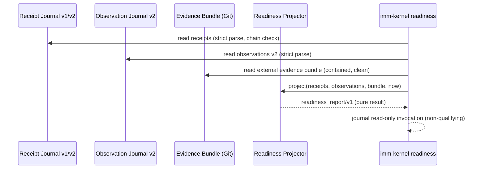

# Assurance Kernel v4 P2B-Readiness Projection Specification

**Design risk**: High
**Diagram decision**: required
**Diagram reason**: readiness reconciliation joins two durable evidence journals (receipts, automatic observations), applies epoch/window/lifecycle/family policy, and feeds a future per-task enrollment gate; an error here either blocks legitimate canary rollout forever or silently admits insufficient evidence.

## 1. Status and Scope

This document is the Technical Design authority for R2B only: the read-only readiness projection over R2A v2 evidence.

Predecessors and successors:

- R2A (complete): receipt v2 with replay-sufficient seeds; automatic observation v2 journal; symmetric writer coverage.
- R2B (this Spec): `assurance_kernel/readiness_report/v1` projector and `imm-kernel readiness --json` route.
- R2C (separate Plan): TaskIntent v1, TaskRecord v2, reducer/authority boundary.
- P2B canary enrollment, P2C routing, and P3 retirement remain outside this Spec.

R2B remains strictly read-only:

- no Ledger, TaskRecord, workspace pointer, Intent, journal, receipt, or manifest writes;
- no route enrollment, host issuer, capability minting, or backend selection;
- `ready=true` is never persisted as workflow authority;
- the projection is recomputed from durable evidence on every invocation.

## 2. Evidence Basis

The only qualifying inputs are:

1. The authority commit receipt journal `.imm/memory/.current_iteration.authority_commit_receipts.jsonl` (v1 readable as legacy; v2 carries `observation_generation` and terminal `observation_seed`).
2. The automatic observation journal `.imm/memory/.current_iteration.automatic_observations.jsonl` (strict v2 only).
3. An external, Git-tracked evidence bundle for migration digest and rollback rehearsal (Section 4.4).

Non-qualifying inputs, always excluded from windows and counts:

- receipt v1 and observation v1/hash/attempt-only records (`legacy-readable`, diagnostic only);
- manual `imm-kernel status|journal|migrate` invocations recorded in `.imm/journal.jsonl`;
- any readiness report itself (no self-observation recursion).

## 3. Technical Design

### 3.1 Epoch and Qualifying Window

The v2 epoch starts at the earliest receipt-v2 `prepared` record timestamp. A qualifying window is a maximal contiguous span of v2 receipts and v2 observations in which:

- every receipt-v2 prepared/terminal pair matches on attempt ID and generation;
- every terminal `committed`/`recovered_committed` receipt v2 has exactly one matching observation v2 with identical `receipt_record_id`, `receipt_attempt_id`, `source_kind`, `state_path_identity`, `committed_bytes_sha256`, and `committed_revision`/receipt seed `ledger_revision` semantics;
- no receipt or observation is malformed, ambiguous, or carries an unexpected `observer_version`/`observation_generation`;
- no observation `divergence.detected` is true;
- no observation journal conflict or receipt chain break exists.

Any violation marks the current epoch `blocked`. Blocking is sticky for that epoch: repairing or appending records never resets the window forward and never removes the gap from the report. A fresh window can begin only when a later receipt uses a new `observation_generation`; prior-epoch violations remain visible in `gaps[]` and `legacy_counts`. A window that is merely too short or too thin emits `collecting`.

### 3.2 Promotion Conditions

`candidate` requires all of the following, computed from the current window:

1. `window_days = floor((midnightUTC(now) - midnightUTC(epoch_started_at)) / 86400) + 1`; `candidate` requires `window_days >= 2` (at least one full UTC day span; day 1 is the epoch's own day). This short window deliberately replaces the original 14-day observation gate per the literal user's short-validation request after the first real canary walkthrough; the gate remains waivable at enrollment. For example, an epoch starting `2026-08-01T15:00:00Z` reaches day 2 at `2026-08-02T00:00:00Z`.
2. At least three completed real v3 managed lifecycles. One lifecycle is a maximal sequence for one `plan_path` containing, in temporal order, at least one execution-evidence family receipt (`record_execution_evidence` or `record_work_probe_evidence`), at least one review family receipt (`review_step` or `review_gate_pass`), and exactly one termination family receipt (`finish_reset` or `terminate_plan`). An activation family receipt (`sync_plan_from_imm_plan` or `activate_step`) may precede this sequence and, when present, must be its earliest member. Each distinct `plan_path` contributes at most one lifecycle; records after termination cannot form a second lifecycle for the same path.
3. Family coverage across the window includes execution evidence, review, and termination. Activation-or-sync coverage is reported but is not required because a qualifying epoch may begin while a Plan is already active.
4. Zero qualifying-window gaps, conflicts, divergences, or malformed records.
5. The evidence bundle presents a migration dry-run digest and `writes_performed=false`; the CLI independently computes the current digest through the existing in-process read-only migration dry-run report generator and requires an exact match (Section 3.4). Failure to compute the current digest is `blocked`.
6. A rollback rehearsal record exists in the evidence bundle with `result="passed"` within the current window.

`collecting` is the healthy default whenever a temporal or coverage condition is unmet and no integrity violation exists. `blocked` is sticky for the current epoch as defined in Section 3.1. The report never infers or stores literal user approval; P2B promotion additionally requires a separate user decision outside this projection.

### 3.3 Report Contract

`imm-kernel readiness --json` emits `assurance_kernel/readiness_report/v1`:

```text
contract
status: collecting | blocked | candidate
observer_version
epoch_started_at
window_started_at
window_days
receipts_v2_count
observations_v2_count
reconciled_terminal_count
lifecycle_count
families_covered[]
families_missing[]
gaps[]           // typed reason codes with evidence references
legacy_counts    // v1 receipts/observations, diagnostic only
migration_digest { presented, current, match }
rollback_rehearsal { present, result, at }
generated_at
```

The report is deterministic for identical inputs and carries no authority. `generated_at` is injected by the caller so tests control time.

### 3.4 External Evidence Bundle

Migration digest and rollback rehearsal cannot be produced by the same read-only query that consumes them; otherwise staleness is undetectable. They arrive as one strict, Git-tracked JSON bundle:

```text
docs/evidence/assurance-kernel/readiness.json
```

```json
{
  "contract": "assurance_kernel/readiness_evidence/v1",
  "generated_at": "ISO-8601",
  "migration_dry_run": {
    "digest": "sha256:...",
    "writes_performed": false
  },
  "rollback_rehearsal": {
    "result": "passed",
    "at": "ISO-8601",
    "summary": "..."
  }
}
```

Loader rules: canonical containment under `docs/evidence/assurance-kernel/`; whole-path no-symlink; bounded size (64 KiB); strict closed schema; `generated_at` within the current window; Git-tracked and clean (`git status --porcelain` empty for the path); pre/post-read device/inode identity. The loader does not trust the bundle's digest as current. `commands/kernel.ts` exposes one reusable `buildKernelMigrationDryRunReport(root)` for both `imm-kernel migrate --dry-run` and readiness; `canonicalKernelMigrationReportBytes(report)` serializes that report with recursively sorted object keys and UTF-8 JSON without insignificant whitespace; `migration_dry_run.digest` is `sha256:` plus the lowercase SHA-256 of those bytes. `imm-kernel readiness` invokes this in-process read-only builder, hashes the canonical bytes, and compares the result with the bundle digest. It must not spawn a migration subprocess or write a migration manifest. A missing bundle yields `collecting` with reason `evidence_bundle_missing`; a malformed, stale, dirty, out-of-window, or digest-mismatched bundle yields `blocked`.

### 3.5 Sequence Diagram



### 3.6 Failure Matrix

| Condition | Status | Reason code |
|---|---|---|
| No v2 receipts yet | collecting | `epoch_empty` |
| Window shorter than 2 days | collecting | `window_too_short` |
| Fewer than 3 lifecycles | collecting | `lifecycle_coverage` |
| Missing family coverage | collecting | `family_coverage` |
| Missing evidence bundle | collecting | `evidence_bundle_missing` |
| Terminal receipt without observation | blocked | `missing_observation` |
| Observation without terminal receipt | blocked | `orphan_observation` |
| Field mismatch receipt vs observation | blocked | `binding_mismatch` |
| Observer version or generation change | blocked | `version_discontinuity` |
| Observation divergence detected | blocked | `shadow_divergence` |
| Receipt chain break or malformed record | blocked | `evidence_integrity` |
| Bundle malformed/stale/dirty/out-of-window | blocked | `evidence_bundle_invalid` |
| Rehearsal failed or outside window | blocked | `rollback_rehearsal_invalid` |

### 3.7 Legacy and Non-Qualifying Inputs

V1 receipts and v1/hash observations remain readable for diagnostics and count only in `legacy_counts`. They never open a window, supply lifecycle/family coverage, satisfy reconciliation, or reset an epoch. A record that merely claims v2 but fails strict validation is an integrity violation, not legacy.

Every `imm-kernel readiness` invocation appends exactly one non-qualifying `assurance_kernel/journal/v1` entry to `.imm/journal.jsonl` with `reason_code="command_ok"` on success (or the existing command error reason on failure). The entire friction journal is excluded from readiness inputs regardless of reason code or payload; readiness never reads it.

## 4. Acceptance Criteria

1. The projector is a pure function over (receipts, observations, bundle, now) with deterministic output and no I/O.
2. Epoch begins at the first v2 prepared receipt; gaps before the first successful observation are visible and cannot be hidden.
3. Every terminal v2 receipt is reconciled exactly once; duplicate identical observations are tolerated as one, conflicting duplicates block.
4. Version or generation discontinuity inside or adjacent to the window blocks rather than silently resets.
5. Lifecycle detection requires distinct `plan_path` values, counts at most one lifecycle per path, and enforces `optional activation < execution evidence < review < termination`; partial, repeated-path, or out-of-order sequences never count.
6. UTC day counting uses the normative formula in Section 3.2 condition 1.
7. `imm-kernel readiness --json` is registered in the canonical command manifest/help, classified as `projectAccess="read"`, runs through canonical migration preflight, performs no authority writes, appends exactly one non-qualifying friction event, and preserves Ledger/TaskRecord/workspace/Intent/receipt/observation/migration-manifest bytes.
8. V1 records remain readable and are counted only under `legacy_counts`.
9. A missing bundle yields `collecting`; an invalid bundle yields `blocked`; the presented digest must equal a digest independently recomputed through the existing in-process read-only migration dry-run generator, never a subprocess or a value copied from the bundle.
10. The report never persists readiness status and never influences routing in this slice.

## 5. Non-Goals

- P2B enrollment, Pi confirmation, capability issuance, or per-task routing.
- TaskIntent/TaskRecord v2 or production reducer actions (R2C).
- Automatic scheduling or background daemons; projection is on-demand only.
- Terminal import or legacy journal rewriting.
- Claiming tamper-proof audit against a same-user hostile writer.
