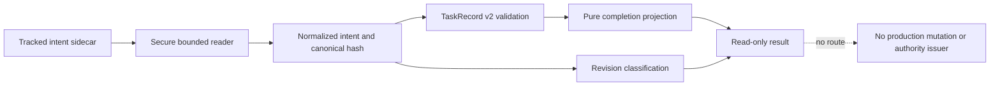

# Assurance Kernel v4 P2C1 Intent Identity Specification

## 1. Summary

P2C1 freezes the production data identity required before any Kernel mutation can be exposed. It adds a secure Git-owned `TaskIntent v1` reader, additive `TaskRecord v2`, and intent-hash-aware completion semantics while v3 remains the sole production workflow authority.

P2C1 exposes no mutation CLI, host authority issuer, enrollment route, backend switch, terminal import, or TaskRecord production writer. Those remain later boundaries.

## 2. Goals

1. Read one exact Git-tracked TaskIntent sidecar through a bounded, symlink-safe, TOCTOU-aware contract.
2. Derive one deterministic canonical intent content hash independent of JSON formatting.
3. Add TaskRecord v2 without changing TaskIntent/TaskRecord v1 wire meanings.
4. Bind v2 evidence and approvals to the current intent revision, intent content hash, acceptance ID, and diff hash.
5. Require fresh accepted evidence for every current acceptance ID.
6. Classify compatible and breaking intent revisions deterministically.
7. Keep all production mutation and authority issuance unavailable.

## 3. Non-Goals

- No reducer factual action vocabulary.
- No authority-consumption port or authority factory.
- No `imm-kernel` mutation subcommand, host tool, RPC, or routing change.
- No P2B canary enrollment or backend selection.
- No legacy terminal import or TaskRecord materialization from v3.
- No claim that Git tracking authenticates a user.
- No automatic rewrite of TaskRecord v1.

## 4. Contracts

### 4.1 TaskIntent v1

The canonical sidecar path is:

```text
docs/plans/<task_id>.intent.json
```

The strict wire contract is:

```json
{
  "contract": "assurance_kernel/task_intent/v1",
  "task_id": "123-short-goal",
  "goal": "One outcome statement",
  "acceptance": [
    {
      "id": "A1",
      "assertion": "One observable acceptance condition",
      "verification": "One deterministic verification description"
    }
  ],
  "scope_hint": ["path/or/domain"],
  "risk": "routine",
  "revision": 1,
  "owner": "user"
}
```

Validation is fail-closed:

- unknown fields are rejected at every level;
- task ID, acceptance IDs, goal, assertion, verification, and scope entries are non-empty and bounded;
- acceptance is non-empty and IDs are unique;
- revision is a positive integer;
- risk is `routine`, `material`, or `critical`;
- owner is exactly `user` in P2C1.

### 4.2 Secure reader and identity token

`readTaskIntent(root, taskId)` resolves only the exact canonical sidecar. The reader first resolves `realpath(root)` and uses that same canonical root as both Git command `cwd` and filesystem containment authority. A symlink supplied as the project root is rejected rather than silently changing project identity. The canonical sidecar path and persisted `intent_ref.path` are repo-relative POSIX paths exactly equal to `docs/plans/<task_id>.intent.json`.

The reader requires:

- exact filename-to-task-ID binding and canonical project containment;
- every existing parent segment to be non-symlink before and after the read, with stable `{dev, ino}` identity;
- a regular file no larger than 64 KiB;
- Git tracking through `git ls-files --error-unmatch -- <relative-path>` using the canonical root as `cwd`;
- no requirement that worktree or index content be clean;
- an `O_NOFOLLOW` descriptor open; platforms without an effective no-follow primitive fail closed;
- descriptor `fstat` identity `{dev, ino, size, mtimeMs}` matching the path identity before and after reading;
- a bounded descriptor read, followed by path/parent identity re-verification without using a second path read as the source of bytes;
- rejection of parent-directory replacement, file replacement, A→B→A swaps, canonical-root drift, and Git-cwd mismatch.

The reader returns normalized TaskIntent, `content_hash = sha256:<64-lowercase-hex>` over canonical JSON, `intent_ref { path, revision, content_hash }`, and an opaque file identity token. The token is a module-private branded runtime value containing the canonical root/path identity, descriptor identity, source-byte hash, and canonical intent hash. It is attached through a non-enumerable symbol-backed property, is absent from `Object.keys`, object spread, structured wire projection, and `JSON.stringify`, and cannot be caller-constructed through exported APIs. P2C1 exports no token consumer or authority issuer; R2C2 must consume only a token produced by this reader and must reread/CAS before mutation.

Git tracking is an ownership convention, not user authentication.

### 4.3 Canonical JSON

Canonical JSON recursively sorts object keys, preserves array order, emits UTF-8 JSON without insignificant whitespace, and hashes the exact canonical bytes. Two formatting-only source changes produce the same content hash; semantic changes produce a different hash.

### 4.4 Additive TaskRecord v2

TaskRecord v1 remains strictly readable through the existing `parseTaskRecord`, `completionDecision`, and `projectTask` signatures and keeps its current behavior. Existing storage and reducer call sites remain v1-only and must reject `task_record/v2` before any write. TaskRecord v1 is production-ineligible.

TaskRecord v2 uses independent read-only APIs `parseTaskRecordV2`, `completionDecisionV2`, and `projectTaskV2`. Its exact top-level wire is:

```json
{
  "contract": "assurance_kernel/task_record/v2",
  "task_id": "123-short-goal",
  "intent_revision": 1,
  "intent_snapshot": { "contract": "assurance_kernel/task_intent/v1" },
  "intent_ref": {
    "path": "docs/plans/123-short-goal.intent.json",
    "revision": 1,
    "content_hash": "sha256:<64-lowercase-hex>"
  },
  "phase": "working",
  "baseline": "sha256:<64-lowercase-hex>",
  "evidence": [],
  "findings": [],
  "approvals": [],
  "history": []
}
```

`intent_snapshot` is the complete normalized TaskIntent v1 wire from section 4.1. `task_id`, `intent_revision`, `intent_snapshot.task_id/revision`, and `intent_ref.revision` must match. `intent_ref.path` is the exact repo-relative POSIX canonical sidecar path and its hash must equal the snapshot canonical hash.

V2 evidence exact keys are `id`, `acceptance_id`, `task_revision`, `intent_content_hash`, `diff_hash`, `status`, `actor_id`, and `summary`. V2 approvals exact keys are `id`, `kind`, `authority_role`, `task_revision`, `intent_content_hash`, `diff_hash`, `actor_id`, and `summary`. Hashes use `sha256:<64-lowercase-hex>`. Status and enum meanings remain those of v1. Findings and history reuse the exact v1 shapes without additive fields. IDs, actors, summaries, baseline, and strings retain v1 non-empty bounded rules; unknown fields and duplicate IDs are rejected.

The v2 parser rejects mixed v1/v2 item shapes, unknown acceptance IDs, snapshot/ref mismatches, malformed hashes, and any v1 contract routed to the v2 API. No generic union dispatcher replaces a v1 public API in P2C1.

### 4.5 Completion semantics

For TaskRecord v2, evidence is fresh only when all of these match the current read intent:

- acceptance ID exists in the current acceptance set;
- status is passed;
- intent revision matches;
- intent content hash matches;
- diff hash matches the current diff.

Completion requires fresh evidence for every current acceptance ID plus the existing risk-based independent approval, no-blocking-finding, and no-unresolved-user-decision predicates. Approvals are fresh only when revision, intent hash, and diff hash all match.

Intent drift is projected, not persisted: prior evidence and approvals remain append-only but become stale when revision or content hash changes.

TaskRecord v1 continues to use the existing v1 completion predicate.

### 4.6 Intent revision classification

`classifyIntentRevision(previous, next)` returns `unchanged`, `compatible`, or `breaking`.

A compatible revision:

- preserves contract, task ID, owner, and goal;
- strictly increases revision when canonical content changes;
- never lowers risk;
- preserves every prior acceptance ID and its assertion;
- may add new acceptance IDs;
- may update verification text or scope hints with a revision increase.

Removing or rewriting an existing acceptance assertion, changing goal/owner/task identity, or lowering risk is breaking. P2C1 only classifies; it cannot approve or apply either class through production mutation.

## 5. Technical Design

**Design risk**: high

**Required diagram**: included



Implementation ownership:

- `kernel/intent.ts`: strict TaskIntent v1 parser, canonical serializer/hash, secure descriptor reader, opaque token producer, and revision classifier;
- `kernel/types.ts`: additive TaskIntent v1 and TaskRecord v2 types without changing v1 contracts or exported signatures;
- `kernel/validation.ts`: independent v2 parser/invariants while `parseTaskRecord` remains v1-only;
- `kernel/completion.ts`: independently named v2 completion/projection APIs while v1 APIs remain unchanged;
- `kernel/index.ts`: additive read-only identity/v2 exports only; existing v1 mutation exports remain unchanged and cannot accept v2;
- tests: identity/path/token security, exact wire compatibility, all-acceptance completion, stale projection, v1 API compatibility, v2 writer rejection, and no-new-surface boundaries.

## 6. Invariants

1. TaskIntent source bytes are never trusted through a caller-supplied path.
2. Git tracking is required but clean status is not.
3. Canonical intent hash is formatting-independent and semantic-change-sensitive.
4. TaskRecord v1 wire semantics remain unchanged.
5. TaskRecord v2 cannot validate unless its snapshot and intent_ref match exactly.
6. Every current acceptance ID requires fresh accepted evidence.
7. Revision/hash drift stales evidence and approvals by projection only.
8. P2C1 adds no mutation, issuer, routing, import, or generic union-parser surface; existing v1 exports remain unchanged and reject v2.
9. The opaque token is non-enumerable, non-serializable through public projections, and caller-unconstructable through exported APIs.
10. P2C1 does not alter v3 routing, readiness, receipt, or observation behavior.

## 7. Verification

- Strict TaskIntent schema and canonical hash tests.
- Secure reader tests for root symlink, Git-cwd mismatch, missing/untracked/traversal/wrong filename, parent-directory replacement, file replacement, A→B→A swap, unsupported no-follow, oversize, malformed input, and descriptor/path identity drift.
- Opaque token tests proving non-enumerability, JSON/spread exclusion, stable internal identity, and no exported constructor/consumer.
- TaskRecord v1 fixture plus compile-time/public-signature compatibility tests.
- TaskRecord v2 exact-wire parsing, snapshot/ref mismatch, mixed-shape rejection, hash-format enforcement, and duplicate-ID tests.
- Existing storage/reducer rejection tests proving valid v2 cannot enter v1 production writers.
- All-acceptance completion and revision/hash/diff staleness matrices through independently named v2 APIs.
- Compatible/breaking revision truth table.
- Boundary tests anchored to `commands/kernel.ts`, `immune_brain_runtime.ts`, `storage.ts`, `reducer.ts`, and `index.ts`, proving command/manifest/export baselines and no new mutation/issuer/import surface.
- Full repository tests, Plan validation, and `git diff --check`.

## 8. Devil's Advocate Audit

| Challenge | Decision |
|---|---|
| A dirty tracked intent can be attacker-controlled | P2C1 does not authenticate the editor; it binds exact bytes/hash and requires future host authority before mutation. Requiring clean state would make ordinary intent editing unusable and still would not prove identity. |
| V2 could silently reinterpret v1 records | Use independently named v2 APIs; preserve exact v1 signatures and require existing storage/reducer paths to reject v2. |
| Existing index already exposes v1 mutation helpers | P2C1 does not claim a mutation-free baseline; it adds no new mutation/issuer surface and does not extend existing v1 writers to v2. |
| One evidence item could satisfy the task | Completion iterates every current acceptance ID and requires one fresh passed item per ID. |
| Formatting-only changes could stale evidence | Hash canonical normalized JSON, not source bytes. |
| Canonical hash could hide source races | Descriptor bytes are authoritative; parent/path/fd identities and opaque token are separately verified. |
| Token could leak into persisted records | Token is module-private branded, non-enumerable, excluded from JSON/spread projections, and has no exported consumer in P2C1. |
| This slice could accidentally expose mutation | Boundary tests pin command/manifest/export baselines and prove v2 rejection at existing storage/reducer call sites. |
| Intent and reducer work could be one Step | Rejected: they have different rollback and authority boundaries and would modify the same core owners twice. Reducer/authority remains R2C2. |

## 9. Continuation

After P2C1 closes, R2C2 may define the closed factual reducer vocabulary and opaque authority-consumption port. P2B canary routing still requires qualifying R2B readiness evidence plus separate literal user approval.
