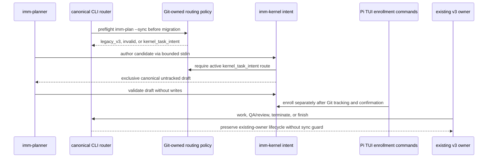

# Assurance Kernel P3: Managed v3 Creation Retirement

**Design risk**: High
**Design risk rationale**: This slice changes pre-migration command routing, Git-index-bound authority policy, host-neutral artifact creation, packaged Skill behavior, and the final drain-to-finish path across persisted v3 and Kernel ownership boundaries.
**Diagram decision**: required
**Diagram reason**: The ordered relationship among policy preflight, TaskIntent authoring, Pi-only enrollment, existing-owner drain, and final policy activation is security-critical and easier to falsify as a sequence diagram.

## Technical Design



The normative interfaces, invariants, failure behavior, compatibility, and
rollback model follow in Sections 4 through 8; the diagram is explanatory and
does not define a second contract.

## 1. Context

P2C made Assurance Kernel the default backend for newly created managed tasks
on the qualified Pi host. It preserved v3 Plan creation, existing-task backend
affinity, and all v3 lifecycle behavior. P3 is the separate value decision
recorded by the parent cutover contract: stop creating new v3 managed tasks,
retain legacy visibility and drain behavior, and decide whether terminal v3
history needs import.

The P2C route is not yet a complete planning route. The default
`/imm-canary-new <task-id>` and explicit-waiver
`/imm-canary-enroll <task-id>` routes only enroll an already-authored,
Git-tracked `docs/plans/<task-id>.intent.json`; neither creates a
`TaskIntent`. No current Planner or CLI contract authors and validates this
artifact. Retiring v3 creation before closing that gap would leave the default
Kernel route unable to start ordinary planned work.

P3 therefore has three ordered outcomes:

1. establish a pre-dispatch project policy that can reject new v3 authority
   before automatic migration or any state write;
2. establish one host-neutral Kernel `TaskIntent` authoring and validation
   contract for `imm-planner` while leaving enrollment authority Pi-only;
3. activate the reviewed policy only after both paths are verified.

## 2. Goals

- Give `imm-planner` a bounded executable Kernel planning output:
  `docs/plans/<task-id>.intent.json` using
  `assurance_kernel/task_intent/v1`.
- Add one host-neutral CLI authoring command that exclusively creates a strict,
  canonical TaskIntent draft without overwriting an existing path or writing
  workflow state.
- Add a read-only CLI validator that proves schema, path identity, acceptance
  identity, and Pi verification-descriptor eligibility without writing a
  TaskRecord, backend claim, State Ledger, Git index, or session state.
- Add one strict, project-local routing policy with a deterministic read-only
  status projection.
- Reject every attempt to acquire new v3 Plan authority after this repository
  opts into retirement.
- Preserve validation-only Plan reads, active/finished legacy projections,
  existing Plan execution, QA/review, termination, and `imm-finish`.
- Keep Kernel planning host-neutral while keeping managed execution authority
  exclusive to the existing Pi TUI enrollment boundary: default no-waiver
  `/imm-canary-new` and explicit-waiver `/imm-canary-enroll`.
- Record an explicit no-import decision for terminal v3 history.

## 3. Non-goals

- Deleting the v3 State Ledger, parser, migration reader, projection, command
  wrappers, Skills, historical Plans, Specs, receipts, or observations.
- Converting an active or terminal v3 Plan into a Kernel `TaskRecord`.
- Dual-writing TaskIntent/TaskRecord facts into v3 state.
- Qualifying OpenCode, Codex, Cursor, Claude Code, RPC, JSON, print, or CLI as
  privileged Kernel enrollment hosts. These hosts may author and validate
  TaskIntent files but cannot acquire Kernel lifecycle authority.
- Adding a compatibility adapter or temporary fallback from failed Kernel
  enrollment to v3.
- Changing Direct Path eligibility for low-risk work that does not acquire
  managed workflow authority.
- Changing Kernel backend affinity, drain semantics, authority capabilities,
  TaskRecord schema, or completion semantics.

## 4. Kernel Planning Contract

### 4.1 Planner route selection

Before producing a new managed planning artifact, `imm-planner` reads the
host-neutral routing-status projection. Routing is deterministic:

- an active Kernel claim routes to `imm-canary-work`, not new planning;
- an active or otherwise nonterminal v3 Plan remains on its existing v3 route;
- no routing policy preserves the legacy v3 Planner behavior for compatibility
  with other projects;
- a valid `kernel_task_intent` retirement policy produces one TaskIntent draft
  on every host that can run `imm-planner`;
- an invalid, unreadable, untracked, or tracked-deleted policy rejects new
  planning authority with `routing_policy_invalid`;
- no Planner path enrolls a task or falls back to v3 after retirement.

Host identity is not a planning input and is never inferred from flags,
environment variables, agent-local config, or Skill prose. Planning is
read-only with respect to workflow state. The only production boundary that can
turn the Git-tracked draft into managed execution authority remains Pi TUI. Its
default `/imm-canary-new` route requires candidate readiness with no waiver;
its existing `/imm-canary-enroll` route permits only the separately specified
literal-user-confirmed waiver flow. Both preserve exact-task confirmation,
post-confirm revalidation, rehearsal, and atomic enrollment. Other hosts can
produce and review the artifact but cannot enroll it.

The Planner must not write the artifact directly or overwrite an existing
TaskIntent. It supplies a complete candidate Intent to the canonical
`imm-kernel intent author` command, which owns strict parsing, descriptor
canonicalization, path binding, and exclusive file creation. A new task ID uses
the existing project date/sequence naming convention unless the user supplied
a valid stable ID. Revisions of an enrolled intent continue through Kernel
`revise_intent` authority and are not a Planner overwrite path.

### 4.2 TaskIntent artifact

The only Kernel planning artifact is:

```text
docs/plans/<task-id>.intent.json
```

It uses the exact existing contract:

```json
{
  "contract": "assurance_kernel/task_intent/v1",
  "task_id": "<task-id>",
  "owner": "user",
  "goal": "<one bounded goal>",
  "acceptance": [
    {
      "id": "A1",
      "assertion": "<observable acceptance assertion>",
      "verification": "<canonical verification_descriptor/v1 JSON string>"
    }
  ],
  "scope_hint": ["<project-relative path>"],
  "risk": "routine|material|critical",
  "revision": 1
}
```

The artifact stores intent only. It contains no phase, evidence, finding,
approval, diff hash, capability, backend claim, execution attempt, or derived
readiness field.

### 4.3 Executable authoring and read-only validation

The canonical authoring command is:

```text
imm-kernel intent author docs/plans/<task-id>.intent.json --stdin --json
```

It accepts one complete `task_intent/v1` candidate from bounded stdin. Only the
exact `intent author ... --stdin` branch reads file descriptor 0; help,
validation, and all pre-existing `imm-kernel` commands never read stdin. Input
larger than the fixed TaskIntent bound fails before JSON parsing or destination
access. Canonical dispatch bypasses project migration and the friction journal.
The command first requires the routing policy to resolve to the active
`kernel_task_intent` route; missing legacy policy, invalid policy, active Kernel
ownership, or nonterminal v3 ownership rejects before opening the destination. It then applies the
strict TaskIntent parser, task/path identity checks, and shared verification
parser, replaces every accepted verification string with
`canonicalDescriptorBytes`, serializes one deterministic JSON document, and
creates only the requested `docs/plans/<task-id>.intent.json` with exclusive
no-overwrite semantics. It never stages Git, enrolls a task, writes a
TaskRecord/backend claim/State Ledger/receipt/observation/journal/session file,
or creates parent directories. Existing regular files and every symlink or
path-identity mismatch fail closed and remain byte-for-byte unchanged. A
successful draft is valid but not enrollment-ready until Git tracking is
separately established.

The canonical validation command is:

```text
imm-kernel intent validate docs/plans/<task-id>.intent.json --json
```

Validation performs zero writes, including no friction-journal append,
migration, lock, receipt, observation, TaskRecord, backend claim, State Ledger,
Git index, or session-state write. Canonical dispatch classifies this exact
subcommand as a no-migration query before `prepareProjectAccess`; other existing
`imm-kernel` query journal semantics remain unchanged. The command returns a
stable bounded projection containing:

- `valid`;
- normalized project-relative path and task ID;
- canonical intent content hash;
- risk and acceptance IDs;
- verification eligibility for every acceptance item;
- Git ownership status (`tracked`, `untracked`, or `unavailable`);
- an `enrollment_ready` decision.

Validation must use the existing strict `parseTaskIntentV1` contract and one
shared pure `verification_descriptor/v1` parser also consumed by Pi assurance.
The shared parser preserves the complete existing Pi accepted wire contract:
exact fields, supported `bun` runner ID, non-empty claimed runner version,
shell-free argv, any contained repository-relative `cwd`, and current
timeout/output bounds. JSON whitespace and key ordering are not eligibility
conditions. Planner output itself uses `canonicalDescriptorBytes`, so newly
authored descriptors are deterministic without rejecting equivalent historical
formatting. Unknown fields, duplicate acceptance IDs, task/path mismatch,
unsupported runner metadata, shell strings, malformed JSON, traversal,
symlinks, and oversized input fail closed. Enrollment readiness additionally
requires the descriptor runner version to equal the currently frozen Bun
runner, exactly as Pi assurance already requires.

A valid untracked draft is `valid: true` but `enrollment_ready: false`; the
validator reports `intent_not_git_tracked`. It never stages or commits the
file. Enrollment continues to use the secure same-lock TaskIntent reader and
therefore requires the reviewed artifact to become Git-tracked before either
Pi TUI enrollment command.

## 5. Routing Policy Contract

### 5.1 Path and schema

The optional project policy is:

```text
docs/plans/managed-task-routing-policy.json
```

The only v1 wire form is:

```json
{
  "contract": "immune_brain/managed_task_routing_policy/v1",
  "revision": 1,
  "new_task_route": "kernel_task_intent",
  "v3_new_plan_sync": "retired",
  "legacy_v3_mode": "drain_read_only",
  "terminal_import": "disabled"
}
```

The policy file uses one canonical UTF-8 serialization: two-space JSON
indentation, the field order shown above, and one trailing newline. Revision 1
accepts no formatting-equivalent alternative. Its exact SHA-256 is
`43949f0ef456efb9ca7dccbe1c8bc2355d6acce66486213fb2750a87388ec71e`.
The parser rejects non-canonical bytes, unknown/missing fields, duplicate JSON
keys, unsupported values, non-regular files, paths outside the canonical
project root, every symlink component, oversized bytes, read-time identity
drift, and a policy that is not present in the Git index. Active policy
additionally requires the worktree bytes and Git-index bytes to be
byte-identical. Any unstaged drift is `routing_policy_invalid`; a staged policy
is active only when its staged bytes match the worktree and fixed hash. The
status projection reports both hashes. The runtime never stages or commits the
policy.

A path absent from both the worktree and Git index is the compatibility state
`legacy_v3`. A present malformed, unreadable, untracked, worktree/index-drifted
policy, and a Git-indexed policy deleted from the worktree, are never treated
as missing; they block every new managed-authority path with
`routing_policy_invalid`. An exact valid policy becomes the active target
route only after identical bytes are present in the worktree and Git index.
Policy activation is therefore an explicit integration action, not a runtime
side effect.

### 5.2 Read-only status

The canonical command is:

```text
imm-plan --routing-status --json
```

It performs no migration and no writes. The bounded output includes policy
status, route, v3 creation decision, legacy mode, terminal-import decision,
worktree content hash, Git-index content hash, ownership/drift state, and a
stable reason code. It contains no host qualification field because planning
is host-neutral and Pi enrollment authority is owned by the existing extension
boundary. It does not expose raw file bytes, Git command output, environment
values, or State Ledger internals.

### 5.3 New v3 authority guard

The canonical dispatcher performs routing-policy preflight before
`prepareProjectAccess`, automatic project migration, Kernel-backend guards, or
command dispatch only for `imm-plan --sync`. It never applies the new-authority
guard to `imm-work`, `imm-review`, explicit termination, or `imm-finish`. For
any `imm-plan --sync`, it parses the command/path and policy without creating a
lock or temporary file. When policy is invalid it rejects with
`routing_policy_invalid`; when a valid policy says
`v3_new_plan_sync: retired`, it rejects:

- initial sync into an empty/intentional-reset Ledger;
- ordinary cross-Plan sync;
- approved successor transition sync;
- every alias of a different Plan identity.

A same-identity sync exception exists only when a current-format Ledger can
prove exact canonical Plan identity without migration. A legacy-format Ledger
cannot earn the exception: new sync remains blocked, while existing ownership
can use the ordinary non-sync work/review/finish path, whose existing migration
gateway remains available.

Every rejection occurs before migration or any State Ledger, HANDOFF, receipt,
observation, journal, session, inbox, lock, migration backup/manifest, or
temporary-file write. Canonical dispatch exposes a test-only
pre-`prepareProjectAccess` seam; retirement tests install interrupted migration,
prepared authority-receipt, missing-observation, and stale lock/temp fixtures
and prove that seam and every recovery owner remain unentered. Final byte
snapshots are supporting evidence, not the sole proof. The stable
`v3_new_plan_sync_retired` error directs users to TaskIntent planning and states
that only the Pi TUI enrollment boundary can enroll the result.

The guard does not reject same-identity access needed by the already-synced P3
Plan. Existing semantic rules still decide whether a same-Plan resync is
otherwise legal. This permits P3 to install the policy without locking itself
out of execution and closure.

### 5.4 Preserved legacy behavior

The policy is not consulted as an authorization gate for an already-owned v3
Plan. These remain available and behaviorally unchanged:

- `imm-plan <path> --json` validation-only reads;
- routing-status and progress/status projections;
- `imm-work activate`, probes, execution evidence, and follow-up handling;
- `imm-review` QA and gate recording;
- explicit termination;
- `imm-finish` and intentional reset;
- project-format migration required to read or finish existing legacy state;
- historical Plan/Spec/receipt/observation retention.

No command may infer that `legacy_v3_mode: drain_read_only` authorizes a new
v3 Plan. "Drain" means only finishing or explicitly terminating authority that
was acquired before retirement.

## 6. Terminal Import Decision

P3 decides `terminal_import: disabled`.

Current consumers need auditability and read-only projection, both already
come from retained v3 Plans, Specs, State Ledger history, commit receipts, and
automatic observations. Reconstructing terminal `TaskRecord` state would add a
second authority representation with no execution or completion value. It
would also require synthetic intent identities, acceptance coverage,
approvals, diff hashes, and terminal markers that historical v3 records do not
prove.

No importer, mapper, migration command, compatibility layer, or dual-written
terminal record is added. Reconsider terminal import only under a new Plan
that names a concrete consumer unable to use retained v3 projection and proves
how every Kernel invariant is sourced without fabrication. Owner: user.
Expiration condition for this no-import decision: such a concrete consumer
and proof are approved.

## 7. Failure and Rollback Model

- Invalid indexed policy: block new v3 authority acquisition; preserve existing
  drain and read-only operations so the project is recoverable.
- Present malformed, unreadable, untracked, tracked-deleted, or
  worktree/index-drifted policy: report `routing_policy_invalid` and block new
  managed authority before migration. Existing-owner work, QA/review, explicit
  termination, and finish do not consult this new-authority guard; the runtime
  never stages or commits policy bytes.
- Missing policy: preserve legacy behavior for projects that have not opted in.
- Kernel Intent authoring failure: leave every pre-existing path and all
  workflow state unchanged; never fallback.
- Kernel Intent validation failure: write nothing and leave v3 retirement in
  force; never fallback.
- Kernel enrollment/readiness failure: write nothing and report the Kernel
  blocker; never fallback.
- P3 execution interruption after policy creation: the already-synced P3 Plan
  remains drainable because same identity and existing-owner operations are
  preserved.
- Operational rollback: literal user may use existing Kernel `begin_drain` or
  `stop` for active Kernel tasks. Re-enabling new v3 creation requires a new
  reviewed policy revision under a separate Plan; deleting or editing policy
  bytes is not an implicit runtime waiver.

This is an intentional permanent transition, not a temporary compatibility
layer. Retained v3 drain/read-only code exits only after no project has
nonterminal v3 ownership and all named audit/projection consumers have a
replacement. Owner: user. Cleanup milestone: a separately approved v4-only
storage-retirement Plan.

## 8. Verification Expectations

- TaskIntent authoring covers policy/ownership routing rejection, bounded stdin,
  strict schema/path/descriptor validation, deterministic canonical bytes,
  exclusive no-overwrite creation, existing-file and symlink preservation, and
  byte snapshots proving the destination is the only write.
- TaskIntent draft validation covers valid tracked/untracked inputs, canonical
  hash stability, all strict parser failures, descriptor runner/version/argv
  bounds, historical JSON formatting and contained relative `cwd`
  compatibility, path/task mismatch, duplicate IDs, symlinks, oversize, and
  complete no-write behavior including `.imm/journal.jsonl`.
- Pi assurance and Planner validation consume the same pure
  verification-descriptor parser and cannot drift.
- Routing policy tests cover absent-from-both compatibility, exact valid,
  malformed, untracked, tracked-deleted, unknown-field, symlink, oversize,
  index/worktree hash drift, and read-time replacement cases.
- New-sync guard tests cover empty Ledger, intentional reset, ordinary switch,
  approved successor, aliases, current-format same identity, legacy format,
  and a pre-project-access call-count seam. Fault fixtures include interrupted
  migration, prepared receipt, missing automatic observation, and stale
  lock/temp artifacts; rejection must leave all recovery owners unentered and
  all fixture bytes unchanged. The same boundary suite proves an active policy
  does not enter this preflight for existing-owner work/review/finish.
- Preservation tests execute canonical `imm-finish` against an isolated,
  finish-eligible v3 Ledger while the exact active policy is installed, then
  prove `idle + intentional_reset` and unchanged worktree/index policy hashes;
  they also cover the already-synced P3 identity, active Step work, QA/review,
  termination, validation-only Plan reads, legacy projection, and project
  migration.
- Packaged wrappers, help/manifest output, Planner source/dist contracts, docs
  mirrors, and the full repository suite remain green.

## 9. Successor Boundary

P3 has no automatic successor. After P3 closes, new managed work is authored
as a host-neutral TaskIntent; only the Pi TUI enrollment boundary can enroll it
into Kernel execution. The default `/imm-canary-new` route remains no-waiver,
and `/imm-canary-enroll` remains the separately confirmed waiver route. Other
hosts may plan and validate but have no privileged enrollment surface. Legacy
v3 remains only as a bounded drain/read-only subsystem. Removal of that
subsystem is a future storage-retirement decision, not part of P3.
