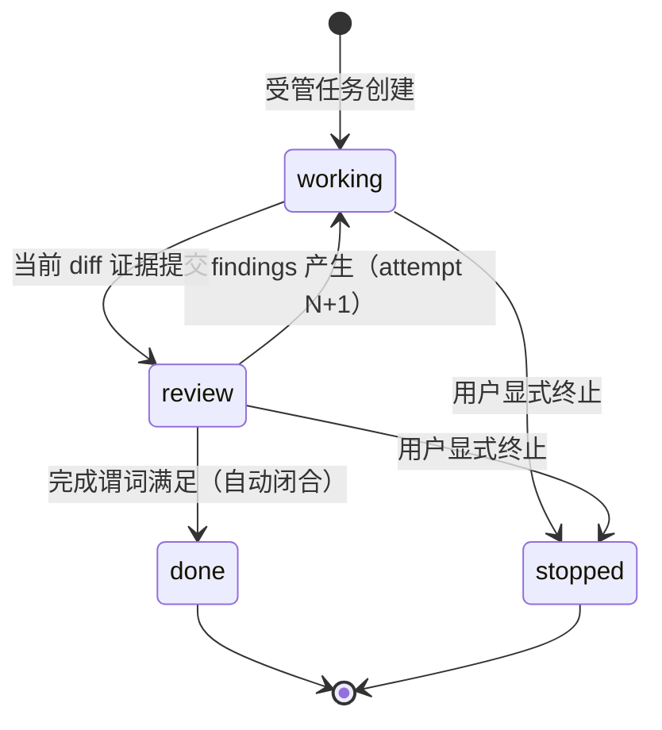

# Spec: Assurance Kernel v4（工作流权威收敛与质量保障内核）

**Design risk**: High — 替换 State Ledger 持久化形态与 Step 状态机，涉及 persisted data shape、迁移兼容、跨 worktree 存储所有权、rollback 敏感的 workflow 行为，且触及多 host 共享的 runtime。
**Diagram decision**: required
**Diagram reason**: phase 生命周期状态转换与 intent/execution 存储所有权拆分包含状态机与数据流关系，纯文字已在 v3 造成语义歧义（如 overloaded `idle`），图能实质澄清且不作为第二设计权威。

## 1. 目标

- G1: 消除多权威控制平面。生命周期只有一个持久化权威字段 `phase`，其余全部派生，可持久化的矛盾状态降为 0。
- G2: 消除 replan 死锁。意图修订通过 `revision` 递增完成，不再要求 terminate/supersede 整个 Plan 才能恢复。
- G3: 按所有权拆分存储：intent 跟 plan 走（git 跟踪、跨 worktree 合并），execution state 按任务分文件、worktree 本地、不跟踪、不合并，消除单一全局 state 文件冲突。
- G4: 全量摩擦可观测。成功与失败路径（命令拒绝、重试、升级、人工介入）都进入 append-only journal，消除当前只记录成功 finish 的观测偏差。
- G5: 不降低高风险任务的保障强度：material/critical 任务的独立 QA/review、evidence freshness、authority separation 全部保留。

## 2. 问题背景与证据

### 2.1 已复现的状态错位

v3 将可互相推导的事实独立持久化（`Step.state`、`runtime_status`、`requires_replan`、`active_step`、投影的 `next_action`）。通过真实 CLI 在临时项目复现：QA `replan` 后持久化为 `Step.state=replanning` + `requires_replan=false` + `runtime_status=idle` + `active_step=null`，而 `buildStatus()` 投影的 `next_action` 建议重新 activate 该 Step；`replanning -> active` 不是合法转换，activate 必然失败。现有测试只验证当次返回，未验证重启后的持久状态。

### 2.2 replan 合同内部死锁

replan checkpoint 声称 `allowed_actions: ["revise_plan"]`，但 active Plan 一旦执行开始，same-Plan semantic sync 被拒绝（signature 锁），cross-Plan sync 又要求前序 Plan 先 finish。唯一恢复路径是用户手工 terminate/supersede——「重复规划」是状态模型的强制产物，不是偶发现象。

### 2.3 Session 取证（2026-08-07 至 2026-08-10）

79 个非本仓库 Pi sessions、19 个项目目录中，约 22 个 sessions 有实质 Immune-Brain 活动；17 个 sessions 重复加载或调用 planner 2–13 次，主要用于回答本应由 status 回答的问题（`idle` 过载、finish 清场、activation 边界）。广义指标：16 个 sessions 出现 replan/supersede/cancel 信号，18 个出现 activation/status confusion。

### 2.4 观测偏差

现有 friction telemetry 主要在成功 `imm-finish` 后写入；命令拒绝、状态矛盾、重试、人工恢复路径基本不可见，导致流程问题被系统性低估。

### 2.5 单一 state 文件冲突

`.imm/memory/current_iteration.json` 在本仓库被 git 跟踪：跨 worktree merge 必然冲突；单 worktree 多 pane 下全局写锁无 backoff，并行访问直接崩溃。

## 3. 非目标

- 不改变 Executor / QA / Reviewer / Compounder 的 authority separation。
- 不引入 event sourcing、projection cache、replay engine（状态仅 4 个 phase，replay 收益不抵投影漂移风险）。
- 不在本 Spec 内合并或删除 host skill 入口（alias 收缩属于 Phase 4，且受 ADR 0002 约束）。
- 不为 v3 增加新状态、新 gate 或双写桥接。
- Plan Markdown 文档继续存在，但不再承担运行时权威。

## 4. Technical Design（技术设计）

### 4.1 权威模型

- `phase` 是唯一持久化的生命周期权威。`next_action`、evidence freshness、blocked、eligibility 全部由纯函数从 `phase + evidence + findings + approvals + 当前 diff` 派生，永不落盘。
- routine 任务（无硬触发）不创建任何 record；agent 直接工作。受管模式仅由硬触发进入：安全/权限/数据迁移/发布/破坏性或不可逆操作、明确的跨 session 持续需求、用户显式要求 Plan/QA/审计。
- 「任务似乎较大」「不确定」不触发受管模式；先只读 probe，仍不确定则问用户。

### 4.2 数据模型与存储所有权

| 数据 | 位置 | git 跟踪 | 所有权 |
| --- | --- | --- | --- |
| Intent（goal / acceptance[] / scope_hint / risk / revision） | `docs/plans/<name>.intent.json` | 是 | 随 plan 合并；首次进入 review 后 revision-lock |
| TaskRecord（phase / baseline / evidence[] / findings[] / approvals[] / history[]） | `.imm/tasks/<task_id>.json` | 否 | worktree 本地；CAS 原子写 |
| Workspace 指针（current_working: task_id \| null） | `.imm/workspace.json` | 否 | worktree 本地；仅在 working 切换时写 |
| 摩擦 journal | `.imm/journal.jsonl` | 否 | append-only，永不 gate 任何转换 |

- acceptance item 带稳定 id；evidence 条目引用 acceptance id；per-item 进度为派生投影。
- history append-only、entry 不可变；每次 phase/revision/approval 变化追加一条。
- approval 与 evidence 绑定 `task_revision + diff_hash`，代码或 intent 变化自动失效。

### 4.3 Phase 生命周期



- `blocked` 不是存储状态：存在 blocking finding 或未解决用户决策时由派生投影给出。
- review 循环满 2 轮未完成时，争议 acceptance item 自动升级为 `unresolved user decision`（派生 blocked），由用户裁决——替代旧的 2-round 强制 replan cap。
- goal/acceptance 在首次进入 review 后 revision-lock；之后变更必须 bump revision 并使受影响 evidence/approval 失效。execution start 不锁（避免旧死锁）。

### 4.4 完成谓词与风险策略

完成谓词（确定性函数，满足即自动 `done`）：

```text
全部 acceptance item 有 fresh evidence
AND 所需 approval 全部 fresh
AND 无 blocking finding
AND 无未解决用户决策
```

| Risk | 完成要求 |
| --- | --- |
| routine | 无 record；仅 journal 一行 |
| material | 当前 diff 自动验证通过 + 独立 review approval |
| critical | 明确 intent contract + 自动验证 + 独立 QA/review + 必要的用户批准 |

风险分类单调：只能升级，永不降级。routine 任务跨 session 边界或触碰第二类文件域时自动升级为 material 并当场创建 TaskRecord（baseline = 当前 diff）。

### 4.5 并发与调度不变量

- 每个 workspace 最多一个 `working` phase 任务，由 `.imm/workspace.json` 的 CAS 写入强制。
- 并行任务仅当 scope_hint 可证不相交时允许（跨 worktree 天然满足工作区隔离）。
- 无 review 轮次上限；终止性由「升级为用户决策」保证。

### 4.6 多 worktree 冲突规则

| 场景 | 规则 |
| --- | --- |
| 不同 plan | intent 文件各自独立；execution 各自本地；零冲突 |
| 同一 plan 的 intent | git merge 冲突 = 真实语义冲突，人工解决 + revision bump |
| 同一 task 在两个 worktree 执行 | 各自 record 合法；先合并者胜，后者 evidence 因 revision/diff_hash 自动 stale，需重新验证 |
| 跨 worktree 全局「单 working」 | 不做强制；可选 advisory claim 注册表（非权威），后续阶段评估 |

### 4.7 Legacy 状态映射（v3 -> v4）

| v3 状态 | v4 映射 |
| --- | --- |
| pending / active / executing | `working`（baseline = 当前 diff，revision 继承） |
| ready_for_review | `review` |
| rework_needed | `working` + findings 保留 |
| probing | routine journal 一行（无 TaskRecord） |
| replanning 及一切矛盾组合 | `stopped("legacy-inconsistent")`，只能由用户显式 resume 或 close，绝不自动激活 |
| follow-up | 同 goal -> findings；跨 goal -> 新 task |

### 4.8 迁移与兼容策略（含退出计划）

- 一次性迁移，不双写。先 `--dry-run` 输出逐记录映射与歧义报告；歧义或不可推断的记录 fail closed，保留原始 Ledger 与 migration provenance。
- v3 Ledger reader 仅保留在迁移命令内。Owner：runtime maintainer。退出里程碑：v4 cutover 后连续两个发布版本且可靠 telemetry 显示 30 天无 v3 Ledger 读写，随后删除 reader。
- 本切片（Phase 0–1）不改 v3 行为（除 Phase 0 hotfix），全部新代码 additive-only，回滚 = 删除新增文件 / revert hotfix commit。

### 4.9 摩擦观测 journal

每条 journal 记录：`timestamp, task_id|null, command, entry_phase, result(ok|rejected|escalated), reason_code, recovery_hint, planner_reentry: bool, user_intervention: bool`。不记录会话正文。reason_code 集合 closed 且可扩展版本化。

### 4.10 不变量

1. `phase` 是唯一持久化生命周期权威；其余派生，绝不落盘。
2. 每 workspace 最多一个 working 任务（CAS 强制）。
3. 验证永远针对当前 diff + 当前 revision；过期 evidence 不满足完成谓词。
4. material/critical 不允许自我批准；approval 绑定 revision + diff_hash，变更自动失效。
5. history append-only、不可变、不参与 gate。
6. 全部 workflow 状态在 session memory 完全丢失后可恢复。
7. 所有写入原子 CAS；失败不部分应用。
8. review 循环必然终止：有界轮次后升级为用户决策。
9. 风险分类单调：只升不降。
10. 用户 override 永远可行、永远记录原因。
11. execution state 永不进入 git；intent 唯一权威为 sidecar 文件，Plan Markdown 仅为其可读投影。

### 4.11 备选方案与拒绝理由

| 方案 | 拒绝理由 |
| --- | --- |
| v3.1 收敛 + WorkItem event sourcing | 两次迁移；projection cache 成为新的竞争权威；用新增可推导层修复可推导 bug |
| 纯最小修复（仅修 deadlock） | 无法解决 planner 滥用、idle 过载、finish 清场等系统性摩擦（session 证据中的主要痛点） |
| 纯规则引擎（零持久生命周期） | 违反不变量 6（状态不依赖 session memory） |
| state 写入 Plan Markdown | 人类编辑与机器写入同一文件 = v3 双权威病根；evidence 绑定 worktree diff 无法随 plan 合并 |

### 4.12 回滚路径

- Phase 0 hotfix：单 commit revert。
- Phase 1 kernel 核心与 shadow CLI：删除 `plugins/immune-brain/runtime/kernel/`、`bin/imm-kernel`、对应测试与 `.gitignore` 条目即可，v3 行为零依赖。
- Phase 2+ cutover：以 dry-run 报告 + provenance 存档为前提，单独 Plan 定义。

### 4.13 验证含义

- 错位回归必须用「重启后持久状态」断言，而非仅断言当次返回（2.1 的教训）。
- kernel 核心为纯函数，采用 fixture + property 测试，fixture 必须包含从真实 bug 提取的矛盾状态。
- shadow 投影与 v3 status 的分歧必须如实报告，测试断言「分歧可见」而非「永远一致」。
- 迁移 dry-run 对本仓库及构造的 legacy fixture 输出确定性映射报告；歧义记录 fail closed 有测试覆盖。

## 5. Roadmap

| Phase | 内容 | 晋升条件 |
| --- | --- | --- |
| P0 止血 | v3 replan 死锁修复 + 重启回归测试 | 错位状态不可再持久化；status 只推荐合法动作 |
| P1 内核基础 | 纯 kernel 核心（schema/reducer/谓词/投影/不变量）+ per-task 存储 + journal + dry-run migrator + shadow CLI（additive-only） | kernel 单测与 shadow 集成测试全绿；v3 行为零变化 |
| P2 受管切换 | 新受管任务走 TaskRecord；imm 命令路由经 kernel；single-working 强制；review 升级规则生效；intent sidecar 成为权威 | shadow 与 v3 在真实仓库并行 2 周无未解释分歧；迁移 dry-run 报告用户批准 |
| P3 迁移与 routine 采纳 | legacy 一次性迁移执行；routine journal + 自动升级规则上线；execution state gitignore 全项目推广 | 歧义记录全部用户裁决；无 v3 Ledger 写入 |
| P4 清理退出 | 删除 v3 Step/FollowUp FSM、Plan signature 锁、旧命令；收缩 skill/CLI surface（遵 ADR 0002）；CONTEXT.md 词汇更新；compounder 沉淀 | 两个发布版本 + 30 天 telemetry 无 v3 读写 |

Deferred decisions: 跨 worktree advisory claim 注册表（P3 评估）；host skill alias 合并清单（P4，需逐 consumer 核实）；journal reason_code 的版本化治理（P2 定）。

Open questions: v3 `strict/standard` workflow profile 存量 Plan 在 P2 切换时的 risk 映射默认值；OpenCode adapter 的 kernel 工具暴露顺序。

## 6. 计划级验收指标

- 可持久化矛盾状态：0
- 状态恢复需读取或手改原始 Ledger：0
- 非需求变化导致的 planner re-entry：p95 ≤ 1 次
- 完成后仍需 `imm-finish` 才能开始后继工作：0
- 任意中断后下一次 status 给出唯一可执行恢复动作：≥ 95%
- material/critical 独立 QA/review/evidence 覆盖率 ≥ 当前水平

## 7. 风险

- R1: routine 误分类导致欠保障。缓解：硬触发清单 + 自动升级规则 + journal 可审计。
- R2: legacy 矛盾状态映射错误。缓解：stopped-heavy 保守映射 + dry-run + fail closed + 用户裁决。
- R3: kernel 与 v3 长期并行产生第二权威。缓解：P1 阶段 kernel 只读；P2 由单独 Plan 经用户批准后切换；禁止双写。
- R4: skill/CLI surface 收缩影响 host 可发现性。缓解：P4 才执行，逐 host 验证，遵 ADR 0002。
