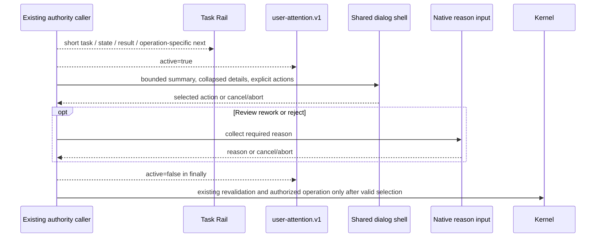

# Spec: Authority Dialog And Task Rail Refinement

**Task ID**: `2026-08-22-001-authority-dialog-task-rail-refinement`
**Owner**: user
**Status**: Proposed
**Design risk**: Medium
**Design risk rationale**: The change standardizes presentation across Enrollment and Work authority callers and must preserve cancellation, abort, attention, and zero-write behavior, but it does not change Kernel authority, persisted state, Tool schemas, or capability inputs.

**Diagram decision**: required
**Diagram reason**: A short sequence clarifies that the shared dialog owns presentation only while each existing caller retains attention bracketing, optional reason collection, revalidation, and authority settlement.

## Summary

Give every Immune-Brain authority decision one consistent native dialog shell and make the existing above-editor Task Rail easier to scan. Preserve the current two-stage Review reason input, all literal-user authority boundaries, and the bounded host-native interaction architecture established by `unified-immune-brain-interaction-ui.spec.md`.

No repository `PRODUCT.md` or `DESIGN.md` exists. This refinement therefore treats the incumbent Pi TUI implementation and the Unified Interaction UI Spec as the visual authority and remains style-neutral.

## Problem

The current interaction hierarchy is sound, but equivalent authority decisions use three different host presentations:

- Enrollment uses a custom centered overlay with collapsible details and described actions;
- Review uses a native selection dialog followed by native text input for rework or rejection; and
- other authority operations use a binary native confirmation dialog.

The result is inconsistent action naming, evidence disclosure, keyboard guidance, and cancellation framing. At the same time, the Task Rail repeats generic dialog instructions such as `Complete or cancel the native authorization dialog`, and its long task identity competes visually with the current state.

## Result

- Enrollment, Review, breaking Intent revision, stale-authority repair, stop, user approval, and user-decision resolution use one shared centered authority-dialog shell.
- Every dialog presents a bounded title, concise summary, collapsed technical details, explicit described actions, and consistent keyboard guidance.
- Review keeps the existing second native `input` only after `Request rework` or `Reject`; a blank or cancelled reason remains cancellation with zero authority writes.
- The Task Rail remains a three-row `aboveEditor` Widget but uses a bounded short task identity, current state, business result, and an operation-specific next action without generic dialog instructions.
- Footer content, timers, polling, watchers, progress percentages, ETA, persisted presentation state, and new authority state remain absent.

## Interaction Architecture

## Technical Design

### Shared authority dialog shell

Add one presentation-only helper to `pi-canary-interaction.ts`. The caller supplies:

- bounded title and summary text;
- bounded collapsible detail text;
- an ordered list of action values, labels, and descriptions;
- the host abort signal; and
- overlay sizing within the existing centered `80%` width and height ceiling.

The helper uses Pi TUI primitives already installed in the package: `Container`, `DynamicBorder`, `SelectList`, and `Text`. It returns the selected caller-owned value or `undefined` for Escape, cancellation, or abort. It settles at most once, removes its abort listener in `finally`, and performs no Kernel reads, writes, inference, attention emission, reason validation, or notification.

Enrollment replaces its local custom-overlay implementation with the shared helper. Work replaces Review `select` and ordinary `confirm` presentation with the same helper. Existing callers retain the complete `user-attention.v1` bracket and operation-specific cancellation behavior.

### Review reason input

Review selection remains two-stage. `Approve`, `Request rework`, `Reject`, and `Cancel` appear in the shared dialog. Only rework and reject continue to the existing native `ctx.ui.input` while the same attention bracket remains active. A missing or whitespace-only reason maps to the current cancellation result and performs no Review or stop authority mutation.

This deliberately avoids building text editing, IME handling, cursor behavior, and validation into a custom overlay when Pi already provides the native input primitive.

### Task Rail hierarchy

Keep `setWidget` with one stable key, `placement: "aboveEditor"`, and three string rows. Do not introduce a themed component, timer, or new state machine.

- Row 1: bounded middle-truncated task identity plus normalized state;
- Row 2: bounded business result;
- Row 3: one operation-specific next action.

When an authority dialog is open, callers use actions such as `Review enrollment evidence`, `Decide Review outcome`, or `Authorize <operation>` instead of generic instructions to complete or cancel a dialog. Terminal visibility and next-input cleanup remain unchanged.

### Information and authority boundaries

Dialog summaries may show the same bounded business evidence already present today. Technical hashes, revisions, detailed findings, and scope remain collapsed by default. No presentation return value becomes authority by itself: existing caller validation, session generation checks, snapshot checks, capability minting, and Kernel application remain the only route to mutation.

## Settlement-Design Contract

### Trigger sources

- Enrollment or descriptor waiver reaches its validated literal-user gate.
- Review authorization reaches decision selection.
- Breaking Intent revision, stale-authority repair, stop, user approval, or user-decision resolution reaches its existing native gate.
- The literal user selects an action, presses Escape, cancels or blanks required reason input, or rejects the operation.
- The host signal aborts an open dialog or reason input.
- Dialog creation, rendering, callback handling, or reason input throws.
- Session generation or authoritative projection changes after the UI returns.
- Session shutdown clears presentation state through the existing lifecycle.

### State inventory

No managed workflow state is added. The operation-local presentation states are:

- `hidden`: no authority dialog is active;
- `choosing`: the shared action dialog is open;
- `collecting_reason`: Review rework or reject was selected and native reason input is open;
- `selected`: a complete caller-owned action and any required reason were returned;
- `cancelled`: Escape, cancel, blank required reason, abort, or contained UI failure ended presentation; and
- `closed`: attention cleanup and local listener cleanup were attempted.

Allowed presentation transitions are `hidden -> choosing -> selected -> closed`, `hidden -> choosing -> collecting_reason -> selected -> closed`, and `choosing|collecting_reason -> cancelled -> closed`.

### Terminal ownership

- The shared dialog helper owns only one-shot presentation settlement to a selected value or `undefined`.
- Existing Enrollment and Work callers own attention open/close, reason requirements, cancellation mapping, freshness checks, and invocation lifecycle.
- Existing native capability and Kernel paths remain the sole authority that can mutate TaskRecord, workspace, backend claim, or TaskIntent state.
- Dialog rendering, selected rows, promise resolution/rejection, Task Rail output, attention-event delivery, and elapsed time are non-authoritative.

### Same-state-machine coverage

Review and verification must inspect every affected presentation caller and shared lifecycle owner:

- `plugins/immune-brain/.pi-extension/pi-canary-interaction.ts`;
- `plugins/immune-brain/.pi-extension/imm-canary-enroll.ts`;
- `plugins/immune-brain/.pi-extension/imm-canary-work.ts`;
- `tests/pi-canary-enroll-extension.test.ts`;
- `tests/pi-canary-work-extension.test.ts`;
- `tests/breaking-intent-revision-gate.test.ts`;
- `tests/pi-canary-user-authority.test.ts`;
- `tests/pi-canary-lifecycle-package.test.ts`; and
- `tests/user-approval-package-contract.test.ts`.

Kernel reducers, capability registries, storage modules, and TaskIntent schemas are unchanged dependencies and must not be edited for this refinement.

## Failure, Interruption, And Recovery

- Dialog or Widget presentation failure remains contained and cannot authorize or settle a managed operation.
- Abort and Escape return cancellation through existing caller behavior; no compatibility fallback opens a second dialog.
- Attention closes in the caller's existing `finally` path, including reason-input and shared-dialog failures.
- Session or snapshot drift after a selection discards that selection through existing freshness checks.
- If implementation stops midway, existing Kernel authority remains resumable from its persisted projection; UI memory is not used for recovery.
- A partially migrated set of authority callers is not releaseable because it would preserve the inconsistency this Spec exists to remove.

## Compatibility And Rollback

No data migration or compatibility layer is required. Tool schemas, Kernel operations, TaskIntent and TaskRecord bytes, capability binding, attention-event payloads, and external adapters remain unchanged.

Rollback reverts the shared helper, its Enrollment and Work integrations, Task Rail copy/identity refinement, focused tests, and this Spec as one unit. Persisted task state requires no repair.

## Scope

- `docs/specs/authority-dialog-task-rail-refinement.spec.md`
- `plugins/immune-brain/.pi-extension/pi-canary-interaction.ts`
- `plugins/immune-brain/.pi-extension/imm-canary-enroll.ts`
- `plugins/immune-brain/.pi-extension/imm-canary-work.ts`
- `tests/pi-canary-enroll-extension.test.ts`
- `tests/pi-canary-work-extension.test.ts`
- `tests/breaking-intent-revision-gate.test.ts`
- `tests/pi-canary-user-authority.test.ts`
- `tests/pi-canary-lifecycle-package.test.ts`
- `tests/user-approval-package-contract.test.ts`

## Out Of Scope

- Footer content, custom editor replacement, timers, polling, watchers, percentage, or ETA;
- embedding a text editor or IME implementation in the custom overlay;
- changing Review choices, authority semantics, Kernel operations, or persisted schemas;
- raw evidence, prompt, capability, or verifier-output display by default;
- external notification adapters, OS notifications, Pi core, or session replay; and
- creating `PRODUCT.md`, `DESIGN.md`, a design system, or a second Widget.

## Acceptance

1. Enrollment and descriptor waiver use the shared authority-dialog shell with bounded summary, collapsed details, described confirm/cancel actions, abort cleanup, and unchanged attention pairing and authority result.
2. Review and every ordinary Work authorization use the same dialog shell; rework/reject alone continue to native reason input; cancel, blank reason, abort, and UI error retain zero-authority-write behavior.
3. The Task Rail keeps one three-row `aboveEditor` Widget, middle-truncates long task identity, presents operation-specific next actions while a dialog is open, preserves terminal cleanup, and publishes no Footer content.
4. Focused extension tests execute each shared presentation seam and exceptional closure path. A real Pi TUI acceptance pass checks compact Rail scanning, collapsed/expanded dialog details, keyboard actions, Review reason continuation, Escape, and narrow-terminal containment. The complete `bun test` suite and `git diff --check` pass before final settlement but are not Enrollment rehearsal descriptors.

## Verification Approach

- `bun test tests/pi-canary-enroll-extension.test.ts -t shared-authority-dialog-shell`
- `bun test tests/pi-canary-work-extension.test.ts -t shared-authority-dialog-shell`
- `bun test tests/pi-canary-work-extension.test.ts -t compact-task-rail-hierarchy`
- Post-implementation regression only: `bun test`
- Diff hygiene: `git diff --check`
- Human TUI check after automated verification, recorded as implementation evidence rather than Kernel authority.

The focused seams catch behavior regressions by executing the real extension factories and shared UI helper with fake host UI, action, abort, and rendering callbacks. Text-presence-only assertions are insufficient.

## Devil's Advocate Audit

**Rollback resilience**: The change is an ephemeral presentation replacement over unchanged authority paths. Reverting the six scoped files restores the prior dialogs and Rail without state migration. A half-migrated dialog surface is not accepted.

**Verification vanity**: Tests must render the real shared shell, drive selection, details expansion, cancellation, abort, blank reason, and UI failure, and assert attention pairing plus zero managed writes. Merely asserting helper names or source strings cannot close acceptance. The real TUI pass catches layout and focus defects that fake UI cannot prove.

**Spec dilution detection**: The task does not call one restyled Enrollment dialog a unified result; all listed Work authorization paths must adopt the shell. It also does not reinterpret visual consistency as permission to remove native authority, hide blockers, embed an incomplete text editor, restore custom progress infrastructure, or weaken cancellation and revalidation.
