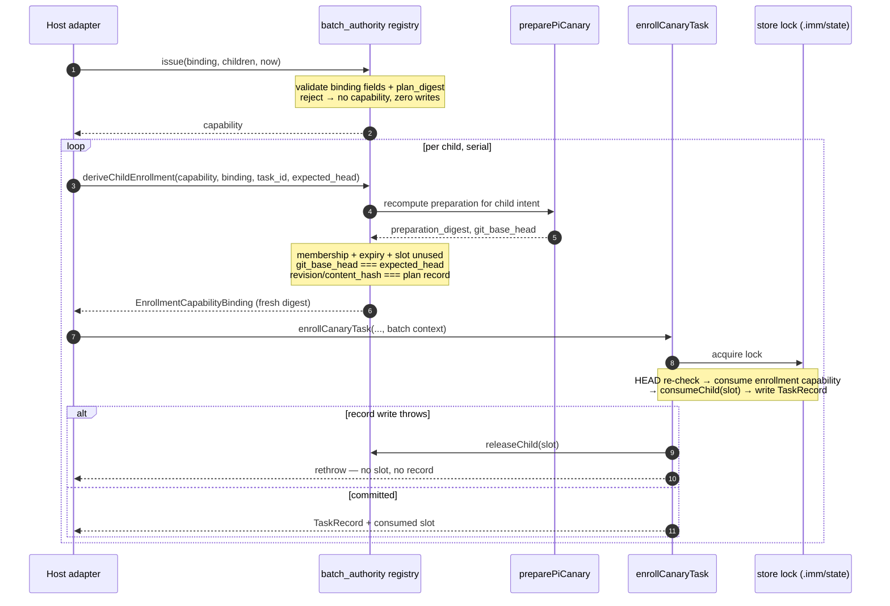

# Spec: Batch Authorization Kernel

**Task ID**: `2026-09-05-001-batch-authorization-kernel`
**Owner**: user
**Status**: Proposed
**Initiative**: `unattended-initiative-batch-run` (S1; parent Spec `docs/specs/unattended-initiative-batch-run.spec.md`)
**Output language**: English (project policy: persisted Immune-Brain documents default to English)

**Design risk**: High
**Design risk rationale**: This slice changes how Enrollment authority is derived. Today exactly one literal-user confirmation authorizes exactly one Enrollment. After this slice, one literal-user confirmation can authorize N Enrollments drawn from a frozen plan. Every weakening of the derivation rules — membership, expiry, one-shot slots, Git HEAD lineage, or failure atomicity — converts an authority error into silently unauthorized Kernel writes.

**Diagram decision**: required
**Diagram reason**: The ordering that makes this slice safe is not expressible unambiguously in prose: which checks run before any write, where the child slot is consumed relative to the TaskRecord write, and how the rollback path restores the slot. A sequence view pins the lock boundary that all atomicity claims depend on.

**Design views**: service/component interfaces, data flow, temporal sequence. State transitions and deployment views are owned by S3 and S4 respectively and are deliberately not restated here.

## 1. Problem Frame

`createEnrollmentAuthorityRegistry` issues a **single-use** capability bound to one
`EnrollmentCapabilityBinding` (`plugins/immune-brain/runtime/kernel/enrollment_authority.ts`,
built on `plugins/immune-brain/runtime/kernel/capability_registry.ts`). `enrollCanaryTask`
consumes it exactly once inside the store lock and fails closed when Git HEAD has moved
since preparation (`plugins/immune-brain/runtime/kernel/enrollment.ts:216`).

An unattended batch needs one authorization act to legitimately cover N enrollments. Two
facts constrain the design:

1. A batch-level `preparation_digest` cannot exist. Preparation binds `git_base_head`, and
   the batch moves HEAD on purpose after every settled child. A digest captured at
   confirmation time is stale by the second child.
2. No Host adapter may mint authority. The Host can only carry the accepted confirmation
   reference; issuance and consumption stay Kernel-side (parent Spec Invariant A-3).

So the Batch Authorization must bind what is stable across the run — the identity of the
confirmed plan and the Git lineage the run is allowed to walk — and recompute per-child
preparation at each child's own enrollment.

## 2. Intended Behavior

A Host adapter that has obtained a literal-user confirmation calls the Kernel-side registry
with the confirmation reference and the projected batch plan. The registry validates every
field and issues one capability object.

For each child, the runner asks the Kernel to derive a per-child
`EnrollmentCapabilityBinding`. Derivation recomputes preparation for that child, asserts the
child is an unconsumed member of the confirmed plan, asserts the batch has not expired, and
asserts `preparation.git_base_head` equals the batch's current `expected_head`. Only then is
an ordinary Enrollment performed, and the child's slot is marked used in the same store lock
that writes the TaskRecord.

Every rejected path leaves Kernel bytes and the registry unchanged: no slot consumed, no
TaskRecord written, no workspace claim taken.



## 3. Technical Design

### 3.1 Module boundary

New module `plugins/immune-brain/runtime/kernel/batch_authority.ts`. It composes
`createCapabilityRegistry` rather than replacing it, and it never calls that factory's own
`consume`: single-use semantics are the wrong lifetime for a batch. Per-child state lives in
two `WeakMap`s keyed by the capability object — the confirmed plan and the set of consumed
`task_id`s — so a dropped capability is collectable and a forged plain object carries no
authority.

`enrollment.ts` gains one optional parameter and no new default behavior. Non-batch
Enrollment is byte-identical to today.

| Concern | Owner |
| --- | --- |
| Binding validation, plan digest, slot lifetime | `runtime/kernel/batch_authority.ts` |
| Per-child preparation and lineage assertion | `runtime/kernel/batch_authority.ts` (via `pi_canary_prepare.ts`) |
| Record write, lock, rollback | `runtime/kernel/enrollment.ts` |
| Confirmation UI, plan projection, run loop | Out of this slice (S5/S6, S2, S3) |

### 3.2 Binding and plan digest

```text
BatchAuthorizationBinding {
  batch_id, initiative_slug, plan_digest, branch, base_head,
  budget { max_children, deadline_at, qa_failure_limit },
  actor_id: "user", confirmation_ref, expires_at, nonce
}
```

`computeBatchPlanDigest` hashes the canonical JSON of the ordered children
`[{ task_id, intent_path, intent_revision, intent_content_hash, blocked_by[] }]` with sorted
keys, so the digest is stable across serialization but sensitive to child order.

Issuance requires: `actor_id === "user"`; non-empty `batch_id`, `initiative_slug`, `branch`,
`confirmation_ref`, `nonce`; a 40-hex `base_head`; `expires_at` strictly after `now`;
positive-integer `max_children` and `qa_failure_limit`; `deadline_at` after `now`; a
non-empty child list with unique `task_id`s and every `blocked_by` entry naming a plan
member; and `plan_digest` equal to the recomputed digest. `inspect` re-validates expiry and
compares every binding field by exact match, with a deep comparison for `budget`.

**Invariant A-1**: a batch-derived enrollment is legal only when the child is in the
confirmed plan, the batch has not expired, the child slot is unused, and
`preparation.git_base_head === expected_head`.

### 3.3 Per-child derivation

`deriveChildEnrollment({ registry, capability, binding, task_id, expected_head, now })`:

1. `inspect` the capability (expiry + exact field match).
2. Resolve the child from the confirmed plan; absent → `batch_child_not_in_plan`.
3. Reject an already-consumed slot → `batch_child_slot_consumed`.
4. Recompute preparation through `preparePiCanary` for the child's `intent_path`.
5. `preparation.git_base_head !== expected_head` → `batch_head_lineage_broken`.
6. Recomputed `intent_revision` / `intent_content_hash` differing from the plan record →
   `batch_child_intent_changed`.
7. Return an `EnrollmentCapabilityBinding` carrying the **fresh** `preparation_digest`, the
   batch's `actor_id` and `confirmation_ref`, the batch `expires_at`, and
   `nonce = "<batch nonce>:<task_id>"` so per-child bindings are distinguishable in audit.

Derivation performs no write. Steps 2, 3, 5 and 6 are the four fail-closed reasons the
runner maps to `needs_human` (S3).

**Invariant A-2**: `expected_head` starts at `base_head` and advances only to a commit this
batch created on the batch branch. Advancing it is S4's responsibility; asserting it is this
slice's.

### 3.4 Slot/record atomicity

`EnrollBatchContext { registry, capability, binding, expected_head }` is threaded into
`enrollCanaryTask`. Inside `onReady`, before any capability is consumed, the already-computed
`checks.gitBaseHead` is compared to `expected_head` again — the lock may have been contended
between derivation and commit. Then the enrollment capability is consumed, then the batch
child slot, then the record is written. `commitEnrollmentLocked` is wrapped so any throw
calls `releaseChild` and rethrows.

The resulting guarantee is bidirectional: no consumed slot without a TaskRecord, and no
TaskRecord without a consumed slot. This is asserted by failure injection, not by reading the
code path.

## 4. Settlement-Design Contract

**Trigger sources**: Host presents an accepted confirmation; runner requests a child
derivation; enrollment commits; enrollment throws; authorization expires; a child slot is
already used.

**State inventory**: this slice owns only capability-local state — a capability is `issued`,
its children individually `unused` or `consumed`, and the capability as a whole `exhausted`
(all slots consumed) or `expired`. Batch run state (`prepared/running/...`) is S3's and is
not duplicated here.

**Terminal ownership**: the Kernel store lock alone decides whether a slot is consumed. A
successful `deriveChildEnrollment` is explicitly **not** authority — it is a proposal that
`enrollCanaryTask` may still reject. Elapsed time, Host belief, and a returned binding are
non-authoritative.

**Expiry semantics**: expiry blocks new derivations and new consumptions only. A child whose
enrollment already committed is unaffected; the batch runner drives it to its own Kernel
settlement (parent Spec §4).

## 5. Verification

`tests/kernel-batch-authority.test.ts` and `tests/kernel-enrollment-transaction.test.ts`
(project regression command remains `bun test`).

- `acc-batch-authority-binding` — digest stability and order sensitivity; issuance rejection
  for each malformed field; per-child consumption leaving remaining slots valid; rejection of
  a non-member, a re-consumed slot, and any consumption after expiry; registry and Kernel
  bytes unchanged on every rejected path.
- `acc-batch-child-derivation` — fresh `preparation_digest` per child; `batch_head_lineage_broken`
  on any other HEAD; `batch_child_intent_changed` on revision/hash divergence with no
  enrollment; slot and TaskRecord committed together under one lock; a failed record write
  (permission-denied `.imm/state`, skipped when running as root) consumes no slot; existing
  single-task enrollment behaviour, tombstone and workspace-claim rejections, and byte-level
  failure atomicity unchanged.

## 6. Devil's Advocate Audit

**Rollback resilience**: the module is additive and `enrollment.ts` gains one optional
parameter. Deleting `batch_authority.ts` and the optional parameter restores per-task
Enrollment exactly; no persisted format changes, so there is no migration to unwind.

**Verification vanity**: asserting that `consumeChild` throws on a second call proves little
on its own. The tests that carry weight are the negative-byte assertions (`.imm` unchanged
after each rejection) and the failure-injection test that makes the record write fail while a
slot is held — without it, "atomic" would be an unverified claim about statement order.

**Spec dilution detection**: the confirmed framing requires one literal-user act per batch
and forbids agent-minted authority. This slice keeps issuance behind an `actor_id === "user"`
check plus a confirmation reference the Host cannot fabricate from Kernel state, and it does
not add a refresh, extend, or re-issue path — an expired batch must return to the Host gate.

## 7. Traceability

| Parent ID | Coverage here |
| --- | --- |
| BR-REQ-2 | §3.2, §3.3 — one confirmation covers N enrollments via plan digest + HEAD lineage |
| BR-REQ-8 | §3.2 expiry validation, §3.3 one-shot slots, §4 expiry semantics |
| BR-DEC-1 | §3.2 issuance rules; no Host-minted capability |
| BR-DEC-2 | §3.3 step 6 — revision/hash mismatch fails closed with no enrollment |
| Invariant A-1 | §3.2 |
| Invariant A-2 | §3.3 |
| Invariant A-3 | §3.1 module boundary |

## 8. Discovery Evidence

- `plugins/immune-brain/runtime/kernel/capability_registry.ts` — WeakMap + brand-symbol
  factory reused for issue/inspect.
- `plugins/immune-brain/runtime/kernel/enrollment_authority.ts` — binding shape and exact
  field-match semantics mirrored by the batch binding.
- `plugins/immune-brain/runtime/kernel/enrollment.ts:216` — the HEAD-moved rejection that
  forces per-child preparation instead of a batch-level digest.
- `plugins/immune-brain/runtime/kernel/pi_canary_prepare.ts` — `preparation_digest` and
  `git_base_head` derivation used by `deriveChildEnrollment`.
- `plugins/immune-brain/runtime/claude/kernel_ports.ts:398` — the existing
  gate → revalidate → issue → rehearse → enroll sequence this derivation mirrors.
