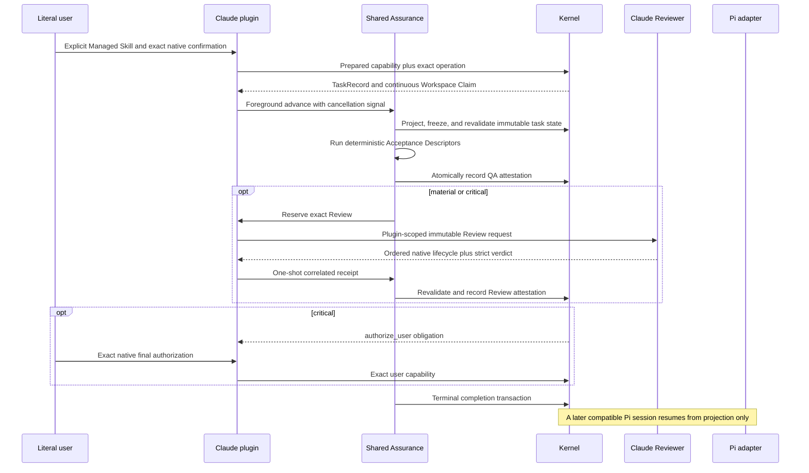

# Claude Code Host

**Status**: Proposed
**Initiative**: `Dual-Host Assurance`
**Initiative slug**: `dual-host-assurance`
**Slice**: `claude-code-host`
**Owner**: user
**Design risk**: High
**Design risk rationale**: This Slice promotes a second Host across native user authority, Review observation, cancellation, cross-host recovery, generated package output, and public support contracts.
**Design views**: Architecture layers, component interfaces, data flow, state transitions, and temporal sequence are selected because every accepted result crosses the Claude plugin, shared Assurance coordinator, Kernel authority, native Host events, and release package. No view can be omitted without hiding an authority or recovery boundary.
**Diagram decision**: required
**Diagram reason**: The ordered relationship between native interaction, process-local evidence, Kernel mutations, and cross-host resume is the core safety contract.

## Task

Promote local interactive Claude Code to a first-class Immune-Brain Host. Claude Code must independently complete `routine`, `material`, and `critical` tasks through the existing host-neutral Assurance boundary, and Pi and Claude Code must safely resume compatible tasks created by the other Host from durable Kernel state.

## Output Language

Human-readable Spec and TaskIntent prose is English. Schema fields, enum values, CLI flags, JSON keys, file paths, Tool names, API names, contract identifiers, and canonical terms remain literal.

## Origin

- GitHub Initiative: `#22`, `dual-host-assurance`.
- Predecessor design baseline: `docs/specs/archive/dual-host-assurance.spec.md`.
- Reviewed infrastructure predecessor: Task `2026-09-01-001-shared-assurance-host-boundary`, terminal `done`.
- Accepted architecture: `docs/adr/0004-dual-host-assurance-adapters.md`.
- Planner decision delta: the user selected one `critical` TaskIntent with deterministic QA descriptors plus a version-bound conformance report. Live TUI clicks at the minimum and current Claude Code versions are HITL evidence accepted at final user authorization. The report is review evidence, not a QA attestation.

## Result

The released package contains one self-contained Claude Code plugin at the same version as the Pi package. Its stdio MCP server, Hooks, and plugin-scoped Reviewer adapter consume the shared Assurance coordinator and existing Kernel contracts. Both Hosts preserve one TaskRecord, one Workspace Claim, one Assurance Projection, and one terminal settlement protocol.

Claude Code support is published only after deterministic contract tests pass and the scoped real-Host conformance report records native interaction, all risk tiers, denial/cancellation, and bidirectional resume against the minimum supported Claude Code version.

## Discovery Evidence

### Reference closure

- `plugins/immune-brain/runtime/assurance/host_port.ts` is the adapter interface; `coordinator.ts` owns foreground QA/Review sequencing, receipt consumption, freshness revalidation, interruption cleanup, and settlement reconciliation.
- `plugins/immune-brain/.pi-extension/pi-canary-assurance-progression.ts` is the real Pi Host adapter and compatibility oracle. `imm-canary-enroll.ts` and `imm-canary-work.ts` own Pi native gates and Tool/session transport.
- `plugins/immune-brain/runtime/kernel/pi_canary_prepare.ts`, `enrollment.ts`, `enrollment_authority.ts`, `authority_port.ts`, `canary_application.ts`, `assurance_projection.ts`, and `completion.ts` own the same authority lifecycle consumed by both Hosts. Legacy `pi_canary` identifiers and bytes remain unchanged.
- `tests/host-neutral-assurance-coordinator.test.ts`, `tests/pi-canary-assurance-progression.test.ts`, `tests/pi-canary-enroll-extension.test.ts`, and focused Kernel tests provide the highest existing behavioral seams. Claude tests must reuse their failure matrix instead of duplicating a second state machine.
- `package.json` is the sole release version authority. `scripts/plugin_versioning.ts` requires `plugins/immune-brain/.claude-plugin/plugin.json`, validates it against `package.json` at one version, stamps that copy on bump and on `changeset version`, and `scripts/plugin_release.ts` plus package ratchets keep an exact Pi+Claude allowlist including the root `.claude-plugin` marketplace.
- The existing five `plugins/immune-brain/skills/*/SKILL.md` loaders and `plugins/immune-brain/dist/imm-*.md` contracts remain the single workflow source. Claude packaging may add Host-specific transport selection but must not fork the five Skill contracts.
- Official Claude Code plugin documentation confirms self-contained plugin roots, `.claude-plugin/plugin.json`, `.mcp.json`, `hooks/hooks.json`, `agents/`, `${CLAUDE_PLUGIN_ROOT}`, scoped MCP Hook names, and `claude plugin validate --strict`.
- Claude Code `2.1.236` exposes `anthropic/requiresUserInteraction`, `ElicitationResult`, `SubagentStart`, `PostToolUse`, `SubagentStop`, and `SessionEnd` runtime capabilities. Because the mandatory-interaction annotation is not currently described in public MCP prose, support remains capability-probed and real-Host tested rather than inferred from a manifest string.

### Advisory probe fallback

The bounded internal `arch-explorer` probe completed without a consumable result. Planner continued with bounded inline reads of the named Assurance, Pi adapter, Kernel owner, package, ADR, rejected Learning, and focused test paths; no scope decision relies on the failed probe.

### Prior decisions and rejected paths

- ADR-0004 requires `host adapter -> assurance coordination -> Kernel`, no generic Host registry, no second persisted workflow, and no handoff state.
- ADR-0002 continues to require self-contained output and distinct consumer paths; only its Pi-only package conclusion is superseded.
- `docs/solutions/rejected-out-of-band-review-authority-reconstruction.md` prohibits inferring authority from workspace or conversational state.
- `docs/solutions/rejected-shared-registry-generic-dispatcher.md` prohibits turning two adapters into a platform registry.
- `docs/solutions/rejected-perpetual-runtime-compatibility.md` preserves v4-current/v3-drain behavior and rejects open-ended compatibility branches.

## Technical Design

### Architecture layers

1. **Kernel** remains the only persisted authority owner. It validates and consumes capabilities, serializes mutation, projects obligations, checks freshness, and settles terminal state. It imports no Host package.
2. **Shared Assurance** remains the only deterministic foreground coordinator. It receives one `AssuranceHostPort`, runs focused descriptors, binds Review to the immutable revision, and reconciles cancellation or ambiguous postcommit outcomes.
3. **Claude adapter** owns stdio MCP transport, native interaction correlation, Hook observation, plugin-scoped Reviewer reservation, session cleanup, progress results, and conversion to the existing Host Port. It cannot write TaskRecord state except through Kernel operations.
4. **Package layer** owns the root marketplace entry shipped in the npm `files` allowlist, self-contained plugin manifest/runtime, one release version stamped into both `package.json` and `plugin.json`, minimum Claude capability probe, generated drift checks, and exact supported-Host claims.

Dependency direction is `Claude adapter -> shared Assurance -> Kernel`. The Kernel and shared Assurance modules must not import Claude plugin files, Claude SDK types, marketplace manifests, or a Host registry. Pi and Claude adapters must not import each other.

### Component interfaces

The Claude MCP server exposes bounded equivalents of status/projection, Enrollment, Assurance advance, Review submission, user authorization, breaking Intent revision, stop, and authority repair. Inputs are exact Task IDs and operation payloads already parsed by Kernel contracts. Outputs preserve the shared coordinator and Kernel result contracts; transport errors throw and never become successful text payloads. MCP stdio framing is newline-delimited JSON-RPC.

Privileged calls require a fresh native interaction for the exact operation. `ElicitationResult` correlation accepts only the Host `tool_use_id` or `toolCallId`; JSON-RPC `request_id` is never an authority identity. The capability probe rejects an explicit non-empty unsupported `CLAUDE_CODE_PERMISSION_MODE` before any authority write; only an absent or empty mode defaults to `manual`. For Enrollment and user-authorized operations, the adapter computes the complete binding (current and, for a breaking revision, next intent revision/content hash, plus preparation or diff digest) before consuming native confirmation; for a breaking revision the staged next-state diff digest is included and must remain identical after confirmation. `confirmation_ref` includes that binding, and the adapter revalidates the same binding immediately before issuing a capability. The server binds Host session, MCP tool call, operation, task, intent hash/revision, and preparation digest in process-local capability state before invoking Kernel mutation. Unsupported capability, non-interactive execution, `dontAsk`, cancellation, denial, mismatched input, stale state, replay, or missing correlation returns no capability and performs zero authority writes.

Pi's breaking Intent revision flow stages the candidate Intent at its committed sidecar path and computes the resulting scoped diff before opening the native confirmation dialog. The dialog must display that candidate digest; cancellation, session changes, or precommit failures restore the exact prior sidecar worktree bytes and the exact prior Git index entry bytes independently. After confirmation, the adapter recomputes the digest immediately before issuing the capability and rejects any drift.

The immutable review revision must include every runtime and Hook path named by the package `files` allowlist, including `runtime/claude/**` and `hooks/hooks.json`, so package generation and focused QA execute against the reviewed source rather than only generated output.

The Claude Review Host reserves exactly one plugin-scoped `immune-brain-reviewer` invocation. `SubagentStart` binds that reservation only by exact `operationId`, or when the Host omits `operationId`, by the exact reserved prompt; `taskId` alone never binds. A consumable receipt requires `SubagentStart` plus both the Agent result and `SubagentStop` for the same session, non-empty exact agent identity, and bound operation. `SubagentStop` with a missing or different `agentId` is rejected. `PostToolUse` must carry the exact reserved `agentId`; an optional operationId must also match. Agent `PostToolUse` without the reserved `agentId` or `operationId` is unidentifiable and fails closed. Native order may be Start then Stop then Agent result, or Start then result then Stop. Delayed, conflicting, or replayed same-task events for a different reserved operation fail closed. Consuming an `ElicitationResult` must persist that session and tool identity independently of `SessionEnd` log cleanup and reject a later Result for the same pair; it must not drop concurrent Hook appends. Event application uses stable per-session sequencing, not one numeric cursor over a flattened multi-session list. Each drain advances a session cursor only to the length of the captured event snapshot; a `SessionEnd` clears that cursor so a later event is observed from a fresh session sequence. Hook log paths hash session IDs into an owner-only `0700` cache directory. The directory and every evidence file must be an owned regular object with exact modes `0700` and `0600`; existing symlinks, wrong types, owners, or modes are rejected before any chmod, read, append, or delete. SessionEnd cleanup applies the same regular-file and exact-`0600` checks before deletion. Files are opened with no-follow descriptors. Crafted `../` or symlink session IDs cannot write or read authority evidence outside it. A later reservation must not skip earlier unconsumed log events. Hooks report observations; they never mint or apply authority. The receipt is one-shot and actor IDs use the `claude:*` prefix.

Existing Kernel and coordinator contract identifiers, `preparePiCanary` exports, TaskIntent hashes, TaskRecord v3/v4 bytes, Review verdict schema, and Pi Tool schemas remain compatible. New neutral aliases may be additive only.

### Data flow and temporal sequence

The source of truth is the Git-tracked TaskIntent plus index-backed Git identity and Kernel state. Transformations are strict MCP parsing, native decision correlation, preparation hashing, descriptor execution, immutable Review construction, ordered Hook correlation, verdict parsing, and freshness validation. Destinations are existing TaskRecord attestations/history and terminal audit. Process-local Host observations are discarded after use or session shutdown.

### State transitions and recovery

No persisted Host state is introduced. TaskRecord remains `active|done|stopped` with `artifact_state: active|frozen`; the existing Assurance Projection remains the only next-obligation source.

Claude process-local states are `idle`, `interaction_pending`, `running_qa`, `review_reserved`, `review_observed`, `settlement_unknown`, and `released`. Legal transitions are bounded to one foreground call. They grant no authority and are rebuilt after process exit.

Stdio `stdin` end is a process-local transition to `released`: stop new `tools/call` intake, abort cancellable in-flight work, wait for started Kernel mutations to complete or enter `settlement_unknown` until a fresh Projection reconciles them, flush JSON-RPC replies, then exit. Disconnect never mints or drops authority except through that Projection.

Pi-to-Claude and Claude-to-Pi resume reads TaskRecord, Workspace Claim, backend claim, TaskIntent, Git identity, and Assurance Projection. It never transfers process-local capabilities or receipts. At `active:active`, `active:frozen/run_qa`, `run_review`, `authorize_user`, and terminal states, the new Host either resumes the projected obligation or fails closed on incompatibility/freshness. Existing worktree lock and CAS ensure that at most one concurrent mutation settles.

## Settlement-Design Contract

### Trigger sources

- Enrollment preparation, native accept/decline/cancel, MCP Tool denial, unsupported interaction mode, disconnect, timeout, or session shutdown.
- Artifact freeze; QA pass, failure, output limit, timeout, cancellation, runner/provider failure, or postcommit ambiguity.
- Review reservation; `SubagentStart`, Agent tool result/failure, `PostToolUse`, `SubagentStop`, malformed verdict, denial, timeout, cancellation, Hook/MCP failure, replay, or shutdown.
- Critical user authorization, breaking revision, stop, authority repair, finding rework, and terminal completion.
- Host switch, duplicate resume, stale continuation, incompatible package/core version, changed HEAD/index/diff, or concurrent mutation.

### State inventory

- Persisted lifecycle: `active -> done|stopped`; artifact state: `active -> frozen`, with Kernel-authorized rework restoring `frozen -> active`.
- Process-local: `idle -> interaction_pending -> running_qa -> review_reserved -> review_observed -> released`.
- Precommit interruption returns to `idle|released` with zero mutation. An ambiguous result after commit begins enters `settlement_unknown` until a fresh Projection reconciles it.

### Terminal ownership

- Kernel capability registries and reducer/application paths exclusively authorize state mutations.
- The recoverable Kernel terminal transaction exclusively owns `done|stopped`, terminal proof, and claim/workspace release.
- Native user interaction is authoritative only when correlated to the exact privileged operation; generic MCP permission, model text, or a Hook event is insufficient.
- QA authority is the atomic result of deterministic Acceptance Descriptors after freshness validation.
- Review authority is a validated one-shot Host receipt for the immutable reservation.
- Promise resolution/rejection, elapsed time, process absence, Hook callback alone, transcript text, generated conformance prose, or workspace inspection is non-authoritative.
- Stdio disconnect and Hook subprocess exit are non-authoritative. They must not terminate a started Kernel mutation except by cancellation before commit or by Projection reconciliation after commit.

### Same-state-machine coverage

The TaskIntent mutation envelope includes the shared Assurance owners, exact Kernel Enrollment/capability/projection/completion owners, Pi Enrollment/Work/Review/session owners, every Claude MCP/Hook/Review/session owner, generated plugin output, release ratchets, and focused all-risk/recovery tests. Unchanged owners remain review-visible because they constrain the same authority sequence.

## Verification Strategy

### Deterministic QA

1. `tests/claude-host-authority.test.ts` drives the Claude MCP/Hook adapter through native-decision fixtures and the shared coordinator. It fails on absent, wrong-task, stale, incomplete, reordered, replayed, denied, taskId-only, delayed same-task, conflicting-field, skipped-cursor, or post-consume Elicitation replay before a second Kernel mutation, and it proves concurrent Hook append during Elicitation consume cannot lose other events, that a second session file cannot shift another session's cursor, and that crafted session IDs cannot write Hook evidence outside the private cache directory.
2. `tests/dual-host-assurance-conformance.test.ts` exercises routine/material/critical progression and bidirectional resume at active, frozen, Review, user-authorization, and terminal boundaries using shared Kernel fixtures. It rejects vFuture, stale Git identity, and concurrent continuation, and it proves stdin end stops new calls, aborts cancellable work, waits or reconciles started mutations, flushes replies, then shuts down.
3. `tests/claude-host-package.test.ts` validates manifests with the installed Claude CLI, launches the generated Node stdio server over newline-delimited JSON-RPC, verifies self-contained cache paths, exact Pi+Claude allowlisting including the root `.claude-plugin` marketplace in `npm pack`, generated drift, one release version across `package.json` and `plugin.json`, Changesets version stamping, minimum capability failure, and macOS/Linux/WSL claims.
4. `tests/claude-host-promotion.test.ts` validates that the version-bound real-Host conformance report covers every required interaction scenario and that public support claims, minimum version, and package contracts match it. This check validates completeness and binding, not the human observation itself.

### Real Host evidence

Before artifacts freeze, the Executor runs the repository conformance command in an interactive Claude Code session at the declared minimum version and at the current installed version. The sanitized report at `docs/verification/claude-code-host-conformance.md` records version, platform, plugin validation, per-call native interaction under `manual`, `acceptEdits`, `auto`, `bypassPermissions`, and `dontAsk`, all risk tiers, explicit denial/cancel, complete Review event ordering, both resume directions, stale/concurrent rejection, and plugin removal recovery.

Review checks the report against changed code and deterministic results. Because the interaction cannot be replayed by non-interactive Kernel QA without external model access, final `critical` user authorization explicitly accepts or rejects this HITL evidence. The report never substitutes for Kernel authority or a QA/Review attestation.

## Compatibility, Interruption, And Rollback

- New tasks remain TaskRecord v4; v3 remains bounded drain. No schema migration or dual write is introduced.
- Pi public Tool schemas, preparation bytes, cancellation linearization, Review receipt ordering, and package installation remain regression oracles.
- Claude startup fails before Managed mutation when its version, interaction capability, generated core contract, plugin cache, or Node runtime is unsupported.
- `SessionEnd` releases only process-local reservations and temporary evidence. It never stops, completes, or rewrites a Task.
- Removing Claude manifests/runtime and restoring the exact Pi-only package ratchets rolls back the Slice as one unit. Tasks created through Claude remain ordinary Kernel tasks resumable by a compatible Pi version.
- Existing `.pi-extension` compatibility re-exports retain the ADR-0004 exit milestone: remove them in the next major release after both adapters and all package consumers import neutral paths. Owner: runtime maintainer.

## Scope And Delivery Boundary

This remains one TaskIntent because adapter behavior, public support claims, package output, real-Host proof, compatibility, and rollback must promote or revert together. A separate infrastructure predecessor already established the shared boundary. This Task does not add another Host, a registry, a scheduler, a verification runner, a persisted handoff, or native Windows support.

## Devil's Advocate Audit

**Rollback resilience**: Claude manifests, runtime/generated output, support claims, and exact package ratchets form one additive rollback unit. No persisted migration is required, and compatible Pi can resume existing Kernel tasks after Claude removal.

**Verification vanity**: Manifest existence, mocked MCP responses, source-string annotations, or a successful conversation cannot prove native authority. Deterministic tests attack correlation and state mutations; the version-bound interactive report covers real Host UI and bypass modes; independent Review checks implementation; final user authorization accepts the non-replayable observation.

**Spec dilution detection**: The Slice does not become routine-only, experimental-only, Pi-mediated, or mock-only. It retains all five Skills, all risk tiers, native denial/cancel, both resume directions, v3 drain/v4 current behavior, self-contained release packaging, supported platforms, and fail-closed unsupported modes.

## Out Of Scope

- Cross-worktree migration, simultaneous Host editing, cloud coordination, generic Host registry, background Assurance, new verification runners, native Windows first-release support, Pi TUI replication, automatic code rollback, or additional code-agent Hosts.
- Renaming `assurance_kernel/pi_canary_preparation/v1`, rewriting existing TaskRecord provenance, or persisting adapter/session identity as authority.
- Treating the real-Host report, GitHub Issue state, Hook text, or conversation state as Task authority.
