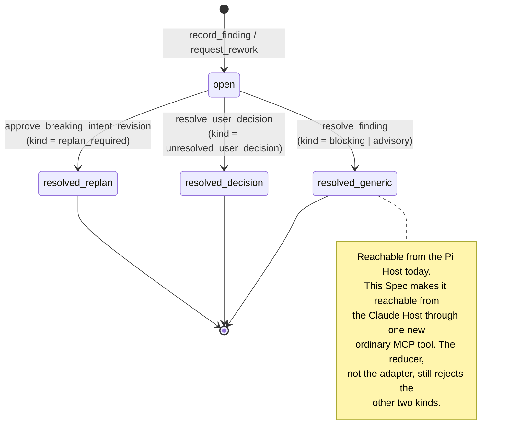

# Spec: Expose `resolve_finding` on the Claude Host

- **Task ID**: `2026-09-06-003-claude-host-resolve-finding`
- **Owner**: user
- **Risk**: critical
- **Design risk**: High — this is cross-runtime host-adapter work on the
  authority lifecycle. It changes the published MCP tool contract, the
  Kernel finding state machine's reachable transitions from one Host, a
  checked-in generated package artifact, and the parity relationship
  between the Pi Host and the Claude Host. None of those are contained
  local fixes.
- **Document language**: English, per the `CLAUDE.md` Output Language Policy.
  Schema fields, enum values, tool names, file paths, and code identifiers
  stay literal.
- **Initiative carrier**: none. This is one ordinary TaskIntent owning one
  closable outcome, tracked by its Kernel TaskRecord. The
  `Initiative carrier default: github` directive in `CLAUDE.md` applies only
  to Initiatives split across multiple TaskIntents, so no carrier is
  resolved and no remote mutation is proposed.

## 1. Outcome

The Claude Code Host can issue the Kernel's existing `resolve_finding`
operation. After this change, a Claude-Host `imm-loop` that has fixed and
verified the cause of a `blocking` or `advisory` finding can clear it and
let the Kernel reproject the next obligation, instead of terminating
fail-closed with `Kernel requires resolve_findings` and no reachable
operation.

## 2. Problem (discovery evidence)

The Kernel implements `resolve_finding` fully and it is reachable from the
Pi Host, but no Claude Host operation can issue it. Concrete pointers
gathered during discovery:

| Fact | Evidence |
| --- | --- |
| The Kernel operation exists and is ordinary (no capability argument). | `plugins/immune-brain/runtime/kernel/canary_application.ts:51` declares `{ op: "resolve_finding"; finding_id: string; actor_id: string }`; `:362` builds the action without setting `capability`, unlike `request_rework` and `record_approval` at `:366`/`:370`. |
| The reducer enforces its own preconditions. | `plugins/immune-brain/runtime/kernel/reducer.ts:291-313`: rejects a non-`active` lifecycle, an unknown `finding_id`, an already-`resolved` finding, and the `unresolved_user_decision` / `replan_required` kinds. |
| The Pi Host already exposes it as an ordinary operation. | `plugins/immune-brain/.pi-extension/imm-canary-work.ts:142-148` `KERNEL_OPERATIONS`; schema at `:449`; operation mapping at `:1056-1057`. |
| The Claude Host MCP surface has eight tools and none is `resolve_finding`. | `plugins/immune-brain/runtime/claude/mcp_server.ts:20-29` `TOOLS`; the exact list is pinned by `tests/claude-host-package.test.ts:138-147`. |
| No existing Claude tool can substitute. | `runtime/claude/interaction.ts:3-8` `PRIVILEGED_OPERATIONS` omits it; `runtime/claude/kernel_ports.ts:545-556` maps `request_authorization` only to `resolve_user_decision` and only when the projection reports `authorization.state === "resolve_user_decision"`; `reducer.ts:422-423` has `approve_breaking_intent_revision` resolve only `replan_required` findings. |
| A blocking finding never clears on its own. | `plugins/immune-brain/runtime/kernel/completion.ts:139` collects open `blocking` findings and `:195` sets `nextObligation = "resolve_findings"` ahead of the `artifact_state === "active"` → `submit_assurance` branch, so no snapshot change or freeze clears it. |
| The coordinator therefore blocks. | `plugins/immune-brain/runtime/assurance/coordinator.ts:528` returns `{ state: "blocked", reason: "Kernel requires resolve_findings" }`. |
| The plumbing already exists and is exercised. | `runtime/claude/kernel_ports.ts:434` binds `applyOrdinaryOperation` to the private `executeOrdinary` (`:776`), which the coordinator already uses for `freeze_artifacts` and `complete` (`coordinator.ts:532`, `:549`, `:650`, `:813`). |
| The published mirror is a checked-in build artifact, not a byproduct. | `git log` shows `plugins/immune-brain/dist/claude/mcp-server.mjs` committed together with every `runtime/claude/mcp_server.ts` change (`6d7d645`); `scripts/build-claude-plugin.ts:10` names it as `OUT`, and `verify:release` runs `build-claude-plugin --check`. `tests/claude-host-package.test.ts:54` asserts the checked-in file matches a fresh generate. |

This gap was proven in production, not hypothesised: task
`2026-09-05-001-batch-authorization-kernel` currently carries the open
`blocking` finding `review-b20ef9c503ee-1-review-1` whose cause was fixed
and mutation-verified, and its `imm-loop` still terminated fail-closed
because no Claude Host operation can clear it.

## 3. Technical Design

**Design views**: service/component interfaces, state transitions, data
flow, and architecture layers are all materially relevant — the change adds
a public tool contract, makes a new Kernel transition reachable, carries a
new argument through the adapter into the Kernel, and turns on the question
of which layer owns the resolution decision. Temporal sequence is omitted:
the operation is a single synchronous request/response inside one
`callTool` frame with no reservation, no dispatch, no background job, and
no second party to order against, so an ordered-interaction view would add
no decision content.

**Diagram decision**: required.
**Diagram reason**: the value of the change is which Kernel finding
transition becomes reachable from which Host, and which stays deliberately
unreachable. The distinction between the generic resolution path and the
two authority-bound kinds is a state-machine fact that a diagram makes
checkable at a glance and that prose alone leaves diffuse.

### 3.1 Architecture layers

Dependency direction is unchanged and one-way: the MCP adapter
(`runtime/claude/`) depends on the Kernel (`runtime/kernel/`) and never the
reverse. Layer responsibilities for this change:

- `runtime/claude/mcp_server.ts` owns the wire contract: the tool entry,
  its input schema, its annotations, and the `callTool` dispatch. It owns
  no finding semantics.
- `runtime/claude/kernel_ports.ts` owns transport into the Kernel: it
  builds the ordinary operation and delegates to the existing
  `executeOrdinary`. It performs no finding lookup, no kind test, and no
  eligibility judgement.
- `runtime/kernel/reducer.ts` remains the sole owner of which findings may
  be resolved and when.

**Prohibited coupling**: the adapter must not read `record.findings` to
decide whether a resolution is allowed, must not filter by `kind`, and must
not derive a `finding_id` the caller did not supply. Duplicating the
reducer's precondition in the adapter would create a second, drifting
authority; the reducer's `KernelInvariantError` is the single rejection.

### 3.2 Service/component interface

New MCP tool `resolve_finding`:

- **Inputs**: `task_id: string` (already required for every tool by
  `mcp_server.ts:92`), `finding_id: string`.
- **Required**: `["task_id", "finding_id"]`. `listMcpTools()` currently
  special-cases `submit_review`'s required list; that branch extends to
  this tool.
- **Output**: the Kernel result of the ordinary operation, i.e. the fresh
  TaskRecord and projection, matching what `executeOrdinary` already
  returns for `freeze_artifacts`.
- **Errors**: a missing `finding_id` is rejected by the adapter before any
  Kernel call, with the same shape as the existing
  `"verdict is required"` check at `mcp_server.ts:117`. Every semantic
  rejection — unknown id, already resolved, non-`active` lifecycle,
  `unresolved_user_decision`, `replan_required` — surfaces the reducer's
  `KernelInvariantError` message unchanged.
- **Compatibility / versioning**: additive. The eight existing tools, their
  schemas, their annotations, and their dispatch are unchanged. Adding a
  ninth tool is backward compatible for any client that reads
  `tools/list`; `MCP_PROTOCOL_VERSION` does not move.
- **Caller/callee ownership**: the caller is the `imm-loop` Parent acting on
  a Kernel obligation of `resolve_findings`. The callee is the Kernel. The
  Host adapter is neither and decides nothing.

**Privilege classification decision**: `resolve_finding` is registered as an
**ordinary** (non-privileged) tool, so `PRIVILEGED_OPERATIONS` in
`runtime/claude/interaction.ts` is unchanged and no native elicitation gate
is added. Rationale: the Kernel itself classifies the operation as ordinary
— `canary_application.ts:362` builds it without a capability, unlike
`request_rework` and `record_approval` — the Pi Host already exposes it
ordinarily, and the two authority-bound finding kinds are exactly the ones
the reducer refuses to resolve through this path. Adding a literal-user
gate here would put the Claude Host out of parity with the Pi Host and
would make the Kernel's own ordinary/privileged split non-authoritative.

**Alternative considered and rejected**: widen `request_authorization` to
cover `blocking` findings. Rejected because `kernel_ports.ts:545-556`
derives its operation solely from `projection.authorization`, which reports
`{"state":"none","blocked":null}` for a `blocking` finding, and because it
would put an ordinary Kernel operation behind a privileged gate that the
Kernel does not ask for. **Second alternative**: auto-resolve blocking
findings when the snapshot changes. Rejected because it would delete the
reviewer's authority — `completion.ts:139` deliberately makes an open
blocking finding survive any snapshot change.

### 3.3 Data flow

Source: MCP `tools/call` arguments. Transformation: `callTool` reads
`task_id` and `finding_id`, applies the same handshake preconditions every
mutating tool already applies (`mcp_server.ts:97-110`: bound host version,
negotiated interactive elicitation, `probeHost`), and hands
`{ op: "resolve_finding", finding_id, actor_id }` to the runtime, which
calls the existing `executeOrdinary`. Validation: structural in the
adapter (`finding_id` present and a string), semantic in the reducer.
Destination: the TaskRecord's `findings[].status` plus one appended history
entry. Failure handling: any throw propagates as a JSON-RPC error and
writes nothing — `executeOrdinary`'s intent-sidecar restore path is inert
here because it only engages for `revise_intent`.

### 3.4 State transitions

- **States**: a finding is `open` or `resolved`.
- **Legal transition**: `open → resolved`, exactly once, for kinds
  `blocking` and `advisory`.
- **Trigger**: the new `resolve_finding` tool call.
- **Invariant**: `record.lifecycle === "active"`; the finding exists; it is
  not already `resolved`; its kind is neither `unresolved_user_decision`
  nor `replan_required`. `validation.ts:1022` continues to accept
  `resolve_finding` as the sole justification for that finding's status
  change, and `:1013` continues to require exactly one appended history
  entry, so a resolution cannot silently alter a second finding.
- **Terminal ownership**: the Kernel reducer owns the transition. The Host
  adapter owns none of it.
- **Recovery**: a rejected call leaves the record byte-identical, so the
  Parent may correct the argument and retry without a repair step.

## 4. Settlement-Design enumeration

This is authority-lifecycle work, so the settlement enumeration is
mandatory.

**Trigger sources** — every event that can start, interrupt, or settle a
`resolve_finding` request:

1. A Parent `tools/call` naming an existing open finding — the only path
   that settles the transition.
2. A Parent call naming a missing, already-resolved, or
   authority-bound-kind finding — settles as a reducer rejection with no
   write.
3. A call arriving while `lifecycle !== "active"` (frozen for QA, or
   already terminal) — settles as a reducer rejection with no write.
4. A call on a connection with no bound host version, or one whose client
   never negotiated interactive elicitation — rejected at
   `mcp_server.ts:101-106` before the Kernel is reached, exactly as for
   `advance_assurance`.
5. Store-lock contention or a failed CAS inside `app.execute` — settles as
   a throw with no partial write; the Kernel transaction is atomic.
6. Session shutdown or transport loss mid-call — no local signal settles
   anything; see terminal ownership below.

**State inventory** — the change introduces no new job state. It mutates
exactly one existing state pair (`finding.status: open → resolved`) and, as
a consequence, the projected `next_obligation`, which moves off
`resolve_findings` once no open `blocking` finding remains
(`completion.ts:139`, `:195`). No reservation, no dispatch, no timeout, and
no settling state is created; the operation is synchronous and atomic.

**Terminal ownership** — the Kernel reducer, writing through the store
lock, is the single authority that may settle `open → resolved`. Explicitly
**non-authoritative**: the resolution of the MCP call's promise, a JSON-RPC
response the client did or did not observe, elapsed time, the Parent's own
belief that it fixed the cause, and any reviewer statement. If the
transport drops mid-call, the Parent must read a fresh `status` projection
rather than replaying the mutation — the existing `imm-loop` rule that a
mutation is never repeated merely to obtain its result applies unchanged.

**Same-state-machine coverage** — `scope_hint` lists every path that owns a
transition of the finding state machine or the tool surface that reaches
it, including paths this change does not edit, so one review round can
audit the whole machine: the Claude tool surface and its dispatch
(`mcp_server.ts`), the Claude Kernel transport (`kernel_ports.ts`), the
privileged/ordinary classification that this Spec deliberately leaves
unchanged (`interaction.ts`), the Pi Host that owns the same operation on
the other runtime (`imm-canary-work.ts`), the published mirror that is the
artifact users actually run (`dist/claude/mcp-server.mjs`), and the two
tests that pin the tool surface.

## 5. Scope

In scope:

- `plugins/immune-brain/runtime/claude/mcp_server.ts` — register the tool,
  extend the input-schema builder, add the dispatch branch.
- `plugins/immune-brain/runtime/claude/kernel_ports.ts` — one public
  runtime method that forwards the ordinary operation to `executeOrdinary`.
- `plugins/immune-brain/dist/claude/mcp-server.mjs` — regenerate the
  checked-in mirror so `build-claude-plugin --check` and
  `tests/claude-host-package.test.ts:54` stay green.
- `plugins/immune-brain/runtime/claude/interaction.ts` — read-only in this
  change; listed for same-state-machine review coverage of the
  ordinary/privileged decision.
- `plugins/immune-brain/.pi-extension/imm-canary-work.ts` — read-only in
  this change; listed as the parity reference for the same operation.
- `tests/claude-host-authority.test.ts`, `tests/claude-host-package.test.ts`
  — behavioural coverage and the pinned tool list.
- `tests/claude-host-authority.test.ts` additionally carries one bounded
  repair without which neither descriptor can pass: see §8.

Out of scope, stated explicitly rather than dropped:

- The existing eight tools, their gates, and `PRIVILEGED_OPERATIONS`.
- `runtime/assurance/coordinator.ts`: the Parent issues `resolve_finding`
  directly; the coordinator does not need to route it, and changing its
  blocked-state reporting is a separate outcome.
- Any resolution of the open findings on
  `2026-09-05-001-batch-authorization-kernel`. That task's obligations are
  its own; this change only makes the operation reachable.
- Retiring or altering `resolve_user_decision` and
  `approve_breaking_intent_revision`.

## 6. Acceptance and test mapping

| ID | Assertion focus | Verification |
| --- | --- | --- |
| `acc-claude-resolve-finding-tool` | The tool exists on the published surface with the right contract and actually clears an open finding through the Kernel, moving the projected obligation off `resolve_findings`. | `bun test tests/claude-host-authority.test.ts` |
| `acc-claude-resolve-finding-fail-closed` | Every rejection path stays fail-closed with zero writes, the adapter adds no second authority, the eight existing tools are unchanged, and the checked-in mirror matches a fresh generate. | `bun test tests/claude-host-authority.test.ts tests/claude-host-package.test.ts` |

Both descriptors name files that exist today and run focused, not
repository-wide. `tests/claude-host-package.test.ts` is the owner of the
exact tool-name list at `:138`, so it must appear in the second descriptor:
without it the mirror and the pinned list could drift green.

## 7. Devil's Advocate Audit

**Rollback resilience.** Partial implementation is safe in both directions.
If the tool is registered but the runtime method is missing, `callTool`
falls through to `throw new Error("unknown tool resolve_finding")` — a
clean rejection with no write. If the runtime method exists but the tool is
not registered, the method is simply unreachable from MCP, which is
today's behaviour. If the mirror is stale relative to the runtime source,
`build-claude-plugin --check` and `tests/claude-host-package.test.ts:54`
fail loudly rather than shipping a surface that disagrees with its source.
Because the Kernel write is a single atomic locked transaction, there is no
half-resolved finding to unwind: revert is `git revert` of the diff, and no
data migration or state repair is implied.

**Verification vanity.** The obvious vacuous test here is asserting that
`listMcpTools()` contains the string `resolve_finding` — that passes
against a tool that dispatches to nothing. The acceptance therefore
requires an end-to-end assertion through a real fixture repository:
`callTool("resolve_finding", ...)` on a task with an open `blocking`
finding must leave that finding `resolved` in the TaskRecord and must move
the projection's `next_obligation` off `resolve_findings`. That assertion
fails if the tool is registered without dispatch, if dispatch calls the
wrong Kernel operation, or if the Kernel result is swallowed. Symmetrically,
the fail-closed acceptance must assert that an `unresolved_user_decision`
finding is *not* resolved and the record is unchanged — an assertion that
only passes if the reducer is genuinely reached, which is what proves the
adapter did not build a second, permissive authority. The mutation check
for these tests is direct: deleting the dispatch branch must fail the first
acceptance, and deleting the reducer's kind guard must fail the second.

**Spec dilution.** The request is exactly "expose `resolve_finding` on the
Claude Host". Three adjacent temptations are named and refused above rather
than absorbed: making the operation privileged (refused — breaks Pi parity
and overrides the Kernel's own classification), widening
`request_authorization` (refused — the projection cannot derive it),
and auto-clearing blocking findings on snapshot change (refused — deletes
reviewer authority). Nothing in scope resolves any live finding on any
existing task; that stays a separate, owner-driven action. Every accepted
requirement maps to one of the two acceptance IDs in section 6, and the
out-of-scope list in section 5 states what was deliberately excluded
instead of silently narrowing.

## 8. Enrollment history

This section records what execution actually cost, because both of this
Spec's enrollments were stopped by the exact defect §2 describes. The
Loop became its own specimen twice.

**First blocker — cleared.** `imm-kernel intent author` failed closed with
`kernel_owner_active` (`runtime/commands/kernel.ts:607-623`): task
`2026-09-05-001-batch-authorization-kernel` held the workspace claim, and
its own `imm-loop` was blocked on `next_obligation: resolve_findings` for
an open `blocking` finding — the operation this Spec adds. The Kernel's
recovery guidance ("Route to `imm-loop`") was therefore unreachable.
`stop` on that task released the claim; `enrollment.ts:116-121` keys the
tombstone on `task_id` alone, so its implementation survived in the git
index and only the id was spent.

**Second blocker — the QA descriptor could not pass for an unrelated
reason.** Enrolled as `2026-09-06-001-claude-host-resolve-finding`, the
first `advance_assurance` returned `rework`: both descriptors exited 1.
Reproducing them through `runtime/assurance/verification.ts`
`runFixedVerification` showed `40 pass / 0 fail` with exit code 1.
`serveStdio`'s `executeShutdown` assigns `process.exitCode = code`
(`runtime/claude/mcp_server.ts:503`) even when the caller injects its own
`exit`, so the test that destroys the stdout stream stamps 1 onto the
**test runner's** process. Every test in the file was green and the file
was still unverifiable as a QA descriptor. This predates the change; it
reproduces at `HEAD`. The repair asserts the production side effect and
then restores the runner's exit code, and is non-vacuous: deleting the
`process.exitCode` assignment fails the test. Both descriptors now exit 0
under the same frozen runner.

**Third blocker — the defect closing on itself.** Round-1 QA had already
written two open `blocking` findings, so the projection moved to
`next_obligation: resolve_findings` and `advance_assurance` refused at
`runtime/assurance/coordinator.ts:527`. Findings never expire on a changed
snapshot (`runtime/kernel/completion.ts:139`), and the Host runs the
released 3.6.4 plugin bundle, which publishes eight tools and not this
one. No other operation applies: `authorization.state` is `none`,
`approve_breaking_intent_revision` resolves only `replan_required`
(`reducer.ts:422`), `repair_authority_state` needs a stale claim, and the
`imm-kernel` CLI exposes no mutation. The task was stopped and the same
scope re-enrolled under a fresh id.

**Fourth blocker — QA and Review disagreed about a build artifact.**
Enrolled as `2026-09-06-002-claude-host-resolve-finding`, QA passed both
descriptors and Review then returned one valid `blocking` finding:
`dist/claude/mcp-server.mjs` carried `enrollCanaryTask` batch-lineage code
whose source was staged but uncommitted and outside this `scope_hint`, so
it was absent from the review revision's tree. QA runs against the live
worktree, where bundle and source agree; Review runs against a synthetic
revision of `base_head` plus the scope paths, where they do not. A
whole-runtime build artifact cannot satisfy both while unrelated runtime
changes sit uncommitted. Widening `scope_hint` would drag unreviewed work
into this task, and rebuilding the bundle without that code would break
the worktree's own `build-claude-plugin --check`. The batch runtime work
was therefore committed first, so the next enrollment's `base_head`
contains source for every line the bundle carries. The finding was again
unresolvable in-Host, and the task was stopped.

Two generalisations worth keeping. On the released Host, **one failed QA
or Review round permanently ends a task**, whatever the failure was; that
is the cost this Spec removes. And a checked-in build artifact is only
reviewable when every line of its source is committed at or below the
task's `base_head` — the Review revision, not the worktree, is what ships.
