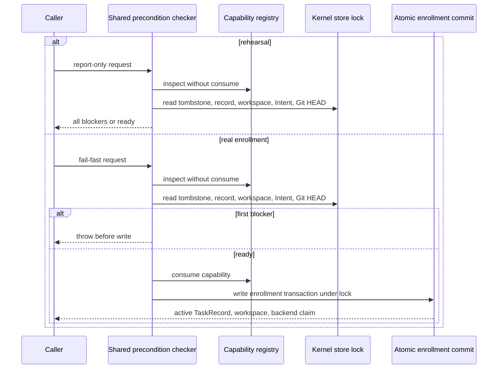

# Spec: Deduplicate Enrollment Precondition Checks

**Task ID**: `2026-09-01-001-dedup-enrollment-preconditions`
**Owner**: user
**Status**: Candidate
**Origin**: GitHub Issue `#18`, child of `#16`
**Design risk**: High

The change is a behavior-preserving refactor of the Kernel enrollment boundary. It must replace the duplicated precondition definitions used by `runEnrollmentRehearsal` and `enrollCanaryTask` with one private implementation while preserving their public signatures, authority ordering, lock protection, diagnostics, and externally observable results.

**Design risk rationale**: The edited module controls one-shot capability consumption and the atomic creation of TaskRecord, workspace, and backend-claim authority. A local refactor can therefore weaken authorization or introduce a check/write race even without changing an exported type.

**Design views**: Service/component interfaces, state transitions, and temporal sequence are selected because the two public callers apply different failure policies around one authority-sensitive check sequence. Architecture layers and data flow are omitted because ownership, persisted schemas, and payload transformations do not change.

**Diagram decision**: required
**Diagram reason**: The ordering difference between report-only rehearsal and locked enrollment is the primary safety contract.

## Intended Behavior

## Technical Design

1. Keep `runEnrollmentRehearsal` and `enrollCanaryTask` signatures unchanged.
2. Add one private precondition-checking implementation in `enrollment.ts`; both public functions must route capability inspection, tombstone absence, TaskRecord absence, workspace availability, Intent readability/identity, and Git HEAD readability/freshness through it.
3. Separate check definition from failure policy: rehearsal collects all blockers in the existing order and returns `not_ready`; enrollment throws the first blocker in the existing order.
4. Rehearsal remains report-only. It may take the existing store lock for coherent reads, but it performs no authority writes and never calls `registry.consume`.
5. Real enrollment keeps state-dependent checks and the successful consume/commit continuation in the existing store-lock critical section. No refactor may move a mutable owner check outside the lock or create a second check/write window.
6. Preserve preparation-digest, intent revision/hash, and Git HEAD freshness validation. The shared helper must not collapse distinct diagnostics or treat malformed owner state as absence.
7. Do not export the helper, change persisted schemas, add configuration, or modify tests solely to assert a private implementation shape.

## Reference Closure

Public/runtime entry and caller trace:

- `plugins/immune-brain/.pi-extension/imm-canary-enroll.ts` calls rehearsal and then real enrollment.
- `plugins/immune-brain/.pi-extension/runtime-stub.ts` forwards both exports to the Kernel module.
- `plugins/immune-brain/runtime/kernel/enrollment_authority.ts` owns inspect/consume semantics.
- `plugins/immune-brain/runtime/kernel/pi_canary_prepare.ts` owns preparation digest and Git HEAD reads.
- `plugins/immune-brain/runtime/kernel/storage.ts` owns the lock and atomic enrollment commit.
- `plugins/immune-brain/runtime/kernel/enrollment.ts` owns both public functions and is the only expected implementation edit.

Highest focused behavioral tests:

- `tests/kernel-canary-rehearsal.test.ts` proves report-only blockers, zero authority bytes, and reusable capability.
- `tests/kernel-enrollment-transaction.test.ts` proves rejection behavior, delayed capability consumption, and atomic successful enrollment.
- `tests/kernel-canary-rework-authority.test.ts` exercises real enrollment as the setup boundary for later authority transitions.

Prior design evidence:

- `docs/specs/archive/assurance-kernel-v4-p2b1-pi-confirmed-enrollment.spec.md` requires rehearsal zero-write behavior, final-lock freshness, and consume immediately before commit.
- `docs/solutions/contracts.md` records the atomic-enrollment rule: every fallible precondition precedes capability consumption, and consume occurs immediately before marker creation.
- No relevant ADR or rejected Learning changes this local design; Issue `#16` explicitly keeps CAS locking and capability semantics intact.

## Settlement-Design Contract

### Trigger sources

- A host rehearsal request starts report-only checking.
- A confirmed enrollment request starts fail-fast checking.
- Capability mismatch/expiry/consumption, tombstone presence, existing TaskRecord, occupied workspace, unreadable or drifted Intent, unreadable or moved Git HEAD, preparation-digest drift, and atomic commit failure interrupt enrollment.
- Successful atomic commit settles enrollment into active ownership.

### State inventory

- `candidate`: no enrollment authority has been consumed.
- `checking`: capability and current owners are being read; no write is permitted.
- `ready`: every precondition passed under the required lock.
- `committing`: capability is consumed and the atomic enrollment transaction owns settlement.
- `active`: TaskRecord, workspace, and backend claim were committed together.
- `rejected`: a blocker returned or threw before authority writes; rehearsal remains reusable.

Legal transitions are `candidate -> checking -> ready`, `checking -> rejected`, `ready -> committing -> active`, and `committing -> rejected` only through the existing atomic transaction failure/recovery contract. Rehearsal stops at `ready` or `rejected` without persisted state.

### Terminal ownership

- `EnrollmentAuthorityRegistry` exclusively validates and consumes the capability.
- `withKernelStoreLock` plus `commitEnrollmentLocked` exclusively owns the authority write transition.
- Rehearsal results, promise completion, elapsed time, and caller acknowledgement are non-authoritative and cannot settle enrollment.

### Same-state-machine coverage

Review must inspect `imm-canary-enroll.ts`, `runtime-stub.ts`, `enrollment_authority.ts`, `pi_canary_prepare.ts`, `storage.ts`, and `enrollment.ts`. Only `enrollment.ts` is expected to change; any required sibling runtime change invalidates this behavior-preserving boundary and requires Planner revision.

## Compatibility, Recovery, And Rollback

There is no schema, migration, package, or public API change. A partial implementation is not usable unless both public paths call the shared checker and focused tests pass. Rollback is a single-file revert of `enrollment.ts`; existing TaskRecords and claims require no migration or repair.

## Scope

Expected implementation mutation:

- `plugins/immune-brain/runtime/kernel/enrollment.ts`

Planning artifacts:

- `docs/specs/dedup-enrollment-preconditions.spec.md`
- `docs/specs/archive/dedup-enrollment-preconditions.spec.md`
- `docs/plans/2026-09-01-001-dedup-enrollment-preconditions.intent.json`
- `docs/plans/archive/2026-09-01-001-dedup-enrollment-preconditions.intent.json`

Same-state-machine review-only owners are listed in Reference Closure and must remain unchanged.

## Acceptance

1. Both public enrollment functions route their shared precondition definitions through one private implementation without changing either signature.
2. Rehearsal reports blockers without writing authority state or consuming its capability.
3. Real enrollment throws the first blocker before writes, preserves final-lock freshness, and consumes capability only immediately before atomic commit.
4. Existing focused rehearsal, transaction, and enrollment-adjacent tests pass unmodified.

## Devil's Advocate Audit

**Rollback resilience**: The expected code delta is one file and changes no persisted format. Reverting that file restores the prior duplicated implementation; interrupted work creates no migration obligation.

**Verification vanity**: `kernel-canary-rehearsal.test.ts` fails on writes or capability consumption, while `kernel-enrollment-transaction.test.ts` fails on precondition, consume-order, or atomic-commit regressions. Independent Review must inspect that both callers actually use one private checker because behavior tests intentionally do not pin private source shape.

**Spec dilution detection**: The refactor does not relax final-lock checks, alter failure ordering, change signatures, permit test edits, or reinterpret “shared” as two wrappers around duplicated bodies. CAS locking and capability semantics remain explicitly unchanged.

## Non-Goals

- Changing CAS/store-lock behavior.
- Changing capability binding, branding, expiry, or single-use semantics.
- Changing preparation, TaskIntent, TaskRecord, workspace, backend-claim, or transaction schemas.
- Changing host Enrollment UX or adding new tests for private helper structure.
- Implementing the other Slices from GitHub Issue `#16`.
