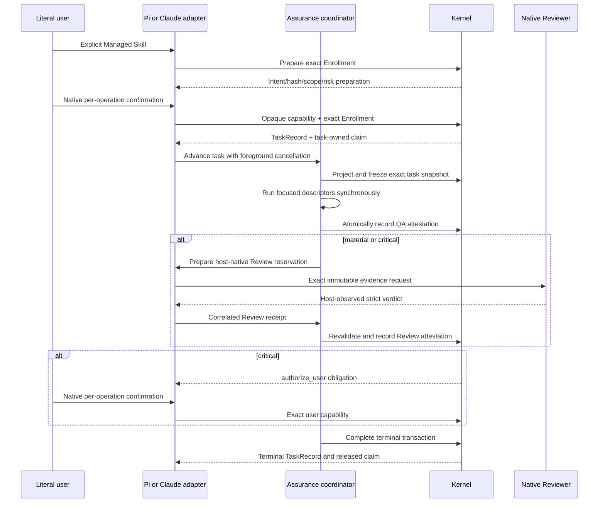

# Dual-Host Assurance

**Status**: Proposed
**Initiative**: `Dual-Host Assurance`
**Initiative slug**: `dual-host-assurance`
**Owner**: user
**Design risk**: High
**Design risk rationale**: This initiative changes host/runtime ownership, foreground authority observation, cancellation and settlement sequencing, release packaging, and cross-host recovery around persisted Kernel state.
**Design views**: Architecture layers, component interfaces, data flow, state transitions, and temporal sequence are all selected because the result crosses Kernel, coordinator, host adapter, native user/Review evidence, packaging, and recovery boundaries.
**Diagram decision**: required
**Diagram reason**: The authority sequence and interruption boundaries across Kernel, coordinator, and two independent hosts cannot be reviewed reliably from a component list alone.

## Task

Make Pi and local interactive Claude Code first-class Immune-Brain Hosts. Each Host independently completes the full Managed Path for `routine`, `material`, and `critical` tasks. Either Host may resume a task created by the other in the same Git worktree by consuming durable Kernel state rather than a handoff record.

## Output Language

Human-readable Spec and TaskIntent prose is English. Schema fields, enum values, CLI flags, JSON keys, file paths, Tool names, API names, contract identifiers, and canonical terms remain literal.

## Origin

This Spec consumes the closed `imm-brainstorm` result in the current conversation. There are no unresolved `BR-Q-*` items and no deferred item that changes the current Result, interface, or compatibility contract.

## Brainstorm Manifest

`BR-REQ-1` through `BR-REQ-6`; `BR-ARCH-1` through `BR-ARCH-8`; `BR-AUTH-1` through `BR-AUTH-6`; `BR-RECOVERY-1` through `BR-RECOVERY-7`; `BR-SCOPE-1` through `BR-SCOPE-4`; `BR-COMPAT-1` through `BR-COMPAT-4`; `BR-VERIFY-1` through `BR-VERIFY-4`; `BR-NONGOAL-1` through `BR-NONGOAL-5`.

## Problem

Kernel authority is already mostly host-neutral, but foreground orchestration is not. `plugins/immune-brain/.pi-extension/pi-canary-assurance-progression.ts` combines deterministic Assurance sequencing with Pi `ExtensionContext`, native Agent reservation matching, Pi session lifecycle, and Pi event observation. Reusable verification, Review revision evidence, and QA finding code also lives under `.pi-extension/`.

The package and release contracts deliberately enforce Pi-only support. ADR-0002 records that non-Pi adapters were retired, while `tests/pi-only-current-contracts.test.ts`, `tests/pi-only-package-surface.test.ts`, `tests/pi-only-release-contract.test.ts`, and `plugins/immune-brain/tests/host-manifest-consistency.test.ts` reject Claude Code claims and plugin paths. Adding a Claude manifest without changing these ownership rules would create an unsupported surface, not a second Host.

## Result

The product has one host-neutral Kernel and one narrow host-neutral Assurance coordination boundary. Pi and Claude Code provide separate native adapters. They share persisted contracts and conformance fixtures, while native confirmation, Review invocation/observation, progress presentation, and cancellation transport remain adapter-owned.

Pi keeps its current public Tool schemas, persisted bytes, contract identifiers, digests, mutation ordering, foreground behavior, and failure semantics. Claude Code ships from the same repository and release version as a self-contained plugin using the existing five Skill sources, a stdio MCP server, plugin Hooks, and one plugin-scoped Reviewer agent.

## Research And Discovery Evidence

### Existing ownership

- `plugins/immune-brain/runtime/kernel/` owns TaskIntent, Enrollment, TaskRecord v3/v4, capability consumption, claims, projection, freshness, and terminal settlement without Pi SDK imports.
- `plugins/immune-brain/runtime/kernel/pi_canary_prepare.ts` is implementation-neutral but its exported name and `assurance_kernel/pi_canary_preparation/v1` bytes are compatibility-sensitive. This initiative preserves them and may add neutral aliases; it does not rename the contract.
- `plugins/immune-brain/.pi-extension/pi-canary-assurance-progression.ts` owns QA-to-Review-to-user progression plus Pi-native Review receipt observation.
- `plugins/immune-brain/.pi-extension/pi-canary-verification.ts`, `pi-canary-review-bundle.ts`, and `pi-canary-qa-findings.ts` contain reusable implementations with no Pi SDK imports.
- `plugins/immune-brain/.pi-extension/imm-canary-enroll.ts` and `imm-canary-work.ts` own Pi Tool registration, native dialogs, mutation registry lifecycle, and foreground cancellation.
- `plugins/immune-brain/runtime/kernel/authority_port.ts`, `enrollment_authority.ts`, and `canary_application.ts` already bind opaque capabilities to exact task, action, record, intent, diff, actor, confirmation, and expiry facts.

### Focused behavioral seams

- `tests/pi-canary-assurance-progression.test.ts` and `tests/pi-canary-assurance-continuation.test.ts` exercise cancellation linearization, retryable Review preparation, reservation observation, freshness, and settlement-unknown behavior.
- `tests/pi-canary-enroll-extension.test.ts` exercises the real Pi Enrollment Tool, zero-write rejection, exact preparation stability, cancellation, and native confirmation.
- `tests/kernel-enrollment-transaction.test.ts`, `tests/kernel-canary-application.test.ts`, `tests/kernel-canary-terminal-transaction.test.ts`, and `tests/kernel-assurance-projection.test.ts` exercise the Kernel-owned state machine that both Hosts must consume.
- `tests/pi-canary-review-bundle.test.ts`, `tests/pi-canary-review-outcome-evidence.test.ts`, and `tests/pi-canary-review-dispatch-resilience.test.ts` exercise immutable Review evidence and receipt constraints.
- Pi-only package tests listed above are the current release ratchet that the second Slice must replace with an explicit Pi+Claude allowlist.

### Prior decisions

- ADR-0002 remains correct about self-contained package output and distinct consumers, but its Pi-only package decision must be superseded by a new ADR when the shared boundary is introduced.
- ADR-0003 keeps internal roles private and advisory/authority-limited; Claude does not create new public execution roles.
- `docs/solutions/rejected-shared-registry-generic-dispatcher.md` rules out a generic host/agent registry. This initiative introduces only the narrow Assurance Host Port required by two proven Hosts.
- `docs/solutions/rejected-out-of-band-review-authority-reconstruction.md` rules out workspace or conversation inference. Cross-host resume consumes TaskRecord, claim, Git identity, and Assurance Projection only.
- `docs/solutions/rejected-perpetual-runtime-compatibility.md` requires bounded v3 drain and strict current writes, not distributed legacy branches.

### Claude Code primary-source constraints

The Claude adapter is based on current official Claude Code documentation:

- MCP tool annotation `anthropic/requiresUserInteraction: true` forces per-call user approval even under allow rules, `acceptEdits`, `auto`, or `bypassPermissions`; unsupported or `dontAsk` environments fail closed. The documented feature requires Claude Code `2.1.199` or later.
- Plugin Hooks expose `SubagentStart`, `SubagentStop`, `PostToolUse`, `PermissionRequest`, `PermissionDenied`, `ElicitationResult`, and `SessionEnd`; MCP tool hooks may report events to the plugin MCP server.
- Hook failure is not authority. A final MCP mutation accepts Review only when the complete expected observation chain is present.
- Plugin files cannot depend on paths outside the plugin root after marketplace caching. The plugin artifact must therefore include its runtime and generated instruction consumers.

The release minimum is the lowest Claude Code version that passes the real conformance suite, never lower than `2.1.199`.

## Technical Design

### Architecture layers

1. **Kernel**: owns persisted authority, capability validation/consumption, lock/CAS, freshness, legal transitions, and settlement. It imports no host adapter.
2. **Assurance coordination**: owns deterministic sequencing around projection, freeze, QA, Review preparation/consumption, user-obligation projection, cancellation linearization, and settlement reconciliation. It depends on Kernel ports and a narrow Host Port.
3. **Host adapters**: Pi and Claude Code own native user interaction, native Review execution observation, process/session signals, progress rendering, and Tool transport. They cannot widen scope or settle without Kernel capability consumption.
4. **Package surfaces**: Pi extension registration and Claude plugin manifests point to the same versioned runtime contracts. Generated output is self-contained and drift-checked.

Dependency direction is `host adapter -> assurance coordination -> Kernel`. Kernel and shared coordination must not import `.pi-extension`, Claude SDK/plugin modules, Pi SDK, TUI, or marketplace manifests. No generic host registry, automatic dispatcher, queue, or plugin-to-plugin coordinator is introduced.

### Shared component interfaces

The first Slice extracts a narrow contract equivalent to:

```ts
interface AssuranceHostPort {
  readonly host: "pi" | "claude-code";
  prepareReview(request: ReviewRequest): Promise<HostReviewReservation>;
  consumeReview(reservation: HostReviewReservation): Promise<ObservedReviewReceipt>;
  releaseReview(reservation: HostReviewReservation): void;
}
```

`ReviewRequest` includes the task, operation, immutable snapshot/revision identities, evidence path, strict prompt bytes, and required result contract. `ObservedReviewReceipt` includes adapter-owned invocation identity, exact reservation correlation, ordered terminal observation, actor identity, and the strict final result. The shared coordinator revalidates Kernel projection and immutable Review revision immediately before applying a verdict.

Enrollment uses the existing shared Kernel preparation, revalidation, enrollment registry, and transaction. Each adapter obtains a native literal-user decision and mints an exact opaque capability inside its private activation/process closure. A neutral facade may wrap the existing `preparePiCanary` and `revalidatePiCanary` exports, but the legacy names and contract bytes remain valid.

The shared verification runner remains Bun-only and POSIX-only. `pi-canary-verification.ts`, `pi-canary-review-bundle.ts`, and `pi-canary-qa-findings.ts` remain compatibility re-export shims until both active consumers import the neutral modules. The shims have an exit milestone: remove them in the next major release after both adapters and all package consumers import the neutral paths. Owner: runtime maintainer.

### Claude plugin surface

The repository root marketplace manifest references `plugins/immune-brain` as the plugin root. That root adds:

- `.claude-plugin/plugin.json` with the common release version;
- `.mcp.json` launching `node ${CLAUDE_PLUGIN_ROOT}/dist/claude/mcp-server.mjs`;
- `hooks/hooks.json` for bounded Host event reporting and scope feedback;
- `agents/immune-brain-reviewer.md` with plugin-scoped identity and read-only evidence tools;
- generated `dist/claude/` Node-compatible runtime output.

The existing `plugins/immune-brain/skills/*/SKILL.md` and `dist/*.md` remain the single five-Skill source. Claude-specific wrappers may select native Tools but must not fork the workflow contracts.

The MCP server exposes only bounded Immune-Brain operations. Privileged Tools for Enrollment, breaking revision, critical user authorization, stop, and authority repair carry `anthropic/requiresUserInteraction: true` and exact operation metadata. Ordinary status/projection and preparation calls do not manufacture authority.

### Data flow



Source data is the Git-tracked TaskIntent and index-backed task snapshot. Transformations are canonical parsing, preparation hashing, descriptor execution, Review revision construction, host observation correlation, freshness revalidation, and reducer application. Destinations are TaskRecord attestations/history and terminal audit. Any malformed, stale, unsupported, incomplete, or unobserved input fails before authority mutation.

### State and recovery

Persisted states and legal transitions remain those of TaskRecord v3/v4; this initiative introduces no Host ownership state and no handoff state. New Enrollment writes v4. Existing v3 tasks remain bounded drain consumers.

The task-owned Workspace Claim remains continuous from Enrollment through Assurance. Starting another Host does not transfer authority. The new Host reads the active claim and Assurance Projection, validates repository/index identity, and resumes the projected Obligation. Process-local capabilities, reservations, temporary evidence, and incomplete receipts are discarded and rebuilt.

Concurrent authority mutations are serialized by existing worktree lock and CAS/freshness checks. At most one succeeds. Simultaneous editing by two Hosts is unsupported; stale staged bytes fail at freeze or later freshness validation. No durable Host lease is introduced.

### Native authority and Review evidence

Pi retains its native TUI confirmation and foreground Agent event reservation. Claude uses mandatory-interaction MCP Tool metadata for literal-user gates. Claude Review is valid only when the plugin server correlates the reserved plugin-scoped agent across expected start, Agent tool result, and stop observations and validates its strict `assurance_kernel/assurance_verdict/v2` output against the exact snapshot.

`actor_id` uses `pi:*` or `claude:*` prefixes for machine authorities. Literal-user authority remains `actor_id: "user"`; `confirmation_ref` records Host, session/tool identity, exact operation, and native confirmation correlation. A receipt from another task, revision, diff, risk obligation, operation, agent, session, or expired reservation is rejected. Replayed receipts are rejected after one consume.

Review rejection follows existing semantics: a reliably observed literal-user rejection of Review authorization invokes the exact user stop path. If denial observation fails, no stop or approval is inferred; the task remains unresolved and fail closed.

### Version and package compatibility

Pi and Claude artifacts carry one release version. The Claude MCP server performs a startup capability probe and checks its generated core contract version. TaskRecord loaders retain the existing v4-current/v3-drain policy. Unsupported future state, missing native features, mismatched generated artifacts, or incompatible coordinator contract blocks Managed operations with zero authority writes.

Different installed package versions may resume only when their declared persisted and coordinator contracts are compatible. Adapter version is not added to TaskRecord and never becomes authority. Disabling Claude leaves the durable task Pi-resumable.

## Settlement-Design Contract

### Trigger sources

- Explicit Enrollment request and native approval or rejection.
- Artifact freeze and deterministic QA completion, failure, timeout, output limit, cancellation, or provider/runner failure.
- Review preparation, native dispatch, result, ordered terminal observation, malformed verdict, denial, cancellation, timeout, Hook/MCP failure, or session shutdown.
- Critical user authorization approval, rejection, Tool denial, cancellation, or disconnect.
- Breaking revision, stop, authority repair, finding rework, and terminal completion operations.
- Host switch, duplicate resume, stale process continuation, unsupported Host/core version, changed HEAD/index/scoped diff, and concurrent mutation.

### State inventory

No new persisted lifecycle is introduced. TaskRecord remains `active|done|stopped` with `artifact_state: active|frozen`; the Kernel projects `submit_assurance`, `run_qa`, `run_review`, `authorize_user`, finding/revision obligations, `complete`, or terminal no-action.

Process-local coordination states are `idle`, `running_qa`, `review_reserved`, `review_observed`, `settlement_unknown`, and `released`. They grant no authority and disappear on process exit. Legal local transitions are `idle -> running_qa -> review_reserved -> review_observed -> released`, with any precommit cancellation returning to `idle/released`; an ambiguous postcommit result enters `settlement_unknown` until projection reconciliation.

### Terminal ownership

- Kernel capability registries and reducer/application paths exclusively authorize and apply state mutations.
- The recoverable Kernel transaction exclusively owns `done|stopped`, terminal proof, and claim/workspace release.
- Literal-user confirmation is authoritative only when delivered by the Host-native mandatory interaction surface and bound to the exact operation.
- QA authority is the foreground deterministic descriptor result applied atomically after freshness validation.
- Review authority is the validated native Host receipt for the exact immutable reservation.
- Promise resolution/rejection, Hook callback alone, Parent text, model text, elapsed time, process absence, session shutdown, tool progress, and workspace inspection are non-authoritative.

### Same-state-machine coverage

The shared-boundary TaskIntent lists the exact Kernel enrollment/capability/application/projection/completion owners, Pi Enrollment/Work/progression/native Review/invocation owners, extracted neutral modules, runtime transport, and focused tests. The Claude Host TaskIntent will list the same shared owners plus every Claude MCP Tool, Hook observer, reservation registry, generated artifact, package/release guard, and both Host conformance tests. Unchanged owners are review-visible because they constrain the same authority sequence; scope remains mutation authority and does not make unchanged files Review bundle neighborhood.

## Failure, Interruption, And Recovery

- Cancellation before capability consume or authority commit performs zero mutation.
- Cancellation after commit begins cannot claim rollback; projection reconciliation returns settled state or `settlement_unknown`.
- QA settled but Review preparation failed remains `run_review` and is retryable from either Host.
- A missing or partial Claude Hook chain never creates Review or user attestation.
- SessionEnd cleans process-local reservations and temporary files only. It never stops, completes, or rewrites TaskRecord.
- A new Host removes only temporary assets it can prove stale, then reconstructs from durable projection.
- Unsupported or incompatible Host versions block Managed operations; ordinary host-native work remains available.
- Plugin removal performs no task mutation and no code rollback.

## Compatibility And Migration

This initiative performs no TaskRecord schema migration and no dual write. New tasks remain v4; v3 remains bounded drain. Existing Pi TaskIntent hashes, preparation contract bytes, TaskRecord bytes, Review contracts, Tool action schemas, and terminal proofs remain valid.

Slice 1 introduces temporary Pi-path re-export shims for moved neutral code. The shims have the explicit exit plan stated above. Slice 2 replaces Pi-only release ratchets with an exact Pi+Claude allowlist; Codex, Cursor, OpenCode, and undeclared adapters remain rejected.

Rollback of Slice 1 reverts the neutral modules, Pi adapter composition, ADR, and focused tests as one unit; no persisted state needs rewriting. Rollback of Slice 2 removes Claude manifests/runtime/generated output and restores the Pi-only release surface; tasks created through Claude remain valid Kernel tasks and may be completed by a compatible Pi release.

## Execution Slices

### Slice 1: `shared-assurance-host-boundary`

**Result**: A narrow host-neutral Enrollment/Assurance boundary drives a fake Host and the real Pi adapter while preserving Pi public and persisted behavior.

**Boundary rationale**: This is an independently promotable infrastructure invariant. Claude implementation must not begin until the shared contract, cancellation semantics, and Pi regression oracle pass.

**Execution posture**: `characterization-first` for existing Pi behavior, then `test-first` for the new host contract.

**Implementation scope pressure**: Authority-sensitive but coherent. Exact Kernel and Pi owners must be review-visible; reusable modules move without changing contract bytes.

**Expected implementation paths**:

- `docs/specs/dual-host-assurance.spec.md`
- `docs/adr/0004-dual-host-assurance-adapters.md`
- `plugins/immune-brain/runtime/assurance/host_port.ts`
- `plugins/immune-brain/runtime/assurance/coordinator.ts`
- `plugins/immune-brain/runtime/assurance/verification.ts`
- `plugins/immune-brain/runtime/assurance/review_evidence.ts`
- `plugins/immune-brain/runtime/kernel/pi_canary_prepare.ts`
- `plugins/immune-brain/runtime/kernel/enrollment.ts`
- `plugins/immune-brain/runtime/kernel/enrollment_authority.ts`
- `plugins/immune-brain/runtime/kernel/authority_port.ts`
- `plugins/immune-brain/runtime/kernel/canary_application.ts`
- `plugins/immune-brain/runtime/kernel/assurance_projection.ts`
- `plugins/immune-brain/runtime/kernel/completion.ts`
- `plugins/immune-brain/.pi-extension/imm-canary-enroll.ts`
- `plugins/immune-brain/.pi-extension/imm-canary-work.ts`
- `plugins/immune-brain/.pi-extension/pi-canary-assurance-progression.ts`
- `plugins/immune-brain/.pi-extension/pi-canary-verification.ts`
- `plugins/immune-brain/.pi-extension/pi-canary-review-bundle.ts`
- `plugins/immune-brain/.pi-extension/pi-canary-qa-findings.ts`
- `plugins/immune-brain/.pi-extension/pi-canary-native-review.ts`
- `plugins/immune-brain/.pi-extension/pi-canary-invocations.ts`
- `plugins/immune-brain/.pi-extension/runtime-stub.ts`
- `tests/helpers/pi-canary-assurance-harness.ts`
- `tests/host-neutral-assurance-coordinator.test.ts`
- `tests/pi-canary-assurance-progression.test.ts`
- `tests/pi-canary-assurance-continuation.test.ts`
- `tests/pi-canary-enroll-extension.test.ts`
- `tests/kernel-enrollment-transaction.test.ts`
- `tests/pi-canary-package-boundary.test.ts`

**Verification prior art**: The Pi progression and Enrollment tests can fail on cancellation, stale reservations, changed snapshots, wrong terminal event order, or writes before confirmation. A new fake-Host test must exercise the same coordinator independently of Pi types and verify dependency direction.

### Slice 2: `claude-code-host`

**Result**: The released Claude Code plugin independently completes all risk tiers and resumes compatible Pi tasks, while Pi resumes compatible Claude tasks.

**Boundary rationale**: This is the product promotion boundary. It depends on the reviewed shared invariant and owns Claude native evidence, package/release changes, official support claims, and cross-host conformance as one rollback unit.

**Execution posture**: `test-first` for MCP Tool schemas, event correlation, fail-closed authority, and compatibility matrices.

**Expected component paths**:

- root `.claude-plugin/marketplace.json`;
- `plugins/immune-brain/.claude-plugin/plugin.json`;
- `plugins/immune-brain/.mcp.json`;
- `plugins/immune-brain/hooks/hooks.json`;
- `plugins/immune-brain/agents/immune-brain-reviewer.md`;
- `plugins/immune-brain/runtime/claude/`;
- generated `plugins/immune-brain/dist/claude/`;
- existing five Skill/dist contracts;
- `package.json`, release/version/dist scripts, README, `CONTEXT.md`, ADR-0002 relationship text, and exact Pi+Claude package ratchets;
- focused Claude capability, authority, Review receipt, lifecycle, packaging, and cross-host conformance tests.

Only Slice 1 receives a TaskIntent in this Planner pass. Slice 2 remains a stable Initiative Slice until Slice 1 settles and its reference closure is revalidated.

## Acceptance And Verification Strategy

### Slice 1 acceptance

1. A fake Host uses the shared coordinator for routine, material, and critical progression without importing Pi APIs, and missing/stale/replayed authority or Review evidence fails before mutation.
2. The real Pi Enrollment and Assurance adapter preserves exact preparation identifiers/digests, TaskRecord/attestation bytes, public Tool result contracts, operation ordering, and precommit/postcommit cancellation semantics.
3. Pi native Review reservation matching, ordered result/terminal observation, immutable revision freshness, rework, retryable preparation failure, and settlement-unknown behavior remain unchanged.
4. Shared runtime modules import no Pi/Claude SDK, adapter, TUI, plugin manifest, or generic registry/dispatcher.
5. The accepted ADR supersedes only ADR-0002's Pi-only package assumption while retaining self-contained distribution and distinct consumer ownership.

Focused checks use `bun 1.3.14` and one acceptance-specific file per descriptor. Full `bun test` is implementation regression evidence but is not an Acceptance Descriptor.

### Slice 2 promotion criteria

- Real local Claude Code tests prove mandatory native approval cannot be bypassed and `dontAsk` fails closed.
- The complete Claude Review observation chain is correlated, one-shot, freshness-bound, and required before Review attestation.
- Claude independently closes routine/material/critical tasks, including rejection and cancellation paths.
- Pi-to-Claude and Claude-to-Pi recovery pass at active, frozen/run-QA, run-Review, authorize-user, and terminal states; stale and concurrent continuations fail closed.
- v3 drain and v4 current tasks work according to existing compatibility policy; unsupported future/core versions perform zero writes.
- Marketplace install/cache, self-contained artifact, Node launch, minimum-version probe, generated drift, same release version, and exact Pi+Claude allowlist pass.
- macOS, Linux, and WSL are supported; native Windows remains explicitly unsupported.

## Brainstorm Trace

| Manifest item | Status | Spec coverage |
| --- | --- | --- |
| `BR-REQ-1` | captured_as_decision | Result and two adapter layers |
| `BR-REQ-2` | captured_as_decision | Shared semantics with native UI |
| `BR-REQ-3` | covered_by_step | Slice 2 local interactive target |
| `BR-REQ-4` | covered_by_step | Existing five Skill sources in Slice 2 |
| `BR-REQ-5` | captured_as_decision | v4 current and v3 drain compatibility |
| `BR-REQ-6` | covered_by_step | Slice 2 promotion matrix |
| `BR-ARCH-1` | captured_as_decision | Single Kernel implementation |
| `BR-ARCH-2` | covered_by_step | Slice 1 coordinator and Host Port |
| `BR-ARCH-3` | covered_by_step | Slice 2 self-contained Node MCP plugin |
| `BR-ARCH-4` | captured_as_decision | Adapter-private process capability registry |
| `BR-ARCH-5` | captured_as_decision | No TaskRecord schema change |
| `BR-ARCH-6` | captured_as_decision | Stable user actor and Host confirmation reference |
| `BR-ARCH-7` | covered_by_step | Plugin-scoped Reviewer inheriting Host defaults |
| `BR-ARCH-8` | covered_by_step | Read-only immutable evidence Reviewer |
| `BR-AUTH-1` | covered_by_step | Mandatory-interaction privileged Tools |
| `BR-AUTH-2` | captured_as_decision | Exact confirmation binding |
| `BR-AUTH-3` | captured_as_decision | `dontAsk` and unsupported fail closed |
| `BR-AUTH-4` | covered_by_step | Complete Claude Review observation chain |
| `BR-AUTH-5` | captured_as_decision | Receipt rejection rules |
| `BR-AUTH-6` | captured_as_decision | Review denial and unresolved failure semantics |
| `BR-RECOVERY-1` | captured_as_decision | Projection reconstruction without handoff state |
| `BR-RECOVERY-2` | captured_as_decision | Process-local authority is not transferred |
| `BR-RECOVERY-3` | captured_as_decision | Switch only outside live mutation |
| `BR-RECOVERY-4` | captured_as_decision | Unsupported parallel editing and Kernel CAS |
| `BR-RECOVERY-5` | captured_as_decision | SessionEnd cleanup only |
| `BR-RECOVERY-6` | covered_by_step | Pi recovery after Claude removal |
| `BR-RECOVERY-7` | captured_as_decision | Proven-stale temporary cleanup |
| `BR-SCOPE-1` | covered_by_step | Claude file guard plus Kernel diff validation |
| `BR-SCOPE-2` | captured_as_decision | Preserve unrelated dirty work and exact staging |
| `BR-SCOPE-3` | out_of_scope | Shell parser is intentionally excluded because it cannot be authoritative |
| `BR-SCOPE-4` | captured_as_decision | Explicit Managed Skill entry only |
| `BR-COMPAT-1` | covered_by_step | Capability-probed minimum Claude version |
| `BR-COMPAT-2` | captured_as_decision | macOS/Linux/WSL first release |
| `BR-COMPAT-3` | covered_by_step | One release version and drift guard |
| `BR-COMPAT-4` | captured_as_decision | Kernel-only migration ownership |
| `BR-VERIFY-1` | covered_by_step | Shared Kernel/reducer fixtures |
| `BR-VERIFY-2` | covered_by_step | Per-Host risk matrix |
| `BR-VERIFY-3` | covered_by_step | Recovery and failure matrix |
| `BR-VERIFY-4` | covered_by_step | Package/capability/release checks |
| `BR-NONGOAL-1` | out_of_scope | Cross-worktree migration is excluded |
| `BR-NONGOAL-2` | out_of_scope | Concurrent Host execution is excluded |
| `BR-NONGOAL-3` | out_of_scope | Cloud coordinator and second authority are excluded |
| `BR-NONGOAL-4` | out_of_scope | Additional verification runners are excluded |
| `BR-NONGOAL-5` | out_of_scope | Pi UI clone, code rollback, and native Windows are excluded |

## Devil's Advocate Audit

**Rollback resilience**: Slice 1 is a code-location and dependency-direction change behind compatibility exports. It rolls back without persisted migration. Slice 2 is an additive Host and release promotion; removing its manifests/runtime and restoring package ratchets leaves Kernel tasks recoverable through compatible Pi. No temporary bridge lacks an owner or exit milestone.

**Verification vanity**: Source-string checks, manifest existence, mock-only MCP tests, matching JSON output, or a manually successful Claude conversation cannot prove authority parity. Slice 1 must execute a fake Host and the real Pi adapter against cancellation and freshness failures. Slice 2 must observe real mandatory user interaction and real native subagent lifecycle events, then prove Kernel mutation is absent when any event is missing, stale, replayed, or malformed.

**Spec dilution detection**: The design does not replace independent full Claude flow with a Pi bridge, does not release routine-only support, does not infer authority from Hooks or Parent text, does not create a handoff state, and does not rename existing preparation contracts for architectural aesthetics. All five Skills, all three risk tiers, both recovery directions, supported platforms, package self-containment, v3 drain, and fail-closed conditions remain explicit promotion requirements.

## Assumptions

- Claude Code retains the documented mandatory-interaction MCP annotation and Host lifecycle Hooks through the implementation window.
- Bun `1.3.14` remains the repository's canonical verification runner for authored Acceptance Descriptors.
- The GitHub carrier remains one-way public planning projection and never becomes execution authority.

## Out Of Scope

- Cross-worktree state movement, automatic worktree creation, simultaneous Host execution, cloud coordination, generic host/agent registry, background Assurance, additional verification runners, native Windows support, Pi TUI replication, automatic code rollback, and non-Immune host integration.
- Renaming `assurance_kernel/pi_canary_preparation/v1` or rewriting existing TaskRecord provenance solely to make identifiers host-neutral.
- Creating the Slice 2 TaskIntent before Slice 1 completion and renewed reference closure.
