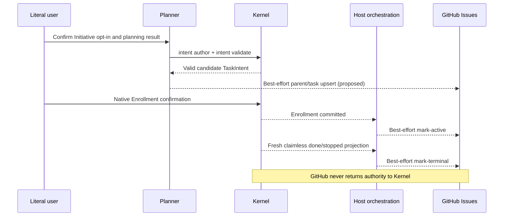

# GitHub Issue Multi-Plan Tracking

**Status**: Candidate
**Task**: `2026-08-22-001-github-issue-multi-plan-tracking`
**Output Language**: English prose; preserve CLI commands, paths, schema keys,
contract names, and code identifiers literally.
**Design risk**: High - this introduces opt-in external side effects across
Planner authoring, Enrollment, and terminal Loop observation, with retry,
credential, packaging, and authority-separation requirements.
**Diagram decision**: required
**Diagram reason**: A sequence diagram materially clarifies that GitHub
publication follows validated local facts but never participates in Kernel
authority transitions.

## Problem

Immune-Brain requires large initiatives to split independent execution
boundaries into separate TaskIntents, but v4 has no durable cross-Task tracking
surface. The repository previously rejected Issue tracker integration entirely,
leaving users to reconstruct initiative progress outside the workflow.

The desired replacement is narrower than a project-management subsystem:
GitHub Issues provides opt-in human visibility, while TaskIntent, TaskRecord,
Assurance projection, literal-user Enrollment, QA, Review, and terminal Kernel
transactions retain all execution authority.

## Goal

Provide an initiative-specific, one-way GitHub Issues projection for multi-Plan
work:

1. one parent Issue tracks the initiative and its future Slice checklist;
2. one child Issue represents each authored and validated TaskIntent;
3. Enrollment updates the child from `proposed` to `active`;
4. an authoritative claimless `done` or `stopped` projection closes the child;
5. every GitHub failure remains observable and retryable without changing or
   blocking the Immune-Brain workflow.

## Decisions

1. Integration is disabled by default and enabled only by literal-user opt-in
   for a named Initiative.
2. GitHub Issues is the only v1 tracker surface. GitHub Projects v2, Milestones,
   and bidirectional synchronization are excluded.
3. The Initiative identity is the GitHub repository numeric ID plus a
   user-confirmed immutable slug. A child identity adds the immutable `task_id`.
4. Associations live only in versioned HTML markers in Issue bodies. Issue
   numbers, URLs, titles, labels, and GitHub state never enter TaskIntent,
   TaskRecord, or Kernel authority storage.
5. The parent Issue is created after the first opted-in TaskIntent successfully
   passes canonical `intent author` and `intent validate`. Future Slices remain
   checklist entries until they become validated TaskIntents.
6. The parent Issue is never automatically closed in v1.
7. The adapter is a narrow `gh` transport routed through the single shipped
   `v4_runtime.ts` CLI. It is not a public Skill or a Kernel command.
8. Source Skill loaders, packaged `dist` contracts, host extensions, runtime,
   wrapper, and package manifest must ship one lifecycle contract.

## Technical Design

### 1. Ownership boundaries

- `plugins/immune-brain/runtime/github_issue_tracker.ts` owns marker parsing,
  managed-region reconciliation, result classification, redaction, exact-match
  lookup, and `gh` process transport.
- `plugins/immune-brain/runtime/v4_runtime.ts` exposes the internal
  `imm-tracker` route, and `plugins/immune-brain/bin/imm-tracker` remains a thin
  Bun wrapper into that single shipped runtime.
- Planner contracts may call `upsert-initiative` and `upsert-task` only after
  canonical TaskIntent authoring and validation.
- Enrollment invokes `mark-active` only after the Kernel Enrollment commit has
  succeeded.
- Work/Assurance orchestration invokes `mark-terminal` only after a fresh named
  projection proves claimless `done` or `stopped`.
- Kernel reducers, transactions, projections, schemas, and authority receipts
  never call GitHub and never consume tracker output.



### 2. Marker and managed-region protocol

Markers use a literal version and unambiguous line-oriented values:

```html
<!-- immune-brain-tracker:v1 -->
<!-- immune-brain:repo-id=123456 -->
<!-- immune-brain:initiative-id=assurance-kernel-v5 -->
<!-- immune-brain:task-id=2026-08-22-001-example -->
```

- Parent identity requires exactly one protocol marker, repository ID, and
  Initiative ID.
- Child identity requires the same values plus exactly one `task_id`.
- Initiative slugs are immutable in v1. Renaming requires a new identity or an
  explicit future migration design.
- Unknown marker versions are preserved and rejected as unsupported; they are
  never rewritten as v1.
- Parent checklist content is enclosed by one uniquely delimited managed
  region. Reconciliation replaces only that region and preserves human prose.
- Missing or duplicate delimiters and copied or duplicate identity markers
  produce `ambiguous_remote_state` with zero remote writes.

### 3. Idempotent outbound operations

The adapter supports only:

- `upsert-initiative`;
- `upsert-task`;
- `mark-active`;
- `mark-terminal`.

For each operation:

1. Resolve the repository numeric ID through `gh` and search by exact markers.
2. If one Issue matches, reconcile only the managed fields.
3. If no Issue matches a create-capable operation, create it and search again.
4. If `gh` times out or returns an indeterminate result, search again before
   classifying the operation.
5. If exactly one Issue then matches, return its observed state.
6. If none match, return `retryable_failure`; if multiple match, return
   `ambiguous_remote_state` and perform no further remote mutation.

The result vocabulary is closed:

- `created`;
- `updated`;
- `already_current`;
- `retryable_failure`;
- `permanent_failure`;
- `ambiguous_remote_state`.

An ambiguous association blocks only later GitHub mutations for that
association until a retry observes exactly one match. It never blocks planning,
Enrollment, QA, Review, Kernel settlement, completion, or unrelated tracker
associations.

### 4. Publication allowlist and credential handling

The adapter may publish only:

- Initiative slug and goal;
- future Slice IDs and goal summaries;
- Task `task_id`, goal, risk, TaskIntent path, acceptance IDs, and bounded
  acceptance summaries;
- projected tracker state and terminal reason (`completed` or `not planned`).

It must not publish raw execution evidence, command output, environment values,
credentials, authorization diagnostics, user review feedback, TaskRecord
history, tombstone contents, or arbitrary files. The `gh` child process inherits
authentication without reading or persisting tokens. Arguments are passed as an
array, Issue content uses stdin or a bounded temporary file with guaranteed
cleanup, shell interpolation is forbidden, and stderr is bounded and redacted
before reporting.

### 5. Settlement-Design Contract

**Trigger sources**:

- proposed publication: explicit Initiative opt-in followed by successful
  canonical TaskIntent authoring and validation;
- active publication: successful literal-user-authorized Enrollment commit;
- terminal publication: completion, literal-user stop, or idempotent terminal
  replay that yields a fresh named claimless terminal projection;
- interruption sources: user cancellation, session shutdown, `gh` timeout,
  transport failure, provider failure, malformed output, duplicate markers, or
  process termination.

**State inventory**:

- Kernel states remain `working`, `review`, `done`, and `stopped` with their
  existing transitions unchanged.
- Tracker-only observations are `absent`, `proposed`, `active`, `completed`,
  `not_planned`, `retryable_failure`, `permanent_failure`, and
  `ambiguous_remote_state`.
- Tracker states are not workflow states and cannot select a Kernel action.

**Terminal ownership**:

- Kernel reducer/application and terminal transaction remain the only owners of
  `done` and `stopped` settlement.
- A matching TaskRecord+tombstone and claimless fresh Assurance projection are
  the only facts accepted for terminal publication.
- Literal-user confirmation remains the only Enrollment/stop authority.
- Promise resolution, `gh` exit status, Issue state, Parent text, elapsed time,
  missing process, Review pass, and `completion_ready` are non-authoritative.

**Same-state-machine coverage**:

Review covers `kernel/reducer_v2.ts`, `kernel/application_v2.ts`,
`kernel/completion.ts`, `kernel/storage.ts`, `kernel/backend_claim.ts`,
`kernel/assurance_projection.ts`, Pi enrollment, Pi Assurance progression, and
Work Tool consumption. These Kernel files are audit surfaces, not intended
implementation targets; the tracker must remain post-commit and post-projection.

Immediately before `mark-terminal`, host orchestration rereads the named task
projection and requires exact `task_id`, claimless `done|stopped`, and matching
terminal evidence. The immutable terminal event identity is included in the
managed child region so retries are idempotent. A stale cached projection cannot
authorize a GitHub mutation.

## Failure, Recovery, and Rollback

- Tracker failures are returned and visibly reported separately from workflow
  outcomes. No failure path writes TaskIntent, TaskRecord, tombstone, claim,
  receipt, or `.imm` state.
- Re-entry repeats exact-marker lookup and converges when one association exists.
- Multiple matches require human reconciliation in GitHub; the adapter does not
  guess, delete, or merge Issues.
- Git revert removes future integration behavior without any local data
  migration. Existing Issues remain inert, human-readable external records.
- If remote artifacts must be removed, their owner may close them manually;
  rollback never deletes user-edited Issues automatically.

## Compatibility

- Existing repositories and initiatives remain tracker-disabled.
- Existing TaskIntent and TaskRecord bytes and parser behavior are unchanged.
- Existing public Skill surface remains exactly `imm-brainstorm`, `imm-planner`,
  and `imm-loop`.
- Existing terminal settlement and Enrollment behavior proceeds even when `gh`
  is absent, unauthenticated, unavailable, or malformed.
- No compatibility layer or dual-write authority is introduced.

## Non-Goals

- GitHub Projects v2, Milestones, labels as identity, or parent auto-closure.
- Importing Issue state, comments, assignees, or checklists into Kernel.
- Automatic TaskIntent creation, Enrollment, successor selection, scheduling,
  queues, DAGs, or parallel active Plans.
- TaskIntent/TaskRecord schema fields for Issue IDs or URLs.
- Cross-provider tracker abstraction or support for non-GitHub trackers.
- Initiative slug migration, duplicate auto-deletion, or historical backfill.

## Acceptance Criteria

1. The internal `imm-tracker` adapter implements the versioned marker,
   managed-region, exact-match, post-create lookup, indeterminate-result retry,
   duplicate rejection, bounded result, redaction, and zero-Kernel-write
   contracts through a fake `gh` transport and source/packed wrapper execution.
2. Planner publishes only opted-in validated candidates as proposed; Enrollment
   publishes active only after commit; Loop publishes terminal only after a
   fresh exact claimless `done|stopped` projection; tracker failure cannot alter
   or block any workflow state, and source/package contracts remain aligned.
3. The old blanket rejection of Issue tracker integration is replaced with the
   narrow one-way, non-authoritative exception, without weakening the rejection
   of triage state machines or automatic successor authority.

## Verification Strategy

- `tests/plugin-package-runtime.test.ts` is extended to exercise pure marker and
  managed-region behavior plus fake-transport source/packed CLI scenarios. It
  fails on duplicate creation, destructive human-prose replacement, unredacted
  diagnostics, or accidental Kernel persistence.
- `tests/pi-canary-assurance-progression.test.ts` is extended across Planner,
  Enrollment, Work/Assurance, source/packed contracts, and terminal timing. It
  fails if a proposed Issue precedes validation, active precedes Enrollment
  commit, terminal publication consumes cached/nonterminal evidence, or GitHub
  failure changes workflow outcome.
- `bun scripts/sync-dist-docs.ts --check` proves deterministic packaged contract
  synchronization. Full `bun test` remains the canonical repository regression
  check during execution but is intentionally not an Enrollment rehearsal
  descriptor.

## Devil's Advocate Audit

**Rollback resilience**: The implementation never places GitHub inside Kernel
transactions. A coherent code revert stops future outbound calls with no local
migration; already-created Issues remain inert and are never automatically
deleted. Mid-operation recovery uses exact markers and post-operation lookup.

**Verification vanity**: Tests use a stateful fake `gh` transport and source plus
packed wrappers. They must reproduce accepted-create/lost-response, duplicate
markers, human-edited prose, stale terminal projection, absent credentials, and
redaction failures. String-presence assertions alone cannot satisfy adapter or
lifecycle acceptance.

**Spec dilution detection**: The scope retains parent visibility, future Slice
checklists, proposed/active/terminal child progression, failure observability,
packaged parity, and the explicit Issue-tracker policy change. It does not
silently replace automation with documentation-only guidance or reinterpret
external state as execution authority.
