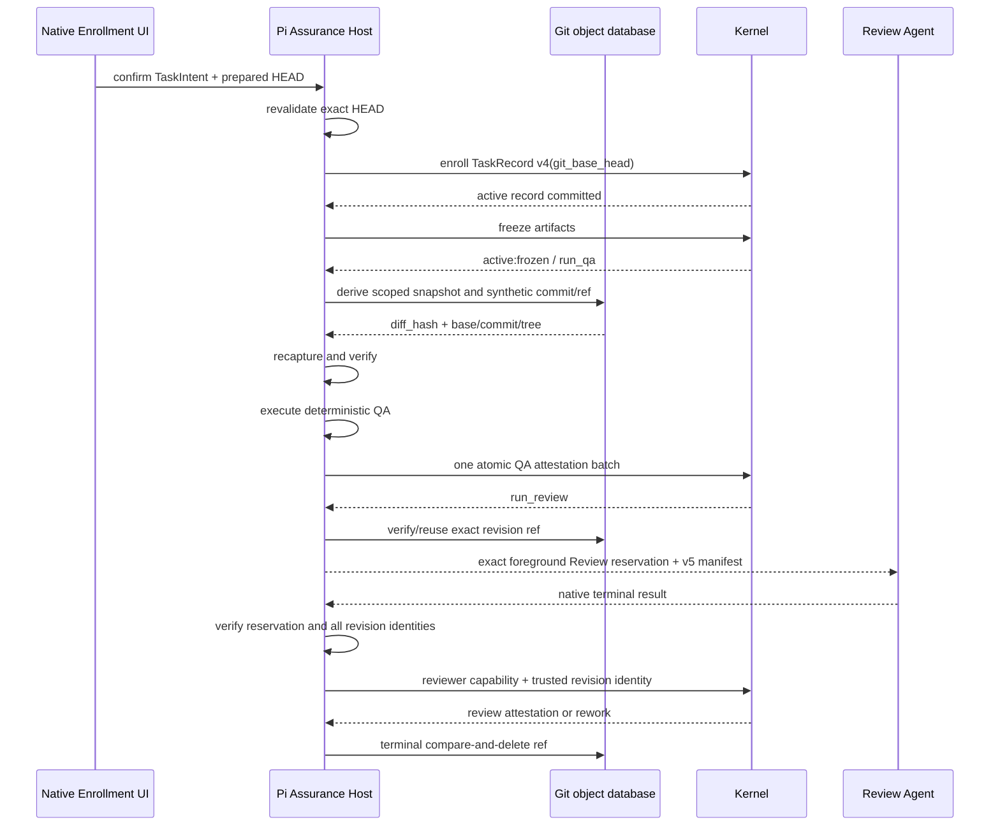

# Spec: Immutable Git Review Revisions

**Task ID**: `2026-08-31-001-immutable-git-review-revisions`
**Owner**: user
**Status**: Candidate
**Design risk**: High
**Design risk rationale**: This change crosses the persisted TaskRecord contract, Enrollment identity, scoped Git freshness, deterministic QA, Review evidence transport, native Agent reservation, reviewer capability binding, terminal cleanup, and internal role routing. A mixed deployment could approve different bytes than QA tested, strand active v3 tasks, or consume Review authority for an unbound revision.

**Diagram decision**: required
**Diagram reason**: Enrollment base capture, scoped revision construction, QA, foreground Review, capability application, and ref cleanup form one ordered provenance and settlement chain.

## Summary

Replace source-embedded Review bundles with immutable, task-scoped Git revisions. New Enrollment writes TaskRecord v4 with an immutable `git_base_head`. The shared freshness provider derives one canonical revision digest from that base and the current index tree restricted by `scope_hint`. Material and critical Assurance publish the same deterministic tree as a synthetic commit under a temporary namespaced ref, then send only a bounded Review v5 metadata manifest to the configured `Review` Agent.

`scope_hint` remains the mutation authority envelope. Exact files, directories, and supported globs remain legal, but unchanged matching files are never enumerated into Review evidence. The reviewer may inspect directly related unchanged context from the synthetic revision with standard Git commands. Source blob size, encoding, and binary content no longer consume the 2 MiB host envelope; that bound applies only to canonical metadata.

## Origin

The Review in Pi session `01a05565-d439-79c4-8ca1-21b6bb839dd9` failed before native Agent reservation because one directory-level `scope_hint` expanded to 268 changed and unchanged neighborhood files totaling about 18.2 MiB. The host then misclassified the read-only preparation failure as `settlement_unknown` after QA had committed, and a manual generic `code-review` dispatch bypassed the configured `Review` Agent without possessing reserved Kernel Review authority.

The upstream Brainstorm closed these product decisions:

- `scope_hint` is a mutation envelope, not a neighborhood selector;
- Review binds `base commit + scoped synthetic review commit`;
- committed and staged task changes since Enrollment are included;
- out-of-scope workspace changes are excluded;
- binary and non-UTF-8 blobs are supported through Git objects;
- Kernel Review and internal `code-review` route to `Review`, while `advisory-reviewer` remains `general-purpose`;
- Review preparation occurs after freeze and before QA authority commit;
- TaskRecord v4 stores `git_base_head`, Review manifest v5 contains metadata only, and Review attestations persist revision identity;
- v3 drains through a bounded one-release compatibility path; remote transport remains deferred.

## Research And Reference Closure

### Runtime trace

- `runtime/kernel/pi_canary_prepare.ts` and `.pi-extension/imm-canary-enroll.ts` own Enrollment preparation, confirmation binding, and pre-commit revalidation.
- `runtime/kernel/enrollment.ts`, `types.ts`, `validation.ts`, `storage.ts`, `reducer.ts`, `assurance_projection.ts`, and `completion.ts` own the persisted TaskRecord state machine. TaskRecord v3 parsing currently rejects unknown fields.
- `runtime/workspace_scope.ts` owns canonical index-backed task snapshots and all scope matching rules.
- `runtime/kernel/application.ts` and `canary_application.ts` recompute freshness at authority mutation boundaries.
- `.pi-extension/pi-canary-assurance-progression.ts` owns freeze, deterministic QA, Review preparation, reservation, native result observation, and settlement reporting.
- `.pi-extension/pi-canary-review-bundle.ts` currently serializes dirty and unchanged neighborhood source bytes into `assurance_kernel/review_bundle/v4` with one 2 MiB aggregate ceiling.
- `.pi-extension/imm-canary-work.ts` and `runtime-stub.ts` connect host Git evidence, Kernel ports, tool lifecycle, and shutdown cleanup.
- `runtime/loop_contract.ts` currently emits `general-purpose` for every internal role dispatch.
- `runtime/prompts/code-review.md` and its packaged mirror define the Reviewer's evidence access contract.

### Highest focused behavioral seams

- `tests/kernel-enrollment-transaction.test.ts` and `tests/kernel-record-v3.test.ts` exercise persisted Enrollment and record parsing.
- `tests/kernel-canary-application.test.ts`, `tests/kernel-assurance-projection.test.ts`, and `tests/kernel-canary-terminal-transaction.test.ts` exercise capability binding, obligation projection, terminal settlement, and audit bytes.
- `tests/managed-task-snapshot-isolation.test.ts` exercises real Git scope and index behavior.
- `tests/pi-canary-review-bundle.test.ts`, `tests/pi-canary-review-neighborhood.test.ts`, and `tests/pi-canary-review-outcome-evidence.test.ts` own Review evidence provenance and the obsolete source-byte bounds.
- `tests/pi-canary-assurance-progression.test.ts` and `tests/pi-canary-work-extension.test.ts` exercise foreground QA/Review sequencing, cancellation, restart, and reservation ownership.
- `tests/loop-execution-routing.test.ts` and `tests/role-prompt-bridge.test.ts` exercise internal role dispatch and packaged prompt parity.

### Prior art and rejected decisions

- ADR 0002 requires explicit artifact ownership and generated/package mirror closure.
- ADR 0003 requires bounded, deterministic reducer evidence rather than unbounded logs or prose.
- `docs/solutions/rejected-out-of-band-review-authority-reconstruction.md` rejects reconstructing authority from mutable workspace or conversation state.
- `managed-task-snapshot-isolation.spec.md` established Git index ownership and out-of-scope dirty-file isolation, but its `HEAD -> index` model does not retain committed task deltas.
- `standard-agent-review-dispatch.spec.md` established exact foreground `Agent` reservation matching and distinguished native Review authority from generic advisory dispatch.
- `archive/review-bundle-frozen-revision-repair.spec.md` intentionally retained v4 and the 2 MiB full-source bundle. The production failure and clarified `scope_hint` semantics invalidate that transport choice, not its immutable-evidence goal.

## Design Views

Selected views: architecture layers, component interfaces, data flow, state transitions, and temporal sequence. Every view is material because the change introduces a new persisted record version, changes freshness and Review transport across host/Kernel boundaries, and has interruption behavior before and after QA authority commit. No technical-design view is omitted.

## Architecture And Interfaces

### 1. TaskRecord v4

Add `assurance_kernel/task_record/v4`. New Enrollment writes v4 only. v4 retains the v3 lifecycle, artifact, obligation, finding, and attestation model and adds:

```text
git_base_head: Git commit OID captured at Enrollment
```

The value is a lowercase 40- or 64-hex commit OID that must resolve to a commit in the current repository. Enrollment preparation includes it in the confirmation-bound preparation digest. Immediately before authority commit, the host recaptures `HEAD` and rejects if it differs. Retries after a committed Enrollment reread the persisted value and never recalculate it.

Review attestations in v4 additionally require one structured revision identity:

```text
review_revision: {
  contract: "assurance_kernel/review_revision_identity/v1"
  base_head: Git OID
  review_commit: Git OID
  review_tree: Git OID
  manifest_digest: sha256 digest
}
```

QA and user attestations do not carry `review_revision`. Strict version-dispatched parsing remains fail closed: v3 accepts exactly v3 fields, v4 requires `git_base_head`, and malformed cross-version or unknown fields reject.

TaskRecord remains the sole durable workflow authority. Synthetic refs, manifests, and native Agent reservations are evidence transport, not lifecycle state.

### 2. Version-aware freshness provider

Replace the Managed freshness provider interface with a record-aware provider:

```text
diffProvider(repositoryRoot, intentSnapshot, taskRecord)
```

For active v3 records it calls the existing `taskDiffHash` unchanged. For v4 it computes `task_revision_snapshot/v1` from:

- canonical repository root identity;
- persisted `git_base_head` and its tree;
- normalized `scope_hint`;
- the current index tree;
- sorted in-scope paths whose base and current entries differ;
- each changed path's status, mode, and base/current Git object identity.

The current index tree incorporates committed `HEAD` content plus staged changes. In-scope unstaged or untracked drift, unsupported index state, object mismatch, path ambiguity, or concurrent mutation fails closed under the existing snapshot rules. Rename detection remains disabled and is represented as delete plus add. Regular blobs, executable mode, symlinks, deletions, and binary/non-UTF-8 blob identities are supported without decoding source bytes. Unsupported gitlinks/submodules remain fail closed.

The provider first requires `git_base_head` to be an ancestor of current `HEAD` and requires all referenced objects to exist. Rebase/reset, missing objects, repository replacement, or ancestry failure blocks Assurance; the runtime never substitutes merge-base or current HEAD.

Only in-scope changed paths enter the snapshot. Current out-of-scope committed, staged, unstaged, and untracked state is not read into the task identity or synthetic tree. This preserves the established explicit ownership contract: the runtime does not claim to infer authorship outside the TaskIntent envelope.

The resulting domain-separated canonical digest remains shaped as `sha256:<64 lowercase hex>` and is the single `diff_hash` used by evidence, QA, Review, authorization, and completion.

### 3. Deterministic scoped synthetic revision

For material and critical Assurance, after artifacts freeze and before deterministic QA runs, build the Review revision from the same v4 snapshot:

1. Create a temporary index initialized from `git_base_head^{tree}`.
2. Overlay only the current in-scope changed entries from the captured current index; force-remove scoped deletions.
3. Write `review_tree` and prove it equals the expected base tree plus exactly the captured scoped delta.
4. Create `review_commit` with parent `git_base_head`, fixed author/committer identity, fixed timestamp, deterministic message derived from task ID, tree, and `diff_hash`, and no signing or repository user-config dependency.
5. Publish `refs/immune-brain/reviews/<task-id>/<review-commit>` with atomic compare-and-set.

Identical input produces the same tree, commit, ref, and manifest. An existing exact ref is idempotently reused. A ref collision or mismatched target fails loudly and is never overwritten. Temporary index files are removed on every path; unreachable objects created before ref publication are left to Git garbage collection.

The host then recaptures the v4 snapshot and verifies the same `diff_hash`, tree, commit, and ref before QA begins. Any drift produces no QA attestation and no Review reservation.

### 4. Review manifest v5

Replace source-embedded `assurance_kernel/review_bundle/v4` for v4 tasks with `assurance_kernel/review_manifest/v5` containing only canonical metadata:

- task and Intent identity;
- normalized mutation scope;
- `base_head`, `review_commit`, and `review_tree`;
- sorted changed paths with status, modes, and base/current OIDs;
- shared `diff_hash`;
- deterministic QA outcomes;
- provenance metadata needed by the existing native reservation;
- `manifest_digest`, computed with the digest field omitted.

The existing 2 MiB ceiling applies to the final canonical metadata JSON only. Source blob size and encoding do not count toward it. The v5 schema has no `current_content`, `base_content`, `dirty_files`, or `neighborhood_files` compatibility fields and never truncates source.

The evidence file remains canonical, read-only, outside the repository, and available to the isolated foreground Reviewer. The reviewer runs at the repository's committed checkout but uses `git diff <base_head> <review_commit>`, `git show <review_commit>:<path>`, and other read-only Git operations against the shared object database. It may inspect unchanged paths only when directly relevant to acceptance, changed callers, or the same state machine, and must cite the path and reason. It receives no mutation authority and no remote transport fallback.

Active v3 tasks retain the exact v4 full-source bundle path during the bounded drain period. New v4 tasks never emit that format.

### 5. Review authority binding

The exact reserved native `Agent` parameters remain the authority boundary. Kernel Assurance uses `subagent_type: "Review"`, preserving the user's custom `Review.md` model/provider selection. `buildLoopRoleDispatch` also maps internal `code-review` to `Review`; `advisory-reviewer` and all unrelated roles remain `general-purpose`.

A valid v4 Review result must match the reservation's task identity, record revision, `diff_hash`, `base_head`, `review_commit`, `review_tree`, and `manifest_digest`. The reviewer payload remains inert; the host supplies the trusted revision identity to the reviewer-capability action. Reducer validation writes that identity only on a review attestation. Generic `imm_loop_action` advisory dispatch can neither match the reserved invocation nor submit a Review receipt.

### 6. Recovery and cleanup

No durable `review_preparing` state or persisted Agent reservation is added. Before QA and on a later `run_review` retry, the host deterministically reconstructs the expected revision from TaskRecord v4 and frozen Git state:

- matching existing ref: reuse it;
- absent ref: publish it;
- mismatched ref or snapshot: block with zero authority writes;
- process restart after QA: reconstruct the same evidence and create a fresh session-local reservation bound to the same revision.

Review refs survive rework and session restart until task terminal settlement. Host startup and terminal paths reconcile `refs/immune-brain/reviews/*`: a ref is live only when its task has a nonterminal TaskRecord with matching ownership. Cleanup is idempotent, never removes a live task's ref, and uses compare-and-delete against the expected target. Cleanup failure does not roll back a committed terminal TaskRecord; it reports a bounded warning and is retried by orphan reconciliation.

Terminal audit keeps the structured Review attestation identities but no source copy and no permanent ref.

## Temporal Sequence



## State Transitions

TaskRecord lifecycle and artifact transitions remain v3-compatible:

```text
Enrollment:              none -> active:active (v4 + git_base_head)
Freeze:                  active:active -> active:frozen
Pre-QA preparation fail: active:frozen -> active:frozen; zero attestation
QA pass:                 active:frozen/run_qa -> active:frozen/run_review
Review prepare fail:     active:frozen/run_review -> unchanged; retryable host result
Review pass:             active:frozen/run_review -> review attestation -> next obligation/done
Review rework:           active:frozen/run_review -> active:active/working
Terminal:                active:* -> done|stopped transaction, then best-effort ref cleanup
```

`review_preparation_failed` is a host result, not a new Kernel phase. `settlement_unknown` is reserved for an authority operation whose durable commit outcome cannot be established by rereading Kernel state.

## Settlement-Design Contract

### Trigger sources

- Enrollment preparation or confirmation observes `HEAD`.
- Freeze makes task artifacts immutable for Assurance.
- Review revision construction, ref publication, or manifest verification succeeds or fails.
- Deterministic QA settles with pass or rework.
- Native foreground Agent reservation, result observation, cancellation, timeout, or shutdown occurs.
- Review capability application records pass or rework.
- User authorization settles a critical task.
- Terminal transaction or startup reconciliation requests ref cleanup.

### State inventory

- Durable authority states remain TaskRecord v4 `active|done|stopped`, `artifact_state active|frozen`, obligations, findings, and attestations.
- `git_base_head` is immutable from Enrollment through terminal settlement.
- Synthetic objects, refs, manifests, and Agent reservations are non-authoritative transport/cache state.
- v3 records retain their existing shape and progression during the drain window; no v3 record is rewritten to v4.
- No partial TaskRecord, partial Review attestation, `review_preparing`, or compatibility alias state is legal.

### Terminal ownership

- Native Enrollment confirmation is the sole authority source for creating TaskRecord v4 and binding `git_base_head`.
- The locked Kernel application and reducer are the sole TaskRecord mutation owners.
- Deterministic QA owns descriptor execution and one atomic QA attestation batch.
- The exact host-observed foreground `Review` reservation plus reviewer capability owns Review settlement.
- Critical completion remains literal-user authorized.
- Git command success, ref existence, evidence files, Agent prose, advisory dispatch, chat state, and cleanup completion are never workflow authority.

### Same-state-machine coverage

- `plugins/immune-brain/runtime/kernel/types.ts`
- `plugins/immune-brain/runtime/kernel/validation.ts`
- `plugins/immune-brain/runtime/kernel/enrollment.ts`
- `plugins/immune-brain/runtime/kernel/storage.ts`
- `plugins/immune-brain/runtime/kernel/reducer.ts`
- `plugins/immune-brain/runtime/kernel/assurance_projection.ts`
- `plugins/immune-brain/runtime/kernel/completion.ts`
- `plugins/immune-brain/runtime/kernel/application.ts`
- `plugins/immune-brain/runtime/kernel/canary_application.ts`
- `plugins/immune-brain/runtime/kernel/authority_port.ts`
- `plugins/immune-brain/runtime/kernel/pi_canary_prepare.ts`
- `plugins/immune-brain/runtime/workspace_scope.ts`
- `plugins/immune-brain/.pi-extension/imm-canary-enroll.ts`
- `plugins/immune-brain/.pi-extension/imm-canary-work.ts`
- `plugins/immune-brain/.pi-extension/runtime-stub.ts`
- `plugins/immune-brain/.pi-extension/pi-canary-assurance-progression.ts`
- `plugins/immune-brain/.pi-extension/pi-canary-review-bundle.ts`

## Failure, Interruption, And Recovery

- Invalid, missing, non-commit, or changed Enrollment HEAD rejects before TaskRecord creation.
- Missing base object, non-ancestor base, shallow/object failure, repository replacement, unsupported index entry, in-scope worktree drift, scope ambiguity, concurrent mutation, commit/tree mismatch, ref collision, or metadata overflow returns `blocked` before QA and records no attestation.
- QA cancellation before authority commit records nothing. A proven QA commit is reconciled from TaskRecord even if host cancellation follows.
- Review construction or reservation failure after QA returns `review_preparation_failed`, leaves the Kernel projection at `run_review`, releases only session-local reservation state, and permits deterministic retry.
- Only an indeterminate Kernel authority commit reports `settlement_unknown`; evidence preparation never sets that state.
- A stale, mismatched, malformed, duplicate, generic, late, cancelled, or wrong-model Agent result cannot mint or apply reviewer authority.
- Restart before QA reconstructs or verifies the ref before executing descriptors. Restart after QA reconstructs the same manifest and creates a fresh exact reservation.
- Rework restores active artifacts and invalidates prior freshness through changed state while retaining the old ref only as a cache until the next capture replaces or adds the deterministic new ref.
- Terminal cleanup is idempotent and non-authoritative. A crash before cleanup leaves an orphan ref that startup reconciliation removes only after proving no live owner.

## Compatibility, Migration, Rollback, And Exit Plan

### v3 drain compatibility

- New Enrollment writes v4 immediately after rollout.
- Existing active v3 records remain strictly readable and continue through the current v3 freshness and Review bundle v4 path.
- No automatic base inference, record rewrite, dual write, or `adopt_review_base` authority is introduced.
- A v3 task blocked by its legacy bundle may finish on the legacy path, stop, or be explicitly re-enrolled as a new v4 task.
- Historical terminal v3 audit remains immutable.

**Owner**: Kernel runtime maintainers.

**Expiry condition**: one released version has made v4 the only Enrollment output and no supported workspace contains a nonterminal v3 TaskRecord.

**Cleanup milestone**: the next release after that condition is observed removes v3 active parsing/progression, Review bundle v4 source and contract text, and its compatibility tests in a dedicated retirement TaskIntent. This Task does not claim that future deletion as completed work.

### Rollback

The implementation is one release unit: TaskRecord v4 creation/dual read, record-aware freshness, synthetic Review transport, attestation binding, host progression, role routing, docs, and tests. Before any v4 Enrollment, reverting the unit restores v3 behavior. After a v4 task exists, rollback must keep the v4 reader and fail-closed projection until that task becomes terminal; reverting only the host or only the Kernel is prohibited.

No migration script moves files or rewrites settled audit. Remote Review transport, if later required, must be a separate `git bundle` or CAS design bound to the same revision identities.

## Invariants

- One record-aware `diff_hash` binds evidence, QA, Review, authorization, and completion.
- `scope_hint` authorizes possible mutation; only actual scoped deltas enter revision identity.
- Review source bytes are immutable Git objects, never JSON payload fields.
- QA executes only after the exact synthetic revision is reproducible and verified.
- Review authority binds base, commit, tree, manifest, diff, TaskIntent, and TaskRecord identities.
- Generic advisory Review cannot satisfy an exact Kernel reservation.
- TaskRecord is the only durable workflow state; refs and reservations are reconstructible transport.
- v3 compatibility is read/progress-only, never a new-write or dual-write path.
- No truncation, silent neighborhood omission, merge-base substitution, or generic-model fallback exists.

## Scope

Planning artifacts:

- `docs/specs/immutable-git-review-revisions.spec.md`
- `docs/specs/archive/immutable-git-review-revisions.spec.md`
- `docs/plans/2026-08-31-001-immutable-git-review-revisions.intent.json`
- `docs/plans/archive/2026-08-31-001-immutable-git-review-revisions.intent.json`

Production owners:

- `plugins/immune-brain/runtime/workspace_scope.ts`
- `plugins/immune-brain/runtime/kernel/types.ts`
- `plugins/immune-brain/runtime/kernel/validation.ts`
- `plugins/immune-brain/runtime/kernel/enrollment.ts`
- `plugins/immune-brain/runtime/kernel/storage.ts`
- `plugins/immune-brain/runtime/kernel/reducer.ts`
- `plugins/immune-brain/runtime/kernel/assurance_projection.ts`
- `plugins/immune-brain/runtime/kernel/completion.ts`
- `plugins/immune-brain/runtime/kernel/application.ts`
- `plugins/immune-brain/runtime/kernel/canary_application.ts`
- `plugins/immune-brain/runtime/kernel/authority_port.ts`
- `plugins/immune-brain/runtime/kernel/pi_canary_prepare.ts`
- `plugins/immune-brain/runtime/loop_contract.ts`
- `plugins/immune-brain/runtime/prompts/code-review.md`
- `plugins/immune-brain/dist/role-prompts/code-review.md`
- `plugins/immune-brain/.pi-extension/imm-canary-enroll.ts`
- `plugins/immune-brain/.pi-extension/imm-canary-work.ts`
- `plugins/immune-brain/.pi-extension/runtime-stub.ts`
- `plugins/immune-brain/.pi-extension/pi-canary-assurance-progression.ts`
- `plugins/immune-brain/.pi-extension/pi-canary-review-bundle.ts`
- `docs/reference/subagent-dispatch-protocol.md`
- `plugins/immune-brain/dist/docs/reference/subagent-dispatch-protocol.md`

Focused tests:

- `tests/kernel-record-v3.test.ts`
- `tests/kernel-record-v4.test.ts`
- `tests/kernel-enrollment-transaction.test.ts`
- `tests/kernel-assurance-projection.test.ts`
- `tests/kernel-canary-application.test.ts`
- `tests/kernel-canary-terminal-transaction.test.ts`
- `tests/managed-task-snapshot-isolation.test.ts`
- `tests/pi-canary-enroll-extension.test.ts`
- `tests/pi-canary-review-bundle.test.ts`
- `tests/pi-canary-review-neighborhood.test.ts`
- `tests/pi-canary-review-outcome-evidence.test.ts`
- `tests/pi-canary-assurance-progression.test.ts`
- `tests/pi-canary-work-extension.test.ts`
- `tests/loop-execution-routing.test.ts`
- `tests/role-prompt-bridge.test.ts`

## Out Of Scope

- Remote or non-shared Git object transport, `git bundle`, or CAS upload;
- permanent Review refs or source copies in `.imm/audit`;
- binary semantic analyzers, model context-window changes, or source truncation;
- hardcoding a provider/model or changing the user's global `Review.md`;
- automatic v3 base inference, v3-to-v4 record rewrite, or adoption authority;
- changing TaskIntent scope syntax, Review round limits, deterministic QA semantics, critical final authorization, or GitHub tracker projection;
- inferring authorship for out-of-scope workspace changes;
- creating, switching, or deleting Git worktrees.

## Acceptance

1. New Enrollment atomically writes strict TaskRecord v4 with the confirmation-bound `git_base_head`; v3 remains exact and progressable only as the bounded drain format, malformed cross-version records fail closed, and terminal Review attestations persist exact base/commit/tree/manifest identity without adding those fields to QA or user attestations.
2. One canonical v4 scoped revision digest covers committed and staged add/modify/delete/mode/symlink changes since Enrollment, ignores current out-of-scope workspace changes, rejects in-scope drift and rewritten/missing base history, and constructs a deterministic synthetic commit/ref whose binary, non-UTF-8, single-file, or aggregate source size never counts against the 2 MiB metadata limit.
3. Material/critical Assurance proves the revision before QA, records no QA attestation on preparation failure, returns retryable `review_preparation_failed` while preserving `run_review` after post-QA preparation/reservation failure, reconstructs the same revision across restart/rework, accepts only the exact native receipt and rejects unknown approval fields, revalidates base/commit/tree/manifest digest on Review submission, and idempotently removes terminal/orphan refs with non-throwing cleanup that is never workflow authority.
4. Kernel Review and internal `code-review` dispatch use `subagent_type: "Review"` and the v5 Git-read prompt, while `advisory-reviewer` remains `general-purpose`; a generic or parameter-mismatched Agent cannot satisfy the reservation, v5 contains no source/neighborhood fields, and source/package documentation mirrors stay byte-equal.

## Verification Approach

- Acceptance 1: `bun test tests/kernel-record-v4.test.ts tests/kernel-enrollment-transaction.test.ts`
- Acceptance 2: `bun test tests/pi-canary-review-bundle.test.ts tests/managed-task-snapshot-isolation.test.ts`
- Acceptance 3: `bun test tests/pi-canary-assurance-progression.test.ts tests/pi-canary-work-extension.test.ts`
- Acceptance 4: `bun test tests/loop-execution-routing.test.ts tests/role-prompt-bridge.test.ts`

Post-implementation focused supporting checks:

- `bun test tests/kernel-canary-application.test.ts tests/kernel-canary-terminal-transaction.test.ts`
- `bun test tests/pi-canary-review-neighborhood.test.ts tests/pi-canary-review-outcome-evidence.test.ts`
- `bun scripts/sync-dist-docs.ts --check`
- `git diff --check`

Each TaskIntent descriptor uses an existing behavioral seam or one new schema-focused file and explicit file arguments. No descriptor runs the full suite, build, network, installation, or a source-only vanity assertion.

## Devil's Advocate Audit

**Authority reconstruction**: A Git ref or commit SHA alone is not reviewer authority. The exact host reservation, frozen TaskRecord identities, trusted manifest, reviewer capability, and Kernel CAS remain mandatory. Generic `code-review` output stays inert.

**Digest split**: Changing only Review transport would leave QA and completion bound to `HEAD -> index` while Review sees `base -> synthetic commit`. The record-aware provider is therefore part of the same slice and one `diff_hash` must cover the whole authority chain.

**Committed-change omission**: Reading only staged files would lose implementation already committed after Enrollment. The current index tree plus persisted base captures committed and staged final state without reading mutable worktree bytes.

**Scope expansion regression**: Enumerating every tracked path matched by a directory recreates the 18.2 MiB failure and conflates mutation authority with context selection. The synthetic tree overlays only actual scoped deltas; unchanged context is available from the immutable base-backed commit on demand.

**Recovery overdesign**: Persisting Agent reservation or a new `review_preparing` phase would create a second workflow state. Deterministic reconstruction from TaskRecord plus Git objects is sufficient; only the final Review attestation becomes durable authority.

**Migration trap**: Making `git_base_head` optional on v3 or silently upgrading v3 would weaken strict parsing and invent an unconfirmed base. Version-dispatched read/progress compatibility has a one-release owner and exit milestone; new writes are v4 only.

**Verification vanity**: Constant checks and JSON shape assertions alone are insufficient. Focused tests must use real repositories and cover committed plus staged content, >2 MiB and binary blobs, ref retry/collision/cleanup, base ancestry failure, cancellation around QA commit, exact Agent parameter matching, and byte-stable terminal audit identities.

**Rollback risk**: Kernel and host cannot be rolled back independently after a v4 Enrollment. The release unit and v4-reader rollback floor are explicit; mixed-contract deployment must fail tests before release.
