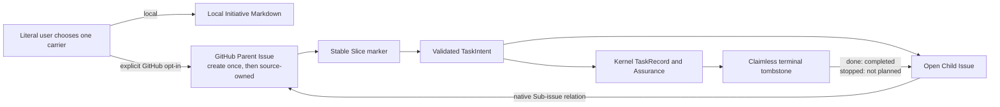

# Spec: Exclusive Initiative Carrier And Minimal GitHub Task Projection

**Task ID**: `2026-08-24-001-simplify-initiative-tracking`
**Owner**: user
**Status**: Proposed
**Design risk**: High
**Output language**: English

This change replaces the existing command-driven GitHub lifecycle projection
with one exclusive Initiative carrier and the smallest useful Task visibility.
Kernel TaskIntent, TaskRecord, Assurance, and terminal settlement remain the
only execution authority.

**Diagram decision**: required
**Diagram reason**: Carrier ownership, the create-and-attach remote sequence,
and terminal projection have different failure and retry boundaries.

**Brainstorm manifest**: None. The user confirmed the complete framing and
Planner decision frontiers in the current conversation.

## Problem

The current tracker makes GitHub a partial mirror of planning and execution:
`upsert-initiative` rewrites a managed parent region, Task Issues move through
custom `proposed`, `active`, `completed`, and `not_planned` states, and
Enrollment performs a post-commit `mark-active` call. This adds synchronization
without adding authority. In particular, an active projection failure has no
symmetric public retry path after Enrollment owns the active claim.

A local Initiative manifest plus a GitHub mirror would add another copy and a
reconciler. A machine state model for Slice progress would duplicate Kernel
state. GitHub also does not document atomic conditional writes for the Issue
update endpoint, so an automated read-merge-write of the parent body cannot
satisfy the required no-lost-update guarantee.

## Result

Each Initiative has exactly one planning carrier:

- Local mode uses `docs/initiatives/<immutable-slug>.md` and performs no GitHub
  operation.
- GitHub mode uses one create-once Parent Issue as the only Initiative source
  and native Sub-issues for finalized Tasks. It requires literal-user opt-in for
  the immutable slug.

A validated TaskIntent creates one open Child Issue associated with one stable
Slice ID and attaches it to the Parent. Enrollment performs no GitHub mutation.
Only a fresh exact claimless `done` or `stopped` projection may close the Child.
The Parent is never automatically rewritten or closed.

## Supersession Boundary

This Spec supersedes the active runtime and contract decisions introduced by
`docs/specs/archive/github-issue-multi-plan-tracking.spec.md` that require:

- parent managed-region updates after creation;
- custom `proposed -> active -> completed|not_planned` Task states;
- Enrollment-time `mark-active`; and
- a local TaskIntent path in Child Issue content.

The archived Spec and settled TaskRecord remain immutable historical evidence.
The current source, public command surface, packaged contracts, architecture
map, and tests must no longer require the retired behavior. Absence assertions
may guard source that has actually been deleted; they may not substitute for
leaving a dormant `mark-active` implementation in the tree.

The following boundaries remain authoritative:

- GitHub is optional, outbound-only observation and never Kernel evidence;
- repository numeric ID plus immutable Initiative slug identifies a Parent;
- repository numeric ID plus immutable Task ID identifies a Child;
- Issue numbers and URLs never enter TaskIntent, TaskRecord, or `.imm` state;
- exact marker lookup and post-mutation observation provide idempotent retry;
- tracker failure never blocks or rolls back planning, Enrollment, execution,
  QA, Review, authorization, or terminal settlement; and
- duplicate marker matches fail as `ambiguous_remote_state` without guessing.

## Architecture



There is no carrier synchronization arrow. Local mode never reads or writes
GitHub. GitHub mode never creates a local Initiative artifact.

## Carrier Contract

### Local mode

The only artifact is:

```text
docs/initiatives/<immutable-slug>.md
```

It uses this minimal human-owned shape:

```markdown
# <Initiative goal>

## <stable-slice-id>: <Slice result>

Exit criteria: <observable result>

Tasks:
- <immutable-task-id>
```

The Markdown has no schema version, parser, content hash, state field, DAG,
promotion command, scheduler, or generated GitHub metadata. A Slice carries
only a stable ID, result, exit criteria, and Task IDs. TaskIntent retains all
machine-verifiable acceptance, scope, risk, and execution authority.

Planner contracts permit this artifact only after explicit Local selection.
They must not invoke `imm-tracker` for Local creation or maintenance.

### GitHub mode

GitHub mode is enabled per Initiative only after the literal user confirms the
immutable slug. There is no project-level backend configuration and no inferred
default.

`imm-tracker create-initiative --stdin --json` replaces
`upsert-initiative`. It accepts the complete initial goal and known stable Slice
ID/result summaries, and it:

1. fails before network mutation when `docs/initiatives/<slug>.md` exists;
2. resolves the repository numeric ID;
3. creates one Parent with the stable Initiative marker and stable Slice markers
   when no exact Parent exists;
4. returns `already_current` if the exact existing Parent body already equals
   the requested initial body; and
5. otherwise returns a non-mutating failure that tells the user to edit the
   existing Parent directly in GitHub.

The tracker never rewrites an existing Parent body. Later goal, Slice, exit
criteria, ordering, and Task-list changes are direct edits to the GitHub source.
This avoids a non-atomic read-merge-write window rather than pretending a body
digest precheck is compare-and-swap.

Local mode cannot continuously observe out-of-band remote duplicates while
offline. Exclusivity is therefore enforced whenever a GitHub operation is
attempted: every `create-initiative` and `upsert-task` fails if the Local artifact
for that slug exists. An externally created duplicate remains inert until such
an operation observes the conflict; it never changes Local authority.

## Parent And Slice Markers

The Parent keeps one versioned Initiative marker and one stable hidden marker
per Slice. Marker values use the existing strict identifier grammar and are
never derived from mutable titles or Issue numbers. Human prose is source-owned,
not a tracker-managed region after creation.

A Task upsert requires `--slice-id <id>`. It must find exactly one Parent for the
Initiative and exactly one matching Slice marker in that Parent. A missing or
duplicate Slice marker fails without creating or attaching a Child. The tracker
never guesses from headings or list position.

Task-to-Slice ownership is immutable. An existing exact Task marker associated
with another Initiative or Slice returns `ambiguous_remote_state`; moving work
requires closing the old Task and authoring a new TaskIntent.

## Child Issue And Native Sub-Issue Contract

After canonical `imm-kernel intent author` and `intent validate` report
`valid: true` and `enrollment_ready: true`, Planner calls:

```text
imm-tracker upsert-task --initiative-id <slug> --slice-id <id> --intent <path> --json
```

The tracker rereads and strictly validates the TaskIntent, creates or confirms
one open Child, then creates or confirms the native Sub-issue relation. Child
content contains only:

- immutable Initiative slug;
- immutable Slice ID;
- immutable Task ID;
- Task goal and risk;
- acceptance assertions; and
- versioned identity markers.

It does not contain the TaskIntent path because artifact freeze relocates that
file. It has no custom `proposed` or `active` tracker state. Open means only
"still needs attention".

Child creation and native attachment are two remote effects with one idempotent
operation:

- a lost create response is recovered by exact Task-marker lookup;
- an existing unattached Child is attached on retry;
- an already attached Child returns `already_current`;
- a Child attached to another Parent fails without moving it;
- duplicate Parent, Child, or Slice markers fail without mutation; and
- a GitHub native Sub-issue capacity error fails loudly and requires splitting
  the Initiative rather than introducing a compatibility relationship graph.

Parent close state is user-owned and does not grant or remove Kernel authority.
The tracker never auto-closes the Parent.

## Terminal Projection

The Enrollment extension deletes its GitHub import, `markGithubTaskActive`
call, tracker rendering, and corresponding contract text. Enrollment success is
therefore independent of GitHub and has no post-commit tracker retry gap.

The Work extension retains the existing exact terminal gate:

1. re-read the named Assurance projection;
2. require no projection error and no active claim;
3. require phase `done` or `stopped`;
4. read the exact Task tombstone;
5. require matching task ID, lifecycle status, terminal phase, and terminal
   event ID; and
6. only then invoke terminal projection.

Terminal projection records the immutable terminal event in the Child and
closes it with GitHub's native reason:

- `done` -> `completed`;
- `stopped` -> `not planned`.

A Child manually closed before an exact terminal marker exists is
`ambiguous_remote_state`; the tracker neither reopens nor rewrites it. A Child
that already contains the exact terminal event but was manually reopened is
closed again on retry. Removing the tracker identity marker is the explicit
manual opt-out from later automated projection.

A mismatched terminal event, wrong Slice association, duplicate marker, or wrong
Parent relation is ambiguous and non-mutating. GitHub state never feeds back
into Kernel settlement.

## Failure And Recovery

Every `gh` execution remains bounded and redacted. Authentication, permission,
network, timeout, output-limit, repository identity, validation, capacity, and
API failures are returned through the existing tracker result classes with one
exact retry or repair action.

There is no outbox, retry worker, cache, local GitHub association file, backend
configuration, or full-Initiative reconciler. Recovery is operation-local:

- retry `create-initiative` after an uncertain create response;
- retry `upsert-task` after Child creation or attachment uncertainty; and
- re-enter `imm-loop` to retry terminal observation after GitHub failure.

A process interruption may leave a created Parent, created Child, attached
Child, terminal-marked Child, or closed Child. Exact markers, relation reads,
and terminal event identity distinguish each state on retry. No compensating
Issue deletion or Kernel rollback is attempted.

## Settlement-Design Contract

### Trigger sources

- The literal user selects Local or GitHub carrier for an immutable slug.
- Canonical TaskIntent validation makes a GitHub Task publishable.
- `upsert-task` creates or observes a Child and creates or observes attachment.
- A fresh exact claimless `done` or `stopped` projection supplies terminal
  identity.
- GitHub returns success, conflict, auth failure, timeout, output overflow,
  capacity failure, or an uncertain mutation response.
- A user edits/closes/reopens the Parent or Child, removes a marker, or changes a
  Slice marker.
- The host process aborts between any two GitHub effects.

### State inventory

No new persisted local workflow state is introduced. Observable remote states
are:

- Parent: `missing`, `created_source_owned`, `duplicate`, or `carrier_conflict`;
- Slice: `exact`, `missing`, or `duplicate`;
- Child: `missing`, `open`, `closed_without_terminal`, `terminal_done`,
  `terminal_stopped`, or `terminal_reopened`;
- relation: `unattached`, `attached_to_expected_parent`, or
  `attached_to_other_parent`; and
- Kernel: unchanged TaskIntent, TaskRecord, Assurance, claim, and tombstone
  states.

Only Parent creation, Child creation, relation attachment, terminal marker
publication, and terminal close are automated remote transitions. There is no
remote `proposed -> active` transition.

### Terminal ownership

- Kernel reducers and tombstones exclusively own `done` and `stopped`.
- Literal-user GitHub edits exclusively own Parent planning content after
  creation.
- GitHub owns storage and native open/closed/Sub-issue behavior.
- Tracker output, Issue state, Parent progress, comments, labels, relation
  display, and API acknowledgement are non-authoritative observations.

### Same-state-machine coverage

The executable scope includes the tracker runtime and CLI parser, packed runtime
stub, Enrollment hook that must delete active projection, Work terminal hook,
terminal derivation helper, Planner and Loop source/packed contracts, current
architecture vocabulary, project planning boundary, and focused fake-GitHub and
host-hook tests. Kernel reducer, storage, TaskIntent schema, TaskRecord schema,
and native authority receipts are unchanged dependencies.

### Completion futures and callbacks

No detached future, callback, timer, watcher, or background retry is created.
Each operation settles synchronously after post-mutation observation. A Tool or
CLI result may report remote uncertainty, but it cannot remain an authority
owner after return.

### Retry identity

- Parent retry identity: repository numeric ID plus immutable Initiative slug.
- Child retry identity: repository numeric ID plus immutable Task ID, bound to
  immutable Initiative slug and Slice ID.
- Terminal retry identity: exact terminal event ID plus terminal phase.

Retries re-observe before mutation. Different terminal identities, carrier
associations, or parent relations never overwrite one another.

### Duplicate, race, timeout, and stale-result behavior

- Concurrent duplicate creates converge only when exactly one marker match is
  observed; multiple matches are ambiguous.
- Parent body updates are absent, eliminating the unsupported CAS race.
- A timeout after create/attach/update/close is recovered by exact observation.
- A stale nonterminal projection cannot close a Child.
- A late terminal result with a mismatched event cannot replace an existing
  terminal marker.
- Manual preterminal close is preserved as ambiguity; exact terminal reopen is
  reclosed.
- Host cancellation or process death never rolls back Kernel state or delete a
  remote artifact.

### Restart and external side effects

External side effects are limited to GitHub Parent creation, Child creation,
native Sub-issue attachment, terminal Child body update, and terminal Child
close. They have no compensating deletion. On restart, the caller reruns the
same explicit operation and exact markers plus relation and terminal identity
recover the observable result.

## Compatibility, Migration, And Rollback

No repository migration is required: `dereknex/immune-brain` has no existing
Issue carrying an `immune-brain` marker, and the native Sub-issues API is
available for the repository. Existing third-party projections are not
backfilled or dual-written. A legacy Child that still has the stable Task marker
may converge only when a future exact Task upsert or terminal operation touches
it; no compatibility command remains.

Rollback is one coherent revert of runtime, host hooks, contracts, tests, and
current documentation. Already-created GitHub artifacts remain inert and
human-readable. No local state repair is needed because the change adds no
local persisted state and never puts GitHub inside a Kernel transaction.

## Scope

- `docs/specs/initiative-tracking-carrier-simplification.spec.md`
- `docs/plans/2026-08-24-001-simplify-initiative-tracking.intent.json`
- `CONTEXT.md`
- `IMMUNE.md`
- `plugins/immune-brain/runtime/github_issue_tracker.ts`
- `plugins/immune-brain/runtime/v4_runtime.ts`
- `plugins/immune-brain/.pi-extension/runtime-stub.ts`
- `plugins/immune-brain/.pi-extension/imm-canary-enroll.ts`
- `plugins/immune-brain/.pi-extension/imm-canary-work.ts`
- `plugins/immune-brain/.pi-extension/pi-canary-assurance-progression.ts`
- `plugins/immune-brain/skills/imm-planner/SKILL.md`
- `plugins/immune-brain/dist/imm-planner.md`
- `plugins/immune-brain/skills/imm-loop/SKILL.md`
- `plugins/immune-brain/dist/imm-loop.md`
- `tests/plugin-package-runtime.test.ts`
- `tests/pi-canary-assurance-progression.test.ts`

Reference closure found one relevant architecture decision:
`docs/adr/0002-maintenance-surface-ownership.md` requires the host-discoverable
Skill source and checked-in `dist` instruction surface to remain distinct,
verified consumers. Both Planner and Loop copies are therefore explicit scope,
not generated aliases. No relevant rejected Learning was found. The current
iteration cache concerns a settled unrelated task and is not authority. The
archived original tracker Spec and commit `7fbb645` supply historical prior art;
current behavior is reached through `v4_runtime.ts`, packed `runtime-stub.ts`,
Enrollment and Work extension hooks, and the two focused test seams named above.

## Out Of Scope

- GitHub Projects, Milestones, labels as identity, comments import, or Parent
  auto-close;
- backend configuration, local/remote mirroring, outbox, cache, retry worker, or
  full reconciliation;
- JSON Initiative schema, local Markdown parser, Slice state, percentages, DAG,
  promotion, scheduling, or automatic successor creation;
- automatic Parent body updates after creation;
- native Sub-issue compatibility graph or capacity virtualization;
- importing Issue state into Kernel or changing TaskIntent/TaskRecord schemas;
- Issue-number persistence, TaskIntent path publication, historical backfill, or
  cross-provider tracker abstraction; and
- changing the archived Spec or settled TaskRecord.

## Acceptance

1. Planner and tracker enforce one explicit Initiative carrier: Local mode uses
   minimal Markdown with zero GitHub operations; GitHub mode refuses a matching
   Local artifact, creates but never rewrites one marker-bound Parent, requires
   an exact Slice marker, creates one neutral open marker-bound Child without a
   TaskIntent path, and idempotently confirms native Sub-issue attachment while
   failing duplicate, wrong-parent, missing-Slice, manual-preclose, and capacity
   ambiguity without changing Kernel state.
2. The `mark-active` source, command vocabulary, Enrollment call, custom
   `proposed/active` contract text, and obsolete tests are deleted. Only an exact
   claimless terminal projection plus matching tombstone may publish and close a
   Child as `completed` or `not planned`; remote failure remains observation,
   exact terminal reopen is reclosed, source and packed Planner/Loop contracts
   match, and Parent closure remains user-owned.

## Execution Slices

1. Characterize the replacement contract in the existing fake-GitHub seam:
   create-once Parent, Slice lookup, neutral Child, native parent relation,
   partial-effect retry, carrier conflicts, manual ambiguity, and capacity.
2. Replace the tracker operation model and CLI/runtime-stub surface; delete
   parent update, `mark-active`, custom nonterminal states, and TaskIntent path
   publication.
3. Remove Enrollment projection and align Work terminal behavior, Planner/Loop
   source and packed contracts, `IMMUNE.md`, `CONTEXT.md`, command catalog, and
   retirement absence assertions.
4. Run the two focused acceptance tests, package contract checks, full Bun
   regression, and `git diff --check`; repair only failures caused by this scope.

This is one coherent executable TaskIntent because the command vocabulary,
remote identity model, host lifecycle hooks, and public contracts describe one
tracker state machine. Splitting runtime deletion from contract deletion would
leave an executable or documented compatibility path, which is not a completed
retirement.

## Verification Approach

- `bun test tests/plugin-package-runtime.test.ts` is the highest existing
  observable seam for real tracker operations through fake `gh`, CLI catalog,
  package surface, and source/packed Planner/Loop contracts. It must assert API
  calls and post-state, not only token presence.
- `bun test tests/pi-canary-assurance-progression.test.ts` is the focused host
  lifecycle seam for exact claimless tombstone derivation, Enrollment absence,
  and Work terminal timing.
- `bun scripts/sync-dist-docs.ts --check` verifies generated/package mirrors that
  are actually manifest-owned. Planner and Loop packed contracts are
  independently owned and must be asserted by focused tests.
- `bun test` and `git diff --check` remain final repository regression checks,
  not enrollment rehearsal descriptors.

## Devil's Advocate Audit

**Rollback resilience**: No local schema or authority state changes. Reverting
one bounded runtime/hook/contract/test set stops future effects; remote Issues
remain inert. The weakest rollback fact is external Sub-issue attachment, which
is intentionally not compensated because deleting or moving user-visible Issues
would be more destructive than leaving them readable.

**Verification vanity**: Source-token absence alone is insufficient. The fake
transport must prove Parent is not edited, Child create loss recovers, relation
attachment retries, wrong-parent and missing-Slice cases perform zero mutation,
manual preterminal close remains untouched, and exact terminal reopen is
reclosed. Host tests must prove Enrollment contains no tracker call after the
authority commit while terminal derivation still requires the exact claimless
tombstone.

**Spec dilution detection**: Keeping `upsert-initiative` under a new name,
leaving a dormant `mark-active`, writing `proposed` into a neutral open Child,
using ordinary links instead of native Sub-issues, or storing a local GitHub
association file does not satisfy this Spec. Likewise, a Local path that invokes
GitHub for conflict discovery violates the offline carrier boundary.

**Negative-space audit**: No backend abstraction, JSON manifest, reconciler,
outbox, migration adapter, DAG, Slice status, Parent progress calculation,
auto-close, or Issue-to-Kernel import is needed. The minimum complete design is
one create-only Parent operation, one idempotent Child-plus-relation operation,
and one exact terminal close operation.

**Dependency and API risk**: GitHub native Sub-issues is the only new remote
capability. Repository probing returned HTTP 200 for the endpoint. Focused fake
transport tests pin request shape and failure handling; live network access is
not an acceptance descriptor. API absence or capacity fails loudly and does not
fall back to a second relationship model.

**Planning confidence**: High on local ownership and Kernel isolation; medium on
remote API edge responses until implementation tests pin the exact `gh api`
shape. That uncertainty is contained entirely inside the tracker transport and
cannot broaden authority or scope.
