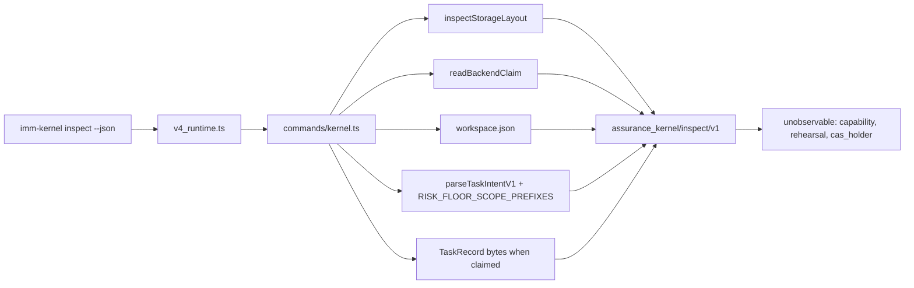

# Spec: Kernel Inspect Read Projection

**Task ID**: `2026-09-01-001-kernel-inspect-read-projection`
**Owner**: user
**Status**: Candidate
**Design risk**: Medium

**Design risk rationale**: This adds a versioned public `imm-kernel` JSON contract over Kernel facts. It does not mutate TaskRecord, claims, Capability, CAS, or Review. It is Medium, not Low, because it is a new CLI contract with compatibility and command-surface owners. It is not High: no new state machine, no persisted schema, no authority write path.

**Diagram decision**: required
**Diagram reason**: Several existing readers feed one inspect payload. A data-flow diagram keeps that composition from being mistaken for a second authority store.

**Output Language**: English prose. Preserve literal schema names, CLI flags, JSON keys, file paths, and canonical terms from `CONTEXT.md`.

## Brainstorm manifest

- `BR-REQ-1` on-demand read-only inspector of GitHub #16 Kernel mechanisms
- `BR-REQ-2` `imm-kernel inspect --json` machine JSON only
- `BR-REQ-3` v1 fields: layout, claim, workspace, Assurance Projection, risk, unobservable
- `BR-REQ-4` idle still emits floor prefixes; never fabricate a task
- `BR-REQ-5` unreadable record/intent fail closed; layout follows `status`; zero writes
- `BR-REQ-6` focused test `tests/kernel-inspect.test.ts`
- `BR-REQ-7` independent GitHub issue; #16 is the visualization subject only
- `BR-DEC-1` CAS display-only; no CAS implementation change
- `BR-DEC-2` do not implement #16; show today's `risk` plus `RISK_FLOOR_SCOPE_PREFIXES`
- `BR-DEC-3` compose existing read APIs in `runtime/commands/kernel.ts`; no new Kernel authority module
- `BR-DEC-4` current workspace claim only
- `BR-DEC-5` do not change `status --json`
- `BR-DEC-6` contract `assurance_kernel/inspect/v1`
- `BR-DEC-7` unobservable fields are labeled, never fabricated; no capability serialization
- `BR-OUT-1` TUI overlay / Task Rail replacement
- `BR-OUT-2` static architecture diagram
- `BR-OUT-3` human pretty-print
- `BR-OUT-4` capability debug hook
- `BR-OUT-5` restore legacy progress / Footer / polling / ETA
- `BR-OUT-6` CAS implementation changes
- `BR-OUT-7` #16 dedup and tier wiring
- `BR-OUT-8` GitHub tracker visualization
- `BR-OUT-9` TaskRecord dump
- `BR-DEFER-1` `--task-id` historical inspect
- `BR-DEFER-2` #16 resolved-tier compatible field expansion

## 1. Problem

Authors auditing Kernel safety machinery (Capability, enrollment rehearsal, risk floor / Review gate, CAS as display) cannot see those facts without reading JSON files. `imm-kernel status --json` reports only layout, claim, and workspace. Task Rail is `State / Result / Next`. Capability state is process-local WeakMap. GitHub #16's task-tier function is not implemented.

The retired `imm-work progress` / `/imm-progress` path, Footer content, polling, watchers, percentages, and ETA stay forbidden.

## 2. Result

`imm-kernel inspect --json` returns one host-neutral `assurance_kernel/inspect/v1` snapshot of the current workspace claim. It is an Inspect Projection: read-only, non-authoritative, and composed from existing Kernel readers.

## 3. Design views

Selected: architecture layers, component interfaces, data flow.

Omitted: state transitions — inspect adds no lifecycle or artifact states. Temporal sequence — one synchronous CLI invocation, no interruption protocol.

### Architecture layers

| Layer | Responsibility | May not |
| --- | --- | --- |
| `bin/imm-kernel` → `v4_runtime.ts` | Whitelist `inspect --json` beside `status`, `audit`, and `intent` | Reconstruct Kernel facts or persist inspect output |
| `commands/kernel.ts` | Compose the inspect payload; keep `runKernelCommand` no-journal for `inspect` | New Kernel module, store lock that creates files, journal append |
| Kernel readers | Remain the authority parsers | Change because inspect exists |
| Tests / README | Pin contract and public command list | Treat inspect as authority |

Dependency direction: CLI → command composer → existing readers. Inspect must not be imported by Kernel reducers, Enrollment, or Capability registries.

### Component interfaces

`imm-kernel inspect --json` is the only new public interface.

- Input: argv `inspect --json` only. Missing `--json` or extra flags is `invalid_command` (exit 2), same pattern as `status`.
- Output: JSON object, contract `assurance_kernel/inspect/v1`.
- Errors: unreadable claimed TaskRecord or TaskIntent fail closed (nonzero, JSON error, no inspect body). Layout that is not `ready` still succeeds like `status` and does not invent assurance.
- Compatibility: `assurance_kernel/status/v1` bytes and fields stay unchanged. No migration.
- Caller: humans and tests via `bin/imm-kernel` / `runKernelCommand`. Callee: existing read APIs. Do not export inspect from `runtime/kernel/index.ts`.

### Data flow

Source is worktree files already used by `status` plus, when a current claim exists, the claimed TaskIntent sidecar and TaskRecord. Transformations are parse, risk-floor comparison, and field copy. Validation is fail-closed parse. Destination is stdout. Failure: nonzero exit, no fabricated task, no write.

Idle (no claim): emit `layout`, empty `kernel.claim` / `kernel.workspace.current_working`, `assurance: null`, `risk.floor_prefixes` from `RISK_FLOOR_SCOPE_PREFIXES`, `risk.declared` / `risk.resolved` null, `matching_scope_entries` `[]`, `floor_applied` false, and the three `unobservable` keys.

Claimed and readable: copy `status`-equivalent layout/claim/workspace; set `assurance` to the existing Assurance Projection field set for that task (`error` must be null or inspect fails closed); set `risk.declared` from the sidecar `risk` field, `risk.resolved` from `parseTaskIntentV1`, `floor_applied` when resolved ranks above declared, `matching_scope_entries` to `scope_hint` entries that would promote a `routine` clone.

Do not acquire a Kernel store lock if doing so would create `.imm/state/**` paths. Do not append the Kernel journal. Creating a lock, journal, workspace, or claim file fails the zero-write invariant.

## 4. Accepted behavior

1. `imm-kernel inspect --json` prints `assurance_kernel/inspect/v1` and exits 0 on a readable layout, including idle workspaces.
2. `imm-kernel status --json` remains `assurance_kernel/status/v1` with the same fields as today.
3. `capability`, `rehearsal`, and `cas_holder` are present and equal the literal `"unobservable"`.
4. A claimed task whose TaskRecord or TaskIntent cannot be read fails closed; inspect does not succeed with a partial projection.
5. Inspect is no-journal and creates no `.imm/state/**` paths.

## 5. Invariants

- Inspect is not authority. TaskRecord, claims, and Assurance Projection remain the sources of truth.
- No Footer, polling, watcher, percentage, ETA, or restored progress projection.
- No Capability serialization and no rehearsal invocation (rehearsal requires a live capability).
- No CAS implementation change.
- No `--task-id` in v1.
- `#16` task-tier wiring is not implemented; today's floor list is `RISK_FLOOR_SCOPE_PREFIXES`.

## 6. Out of scope

TUI overlay, Task Rail changes, pretty-print, static diagrams, capability debug hooks, GitHub tracker visualization, TaskRecord dumps, historical inspect, and all of GitHub #16's dedup / tier / Review-skip work.

## 7. Compatibility, rollback, recovery

- Compatibility: additive CLI command. Existing `status` / `audit` / `intent` paths unchanged.
- Migration: none. No persisted inspect schema.
- Rollback: revert the CLI, test, README, Spec, and TaskIntent files. No Kernel store repair.
- Interruption: a partial source edit leaves `inspect` as `invalid_kernel_command` until `v4_runtime.ts` and `commands/kernel.ts` both whitelist it; that is recovered by finishing the slice or reverting both files. No TaskRecord repair.

## 8. Verification

Highest existing seam: `tests/kernel-shadow-cli.test.ts` (`runKernelCommand` over temp roots, zero-write assertions). New focused file `tests/kernel-inspect.test.ts` follows that pattern and is the sole acceptance runner.

Prior art: `tests/risk-tier-floor.test.ts` for `RISK_FLOOR_SCOPE_PREFIXES`; `tests/kernel-assurance-projection.test.ts` for Assurance Projection fields.

The focused file must fail if: contract is wrong, `--json` is optional, idle fabricates a task or omits floor prefixes, unobservable keys are missing or set to fake boolean state, a claimed unreadable record still exits 0, inspect writes journal/workspace/claim, or `status --json` changes contract.

## 9. Discovery evidence

Public entry: `plugins/immune-brain/bin/imm-kernel` → `runtime/v4_runtime.ts` `runKernelCli` (currently allowlists only `intent`, `status --json`, `audit`) → `runtime/commands/kernel.ts` `runKernelCommand` / `executeKernelCommand`.

Same command-surface owners: `v4_runtime.ts` help, `list-commands` examples, `commands/kernel.ts` usage and no-journal list, `plugins/immune-brain/README.md` CLI table.

Readers to compose, not modify: `inspectStorageLayout`, `readBackendClaim`, workspace `readSecureProjectFile`, `parseTaskIntentV1`, `RISK_FLOOR_SCOPE_PREFIXES`, TaskRecord read used by Assurance Projection.

Packaged/generated mirrors: none for this command; README is the public CLI table. `runtime/kernel/index.ts` must not export inspect.

Focused tests: `tests/kernel-inspect.test.ts` (new). Adjacent pins that stay green without edit unless their exact help string is copied: `tests/kernel-shadow-cli.test.ts`, `tests/plugin-package-runtime.test.ts`.

## Brainstorm Trace

| ID | Status | Notes |
| --- | --- | --- |
| BR-REQ-1 | covered_by_step | Inspect CLI is the inspector |
| BR-REQ-2 | covered_by_step | `inspect --json` only |
| BR-REQ-3 | covered_by_step | Payload fields in §3 |
| BR-REQ-4 | covered_by_step | Idle floor prefixes |
| BR-REQ-5 | covered_by_step | Fail closed + zero writes |
| BR-REQ-6 | covered_by_step | `tests/kernel-inspect.test.ts` |
| BR-REQ-7 | captured_as_decision | Independent GitHub issue; not #16 |
| BR-DEC-1 | captured_as_decision | CAS display-only |
| BR-DEC-2 | captured_as_decision | Today's risk floor only |
| BR-DEC-3 | captured_as_decision | Compose in `commands/kernel.ts` |
| BR-DEC-4 | captured_as_decision | Current claim only |
| BR-DEC-5 | captured_as_decision | `status --json` unchanged |
| BR-DEC-6 | captured_as_decision | `assurance_kernel/inspect/v1` |
| BR-DEC-7 | captured_as_decision | Unobservable, no capability JSON |
| BR-OUT-1 | out_of_scope | CLI-only, not overlay-first |
| BR-OUT-2 | out_of_scope | Spec diagram is design, not a product surface |
| BR-OUT-3 | out_of_scope | JSON only |
| BR-OUT-4 | out_of_scope | Capability stays process-local |
| BR-OUT-5 | out_of_scope | Retired progress stays retired |
| BR-OUT-6 | out_of_scope | CAS untouched |
| BR-OUT-7 | out_of_scope | #16 remains a separate spec |
| BR-OUT-8 | out_of_scope | Tracker is not this payload |
| BR-OUT-9 | out_of_scope | No raw TaskRecord |
| BR-DEFER-1 | deferred | `--task-id` later |
| BR-DEFER-2 | deferred | Show resolved tier when #16 ships |

## Devil's Advocate Audit

- **Rollback resilience**: No persisted inspect state. Mid-slice failure is a missing or half-allowlisted command. Revert `v4_runtime.ts` and `commands/kernel.ts` together.
- **Verification vanity**: `tests/kernel-inspect.test.ts` must invoke the command, parse JSON, assert zero writes, and assert `status` still uses `assurance_kernel/status/v1`. A source substring check for `"inspect"` is not enough.
- **Spec dilution**: Capability remains unobservable; #16 is not implemented; `status` is unchanged; overlay is out of scope.
