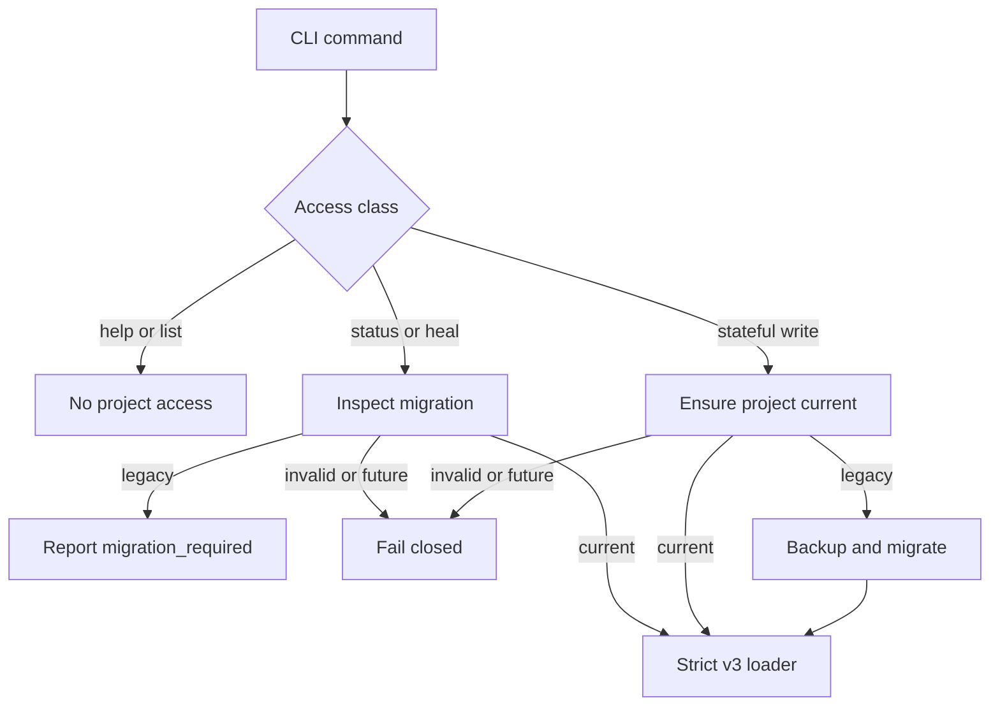

# Legacy Project Migration Spec

## Purpose

Replace Immune-Brain's runtime compatibility branches with an explicit project
migration boundary. Legacy projects are detected, backed up, migrated once to
the current on-disk format, and then handled exclusively by the current runtime
contract.

## Context

The current runtime accepts State Ledger schema v2 and v3, defaults missing
versions to v2, converts free-text execution evidence during every read, keeps a
stateless `LedgerStateMachine` compatibility wrapper, and silently maps legacy
`docs/architecture/` Spec references to `docs/specs/`. This spreads historical
contracts through normal execution and makes it difficult to know whether a
project is current.

The current State Ledger format is schema v3. Current execution evidence uses
`structured-v1` with `status`, non-empty `checks`, and normalized
`changed_files`.

## Requirements

1. Read-only operations detect legacy project state but do not change project
   bytes, timestamps, or locks.
2. Stateful operations migrate a detected legacy project before their first
   workflow mutation.
3. `imm-migrate --check` reports `current`, `migration_required`, `invalid`, or
   `future`; `imm-migrate` performs the migration explicitly.
4. Migration from State Ledger v2, or a missing-version ledger with a valid v2
   shape, produces schema v3 with required transition collections.
5. Legacy execution evidence in known State Ledger locations is converted once
   to `structured-v1`. Ambiguous or incomplete evidence fails migration instead
   of being guessed by the normal runtime.
6. Legacy active Plan Spec references under `docs/architecture/` are rewritten
   to `docs/specs/` only when the target Spec exists.
7. Every changed project file is backed up before replacement. Writes are
   atomic; a failed migration restores changed files from backup and reports the
   failure.
8. Re-running migration on a current project is a no-op and does not create a
   new backup.
9. Normal State Ledger loading accepts only schema v3 and structured execution
   evidence. Unknown future schemas fail closed.
10. Remove legacy runtime inputs and compatibility-only APIs after the migration
    path is active.

## Technical Design

Introduce `runtime/project_migration.ts` as the only module allowed to
understand historical project formats. It exposes pure inspection and explicit
migration operations. Inspection parses the ledger without normalization and
classifies it. Migration creates a content-addressed backup directory under
`.imm/migrations/`, stages replacements, writes them atomically under the State
Ledger lock, and records a migration manifest.

Stateful CLI commands call `ensureProjectCurrent` before loading workflow state.
Read-only commands call `inspectProjectMigration`; when migration is required,
they return a stable diagnostic and an `imm-migrate` command without writing.
Help and command discovery remain state-independent.

After migration integration, `state_ledger.ts` owns only current schema
validation and mutation. It no longer defaults missing versions, accepts schema
v2, or synthesizes structured evidence from free text. `plan_core.ts` no longer
silently rewrites legacy Spec paths.

## Design risk

**Design risk**: High

The main risk is interpreting old free-text verification results incorrectly.
That interpretation is confined to the one-time migration module and uses the
existing historical failure patterns. Missing results, malformed checks, or
conflicting status are migration errors. The normal runtime never performs this
inference.

A second risk is interruption between replacing the Plan and Ledger. Migration
therefore persists backups and a manifest before replacement and restores all
changed files on failure. Tests inject failures around staging and replacement.

## Diagram decision

**Diagram decision**: required

**Diagram reason**: The migration gateway has distinct read-only, current,
legacy, invalid, and future branches whose mutation authority must remain
visible.

Use one migration gateway in front of the current runtime instead of retaining
version branches inside Plan, evidence, State Ledger, and command handlers.

## Diagram reason

The gateway diagram above is the authority for command access behavior. It
shows why read-only detection cannot share the stateful auto-migration path.

A single gateway makes historical knowledge removable and testable. The core
runtime has one accepted representation, while project upgrade behavior remains
observable, recoverable, and fail-closed.

## Non-goals

- Supporting schema versions newer than the installed runtime.
- Preserving legacy CLI flags after migration support ships.
- Migrating arbitrary historical documents that are not active runtime inputs.
- Rewriting unrelated user files.
- Keeping compatibility aliases for repository-internal imports.

## Acceptance Criteria

- Legacy v2 and valid missing-version fixtures migrate to schema v3.
- Legacy evidence becomes valid `structured-v1` evidence in every supported
  runtime location.
- Current projects are byte-identical after inspection and repeated migration.
- Invalid and future projects fail without changing project files.
- Read-only commands never perform migration.
- Stateful commands automatically migrate before mutation.
- `LedgerStateMachine`, legacy evidence input, and silent Spec-path mapping are
  absent from the current runtime.
- Focused migration, runtime, package, transition, follow-up, and finish tests
  pass.
