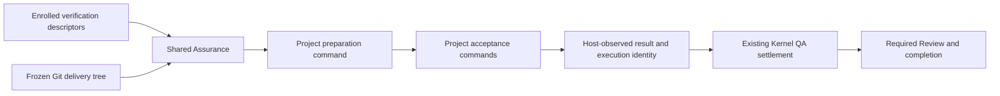

# Project-owned verification on frozen delivery snapshots

**Status**: Candidate; plan-only, not enrolled.
**Design risk**: High — changes the verification execution trust boundary shared by Pi and Claude, canonical descriptor eligibility, process execution, and delivery integrity.
**Execution posture**: characterization-first, then regression-driven implementation at the existing parser, process, QA, and dual-host seams.
**Document language**: English, following the Planner document-language default.

## Outcome

Immune-Brain can prepare and verify a project using project-specified commands without a built-in language, package-manager, or runner enumeration. Its own implementation remains Bun-based. New ecosystems require no plugin modification. Environment preparation failures are distinguishable from acceptance failures, and only host-observed execution can produce QA authority.

The primary invariant is: a QA pass proves that every enrolled check completed against the frozen delivery inputs under the declared preparation and execution contract. Project commands cannot issue attestations or mutate authority. This is one coherent TaskIntent: changing only dependency installation leaves the Bun runner restriction; changing only the runner leaves dependency preparation and workspace integrity incorrect. Parser, execution, both hosts, and their verification must ship and roll back together.

## Brainstorm Trace

| ID | Confirmed requirement | Design / acceptance |
|---|---|---|
| BR-REQ-1 | A new language or package manager requires no Immune-Brain code change | D1/D2; AC1, AC2 unknown-tool behavior |
| BR-REQ-2 | Remove Bun binding from preparation and execution | D1/D2/D6; AC1, AC2, AC5 |
| BR-REQ-3 | Execute project verification while preserving frozen snapshots and trustworthy evidence | D2–D5; AC2–AC4 |
| BR-REQ-4 | Distinguish preparation failures from acceptance failures, without silent skipping | D3/D4; AC2, AC4 |

No unresolved product question remains. The choices below are Planner-owned technical decisions, not additional user approval gates.

## Scope and exclusions

Include the shared verification descriptor, delivery materialization, bounded process execution, QA coordination, Pi/Claude callers, canonical author/validate diagnostics, focused tests, current usage documentation, generated Claude bundle, and a release changeset.

Do not introduce language adapters, package-manager detection, tool installation services, a plugin registry, a second workflow state machine, a new TaskRecord schema, or container orchestration. Keep the existing POSIX execution platform boundary. A temporary directory is not a malicious-code sandbox; do not claim network isolation, hermetic reproducibility, or containment against a trusted project command that deliberately leaves its process group and strips inherited execution identity. Foreground cancellation and cleanup cover the invoked command, its process group, and descendants that retain the host execution token. Strong containment of actively evasive code requires a separately authorized sandbox capability. Native authority gates and existing host effect permissions remain authoritative. Do not automatically run unapproved protected effects.

Do not modify refine or nextty, their task states, credentials, or production resources. Their failures motivate local fixtures; actual business-project recovery and plugin publication are outside this plan-only task. No GitHub Initiative publication is necessary for the single coherent outcome.

## Discovery evidence and reference closure

- `plugins/immune-brain/runtime/verification_descriptor.ts`: sole canonical parser; currently only accepts runner_id=bun, runner_version, literal argv and repository-relative cwd.
- `plugins/immune-brain/runtime/commands/kernel.ts`: author canonicalization and validate eligibility both use that parser. Historical TaskIntent parsing in `runtime/kernel/intent.ts` keeps verification as a string; no TaskRecord migration is required.
- `plugins/immune-brain/runtime/assurance/verification.ts`: resolves the Bun executable, checks its version, and owns process-group cancellation, timeout, combined output bounds, and execution environment.
- `plugins/immune-brain/runtime/assurance/delivery_workspace.ts`: materializes the frozen Git tree; only installs dependencies when bun.lock/bun.lockb exists; seals porcelain status, recursively changes dependency permissions, and rejects escaping initial symlinks.
- `plugins/immune-brain/runtime/assurance/qa.ts`: calls materialization and runs each acceptance; returns one atomic verdict; persists failure status/counts but never raw stdout/stderr.
- `plugins/immune-brain/runtime/assurance/coordinator.ts`: owns foreground preparation/QA/Review ordering, aggregate deadline, snapshot digest, and authority commit recovery. Its ports currently require one FrozenRunner even for Review resumption.
- `plugins/immune-brain/.pi-extension/imm-canary-work.ts`, `.pi-extension/pi-canary-verification.ts`, and `runtime/claude/kernel_ports.ts`: real callers, parser re-export, per-host descriptor validation and runner provisioning. Both hosts must call the same neutral implementation.
- `runtime/assurance/review_evidence.ts`: Review outcomes transport QA summary; no new Review authority or source delivery identity is needed.
- `runtime/kernel/spec_binding.ts`: binds this single Spec from scope_hint; no archive counterpart is required.
- `docs/adr/0004-dual-host-assurance-adapters.md`: retain one neutral coordinator and one persisted authority protocol; no generic host registry.
- `tests/kernel-verification-descriptor.test.ts`, `tests/pi-canary-verification-descriptor.test.ts`: parser identity, command bounds, process cancellation/output, frozen delivery, symlink escape and contamination prior art.
- `tests/managed-task-snapshot-isolation.test.ts`: delivery identity and staged scope prior art.
- `tests/host-neutral-assurance-coordinator.test.ts`, `tests/dual-host-assurance-conformance.test.ts`, `tests/helpers/pi-canary-assurance-harness.ts`: coordinator injection and native host conformance prior art.
- `tests/shared-deterministic-qa.test.ts`: shared QA aggregation, ordered progress and no-output-in-durable-evidence prior art; extend this real shared seam for environment grouping.
- `tests/kernel-intent-authoring.test.ts`, `tests/kernel-intent-validation.test.ts`: candidate contract/migration eligibility seam.
- Additional directly affected callers/fixtures found by runner imports or descriptor literals are enumerated in TaskIntent scope. Update those fixtures with their behavior intact; do not leave compile failures outside the envelope.
- `plugins/immune-brain/dist/claude/mcp-server.mjs` is generated from runtime; rebuild with `bun scripts/build-claude-plugin.ts`. The owned planner contract is `plugins/immune-brain/dist/imm-planner.md`; update its verifier guidance without changing authority semantics. `plugins/immune-brain/README.md` receives the usage and migration reference.

## Technical Design

**Design views**: architecture responsibilities, command interface, evidence data flow, and temporal/recovery sequence are material. Existing Kernel lifecycle transitions remain unchanged and are described as invariants rather than a replacement state machine.
**Diagram decision**: required
**Diagram reason**: separates project command ownership from execution observation and authority settlement.

### D1. One general command contract

Introduce `assurance_kernel/verification_descriptor/v2` in the existing verification string. Keep TaskIntent v1 and TaskRecord v4 unchanged. There is no package-manager or language field and no runner registry.

The canonical descriptor has:

- `contract`: v2.
- `command`: `{ executable, argv, cwd, timeout_ms, max_output_bytes }`.
- `environment`: optional `{ prepare, writable_paths }`; `prepare` is zero or one command with the same shape, and `writable_paths` is an array of repository-relative directory paths. Omission means no preparation and no permitted generated paths.

`executable` is either a bare host tool name or an explicit `./` snapshot-relative file. Reject absolute paths, traversal, NUL/control characters, and symlink escapes for project entries/cwd. Resolve host names once against the host execution context; spawn the resolved entry directly with shell=false. Arguments are literal argv, not shell source: spaces, glob characters and punctuation may be passed literally, subject to count/byte bounds. Do not interpret them as shell syntax. Projects needing orchestration use an existing tracked script or tool target; no new wrapper is mandatory.

Retain current per-command timeout/output ceilings; count preparation in the existing aggregate job ceiling. Bound descriptor size, command count, and writable path count explicitly. Canonicalize absent defaults consistently. A missing entry, invalid executable, unsupported process platform or invalid path is a typed preparation/resolution error, not a business finding.

Do not assume arbitrary tools support `--version`. Bind realpath and executable file identity/content hash where available; for a script bind its frozen bytes and interpreter resolution. Missing or ambiguous interpreter/tool resolution must fail clearly. A host-resolved script shim is not proof of all its transitive tools; record that limitation instead of fabricating complete toolchain identity.

Reuse existing project commands directly, e.g. an executable `./tools/qa` with argv `["check", "summary"]`, or a host tool `make` with argv `["test-summary"]`. These are examples, never dispatch cases.

### D2. Generic environment preparation

Remove `prepareDependencies` and all implicit lockfile-triggered installs/chmod. Materialization only creates and verifies the frozen delivery tree. Project preparation is explicit in the descriptor and uses the same bounded process executor as acceptance commands. A no-dependency project needs no prepare command.

Group checks only when their canonical environment definitions are identical. Give each distinct group a fresh materialization; run its prepare once, then its checks serially in acceptance order. This prevents one environment's setup from silently provisioning another environment. No persistent environment cache, dependency resolver, or generic scheduler is introduced.

Use a group-local temporary HOME/cache/scratch area and a stable host-owned PATH. Keep environment inheritance minimal, do not import ambient secrets or project-supplied environment overrides. Project scripts can configure tools and project-local virtual environments themselves. Private registry credentials and protected external effects are not newly granted by this contract; absent authorized support, report the concrete unmet prerequisite. Network restrictions are subject to actual host capabilities; do not claim offline enforcement from an environment variable.

Preparation may perform ordinary dependency builds/install scripts required by the project, within existing authorization. Unknown project scripts must still be inspected for privileged effects under the existing host rules before execution. Do not automatically install missing global tools, silently download new tools, infer package managers, or use the live project's dependency directory as fallback.

### D3. Protect input bytes; allow declared generated outputs

All tracked delivery paths, including manifests, lockfiles, scripts and config outside the changed scope, are protected by the frozen tree. Checks must compare actual tracked working bytes, file modes, symlink targets and path existence against original Git objects; a porcelain string or rewritten index is not sufficient. Protect repository metadata/HEAD identity as well.

`writable_paths` may only name non-tracked generated directories inside the materialization, cannot be the root or `.git`, and cannot overlap/contain tracked inputs. Validate containment before and after preparation/checks. Allow outputs only in these declared paths or the host scratch area. Undeclared untracked/ignored output remains an integrity failure. Do not make `.gitignore` an implicit authority grant.

Replace blanket recursive chmod with task-owned cleanup. Never chmod a shared package store through hardlinks. Dependency/environment trees may have host-runtime links (e.g. a Python virtualenv interpreter); distinguish generated runtime links from tracked source links. Generated links must not make declared writable paths resolve outside the group root or authorize external writes. Runtime links may only resolve to host-approved executable inputs; ambiguous external links fail with an explicit path error. This constrains accidental contamination; it is not an OS write sandbox.

Before each check verify protected inputs; after each check verify them again. Because writable directories can retain state within a group, evidence promises execution against protected source inputs, not bit-identical generated dependencies across independent checks. Project checks must not rely on undeclared previous groups. Cleanup covers success, failure, timeout and cancellation.

### D4. Failure and authority behavior

Resolution, environment preparation, and delivery-integrity failures return an operation failure with a stable stage/reason and affected acceptance IDs. Do not create one business finding per check that never ran. No approval or partial pass can be committed when any group cannot prepare or a protected input drifts.

A check that actually runs and fails retains existing execution finding behavior with acceptance ID, exit/timeout/output-limit status and byte counts. Never put raw process output, environment values, secret material, or untrusted exception text in durable summaries. Bounded user diagnostics may identify the failing phase and configured command without output disclosure.

Every subprocess uses the existing cancellation/process-group discipline, including prepare. Terminate the invoked process group and descendants that retain the host execution token before returning/cleaning up, account for descendants keeping pipes open, and include preparation budgets in the coordinator deadline. Project verification commands are trusted inputs: a descendant that deliberately creates a new process group and strips the inherited execution token is outside this local runner's containment guarantee and requires a sandbox executor. On cancellation before authority commit leave the task resumable with no partial attestation; after uncertain commit use existing projection-based reconciliation, never rerun a potentially committed action blindly.

### D5. Evidence and host integration

Build deterministic, bounded execution metadata from the trusted executor: descriptor/environment digests, frozen tree identity, resolved entry identities, platform/architecture, preparation outcome, and per-acceptance result. Carry a compact canonical metadata summary/digest through the existing QA approval summary and capability binding; do not add arbitrary persisted fields or rewrite historical record bytes. Set a total metadata byte ceiling and fail before settlement if exceeded. No stdout/stderr or secret-bearing values enter this payload.

Validate resolved executable identity at use and again before approval; project files must match frozen content. The evidence establishes what was observed for this run. It does not assert that all nested tools, external services, or mutable registries were pinned. Project-owned locking remains the project's responsibility.

Both hosts consume the same descriptor/preparation/QA implementation. Remove the globally cached single Bun runner port. Review resumption reads settled QA outcomes and must not require reinstalling dependencies or resolving a verification runner again. Existing snapshot freshness, invocation capability, required Review, and settlement stay authoritative. Host environment changes do not retroactively falsify a historical successful observation; any new verification attempt resolves its environment anew. No cross-run environment reuse is added.

### D6. Compatibility and removal

Historical TaskRecords and old descriptor strings remain readable as historical data; do not rewrite audit files, completed/stopped records, or SQLite. New runtime authoring and QA accept v2 only. This removes a public executable contract, so the implementation changeset must declare a major release; publication remains outside this task. Remove Bun-only resolver/compatibility execution and implicit installer rather than retaining two execution systems. Unsupported v1 execution reports `verification_contract_migration_required` before executing any command.

For an unexecuted candidate, Planner prepares a v2 candidate using canonical authoring, preserving assertions and check intent. For an active task, prepare a complete revised intent and use existing compatible `revise_intent` when only verification changes; scope/assertion changes follow their existing breaking revision gate. Never overwrite an enrolled sidecar. Adding prepare changes verification semantics explicitly and invalidates prior QA through intent revision. No migrated task is marked passed automatically.

This planning TaskIntent necessarily uses the currently installed v1 descriptor to validate and bootstrap the implementation under the current host. Do not edit it in place during execution. An upgraded host requires the same explicit revision before rerunning its QA; source tests exercise v2 independently of the installed plugin. Validate/build with the current installed host before release. After deployment to consumers, v1 definitions require migration; do not promise old binary rollback on active v2 intents.

Removal owner: implementing runtime maintainer. Exit milestone: this feature's delivery contains only the v2 execution path; historical raw-string reading is permanent data support, not an executable compatibility layer. Remove retired Bun-only positive tests and replace them with generic behavioral coverage; preserve legacy read and migration rejection tests. Scope includes direct harness and fixture callers to avoid leaving deleted imports behind.

## Verification and acceptance mapping

Planning validates artifacts only; the following suites are extended during implementation and executed by deterministic QA afterward. They already exist, so descriptors are concrete and runnable. Tests use temporary repositories and synthetic executable tools; no network, language installation, or real business repository is required.

| Acceptance | Focused verification | Required regression behavior |
|---|---|---|
| AC1 | `bun test tests/kernel-verification-descriptor.test.ts` | v2 canonicalization; unknown tool names; literal argv; path and bound validation; parser identity shared by author/hosts; no language enum |
| AC2 | `bun test tests/pi-canary-verification-descriptor.test.ts tests/shared-deterministic-qa.test.ts` | real fresh-snapshot custom-tool execution with no recognized manifests; explicit preparation creates a needed artifact; prepare is once per identical group; distinct groups isolated; no-prepare works; prepare failure differs from failed check |
| AC3 | `bun test tests/managed-task-snapshot-isolation.test.ts` | tracked source/lockfile changes caught even with same porcelain/index spoofing; declared output permitted, undeclared output rejected; symlink containment; source worktree/index/dependency tree untouched |
| AC4 | `bun test tests/host-neutral-assurance-coordinator.test.ts` | cancellation/timeout/output limits include preparation; no partial attestation; bounded execution identity bound to approval; Review resume has no preparation/runner dependency; commit recovery unchanged |
| AC5 | `bun test tests/kernel-intent-authoring.test.ts tests/kernel-intent-validation.test.ts` | new v2 author/validate; old v1 execution eligibility rejected with actionable migration reason; historical records unchanged; no authority writes from validation |
| AC6 | `bun test tests/dual-host-assurance-conformance.test.ts --test-name-pattern project-owned-verification` | add named behavior group `project-owned-verification` exercising Pi and Claude actual ports for prepare pass/failure, unknown-tool checks, cancellation, evidence and revision eligibility; must contain and execute nonzero tests |

The unknown-tool fixture must run a real process and require a setup artifact; a mocked success or acceptance of an arbitrary string does not prove ecosystem independence. Existing Bun-based repository tests remain the implementation test runner, not a restriction on consumer commands.

After runtime edits rebuild `plugins/immune-brain/dist/claude/mcp-server.mjs` before package tests. Outside acceptance descriptors run `bun run typecheck`, related surviving host/fixture tests, `bun scripts/build-claude-plugin.ts --check`, `bun scripts/sync-dist-docs.ts --check`, and `bun scripts/plugin_versioning.ts validate`; normal CI retains the full suite. Do not put a full suite or dependency install into an acceptance command. Preparation is its distinct bounded phase, not disguised acceptance.

## Devil's Advocate Audit

- **Rollback resilience**: no persisted schema migration or terminal record rewrites. Ship parser/executor/host/package changes atomically. Interrupted QA discards temporary environments and resumes from the existing Kernel projection. Rolling binaries back is safe only before v2 tasks are enrolled, or after those tasks are resolved with the supported host; never directly rewrite authority to make an old binary accept v2.
- **Verification vanity**: a manifest-free unknown tool must consume a preparation output in the real executor. Test literal argv fidelity, source-byte tampering, environment separation and late cancellation. Preserve native-host conformance beyond mocked coordinator success. An empty name-filtered suite is a failure.
- **Spec dilution**: implementing pnpm branches, a fixed runner enum, a shell-eval catch-all, automatic host node_modules reuse, or accepting project-issued attestation fails BR-REQ coverage. No hidden package detection is permitted as runtime semantics. No generic platform rebuild is necessary.
- **Limits stated accurately**: local subprocess execution is not a sandbox; executable hashes do not establish transitive toolchain hermeticity. Evidence states observed execution and protected-input identity only. Unavailable permissions/resources block dependent verification without claiming success or inventing new user approval layers.

## Delivery boundary

One Spec and one TaskIntent settle together. This candidate authorizes nothing until native Enrollment. Execution completion requires the focused acceptance checks, relevant regression/package checks and required Review; planning completion requires canonical author/validate success, tracked candidate artifacts and complete BR trace. The current untracked reports and `.agents/` are unrelated and must remain untouched.
