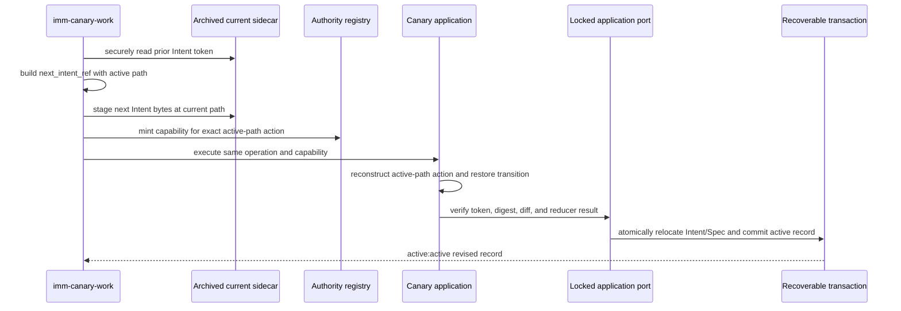

# Spec: Review Bundle And Frozen Revision Repair

**Task ID**: `2026-08-25-001-review-bundle-frozen-revision-repair`
**Owner**: user
**Status**: Candidate
**Design risk**: High
**Design risk rationale**: The repair changes immutable Review input bounds and a literal-user capability action that crosses the Pi host adapter, Kernel action digest, reducer state, and recoverable planning-artifact relocation transaction. A partial fix could block valid baselines, consume authority for different bytes, or leave a TaskRecord path inconsistent with the filesystem.

**Diagram decision**: required
**Diagram reason**: The frozen breaking-revision path has separate current-sidecar, next-authority, and transactional destination identities; a sequence diagram makes their ordering and ownership explicit.

## Summary

Review bundle capture accepts a UTF-8 file larger than 256 KiB when the complete immutable bundle remains within its existing 2 MiB bound. A literal-user-approved breaking Intent revision for an `active:frozen` task binds one canonical active `next_intent_ref`, securely stages the next bytes through the current archived sidecar, and atomically restores the bound Intent and Spec to active paths through the existing Kernel transaction.

## Origin

The user reported two blockers while a separate Refine task and its QA evidence remained frozen:

1. the Review bundle per-file limit rejected an existing `openapi.yaml` baseline even though the complete bundle fit its total bound; and
2. frozen breaking revision minted authority from an archived Intent path while the Kernel reconstructed the action with the active path, producing different action digests.

The user confirmed the root-cause repair and requested a separate Managed task followed by direct Enrollment and execution.

## Research

### Reference closure

- `captureReviewBundle` has one production caller in `imm-canary-work.ts`; `pi-canary-review-neighborhood.test.ts` owns the existing 256 KiB and 2 MiB boundary assertions.
- `authorizeExactOperation` reads and writes the current sidecar path, then includes its `next_intent_ref` in both the capability binding and application payload.
- `canary_application.ts` independently reconstructs breaking-revision actions with `docs/plans/<task-id>.intent.json`, while `application.ts` verifies the exact action digest and securely rereads the current record-bound sidecar.
- `reducer.ts` changes a successful breaking revision from `active:frozen` to `active:active` and adopts the action's `next_intent_ref`; `storage.ts` is the recoverable transaction owner for artifact relocation.
- `breaking-intent-revision-gate.test.ts` exercises the real Tool and capability path but currently covers only an already-active sidecar. `kernel-canary-application.test.ts` is the focused Kernel transaction seam.
- `runtime-stub.ts`, `authority_port.ts`, and `validation.ts` own adapter reads, action digesting, and shape validation for the same action and are included for same-state-machine Review coverage without requiring implementation changes.

### Prior decisions

- ADR 0002 requires planning artifacts and packaged/runtime ownership to remain explicit; this repair reuses the existing archive/active artifact policy and adds no mirror.
- `docs/solutions/rejected-out-of-band-review-authority-reconstruction.md` rejects rebuilding authority from workspace state. This repair keeps the capability-bound action and Kernel transaction authoritative.
- The superseded snapshot-isolation Spec records the original 256 KiB limit. That historical value is not a persisted schema or security boundary; the current total bundle bound remains authoritative.

## Decisions

1. Remove the independent 256 KiB per-file ceiling. Use the existing 2 MiB bundle ceiling as the maximum blob read allocation, then retain the final serialized aggregate-size rejection.
2. Keep `assurance_kernel/review_bundle/v4`; no fields, digest algorithm, provenance semantics, encoding checks, or artifact permissions change.
3. For every breaking revision, the authority action's `next_intent_ref.path` is the canonical active sidecar path. The current record-bound path remains the secure location used for pre-commit reads, staging, and rollback.
4. When the current record is frozen, `approve_breaking_intent_revision` reuses `transitionFor(..., "restore")` so Intent and bound Spec relocation commit atomically with the revised TaskRecord.
5. Cancellation, abort, dialog failure, staging failure, digest mismatch, token mismatch, or transaction failure leaves the prior Intent bytes and frozen authority state recoverable and applies no partial revision.
6. No compatibility layer, alternate digest, path alias, file-name exception, schema migration, or bundle streaming format is introduced.

## Technical Design

### Review bundle bound

`readIndexBlob` continues to reject non-blobs, invalid sizes, invalid UTF-8, byte-round-trip mismatches, changed object sizes, and Git failures. The `git cat-file` buffer is bounded by `MAX_REVIEW_BUNDLE_BYTES + 1`. A file over that read ceiling fails before allocation; one or more accepted files whose serialized bundle exceeds 2 MiB fail at the unchanged aggregate guard.

The regression fixture uses a tracked `openapi.yaml` larger than 256 KiB and asserts exact captured content while keeping the aggregate below 2 MiB. The existing multi-file aggregate rejection remains unchanged.

### Frozen breaking revision

The host must not derive `next_intent_ref.path` from `priorIntent.intent_ref.path`: the latter identifies where the old frozen artifact currently lives, while the former identifies the post-revision active artifact. The host still writes and stages the current archived path before minting so the prior token and locked fresh reread bind one unchanged inode and the new canonical Intent bytes.

`canary_application.ts` adds frozen breaking revision to the existing restore-transition selection. `applyTaskAction` continues to reread the current archived path, compare the next hash and revision, inspect the capability against the active-path action, reduce the record, and pass the restore relocation to the existing recoverable transaction. The transaction changes the record path and filesystem paths together; no intermediate active record or duplicate sidecar is persisted.

## Invariants

- Review evidence remains immutable, index-backed, UTF-8 round-trippable, and at most 2 MiB serialized.
- There is no lower independent per-file ceiling than the aggregate Review bundle ceiling.
- The host-minted breaking-revision action and Kernel-reconstructed action are byte-equivalent for authority digesting.
- A revised `active` TaskRecord always references the canonical active Intent path, which exists exactly once after commit.
- Frozen Intent and bound Spec restore through one recoverable Kernel transaction.
- User cancellation and every pre-commit failure consume no mutation authority and preserve prior bytes and paths.
- Existing active-state breaking revisions retain their current behavior and do not perform an artifact relocation.

## Settlement-Design Contract

### Trigger sources

- QA completion requests immutable Review bundle capture.
- Git object type, size, encoding, content, snapshot, or aggregate-bound validation fails during capture.
- A literal user confirms or cancels `approve_breaking_intent_revision` for an active or frozen task.
- Host cancellation, session drift, dialog failure, sidecar write/stage failure, capability mint failure, token/digest/diff/CAS mismatch, or transaction failure interrupts the revision.
- A successful Kernel commit settles the breaking revision.

### State inventory

- Review capture has no persisted intermediate state: `active:frozen` remains unchanged on capture success or failure until Review authority progresses separately.
- Active breaking revision remains `active:active -> active:active` with a higher Intent revision.
- Frozen breaking revision permits only `active:frozen -> active:active` through one committed transaction.
- Cancellation and every failed preflight remain in the exact prior state. No `restoring`, dual-path, or partially revised persisted state is added.

### Terminal ownership

- The literal-user TUI decision is the sole authority source for approving a breaking revision.
- The mutation authority registry owns exact action-digest validation and single-use capability consumption.
- The locked Kernel application and recoverable storage transaction are the sole owners of TaskRecord mutation and archive-to-active relocation.
- Host staging, promise resolution, dialog completion, Git command completion, elapsed time, and local file existence before transaction commit are non-authoritative.
- Review bundle capture writes no Kernel authority; the immutable bundle digest remains Review provenance only.

### Same-state-machine coverage

- `plugins/immune-brain/.pi-extension/imm-canary-work.ts`
- `plugins/immune-brain/.pi-extension/runtime-stub.ts`
- `plugins/immune-brain/runtime/kernel/authority_port.ts`
- `plugins/immune-brain/runtime/kernel/canary_application.ts`
- `plugins/immune-brain/runtime/kernel/application.ts`
- `plugins/immune-brain/runtime/kernel/reducer.ts`
- `plugins/immune-brain/runtime/kernel/storage.ts`
- `plugins/immune-brain/runtime/kernel/validation.ts`
- `tests/breaking-intent-revision-gate.test.ts`
- `tests/kernel-canary-application.test.ts`

## Failure, Interruption, And Recovery

- Oversized aggregate Review input reports the existing bounded-output failure and spawns no reviewer.
- A single file larger than the total ceiling fails before blob read; malformed or drifting Git data retains existing fail-closed behavior.
- Frozen breaking-revision failure before commit restores the prior archived sidecar bytes and index entry. The TaskRecord and bound Spec remain frozen.
- A process interruption during recoverable transaction commit is handled by the existing workspace transaction recovery; a later `imm-loop` projects the durable record and paths rather than reconstructing authority from chat or Git status.
- A successful revision invalidates prior attestations through the changed Intent identity as already defined by the reducer and Assurance projection.

## Compatibility And Rollback

There is no persisted contract or bundle format change. Existing Review bundles remain verifiable as v4. Existing TaskIntent and TaskRecord files require no migration. Active-state breaking revision behavior remains compatible.

Rollback reverts the three production edits and their two focused regression tests as one unit. If execution stops before completion, the new tests fail against the old limits/path behavior and no enrolled external task is modified. The separate frozen Refine task remains untouched until this repair is completed, loaded by Pi, and explicitly resumed through `imm-loop`.

## Scope

- `docs/specs/review-bundle-frozen-revision-repair.spec.md`
- `docs/specs/archive/review-bundle-frozen-revision-repair.spec.md`
- `docs/plans/2026-08-25-001-review-bundle-frozen-revision-repair.intent.json`
- `docs/plans/archive/2026-08-25-001-review-bundle-frozen-revision-repair.intent.json`
- `plugins/immune-brain/.pi-extension/pi-canary-review-bundle.ts`
- `plugins/immune-brain/.pi-extension/imm-canary-work.ts`
- `plugins/immune-brain/.pi-extension/runtime-stub.ts`
- `plugins/immune-brain/runtime/kernel/authority_port.ts`
- `plugins/immune-brain/runtime/kernel/canary_application.ts`
- `plugins/immune-brain/runtime/kernel/application.ts`
- `plugins/immune-brain/runtime/kernel/reducer.ts`
- `plugins/immune-brain/runtime/kernel/storage.ts`
- `plugins/immune-brain/runtime/kernel/validation.ts`
- `tests/pi-canary-review-neighborhood.test.ts`
- `tests/breaking-intent-revision-gate.test.ts`
- `tests/kernel-canary-application.test.ts`

## Out Of Scope

- Raising the total 2 MiB Review bundle ceiling;
- binary or non-UTF-8 Review files, compression, truncation, streaming, or partial-file review;
- Review workload classification, prompt, Agent reservation, or verdict contracts;
- changing TaskIntent, TaskRecord, Review bundle, capability, or transaction schemas;
- changing breaking-versus-compatible revision classification, risk floors, Review-round policy, or literal-user authorization UX;
- modifying, unfreezing, or settling the separate Refine task; and
- compatibility aliases or duplicate active/archive sidecars.

## Acceptance

1. Review capture includes exact index bytes for a UTF-8 `openapi.yaml` larger than 256 KiB when the complete immutable bundle is below 2 MiB, while a file or aggregate exceeding the 2 MiB bound still fails closed and all existing provenance and encoding checks remain unchanged.
2. Literal-user-approved breaking revision succeeds from both active and genuinely frozen artifact layouts with one canonical active-path authority digest; the frozen path atomically restores Intent and bound Spec to active paths, while cancellation and injected failure preserve the prior bytes, paths, TaskRecord, workspace, claim, and unconsumed authority.

## Verification Approach

- `bun test tests/pi-canary-review-neighborhood.test.ts`
- `bun test tests/breaking-intent-revision-gate.test.ts`
- Post-implementation focused Kernel regression: `bun test tests/kernel-canary-application.test.ts`
- Package mirror check: `bun scripts/sync-dist-docs.ts --check`
- Diff hygiene: `git diff --check`

The first two files are the TaskIntent rehearsal seams. They exercise real Git blobs and the real extension Tool/capability/transaction path, so they fail on the reported regressions rather than merely checking constants or source text.

## Devil's Advocate Audit

**Rollback resilience**: No persisted schema changes or compatibility bridge exists. Production changes and focused tests revert as one unit; pre-commit failure restores archived bytes, while interrupted committed relocation uses the existing transaction recovery.

**Verification vanity**: Raising a constant alone would not prove the total bound, and comparing two digest strings would not prove path relocation. Tests must capture a real oversized baseline from Git and drive a real enrolled task through freeze, native Tool authorization, capability verification, reducer mutation, and filesystem restoration.

**Spec dilution detection**: Fixing only the reported digest mismatch would leave an active TaskRecord pointing at an archived sidecar. Removing all size bounds would weaken the Review security boundary. Closure requires both canonical active action identity plus atomic restore, and a larger individual file plus unchanged aggregate rejection.
