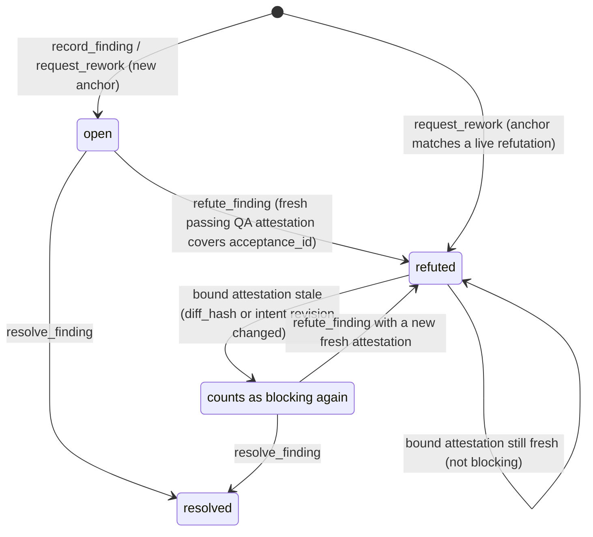

# Spec: Review Finding Provenance and Snapshot-Bound Counterevidence

**Output language**: English (persisted document default; no explicit project
document-language override applies).

**Design risk**: High — the change alters Kernel finding lifecycle authority,
`completionDecision` gating, the mutation-authority capability digest, and the
Review verdict boundary shared by both Host adapters. Persisted TaskRecord
state, a security-relevant authority binding, and a cross-runtime contract are
all involved, so Low or Medium classification is not available.

**Design views**: state transitions, service/component interfaces, data flow.
Architecture layers is omitted because no layer responsibility, dependency
direction, or ownership boundary moves — every edit stays inside the existing
Kernel authority layer and its two Host adapters. Temporal sequence is omitted
because the change adds no new ordered interaction: refutation, reconciliation
and invalidation all resolve inside single existing reducer and projection
calls that already own their interruption and idempotency behavior.

**Diagram decision**: required
**Diagram reason**: The outcome is a new finding-status state machine whose
legal transitions and derived (non-stored) invalidation edge are the core of the
design; prose alone cannot make the `refuted` liveness edge unambiguous.

## Outcome

A Review finding that was refuted by executable counterevidence is not
rediscovered as new work by a later independent Review round, and the refutation
loses force the moment its evidence goes stale. Independent Review keeps its
blind snapshot-bound authority; reconciliation is a deterministic Kernel
function of the TaskRecord, not a reviewer-visible hint and not a second
approval authority.

## Problem Evidence

Issue #51 records repeated full-diff Review rounds on the S3 batch state-machine
task (#45). Rounds re-raised findings that the enclosing call chain and
executable regression tests had already contradicted, because nothing in the
system carries a refutation forward.

Verified in the current code:

- `plugins/immune-brain/runtime/assurance/coordinator.ts:278` `buildReviewPrompt`
  carries acceptance, snapshot identity and evidence provenance, and nothing
  about earlier rounds. Each reviewer starts blind by construction.
- `plugins/immune-brain/runtime/kernel/types.ts:19` `FindingStatus` is
  `"open" | "resolved"`. There is no disposition meaning "contradicted by
  executable evidence", and no field can hold that evidence.
- `plugins/immune-brain/runtime/assurance/coordinator.ts:75` `AssuranceVerdict`
  findings require only `summary`; `acceptance_id` may be `null`. A finding
  therefore carries no machine-comparable identity.
- `plugins/immune-brain/runtime/kernel/reducer.ts:455` `parkForReplan` triggers
  on *any* prior blocking Review finding plus *any* new blocking finding, so an
  unrelated second-round finding parks the task for replan.

Already satisfied, and therefore out of this scope:

- Stale verdicts cannot approve: `coordinator.ts:756-771` re-projects and
  compares `record_revision`, `workspace_revision`, `intent_revision`,
  `intent_content_hash`, `diff_hash`, `lifecycle`, `artifact_state`, plus the
  v4 `review_revision` quadruple, before `applyVerdict`.
- Fail-closed completion: `completion.ts:140-195` blocks on open blocking
  findings, and `reducer.ts:483-506` writes a `replan_required` boundary that
  only literal-user `approve_breaking_intent_revision` can clear.

## Discovery Evidence

| Concern | Path | Why it is in the trace |
| --- | --- | --- |
| Finding shape and statuses | `plugins/immune-brain/runtime/kernel/types.ts:19-31` | Owns `FindingStatus`, `FindingSource`, `TaskFinding`, `CompletionDecision` |
| Finding transitions | `plugins/immune-brain/runtime/kernel/reducer.ts:264-315,433-509` | `record_finding`, `resolve_finding`, `request_rework`, `parkForReplan`, `reviewRound` |
| Normalized findings digest | `plugins/immune-brain/runtime/kernel/reducer.ts:190-205` | `findingsDigestV2` binds the mutation-authority capability to the findings |
| Append-only enforcement | `plugins/immune-brain/runtime/kernel/validation.ts:183-193,1039-1053` | Exact key list per finding plus the "removed / rewritten" invariant |
| Completion gating | `plugins/immune-brain/runtime/kernel/completion.ts:88-196` | Attestation freshness set and `blocking_finding_ids` → `next_obligation` |
| Projection reuse | `plugins/immune-brain/runtime/kernel/assurance_projection.ts:16,159` | Calls `projectTask`; inherits completion behavior, so it needs no edit |
| Operation → action mapping | `plugins/immune-brain/runtime/kernel/canary_application.ts:50-52,119-145,363-372` | Where a new `refute_finding` operation must be admitted |
| Verdict contract and prompt | `plugins/immune-brain/runtime/assurance/coordinator.ts:75-100,278-320,772-777` | `AssuranceVerdict`, `buildReviewPrompt`, `parseAssuranceVerdict` and its `verdict_invalid` path |
| Claude adapter | `plugins/immune-brain/runtime/claude/kernel_ports.ts:854-875` | Builds the findings array and mints the capability from `findingsDigestV2` |
| Pi adapter | `plugins/immune-brain/.pi-extension/imm-canary-work.ts:1381-1400` | Identical construction; dual-host parity requirement |
| Pi structural mirror | `plugins/immune-brain/.pi-extension/runtime-stub.ts:177,387` | Loose finding shape and `findingsDigestV2` re-export must accept the new fields |
| Reviewer role prompt | `plugins/immune-brain/runtime/prompts/code-review.md` + `plugins/immune-brain/dist/role-prompts/code-review.md` | Checked-in generated mirror, guarded by `bun scripts/sync-dist-docs.ts --check` |

Out of the trace, with reason: `runtime/assurance/qa.ts` and
`runtime/assurance/qa_findings.ts` are untouched because QA-authority findings
keep `source: "execution"` and `review_round: null`, carry no anchor, and are
never reconciliation inputs. `assurance_projection.ts` is untouched because it
consumes `projectTask` rather than re-deriving blocking findings.

## Technical Design

### State transitions

`FindingStatus` gains `refuted`. `TaskFinding` gains two optional fields so the
TaskRecord contract is not bumped and v3 drain records stay valid:

- `anchor: string | null` — a canonical `sha256:` digest identifying the claim.
- `counterevidence: { attestation_id: string; acceptance_id: string } | null`.

Legal transitions:

- `open → resolved` — unchanged `resolve_finding` semantics.
- `open → refuted` — new `refute_finding` action. The Kernel admits it only when
  the record holds a **fresh, passing QA attestation** whose
  `acceptance_results` cover the finding's `acceptance_id`. The actor cannot
  assert a refutation; it can only bind evidence the Kernel already validated.
- `admitted-as-refuted` — `request_rework` records a new Review finding whose
  `anchor` matches a live-refuted finding directly as `refuted`, inheriting that
  finding's `counterevidence` binding.
- `refuted ⇢ blocking again` — **derived, never stored.** A refutation is *live*
  only while its bound attestation is in `completionDecision`'s
  `freshAttestations` set (`completion.ts:89-93`: matching `task_revision`,
  `intent_content_hash` and `diff_hash`). Any code change, any intent revision,
  and the refutation stops counting.

No stored status is ever rewritten by invalidation, so the append-only invariant
at `validation.ts:1039-1053` survives; it is extended only to admit the
`open → refuted` transition alongside the existing `open → resolved` one.



### Service and component interfaces

**Review verdict boundary** (`coordinator.ts`). `AssuranceVerdict` keeps
contract `assurance_kernel/assurance_verdict/v2`. Each rework finding gains a
required `evidence` object, enforced by `parseAssuranceVerdict` **only** when
`snapshot.role === "review"`:

```
evidence: {
  trigger: string,                 // concrete inputs or state that reach the defect
  caller_chain: string[],          // ordered, non-empty; each entry a repository path or symbol
  violated: { kind: "acceptance" | "security_boundary", ref: string }
}
```

- Inputs: the reviewer's JSON verdict plus the bound `SnapshotDescriptor`.
- Output: the parsed verdict plus a derived
  `anchor = sha256(canonical({violated.kind, violated.ref, caller_chain}))`.
- Errors: a missing or empty field returns the existing
  `{ state: "blocked", code: "verdict_invalid" }` path
  (`coordinator.ts:772-777`), which already sets
  `reservation.verdictCorrectionRequired`. No new failure mode is introduced.
- Compatibility and versioning: the contract string is deliberately not bumped.
  The requirement is conditional on the Review role, so QA verdicts
  (`runtime/assurance/qa.ts`) and every `pass` verdict are unchanged. The only
  emitter is this plugin's own reviewer prompt, generated in the same build; a
  stale emitter fails closed rather than degrading.
- Caller/callee ownership: `coordinator.submitReview` owns parsing; the two Host
  adapters own forwarding `anchor` and `evidence` into the findings array they
  pass to `findingsDigestV2`, so the minted capability is bound to the anchor.

**Kernel authority** (`reducer.ts`, `canary_application.ts`). A new
`refute_finding` operation and action carry `{ finding_id, attestation_id,
actor_id }`. `findingsDigestV2` is extended to cover `anchor`, so a capability
cannot be minted against one anchor set and spent on another.

### Data flow

1. Reviewer emits a verdict → `parseAssuranceVerdict` validates evidence and
   derives each anchor (source: reviewer JSON; validation: shape plus non-empty
   constraints; failure: `verdict_invalid`, nothing written).
2. Host adapter maps findings, now including `anchor`, and mints a capability
   bound to `findingsDigestV2` (destination: `request_rework` action).
3. Reducer admits each finding: anchor matching a live refutation → `refuted`
   with inherited counterevidence; otherwise → `open`.
4. `completionDecision` derives liveness from attestation freshness and emits
   `blocking_finding_ids`; `projectTask` turns that into `resolve_findings`.
   Failure handling: an unknown or non-fresh `attestation_id` on
   `refute_finding` raises `KernelInvariantError`, leaving the record unchanged.

### Replan boundary granularity

`parkForReplan` becomes: park only when a new **non-disputed** blocking Review
finding shares an acceptance boundary with a prior blocking Review finding.
"Shares an acceptance boundary" means equal `acceptance_id`, or, when both are
`null`, equal `evidence.violated.ref`. A finding admitted as `refuted` never
contributes to the trigger. This narrows a trigger that currently fires on
unrelated second-round findings; it never removes one.

## Assumptions

- `TaskFinding` gains optional fields only, so `TASK_RECORD_CONTRACT_V4` is not
  bumped and the v3 drain window (`types.ts:230-245`) is unaffected. The exact
  key list at `validation.ts:183` is extended in step with the type.
- Declared risk is `critical`. `REQUIRED_ATTESTATIONS` is identical for
  `material` and `critical` (`completion.ts:12-16`), so this adds no attestation
  burden, but it is the honest tier for Kernel authority and completion gating
  and cannot later be silently reduced (`classifyIntentRevision` treats a risk
  reduction as breaking).

## Devil's Advocate Audit

**Rollback resilience.** Every edit is additive: an optional pair of fields, one
new action, one narrowed trigger, one derived predicate. A partial
implementation that lands the type and validation changes but not the reducer
logic leaves `anchor` and `counterevidence` permanently `null`, which reduces to
exactly today's behavior — no finding is ever admitted as `refuted`, nothing is
dropped, completion gating is unchanged. Reverting the commit restores prior
behavior without a state migration, because no existing stored field changes
meaning and no record is rewritten.

**Verification vanity.** The failure this must catch is a defect surviving
because a refutation silenced its finding. A4 is the guard: it asserts that once
the bound attestation goes stale, the refuted finding counts as blocking again
and `projectTask` returns `resolve_findings`. If someone implements refutation
as a stored terminal state instead of a derived predicate, A4 fails. A3 is
paired with a negative case — a finding with a *different* anchor must be
admitted `open` and blocking — so an over-broad matcher that swallows genuine
new findings fails rather than passes. A1 asserts the `verdict_invalid` path on
incomplete evidence, so a permissive parser that accepts an empty
`caller_chain` and derives a colliding anchor fails at the boundary.

**Spec dilution.** The `BR-*` trace below accounts for all fourteen upstream
items. The two deferred items (`BR-DEFER-1`, `BR-DEFER-2`) are recorded as
deferred with their reason, not silently dropped, and the four `BR-OUT-*`
non-goals are restated as exclusions. `BR-DEC-4` is discharged by evidence that
the behavior already exists rather than by new code, and the Spec says so
explicitly instead of quietly omitting it.

## Brainstorm Trace

| ID | Disposition |
| --- | --- |
| `BR-REQ-1` | A2 — `refuted` status plus `counterevidence` binding, append-only |
| `BR-REQ-2` | A3 — `request_rework` anchor reconciliation, neither auto-blocking nor auto-dropped |
| `BR-REQ-3` | A4 — liveness derived from attestation freshness; stale ⇒ blocking again |
| `BR-REQ-4` | A1 — required `evidence` on Review rework findings, else `verdict_invalid` |
| `BR-REQ-5` | A5 — `parkForReplan` narrowed to a shared acceptance boundary |
| `BR-DEC-1` | Design: reconciliation runs in the reducer after verdict submission; `buildReviewPrompt` carries no history (A1 asserts the prompt text, A3 the Kernel-side match) |
| `BR-DEC-2` | Design: fields live on `TaskFinding`; no sidecar truth source (A2) |
| `BR-DEC-3` | Design: `evidence` mirrors the `verification_criteria` alternative adopted in `docs/solutions/rejected-rigid-patch-generation-in-reviewer-subagents.md`; no `suggested_patch` field (A1) |
| `BR-DEC-4` | Discharged without new code: snapshot binding at `coordinator.ts:756-771` and fail-closed completion at `completion.ts:140-195` already hold. No acceptance re-asserts existing behavior. |
| `BR-OUT-1` | Excluded — no coverage reuse; every Review round still reads the full immutable revision |
| `BR-OUT-2` | Excluded — no metrics, counters, or telemetry surface |
| `BR-OUT-3` | Excluded — no Kernel core redesign, no parallel Managed tasks, no lowered risk tier |
| `BR-OUT-4` | Excluded — `buildReviewPrompt` gains evidence-format instructions only, never prior findings |
| `BR-DEFER-1` | Deferred — coverage reuse reuses this anchor mechanism; revisit once reconciliation has produced real match data |
| `BR-DEFER-2` | Deferred — measurement has no baseline; the refuted-vs-open finding counts this work persists are the minimum signal it needs first |

No `BR-Q-*` items were left open by the upstream manifest.

## Acceptance and Verification Mapping

| ID | Assertion focus | Seam | Prior art / why it catches the regression |
| --- | --- | --- | --- |
| A1 | Verdict evidence contract, anchor derivation, prompt instructions | `tests/host-neutral-assurance-coordinator.test.ts` | Existing owner of `parseAssuranceVerdict` and `buildReviewPrompt` behavior; a permissive parser or an unpatched prompt fails here |
| A2 | `refute_finding` admission and append-only invariants | `tests/kernel-r2c2-reducer.test.ts`, `tests/kernel-canary-application.test.ts` | Existing reducer-transition and operation-mapping seams; a refutation accepted without a fresh passing attestation fails here |
| A3 | Anchor reconciliation in `request_rework`, with a differing-anchor negative case | `tests/kernel-canary-rework-authority.test.ts` | Existing `request_rework` authority seam (its header already covers findings digest binding and review rounds) |
| A4 | Derived invalidation ⇒ blocking again ⇒ `resolve_findings` | `tests/kernel-assurance-projection.test.ts` | Highest observable seam over `projectTask`; a stored-terminal implementation fails here |
| A5 | `parkForReplan` per acceptance boundary | `tests/kernel-canary-rework-authority.test.ts` | Same authority seam that owns the current escalation behavior; shares the file with A3 because both are `request_rework` admission semantics |
| A6 | Dual-host anchor forwarding and capability digest binding | `tests/claude-host-authority.test.ts`, `tests/pi-canary-assurance-authority.test.ts` | The two adapters build the findings array independently; parity drift fails here |
| A7 | Reviewer role prompt and checked-in dist mirror | `tests/dist-docs-sync-contract.test.ts` | Guards `plugins/immune-brain/dist/` against an unsynchronized `runtime/prompts/code-review.md` |

Execution posture: `test-first` for A3 and A4. Both encode a negative case
(a differing anchor must stay blocking; a stale attestation must re-block) whose
absence would make the feature silently unsafe, and both sit on existing
untested branches of `request_rework` and `completionDecision`.
