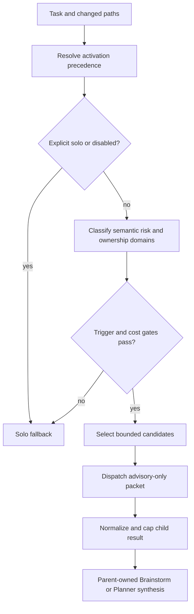
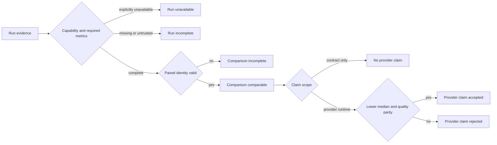

# Spec: Auto Advisory Token Budgeting

## Summary

Make `imm-brainstorm` and `imm-planner` usable with the global
`subagent_activation = auto` policy without turning ordinary planning work into
an unbounded ensemble run. The change establishes deterministic activation
classification, bounded advisory dispatch, and honest benchmark evidence
classification for token and quality regressions. A provider lower-token claim
is emitted only when a host supplies valid paired runtime evidence; synthetic
comparison remains contract-only.

## Origin

The user requested an evaluation of token consumption in Brainstorm and Planner
with subagent authorization defaulting to `auto`. The evaluation found that the
current route classifier labels ordinary token, schema, database, and migration
language as `high_risk`, and labels implementation-plus-test-plus-doc changes as
`multi_domain`. In a nine-case probe, five non-ensemble cases dispatched three
candidates when `auto` was forced. The existing general activation policy and
advisory-only ensemble contracts remain the authority boundaries for this slice.

## Goal

When `auto` is the resolved activation mode, Brainstorm and Planner should:

- dispatch only when semantic risk or a real ownership boundary justifies it;
- keep explicit user solo and disabled overrides authoritative;
- bound candidate fan-out and advisory result size before synthesis;
- preserve parent ownership of framing, Spec, Plan, workflow state, and QA;
- record advisory metrics from the runtime activation/packet boundary rather than
  trusting child prose; and
- produce repeatable benchmark records whose run evidence, paired comparability,
  and provider claim scope are explicit.

A provider token-reduction claim is valid only when the same scenario, model,
prompt, workspace, verifier, and sample policy are compared against a versioned
pre-change or legacy-auto baseline. `explicit_only` zero-dispatch runs are
compatibility controls, not token-reduction baselines. A deterministic harness
may prove comparator behavior but cannot prove provider token reduction. When a
host capability or valid baseline is unavailable, the result must preserve a
stable reason and must not claim a reduction.

## Design risk

**Design risk**: High

The change affects runtime activation policy, Pi advisory envelopes, normalized
cross-stage evidence, user-local configuration semantics, and benchmark
contracts. A bad default can cause unexpected provider calls; a bad packet
contract can silently omit requirements or weaken the advisory-only boundary.

## Diagram decision

**Diagram decision**: required

**Diagram reason**: The change crosses activation classification, candidate
selection, child dispatch, result normalization, parent-owned synthesis, and a
separate benchmark evidence-to-claim flow. The state and authority gates are
easier to verify as explicit flows.

## Scope

### In scope

- `classifyRoute`, `routeDomain`, and dispatch cost-gate behavior for
  Brainstorm and Planner activation.
- Repository policy and reference wording for `auto` as an allowed mode,
  without removing `explicit_only` and `disabled` overrides.
- A shared bounded advisory budget for Brainstorm and Planner candidate
  selection, delegation prompts, and normalized result packets.
- Deterministic truncation metadata for oversized advisory child results.
- Contract tests, focused behavior fixtures, and benchmark evidence contracts
  for route decisions, candidate counts, packet bounds, metric provenance,
  comparison identity, and provider-claim suppression.

### Out of scope

- A new `imm-context brief` CLI or a general context-indexing service.
- Rewriting `current_iteration.json`, the State Ledger, or historical plans.
- Rewriting the Spec/Plan templates or introducing a new persistence format.
- Automatic session creation, compaction, scheduling, polling, or retries for
  advisory children.
- Granting child agents tools, write access, workflow-state mutation, Spec/Plan
  authority, or QA authority.
- Changing the semantics of `imm-preplan-review`, `imm-code-review`, or
  `imm-ui-review` beyond shared policy wording needed for consistency.
- Integrating a new provider telemetry API or executing a legacy provider
  revision. This slice records those capabilities as unavailable and preserves
  them for a dedicated successor Plan.

## Technical Design

### Activation policy

The resolved precedence remains:

1. explicit user solo;
2. explicit subagent request;
3. host or lens override;
4. global default;
5. repository default.

`auto` means dispatch is allowed only after environment, semantic trigger,
boundary, and cost gates pass. It does not mean dispatch is mandatory.
`explicit_only` and `disabled` remain valid operator overrides.

The repository default for `imm-brainstorm` and `imm-planner` becomes `auto` so
the global user authorization is honored. A configured host override of
`explicit_only` continues to suppress automatic ensemble dispatch.

### Route classification

High-risk matching must use contextual security, persistence, compatibility,
or externally observable contract phrases. Generic planning vocabulary such as
`token`, `schema`, `database`, and `migration` is not sufficient on its own.
Tests and documentation are implementation companions when they follow the
same change; they do not create additional ownership domains. Distinct domains
remain meaningful when the change crosses runtime, skill behavior, host adapter,
persistence, or external contract ownership.

### Advisory budget

The runtime exposes one budget contract used by both stages:

- normal auto activation: one fast candidate first;
- elevated semantic risk: at most two candidates, with a strong risk candidate
  allowed as the second candidate;
- explicit ensemble request: at most three configured candidates;
- each child receives a compact task summary, shared context, role, and one
  focused audit question;
- each result field contains at most three entries and each entry is bounded to
  a configured character limit;
- normalization marks `degraded` and `truncated` when a child exceeds the
  result budget; it never silently treats dropped content as complete evidence;
- optional advisory dispatch does not retry after a failed child and falls back
  to the parent-owned solo path with a recorded reason.

The runtime cannot assume that every Pi host exposes a provider-level
`max_tokens` parameter. Prompt limits and deterministic normalization are the
portable enforcement mechanisms. Host-specific reasoning or verbosity options
may be passed only when the host adapter supports them; unsupported metadata
must not be presented as enforcement.

### Benchmark evidence boundary

Benchmark output separates three decisions that must not be collapsed.

**Run evidence.** Each new run record uses schema v2 and records
`evidence_status` as `complete`, `unavailable`, or `incomplete`, plus a stable
`evidence_reason_code`. `unavailable` requires an explicit host or fixture
capability declaration such as `runtime_advisory_metrics_unavailable`; mere
absence is `incomplete`. Required scenarios record metric provenance, including
`reported_tokens_source` and `advisory_metrics_source`, and require non-empty
completion, verifier, and authority outcomes. `child_footer` is supplementary
only. `deterministic_harness` may produce complete contract evidence but fixes
the claim scope to `contract_only`.

**Paired comparison.** `measurement_status` belongs to the comparison result,
not an individual run. `comparable` requires at least ten complete legacy-auto
and bounded-auto pairs; every record must have a unique contiguous `run_index`
and must agree on cohort, benchmark version, model, sample count,
`fixture_hash`, `prompt_hash`, `workspace_fingerprint`, and
`verifier_fingerprint`. Baseline and current `source_revision` values must be
distinct. An explicitly absent host capability or baseline is `unavailable`;
missing, untrusted, malformed, duplicate, or identity-mismatched evidence is
`incomplete`. Missing quality fields cannot pass by equality with another
missing field.

**Claim gate.** Comparison output records `claim_scope` as `provider_runtime` or
`contract_only`, a stable `reason_code`, and an `accepted` decision. `accepted`
may be true only for `provider_runtime` evidence with a lower paired median and
unchanged completion, verifier, parent authority, and runtime advisory-metric
parity. A deterministic harness may report the simulated median outcome while
remaining `contract_only` and `accepted = false`; it never establishes provider
token reduction. `unavailable`, `incomplete`, child-footer-only, quality
regression, or `explicit_only` evidence cannot create a provider claim.

### Benchmark execution and recovery

The current-host U4 probe has one canonical QA-visible artifact:
`benchmark-results/immune-brain-u4-provider/latest.json`. The historical U3
artifact at `benchmark-results/immune-brain-focused/latest.json` is read-only
context and must never be used as U4 evidence or overwritten by U4 execution.
The executor records the canonical U4 path in the structured execution packet;
QA reads that exact path and does not infer evidence from another `latest.json`.
Temporary paths outside the workspace are supplementary diagnostics only and
cannot close U4.

A successfully executed probe persists its classified record even when an
explicit capability declaration makes the evidence unavailable. Before the
probe, verification captures a start timestamp; after success it requires a
fresh schema-v2 record whose `recorded_at` is not older than that timestamp and
whose benchmark, evidence status, reason code, claim scope, and
`metrics_complete` fields match the current-host contract. A failed or
interrupted probe cannot pass by leaving a stale canonical artifact. Missing or
malformed expected evidence remains a non-zero incomplete run.

History records under the U4 namespace are append-only and use the full
comparison identity plus policy and `run_index` as the pair key. Resume may
collect only absent keys; duplicate keys are rejected rather than silently
overwritten. Probe artifacts are diagnostic only and cannot mutate the State
Ledger, workflow state, Spec, Plan, QA decisions, or successor authority.

## Compatibility

Existing explicit host, lens, and subagent configuration continues to override
the repository default. Existing normalized packet consumers retain their
current owner and authority fields. New budget metadata is additive; legacy
child responses remain valid when they fit the default limits. A child result
that exceeds the limit is reported as degraded rather than rejected solely for
length.

Benchmark run records move to schema v2. Historical schema-v1 records remain
readable and are never rewritten, but they cannot support a provider claim when
required evidence status, provenance, quality, or identity fields are absent;
the comparator reports `incomplete` with `legacy_record_missing_evidence`.
`benchmark-results/immune-brain-focused/latest.json` remains the named U3
historical artifact, while U4 uses the separate
`benchmark-results/immune-brain-u4-provider/` namespace. Existing fixtures that
do not require advisory metrics retain their prior completion behavior outside
the provider-claim path.

## Acceptance Criteria

- A generic `token` planning task and a code-plus-test-plus-doc change do not
  enter an automatic ensemble solely because of those terms.
- A real security or cross-ownership contract change still reaches the bounded
  advisory path under `auto`.
- Explicit solo, explicit subagent, host override, and disabled precedence are
  covered by tests.
- Brainstorm and Planner candidate counts, packet sizes, result entry counts,
  truncation, and fallback reasons are observable in contract output.
- Children cannot receive tools or write authority through the new packet.
- Focused behavior scenarios preserve confirmation-before-planner,
  `BR-Q-*` blocking, parent ownership, and advisory-only boundaries.
- A benchmark run with `advisory_metrics` declared required is incomplete when
  a required scenario or runtime-derived metric is absent or untrusted.
- New run records expose schema-v2 `evidence_status`, metric provenance, and a
  stable `evidence_reason_code`; explicit host capability absence is
  `unavailable`, while unexplained absence is `incomplete`.
- Comparison results expose `measurement_status`, `claim_scope`, and a stable
  `reason_code`; identity mismatches, duplicate indexes, and missing quality
  fields fail closed.
- A deterministic ten-pair harness can verify lower-median comparator behavior
  only as `contract_only`; it always leaves the provider claim unaccepted.
- A provider token-reduction claim requires a versioned same-scenario
  legacy-auto or pre-change baseline, at least ten comparable unique pairs,
  approved runtime metric sources, and unchanged completion, verifier, parent
  authority, and advisory-metric parity.
- The current host probe either records complete provider evidence or an
  explicit unavailable/incomplete status without a token claim; child prose and
  `explicit_only` controls cannot satisfy the provider claim gate.
- U4 execution and QA reference only
  `benchmark-results/immune-brain-u4-provider/latest.json`; the record is fresh,
  schema v2, and identity-checked, while the U3 schema-v1 artifact remains
  untouched and cannot satisfy U4.

## Deferred Design

The following are deliberately deferred until valid provider-runtime evidence
and a reproducible legacy/pre-change baseline are available:

- provider-specific runtime advisory telemetry and provider token-ceiling
  integration;
- execution of a versioned legacy-auto provider cohort with at least ten pairs;
- a structured cache-first discovery projection for `current_iteration.json` and
  `docs/solutions/`;
- host-specific modular loading of dispatch protocol documentation; and
- a separate cross-session `brainstorm_packet/v1` persistence artifact.

The provider telemetry and baseline work is the immediate successor candidate
because it owns the unresolved token-reduction claim. Context projection and
persisted handoff have independent persistence and session-neutrality boundaries
and remain later slices.
