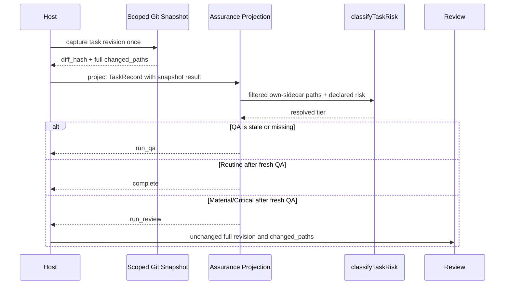

# Dynamic Task Tier Review Gate

**Status**: Current
**Task**: `2026-09-01-004-wire-task-tier-review-gate`
**Origin**: GitHub Issue #20, `Wire task tier into Kernel review-gate (skip Review for Routine tasks)`; child of #16 and dependent on the completed local #19 classifier slice (`c8fa205`).
**Output Language**: English prose; preserve commands, paths, schema keys, contract names, and code identifiers literally.
**Design risk**: High - this changes Kernel Assurance obligation routing from stored-risk-only behavior to a dynamically resolved tier derived from the task's immutable Git revision. A wrong path set or filter can silently skip independent Review or make Routine unreachable.
**Design views**: Architecture layers, service/component interfaces, data flow, state transitions, and temporal sequence are selected because the change crosses Git revision capture, Kernel projection, the Pi host adapter, and CLI inspection; changes the QA-to-Review/complete state decision; and must preserve one atomic identity across repeated projections. No view is omitted.
**Diagram decision**: required
**Diagram reason**: The ordered relationship among immutable revision capture, tier resolution, QA freshness, Review obligation, and completion materially clarifies the security boundary and mid-lifecycle upgrade behavior.

## 1. Problem

Issue #20 names a `Kernel readiness gate` and `tests/kernel-readiness.test.ts`, but those surfaces now implement the retired R2B readiness-evidence projector. Current authority is owned by `plugins/immune-brain/runtime/kernel/completion.ts` and exposed through `plugins/immune-brain/runtime/kernel/assurance_projection.ts`. `completion.ts` already maps stored `TaskIntent.risk` as follows: Routine requires QA, Material requires QA plus Review, and Critical requires QA plus Review plus user authority.

The missing behavior is dynamic re-evaluation. The stored risk is fixed at Enrollment, while TaskRecord v4 already captures the task's complete base-to-index changed paths on every Assurance projection. A task that begins with ordinary paths can therefore expand into Kernel or `.pi-extension` code without the changed-path classifier from #19 affecting its Review obligation.

The classifier's predecessor Spec identifies one required filter: each managed task necessarily changes its own TaskIntent and bound Spec after `git_base_head`. Those exact authority sidecars must not make every task Material. Only the current task's active/archive Intent paths and its one scope-bound active/archive Spec pair are excluded from tier classification. Changes to another task's Spec or TaskIntent remain Material. Filtering affects tier input only; it must never alter `diff_hash`, QA freshness, synthetic Review revision, or Review manifest `changed_paths`.

## 2. Result

Every current Kernel Assurance projection resolves a task tier from the exact same stable Git snapshot used for `diff_hash`. The projection filters only the current task's own planning sidecars, calls `classifyTaskRisk(filteredChangedPaths, intent.risk)`, and uses the result to derive required attestations.

After fresh QA:

- resolved `routine` proceeds to `complete` without `run_review`;
- resolved `material` or `critical` projects `run_review` exactly as today;
- resolved `critical` still projects `authorize_user` after Review;
- every tier still requires QA;
- Compounder remains the unchanged post-settlement internal-role policy and is not added to Kernel obligations.

A later changed path changes the shared `diff_hash`, invalidates stale QA/Review attestations, and triggers a fresh projection. If the new path raises the tier, the task must pass fresh QA and then Review before completion.

## 3. Technical Design

### Architecture layers

- `plugins/immune-brain/runtime/workspace_scope.ts` owns one stable scoped Git snapshot and derives both `diff_hash` and concrete changed paths from it.
- `plugins/immune-brain/runtime/kernel/completion.ts` owns task-sidecar filtering, dynamic tier resolution, required attestation kinds, and the resulting Kernel obligation. `reduceTask` `complete` uses the same trusted changed paths so a host cannot settle Routine work that the projection would send to Review.
- `plugins/immune-brain/runtime/kernel/assurance_projection.ts` correlates TaskRecord authority with the snapshot result and reports the resolved tier.
- `plugins/immune-brain/.pi-extension/runtime-stub.ts` and `imm-canary-work.ts` translate the Kernel interface without reconstructing risk policy.
- `plugins/immune-brain/runtime/commands/kernel.ts` uses the same snapshot and projection inputs for `inspect`; it does not derive a second tier policy.
- `plugins/immune-brain/.pi-extension/pi-canary-review-bundle.ts` remains unchanged and continues to capture the complete task-scoped revision when Review runs.

Dependency direction remains Git capture -> Kernel policy -> host/CLI projection. Host code must not classify risk, and Kernel policy must not import Pi extension code.

### Component interfaces

Introduce one structured snapshot result containing:

- `diff_hash`: the existing domain-separated hash of the complete stable task snapshot;
- `changed_paths`: sorted canonical project-relative paths from that same snapshot.

The v4 provider derives both fields from `captureGitTaskRevisionSnapshot`; the draining v3 provider derives them from `captureGitTaskSnapshot`. Existing hash-only helpers may delegate to the structured helper so current callers keep their signatures and semantics.

`projectTask` receives the concrete changed paths in addition to the existing diff identity. It resolves risk internally rather than accepting a host-provided resolved tier. Invalid Git state continues to fail at snapshot capture. No new fallback or silent empty-path behavior is allowed.

The projection's existing `risk` field reports the dynamically resolved tier. `TaskIntent.risk`, TaskRecord schemas, and persisted intent snapshots remain unchanged; declared risk is never rewritten.

### Data flow

1. Source: the current index and the TaskRecord v4 `git_base_head` (or the existing v3 HEAD-to-index drain path).
2. Validation: existing snapshot capture enforces canonical scope, Git ancestry, staged-only task work, index integrity, and stable double capture.
3. Transformation: one captured snapshot yields both full `diff_hash` and full changed paths.
4. Policy filter: remove exact current-task Intent active/archive paths and the one active/archive Spec pair already bound by `scope_hint`.
5. Tier resolution: call `classifyTaskRisk(filteredPaths, intent.risk)`.
6. Destination: `completionDecision` derives required attestations from the resolved tier; Assurance and `inspect` report the result.
7. Review: when required, the existing bundle builder consumes the unfiltered task revision and the unchanged full `diff_hash`.
8. Failure handling: snapshot, scope, ancestry, or sidecar-binding ambiguity fails closed; no Review is skipped from partial evidence.

### State transitions

States are the existing `active:active`, `active:frozen`, and terminal TaskRecord states. No state or persisted field is added.

Legal obligation transitions for a frozen task are:

- missing/stale QA -> `run_qa` for every resolved tier;
- fresh QA + Routine -> `complete`;
- fresh QA + Material/Critical -> `run_review`;
- fresh QA + fresh Review + Material -> `complete`;
- fresh QA + fresh Review + Critical -> `authorize_user`;
- changed revision -> stale prior attestations -> `run_qa`, followed by the newly resolved tier's next obligation.

The Kernel remains the sole terminal owner. The resolved tier is derived current fact, not persisted authority and not a host override.

### Temporal sequence



Each projection is idempotent over the same TaskRecord and Git snapshot. Cancellation, timeout, or interruption before a Kernel mutation leaves authority unchanged; a later `imm-loop` resumes from a fresh projection. Snapshot drift fails before an obligation is trusted.

## 4. Settlement-Design Contract

**Trigger sources**:

- artifact freeze exposes Assurance work;
- QA pass/failure/cancellation/timeout/provider failure;
- changed paths added, modified, or deleted after Enrollment;
- Review pass/rework/dispatch failure/cancellation/timeout/provider failure;
- critical user authorization or rejection;
- explicit stop/cancel;
- completion request;
- session shutdown or host cancellation.

**State inventory**:

- TaskRecord lifecycle remains `active|done|stopped`;
- artifact state remains `active|frozen`;
- Assurance obligations remain `submit_assurance`, `run_qa`, `run_review`, `authorize_user`, `complete`, and existing finding/revision obligations;
- legal transitions are the existing transitions listed above, with only the fresh-QA branch selected by dynamically resolved tier.

**Terminal ownership**:

- Kernel `complete` remains the only authority that settles `active:frozen` to `done` after all resolved-tier attestations are fresh;
- Kernel `stop` with literal-user authority remains the terminal owner for `stopped`;
- QA process exit, Review agent output, promise resolution/rejection, elapsed time, child acknowledgement, path classification, and host cancellation are non-authoritative local signals and cannot settle a task.

**Same-state-machine coverage**:

- `completion.ts` owns required attestations and next obligation;
- `assurance_projection.ts` owns current-fact correlation;
- `workspace_scope.ts` owns diff/path identity;
- `commands/kernel.ts` exposes the same projection through `inspect`;
- `runtime-stub.ts` and `imm-canary-work.ts` bind the host provider;
- `pi-canary-review-bundle.ts` is verified unchanged because it owns Review input scope when `run_review` occurs;
- focused obligation, projection, and Review-bundle tests cover the whole decision and transport chain.

## 5. Decisions

- Reuse #19's `classifyTaskRisk`; add no new policy type, registry, configuration, or persisted field.
- Resolve risk inside the Kernel completion owner from concrete paths; the host supplies evidence, not policy.
- Capture `diff_hash` and changed paths together from one stable snapshot to prevent skew.
- Filter exact current-task authority sidecars only. Reuse the existing scope-bound Spec pair rule; reject ambiguity rather than guessing.
- Keep the full changed-path set in diff identity and Review transport. The filtered list exists only for classification.
- Preserve v3 drain compatibility through its existing HEAD-to-index snapshot; all new v4 tasks use Enrollment-base-to-index accumulation.
- Do not edit retired `readiness.ts` or `tests/kernel-readiness.test.ts`; use the current behavioral seams.
- Keep one TaskIntent because snapshot evidence, policy resolution, obligation routing, rollback, and verification form one inseparable authority slice.

## 6. Compatibility, Recovery, and Rollback

No TaskIntent or TaskRecord migration is required. Existing declared risks remain valid escalation inputs. Existing Material/Critical tasks preserve Review and critical user authority. Routine tasks gain the intended Review skip only when their non-sidecar changed paths remain outside the floor list.

Interruption before implementation completion leaves only staged code/tests/planning artifacts; no runtime authority mutation occurs outside normal Kernel operations. During execution, any incomplete interface update must fail tests or type/runtime imports rather than silently fall back.

Rollback is one coherent revert of the structured snapshot provider, dynamic completion input, host/CLI adapters, and focused tests. Persisted TaskRecords remain readable because schemas are unchanged. After rollback, stored-risk-only routing resumes; no compatibility layer needs later cleanup.

## 7. Acceptance

1. Kernel obligation projection derives a resolved tier by calling #19's classifier with declared risk and concrete changed paths from the same stable snapshot used for `diff_hash`; exact current-task Intent/Spec sidecars are excluded only from classification, while another task's planning artifact remains Material.
2. Every resolved tier requires fresh QA; after QA, Routine projects `complete`, Material/Critical project `run_review`, and Critical still projects `authorize_user` after Review.
3. A task that was Routine is re-evaluated when its base-to-index revision gains a floored path: prior attestations become stale, fresh QA is required, and `run_review` is projected before completion.
4. Review transport remains unchanged: when Review runs, its synthetic revision, `diff_hash`, scope, and manifest `changed_paths` include the complete unfiltered task delta.
5. Existing TaskIntent parsing, v3 drain behavior, findings, rework, user authorization, completion settlement, and post-settlement Compounder policy remain unchanged.

## 8. Verification

Highest observable seam: `tests/kernel-assurance-projection.test.ts` already enrolls real temporary Git repositories, mutates TaskRecords, computes scoped revision identities, and observes Kernel obligations. Extending it catches snapshot/path skew, own-sidecar overclassification, mid-lifecycle escalation, stale attestations, and the final obligation.

Pure obligation prior art: `tests/kernel-assurance-obligation.test.ts` directly tests the QA/Review/user matrix and should pin exact sidecar filtering and declared-risk behavior without host orchestration.

Review scope prior art: `tests/pi-canary-review-bundle.test.ts` captures the immutable synthetic revision and manifest changed paths. Running it unchanged proves this slice did not slim or rewrite Review input.

Focused commands:

```bash
bun test tests/kernel-assurance-obligation.test.ts tests/kernel-assurance-projection.test.ts
bun test tests/pi-canary-review-bundle.test.ts
```

Descriptor budgets: 60 seconds / 131,072 bytes for obligation and projection; 60 seconds / 131,072 bytes for Review transport.

## 9. Discovery Evidence

- Current obligation owner: `plugins/immune-brain/runtime/kernel/completion.ts` maps `TaskIntent.risk` to QA, Review, and user attestations.
- Current host-neutral projection: `plugins/immune-brain/runtime/kernel/assurance_projection.ts` calls `projectTask` using one host-supplied diff provider.
- Concrete changed-path source: `plugins/immune-brain/runtime/workspace_scope.ts` exposes `staged_files` for v3 and cumulative `changed_paths` for v4 from the same snapshots used by hash helpers.
- Host adapter: `plugins/immune-brain/.pi-extension/imm-canary-work.ts` selects v3/v4 diff capture; `runtime-stub.ts` preserves the structural boundary.
- CLI sibling: `plugins/immune-brain/runtime/commands/kernel.ts` independently exposes current projection and must use the same resolved-tier input.
- Review transport: `plugins/immune-brain/.pi-extension/pi-canary-review-bundle.ts` consumes the complete v4 revision snapshot and expected hash; no source edit is planned.
- Classifier dependency: `plugins/immune-brain/runtime/kernel/intent.ts` exports `classifyTaskRisk` and the centrally editable changed-path floor from completed task `2026-09-01-003-add-task-tier-classifier` at local commit `c8fa205`.
- Binding prior art: `plugins/immune-brain/runtime/kernel/canary_application.ts` derives exactly one scope-bound Spec from paired active/archive paths and fails on ambiguity.
- Focused tests: `tests/kernel-assurance-obligation.test.ts`, `tests/kernel-assurance-projection.test.ts`, and `tests/pi-canary-review-bundle.test.ts` are the current behavioral seams; `tests/kernel-readiness.test.ts` is retired R2B evidence coverage and is not authoritative for this behavior.
- Relevant ADR: `docs/adr/0003-internal-role-prompt-routing.md` keeps Review as an internal authority role and Compounder post-closure.
- Rejected Learning: `docs/solutions/rejected-out-of-band-review-authority-reconstruction.md` rejects reconstructing Review authority from unrelated Git state; this design uses only the task-scoped authoritative revision.
- Architecture advisory: the bounded `arch-explorer` confirmed one structured snapshot result, exact own-sidecar filtering, and unchanged Review transport as the smallest coherent integration.
- Generated/package mirror: none. Runtime TypeScript is loaded directly; no `dist/` source mirror is generated for these modules.

## 10. Out of Scope

- Changing the prefix policy or classifier implementation from #19.
- Persisting resolved tier in TaskIntent or TaskRecord.
- Editing retired readiness evidence modules or tests.
- Review bundle slimming, reviewer prompt changes, workload classification, or Review authority semantics.
- Capability registry dedup, Enrollment precondition dedup, CAS locking, or Compounder routing.
- GitHub Issue state mutation.

## 11. Devil's Advocate Audit

**Rollback resilience**: The change has no schema migration and one coherent revert. Mid-execution interruption leaves current TaskRecord authority untouched; a fresh projection either uses the fully updated interfaces or fails loudly. Reverting restores stored-risk-only routing without transforming persisted data.

**Verification vanity**: Tests must observe actual obligations from real changed-path inputs, not inspect source text. The mid-lifecycle case must first reach Routine completion readiness, then add a floored path, prove the old QA is stale, record fresh QA, and observe `run_review`. The Review transport test must still see all unfiltered changed paths.

**Spec dilution detection**: All Issue behaviors remain: current paths plus declared risk feed classification; Routine skips Review; Material/Critical retain Review; QA is universal; declared escalation and non-downgrade hold; later path accumulation upgrades before completion; Review input remains unchanged. The only deviations are corrections to stale repository names: the retired readiness test is not modified, and Compounder remains its existing post-settlement policy rather than a nonexistent Kernel obligation.
